## CCSDS Historical Document

This document's Historical status indicates that it is no longer current. It has either been replaced by a newer issue or withdrawn because it was deemed obsolete. Current CCSDS publications are maintained at the following location:

http://public.ccsds.org/publications/

## /K43/K6F/K6E/K73/K75/K6C/K74/K61/K74/K69/K76/K65 /K43/K6F/K6D/K6D/K69/K74/K74/K65/K65 /K66/K6F/K72 /K53/K70/K61/K63/K65 /K44/K61/K74/K61 /K53/K79/K73/K74/K65/K6D/K73

## RECOMMENDATION FOR SPACE DATA SYSTEM STANDARDS

## Reference Model for an Open Archival Information System (OAIS)

## CCSDS 650.0-B-1 BLUE BOOK

January 2002

CCSDS HISTORICAL DOCUMENT

## CCSDS RECOMMENDATION FOR AN OAIS REFERENCE MODEL CCSDS HISTORICAL DOCUMENT

## AUTHORITY

Issue:

Blue Book, Issue 1

Date:

January 2002

Location:

Not Applicable

This document has been approved for publication by the Management Council of the Consultative Committee for Space Data Systems (CCSDS) and represents the consensus technical agreement of the participating CCSDS Member Agencies. The procedure for review and authorization of CCSDS Recommendations is detailed in Procedures Manual for the Consultative Committee for Space Data Systems , and the record of Agency participation in the authorization of this document can be obtained from the CCSDS Secretariat at the address below.

This Recommendation is published and maintained by:

CCSDS Secretariat Program Integration Division (Code M-3) National Aeronautics and Space Administration Washington, DC 20546, USA

## STATEMENT OF INTENT

The Consultative Committee for Space Data Systems (CCSDS) is an organization officially established by the management of member space Agencies. The Committee meets periodically to address data systems problems that are common to all participants, and to formulate sound technical solutions to these problems. Inasmuch as participation in the CCSDS is completely voluntary, the results of Committee actions are termed Recommendations and are not considered binding on any Agency.

This Recommendation is issued by, and represents the consensus of, the CCSDS Plenary body. Agency endorsement of this Recommendation is entirely voluntary. Endorsement, however, indicates the following understandings:

- o Whenever an Agency establishes a CCSDS-related standard , this standard will be in accord with the relevant Recommendation . Establishing such a standard does not preclude other provisions which an Agency may develop.
- o Whenever an Agency establishes a CCSDS-related standard, the Agency will provide other CCSDS member Agencies with the following information:
- --The standard itself.
- --The anticipated date of initial operational capability.
- --The anticipated duration of operational service.
- o Specific service arrangements shall be made via memoranda of agreement. Neither this Recommendation nor any ensuing standard is a substitute for a memorandum of agreement.

No later than five years from its date of issuance, this Recommendation will be reviewed by the CCSDS to determine whether it should: (1) remain in effect without change; (2) be changed to reflect the impact of new technologies, new requirements, or new directions; or, (3) be retired or canceled.

In those instances when a new version of a Recommendation is issued, existing CCSDSrelated Agency standards and implementations are not negated or deemed to be non-CCSDS compatible. It is the responsibility of each Agency to determine when such standards or implementations are to be modified. Each Agency is, however, strongly encouraged to direct planning for its new standards and implementations towards the later version of the Recommendation.

## FOREWORD

This document is a technical Recommendation for use in developing a broader consensus on what is required for an archive to provide permanent, or indefinite long-term, preservation of digital information.

This Recommendation establishes a common framework of terms and concepts which comprise an Open Archival Information System (OAIS). It allows existing and future archives to be more meaningfully compared and contrasted. It provides a basis for further standardization within an archival context and it should promote greater vendor awareness of, and support of, archival requirements.

Through the process of normal evolution, it is expected that expansion, deletion, or modification of this document may occur. This Recommendation is therefore subject to CCSDS document management and change control procedures which are defined in Procedures Manual for the Consultative Committee for Space Data Systems . Current versions of CCSDS documents are maintained at the CCSDS Web site:

## http://www.ccsds.org/

Questions relating to the contents or status of this document should be addressed to the CCSDS Secretariat at the address indicated on page i.

## CCSDS HISTORICAL DOCUMENT

## CCSDS RECOMMENDATION FOR AN OAIS REFERENCE MODEL

At time of publication, the active Member and Observer Agencies of the CCSDS were

## Member Agencies

- -Agenzia Spaziale Italiana (ASI)/Italy.
- -British National Space Centre (BNSC)/United Kingdom.
- -Canadian Space Agency (CSA)/Canada.
- -Centre National d'Etudes Spatiales (CNES)/France.
- -Deutsches Zentrum für Luft- und Raumfahrt e.V. (DLR)/Germany.
- -European Space Agency (ESA)/Europe.
- -Instituto Nacional de Pesquisas Espaciais (INPE)/Brazil.
- -National Aeronautics and Space Administration (NASA)/USA.
- -National Space Development Agency of Japan (NASDA)/Japan.
- -Russian Space Agency (RSA)/Russian Federation.

## Observer Agencies

- -Austrian Space Agency (ASA)/Austria.
- -Central Research Institute of Machine Building (TsNIIMash)/Russian Federation.
- -Centro Tecnico Aeroespacial (CTA)/Brazil.
- -Chinese Academy of Space Technology (CAST)/China.
- -Commonwealth Scientific and Industrial Research Organization (CSIRO)/Australia.
- -Communications Research Centre (CRC)/Canada.
- -Communications Research Laboratory (CRL)/Japan.
- -Danish Space Research Institute (DSRI)/Denmark.
- -European Organization for the Exploitation of Meteorological Satellites (EUMETSAT)/Europe.
- -European Telecommunications Satellite Organization (EUTELSAT)/Europe.
- -Federal Service of Scientific, Technical &amp; Cultural Affairs (FSST&amp;CA)/Belgium.
- -Hellenic National Space Committee (HNSC)/Greece.
- -Indian Space Research Organization (ISRO)/India.
- -Institute of Space and Astronautical Science (ISAS)/Japan.
- -Institute of Space Research (IKI)/Russian Federation.
- -KFKI Research Institute for Particle &amp; Nuclear Physics (KFKI)/Hungary.
- -MIKOMTEK: CSIR (CSIR)/Republic of South Africa.
- -Korea Aerospace Research Institute (KARI)/Korea.
- -Ministry of Communications (MOC)/Israel.
- -National Oceanic &amp; Atmospheric Administration (NOAA)/USA.
- -National Space Program Office (NSPO)/Taipei.
- -Swedish Space Corporation (SSC)/Sweden.
- -United States Geological Survey (USGS)/USA.

## CCSDS RECOMMENDATION FOR AN OAIS REFERENCE MODEL CCSDS HISTORICAL DOCUMENT

## DOCUMENT CONTROL

| Document | Title | Date | Status and Substantive Changes |
|-----------------|----------------------------------------------------------------|----------------|------------------------------------------------------------------------------------------------------------------------------|
| CCSDS 650.0-B-1 | Reference Model for an Open Archival Information System (OAIS) | January 2002 | Original Issue |
| EC 1 | Editorial Correction | September 2007 | - Reencodes figures 2-4, 4-2, 4-3, 4-4, 4-6, 4-7 to correct display anomalies. - Corrects typographical error in figure 4-7. |

## CCSDS RECOMMENDATION FOR AN OAIS REFERENCE MODEL

## CONTENTS

| Section | Section | Section | Page |
|---------------------------------------------------------------------------------------------------------------------------|---------------------------------------------------------------------------------------------------------------------------|---------------------------------------------------------------------------------------------------------------------------|--------|
| 1 INTRODUCTION .......................................................................................................... | 1 INTRODUCTION .......................................................................................................... | 1 INTRODUCTION .......................................................................................................... | 1-1 |
| | 1.1 | PURPOSE AND SCOPE........................................................................................ | 1-1 |
| | 1.2 | APPLICABILITY................................................................................................... | 1-2 |
| | 1.3 | RATIONALE.......................................................................................................... | 1-3 |
| | 1.4 | CONFORMANCE.................................................................................................. | 1-3 |
| | 1.5 | ROAD MAP FOR DEVELOPMENT OF RELATED STANDARDS.................. | 1-4 |
| | 1.6 | DOCUMENT STRUCTURE ................................................................................. | 1-4 |
| | 1.7 | DEFINITIONS........................................................................................................ | 1-6 |
| 2 | OAIS CONCEPTS ......................................................................................................... | OAIS CONCEPTS ......................................................................................................... | 2-1 |
| | 2.1 | OAIS ENVIRONMENT......................................................................................... | 2-2 |
| | 2.2 | OAIS INFORMATION.......................................................................................... | 2-3 |
| | 2.3 | OAIS HIGH-LEVEL EXTERNAL INTERACTIONS.......................................... | 2-7 |
| 3 | OAIS RESPONSIBILITIES ......................................................................................... | OAIS RESPONSIBILITIES ......................................................................................... | 3-1 |
| | 3.1 | MANDATORY RESPONSIBILITIES .................................................................. | 3-1 |
| | 3.2 | EXAMPLE MECHANISMS FOR DISCHARGING RESPONSIBILITIES......... | 3-1 |
| 4 | DETAILED MODELS .................................................................................................. | DETAILED MODELS .................................................................................................. | 4-1 |
| | 4.1 | FUNCTIONAL MODEL........................................................................................ | 4-1 |
| | 4.2 | INFORMATION MODEL................................................................................... | 4-18 |
| | 4.3 | INFORMATION PACKAGE TRANSFORMATIONS....................................... | 4-48 |
| 5 | PRESERVATION PERSPECTIVES ........................................................................... | PRESERVATION PERSPECTIVES ........................................................................... | 5-1 |
| | 5.1 | INFORMATION PRESERVATION ..................................................................... | 5-1 |
| | 5.2 | ACCESS SERVICE PRESERVATION............................................................... | 5-10 |
| 6 | ARCHIVE INTEROPERABILITY ............................................................................. | ARCHIVE INTEROPERABILITY ............................................................................. | 6-1 |
| | 6.1 | TECHNICAL LEVELS OF INTERACTION BETWEEN OAIS ARCHIVES..... | 6-2 |
| | 6.2 | MANAGEMENT ISSUES WITH FEDERATED ARCHIVES............................. | 6-8 |

## CCSDS RECOMMENDATION FOR AN OAIS REFERENCE MODEL CCSDS HISTORICAL DOCUMENT

## CONTENTS (continued)

| Section | Section | Page |
|-----------------------------------------------------------------------------------------------------------------------------------------------------------|-----------------------------------------------------------------------------------------------------------------------------------------------------------|--------|
| ANNEX A EXAMPLES OF EXISTING ARCHIVES .................................................. | ANNEX A EXAMPLES OF EXISTING ARCHIVES .................................................. | A-1 |
| ANNEX B RELATIONSHIPS WITH OTHER STANDARDS OR EFFORTS .......... | ANNEX B RELATIONSHIPS WITH OTHER STANDARDS OR EFFORTS .......... | B-1 |
| ANNEX C BRIEF GUIDE TO THE UNIFIED MODELING LANGUAGE (UML) | ANNEX C BRIEF GUIDE TO THE UNIFIED MODELING LANGUAGE (UML) | C-1 |
| ANNEX D INFORMATIVE REFERENCES ................................................................ | ANNEX D INFORMATIVE REFERENCES ................................................................ | D-1 |
| ANNEX E A MODELFORSOFTWAREUSE IN REPRESENTATION INFORMATION ............................................................................................. | ANNEX E A MODELFORSOFTWAREUSE IN REPRESENTATION INFORMATION ............................................................................................. | E-1 |
| ANNEX F COMPOSITE FUNCTIONAL VIEW .......................................................... | ANNEX F COMPOSITE FUNCTIONAL VIEW .......................................................... | F-1 |
| Figure | Figure | Page |
| 2-1 | Environment Model of an OAIS................................................................................... | 2-2 |
| 2-2 | Obtaining Information from Data................................................................................. | 2-4 |
| 2-3 | Information Package Concepts and Relationships ....................................................... | 2-5 |
| 2-4 | OAIS Archive External Data........................................................................................ | 2-8 |
| 4-1 | OAIS Functional Entities.............................................................................................. | 4-1 |
| 4-2 | Functions of Ingest ....................................................................................................... | 4-5 |
| 4-3 | Functions of Archival Storage...................................................................................... | 4-7 |
| 4-4 | Functions of Data Management.................................................................................... | 4-9 |
| 4-5 | Functions of Administration....................................................................................... | 4-10 |
| 4-6 | Functions of Preservation Planning............................................................................ | 4-13 |
| 4-7 | Functions of Access.................................................................................................... | 4-15 |
| 4-8 | OAIS Data Flow Diagram .......................................................................................... | 4-17 |
| 4-9 | Administration Context Diagram ............................................................................... | 4-18 |
| 4-10 | Information Object...................................................................................................... | 4-20 |
| 4-11 | Representation Information Object............................................................................. | 4-22 |
| 4-12 | Information Object Taxonomy ................................................................................... | 4-24 |
| 4-13 | Information Package Contents.................................................................................... | 4-31 |
| 4-14 | Information Package Taxonomy................................................................................. | 4-32 |
| 4-15 | Archival Information Package (AIP).......................................................................... | 4-34 |
| 4-16 | Preservation Description Information (PDI) .............................................................. | 4-34 |
| 4-17 | Package Description ................................................................................................... | 4-35 |
| 4-18 | Archival Information Package (Detailed View)......................................................... | 4-37 |
| 4-19 | Archival Specialization of the AIP............................................................................. | 4-38 |
| 4-20 | Archival Specialization of the Package...................................................................... | 4-39 |
| 4-21 | Archival Information Unit (AIU) ............................................................................... | 4-40 |
| 4-22 | Unit Description.......................................................................................................... | 4-41 |
| 4-23 | Archive Information Collections Logical View......................................................... | 4-43 |

## CCSDS RECOMMENDATION FOR AN OAIS REFERENCE MODEL CCSDS HISTORICAL DOCUMENT

## CONTENTS (continued)

| 4-24 | Collection Descriptions .............................................................................................. | 4-44 |
|--------|--------------------------------------------------------------------------------------------------------------------------|--------|
| 4-25 | Data Management Information................................................................................... | 4-47 |
| 4-26 | High-Level Data Flows in an OAIS ........................................................................... | 4-48 |
| 5-1 | Conceptual View of Relationships Among Names and AIP Components................... | 5-3 |
| 6-1 | Cooperating Archives with Mutual Exchange Agreement........................................... | 6-3 |
| 6-2 | Cooperating Archives with Standard Ingest and Access Methods............................... | 6-4 |
| 6-3 | An OAIS Federation Employing a Common Catalog .................................................. | 6-5 |
| 6-4 | Archives with Shared Storage ...................................................................................... | 6-8 |
| C-1 | Key to UML Relationships...........................................................................................C-1 | |
| E-1 | Layered Information Model..........................................................................................E-1 | |
| F-1 | Composite of Functional Entities .................................................................................F-2 | |
| Table | Table | Table |
| 4-1 | Examples of PDI Types.............................................................................................. | 4-29 |

## 1 INTRODUCTION

## 1.1 PURPOSE AND SCOPE

The purpose of this document is to define the International Organization for Standardization (ISO) Reference Model for an Open Archival Information System (OAIS). An OAIS is an archive, consisting of an organization of people and systems, that has accepted the responsibility to preserve information and make it available for a Designated Community . It meets a set of such responsibilities as defined in this document ,and this allows an OAIS archive to be distinguished from other uses of the term 'archive'. The term 'Open' in OAIS is used to imply that this Recommendation, as well as future related Recommendations and standards, are developed in open forums, and it does not imply that access to the archive is unrestricted.

The information being maintained has been deemed to need Long Term Preservation , even if the OAIS itself is not permanent. Long Term is long enough to be concerned with the impacts of changing technologies, including support for new media and data formats, or with a changing user community. Long Term may extend indefinitely. In this reference model there is a particular focus on digital information, both as the primary forms of information held and as supporting information for both digitally and physically archived materials. Therefore, the model accommodates information that is inherently non-digital (e.g., a physical sample), but the modeling and preservation of such information is not addressed in detail. This reference model:

- -provides a framework for the understanding and increased awareness of archival concepts needed for Long Term digital information preservation and access;
- -provides the concepts needed by non-archival organizations to be effective participants in the preservation process;
- -provides a framework, including terminology and concepts, for describing and comparing architectures and operations of existing and future archives;
- -provides a framework for describing and comparing different long term preservation strategies and techniques;
- -provides a basis for comparing the data models of digital information preserved by archives and for discussing how data models and the underlying information may change over time;
- -provides a foundation that may be expanded by other efforts to cover long-term preservation of information that is NOT in digital form (e.g., physical media and physical samples);
- -expands consensus on the elements and processes for long-term digital information preservation and access, and promotes a larger market which vendors can support;
- -guides the identification and production of OAIS-related standards.

## CCSDS RECOMMENDATION FOR AN OAIS REFERENCE MODEL CCSDS HISTORICAL DOCUMENT

The reference model addresses a full range of archival information preservation functions including ingest, archival storage, data management, access, and dissemination. It also addresses the migration of digital information to new media and forms, the data models used to represent the information, the role of software in information preservation, and the exchange of digital information among archives. It identifies both internal and external interfaces to the archive functions, and it identifies a number of high-level services at these interfaces. It provides various illustrative examples and some 'best practice' recommendations. It defines a minimal set of responsibilities for an archive to be called an OAIS, and it also defines a maximal archive to provide a broad set of useful terms and concepts.

## 1.2 APPLICABILITY

The OAIS model in this document may be applicable to any archive. It is specifically applicable to organizations with the responsibility of making information available for the Long Term. This includes organizations with other responsibilities, such as processing and distribution in response to programmatic needs.

This model is also of interest to those organizations and individuals who create information that may need Long-Term Preservation and those that may need to acquire information from such archives.

The model, including the functional and information modeling concepts, is relevant to the comparison and design of facilities which hold information, on a temporary basis, for two reasons:

- -When taking into consideration the rapid pace of technology changes or possible changes in a Designated Community, there is the likelihood that facilities, thought to be holding information on a temporary basis, will in fact find that some or much of their information holdings will need Long Term Preservation attention.
- -Although some facilities holding information may themselves be temporary, some or all of their information may need to be preserved indefinitely. Such facilities need to be active participants in the Long Term Preservation effort.

Standards developers are expected to use this model as a basis for further standardization in this area. A large number of related standards are possible. A road map for such development is briefly addressed in 1.5.

This reference model does not specify a design or an implementation. Actual implementations may group or break out functionality differently.

## 1.3 RATIONALE

A tremendous growth in computational power, and in networking bandwidth and connectivity, has resulted in an explosion in the number of organizations making digital information available. Transactions among all types of organizations are being conducted using digital forms that are taking the place of more traditional media such as paper.

Preserving information in digital forms is much more difficult than preserving information in forms such as paper and film. This is not only a problem for traditional archives, but also for many organizations that have never thought of themselves as performing an archival function. It is expected that this reference model, by establishing minimum requirements for an OAIS archive along with a set of archival concepts, will provide a common framework from which to view archival challenges, particularly as they relate to digital information. This should enable more organizations to understand the issues and take the proper steps to ensure Long Term information preservation. It should also provide a basis for more standardization and, therefore, a larger market that vendors can support in meeting archival requirements.

## 1.4 CONFORMANCE

A conforming OAIS archive implementation shall support the model of information described in 2.2. The OAIS Reference Model does not define or require any particular method of implementation of these concepts.

A conforming OAIS archive shall fulfill the responsibilities listed in 3.1. Subsection 3.2 provides examples of the mechanisms that may be used to discharge the responsibilities identified in 3.1. These mechanisms are not required for conformance.

It is assumed that implementers will use this reference model as a guide while developing a specific implementation to provide identified services and content. This document does not assume or endorse any specific computing platform, system environment, system design paradigm, system development methodology, database management system, database design paradigm, data definition language, command language, system interface, user interface, technology, or media required for implementation.

A conformant OAIS archive may provide additional services to users that are beyond those required of an OAIS.

The OAIS Reference Model is designed as a conceptual framework in which to discuss and compare archives. As such, it attempts to address all the major activities of an informationpreserving archive in order to define a consistent and useful set of terms and concepts. A standard and other documents that claim to be conformant to the OAIS Reference Model shall use the terms and concepts defined in the OAIS Reference Model in the same manner.

## 1.5 ROAD MAP FOR DEVELOPMENT OF RELATED STANDARDS

This Reference Model, developed by CCSDS Panel 2 in response to ISO TC20/SC 13, serves to identify areas suitable for the development of OAIS-related standards. Some of these standards may be developed by Panel 2; others may be developed by other standardization bodies. However, any such work undertaken by other bodies should be coordinated in order to minimize incompatibilities and efforts. Areas for potential OAIS-related standards include:

- -standard(s) for the interfaces between OAIS type archives;
- -standard(s) for the submission (ingest) methodology used by an archive;
- -standard(s) for the submission (ingest) of digital data sources to the archive;
- -standard(s) for the delivery of digital sources from the archive;
- -standard(s) for the submission of digital metadata, about digital or physical data sources, to the archive;
- -standard(s) for the identification of digital sources within the archive;
- -protocol standard(s) to search and retrieve metadata information about digital and physical data sources;
- -standard(s) for media access allowing replacement of media management systems without having to rewrite the media;
- -standard(s) for specific physical media;
- -standard(s) for the migration of information across media and formats;
- -standard(s) for recommended archival practices;
- -standard(s) for accreditation of archives.

## 1.6 DOCUMENT STRUCTURE

## 1.6.1 HOW TO READ THIS DOCUMENT

All readers should read the Purpose and Scope (1.1), Applicability (1.2), and Conformance (1.4) subsections to obtain a view on the objectives and applicability of the document.

Those who want just an overview of the major concepts should also read OAIS Concepts (section 2) and OAIS Responsibilities (section 3).

Those who will implement OAIS archives or administer them on a daily basis should read the entire document.

## 1.6.2 ORGANIZATION BY SECTION

Section 1 provides purpose, scope, applicability, and definitions sections typical of many standards. It also provides rationale for the effort, conformance requirements, and a road map for development of related standards.

Section 2 provides a high-level overview of the major concepts involved in an OAIS archive. It provides a view of the environment of an OAIS archive and the roles played by those who

## CCSDS HISTORICAL DOCUMENT

## CCSDS RECOMMENDATION FOR AN OAIS REFERENCE MODEL

interact with it. It discusses what is meant by 'information' and what is necessary to preserve it for the Long Term. It contains key information concepts relevant to OAISconforming implementations.

Subsection 3.1 defines mandatory responsibilities an OAIS archive must discharge in preserving its information, and 3.2 provides clarifying material of the types of activities that may be needed in many archives to discharge these responsibilities.

Section 4 provides model views needed for a detailed understanding of an OAIS archive. It breaks down the OAIS into a number of functional areas and it identifies some high-level services at the interfaces. It also provides detailed data model views of information using Unified Modeling Language (UML) diagrams.

Section 5 provides some perspectives on the issues of information preservation using digital migration across media and across new formats or representations. It also provides some perspectives on the issues of preserving access services to digital information using software porting, wrapping, and emulation of hardware.

Section 6 is an introduction to the various alternatives for archive-to-archive associations to provide increased or more cost-effective services.

The annexes are not part of the Recommendation and are provided for the convenience of the reader:

- -annex A provides scenarios of existing archive operations;
- -annex B relates parts of this reference model to other standards work;
- -annex C provides a brief tutorial on the Unified Modeling Language (UML);
- -annex D provides a list of informative references;
- -annex E provides a layered model of information;
- -annex F provides a composite diagram of the detailed functional areas described in 4.1.

## CCSDS RECOMMENDATION FOR AN OAIS REFERENCE MODEL CCSDS HISTORICAL DOCUMENT

## 1.7 DEFINITIONS

## 1.7.1 ACRONYMS AND ABBREVIATIONS

AIC

Archival Information Collection

AIP

Archival Information Package

AIU

Archival Information Unit

ASCII

American Standard Code for Information Interchange

CAD

Computer-Automated Design

CCSDS

Consultative Committee for Space Data Systems

CDO

Content Data Object

CD-ROM

Compact Disk - Read Only Memory

CEOS

Committee on Earth Observation Satellites

CRC

Cyclical Redundancy Check

DED

Data Entity Dictionary

DBMS

Data Base Management System

DDL

Data Description Language

DIP

Dissemination Information Package

DVD

Digital Video Disk

EBCDIC

Extended Binary Coded Decimal Interchange Code

ECS

EOSDIS Core System

EOSDIS

Earth Observing System Data and Information System

FITS

Flexible Image Transfer System

GIF

Graphics Interchange Format

HFMS

Hierarchical File Management System

ICS

Interoperable Catalogue System

IEEE

Institute of Electrical and Electronic Engineers

IMS

Information Management System

ISBN

International Standard Book Number

ISO

International Organization for Standardization

LSDA

Life Sciences Data Archive

NARA

National Archives and Records Administration

NASA

National Aeronautics and Space Administration

NSSDC

National Space Science Data Center

OAIS

Open Archival Information System

ODL

Object Description Language

PDI

Preservation Description Information

PDMP

Project Data Management Plan

PDS

Planetary Data System

PSDD

Planetary Science Data Dictionary

SIP

Submission Information Package

UML

Unified Modeling Language

UNICODE

Universal Code

WWW

World-Wide Web

## 1.7.2 TERMINOLOGY

There are many terms used in this reference model which need to have well-defined meanings, and these are defined in this subsection. When first used in the text, they are shown in bold and are capitalized. Subsequent use employs capitalization only.

As this reference model is applicable to all disciplines and organizations that do, or expect to, preserve and provide information in digital form, these terms can not match all of those familiar to any particular discipline (e.g., traditional archives, digital libraries, science data centers). Rather, the approach taken is to use terms that are not already overloaded with meaning so as to reduce conveying unintended meanings. Therefore we expect all disciplines and organizations will find that they need to map some of their more familiar terms to those of the OAIS Reference Model. This should not be difficult and is viewed as a contribution, rather than a deterrent, to the success of the reference model. For example, archival science focuses on preservation of the 'record'. This term is not used in the OAIS Reference Model, but one mapping might approximately equate it with 'Content Information within an Archival Information Package' (see definitions below, as well as 2.2 and 4.2 for context). A few such mappings are provided in annex B.

Access : The OAIS entity that contains the services and functions which make the archival information holdings and related services visible to Consumers.

Access Aid : A software program or document that allow Consumers to locate, analyze, and order Archival Information Packages of interest.

Access Collection : A collection of AIPs that is defined by a Collection Description but for which there is no Packaging Information for the collection in Archival Storage.

Access Method : A method for retrieving an Archival Information Package based on its name or identifier, which is available to authorized users.

Access Software: A type of software that presents part of or all of the information content of an Information Object in forms understandable to humans or systems.

Adhoc Order : A request that is generated by a Consumer for information the OAIS has indicated is currently available.

Administration : The OAIS entity that contains the services and functions needed to control the operation of the other OAIS functional entities on a day-to-day basis.

Archival Information Collection (AIC) : An Archival Information Package whose Content Information is an aggregation of other Archival Information Packages.

Archival Information Package (AIP) : An Information Package, consisting of the Content Information and the associated Preservation Description Information (PDI), which is preserved within an OAIS.

## CCSDS RECOMMENDATION FOR AN OAIS REFERENCE MODEL CCSDS HISTORICAL DOCUMENT

Archival Information Unit (AIU) : An Archival Information Package whose Content Information is not further broken down into other Content Information components, each of which has its own complete Preservation Description Information. It can be viewed as an 'atomic' AIP. An example of an AIU would be a table of numbers representing temperatures in a certain region with all the associated documentation describing how and where the temperatures were measured, what instruments were used to make the measurements, who made the measurements, why they were made, what processing has been performed on the measurements and who has had custody of these measurements since they were first created, how the measurements relate to other information, how the measurements can be uniquely referenced by others, etc.

Archival Storage : The OAIS entity that contains the services and functions used for the storage and retrieval of Archival Information Packages.

Archive : An organization that intends to preserve information for access and use by a Designated Community.

Associated Description : The information describing the content of an Information Package from the point of view of a particular Access Aid.

Client : An application which exchanges information with another application (see also Consumer).

Collection Description : A type of Package Description that is specialized to provide information about an Archival Information Collection for use by Access Aids.

Common Services : The supporting services such as inter-process communication, name services, temporary storage allocation, exception handling, security, and directory services necessary to support the OAIS.

Consumer : The role played by those persons, or client systems, who interact with OAIS services to find preserved information of interest and to access that information in detail. This can include other OAISs, as well as internal OAIS persons or systems.

Content Data Object : The Data Object, that together with associated Representation Information, is the original target of preservation.

Content Information : The set of information that is the original target of preservation. It is an Information Object comprised of its Content Data Object and its Representation Information. An example of Content Information could be a single table of numbers representing, and understandable as, temperatures, but excluding the documentation that would explain its history and origin, how it relates to other observations, etc.

Context Information : The information .that documents the relationships of the Content Information to its environment. This includes why the Content Information was created and how it relates to other Content Information objects.

## CCSDS HISTORICAL DOCUMENT

## CCSDS RECOMMENDATION FOR AN OAIS REFERENCE MODEL

Co-operating Archives: Those archives that have Designated Communities with related interests. They may order and ingest data from each other. At a minimum, Co-operating Archives must agree to support at least one common Submission Information Package (SIP) and Dissemination Information Package (DIP) for inter-archive requests.

Data: A reinterpretable representation of information in a formalized manner suitable for communication, interpretation, or processing. Examples of data include a sequence of bits, a table of numbers, the characters on a page, the recording of sounds made by a person speaking, or a moon rock specimen.

Data Dictionary : A formal repository of terms used to describe data.

Data Dissemination Session : A delivered set of media or a single telecommunications session that provides data to a Consumer. The Data Dissemination Session format/contents is based on a data model negotiated between the OAIS and the Consumer in the Request Agreement. This data model identifies the logical constructs used by the OAIS and how they are represented on each media delivery or in the telecommunication session.

Data Management : The OAIS entity that contains the services and functions for populating, maintaining, and accessing a wide variety of information. Some examples of this information are catalogs and inventories on what may be retrieved from Archival Storage, processing algorithms that may be run on retrieved data, Consumer access statistics, Consumer billing, Event Based Orders, security controls, and OAIS schedules, policies, and procedures.

Data Management Data : The data created and stored in Data Management persistent storage that refer to operation of an archive. Some examples of this data are accounting data for Consumer billing and authorization, policy data, Event Based Order (subscription) data for repeating requests, preservation process history data, and statistical data for generating reports to archive management.

Data Object : Either a Physical Object or a Digital Object.

Data Submission Session : A delivered set of media or a single telecommunications session that provides Data to an OAIS. The Data Submission Session format/contents is based on a data model negotiated between the OAIS and the Producer in the Submission Agreement. This data model identifies the logical constructs used by the Producer and how they are represented on each media delivery or in the telecommunication session.

Derived AIP: An AIP generated by extracting or aggregating information from one or more source AIPs.

Descriptive Information : The set of information, consisting primarily of Package Descriptions, which is provided to Data Management to support the finding, ordering, and retrieving of OAIS information holdings by Consumers.

## CCSDS HISTORICAL DOCUMENT

## CCSDS RECOMMENDATION FOR AN OAIS REFERENCE MODEL

Designated Community : An identified group of potential Consumers who should be able to understand a particular set of information. The Designated Community may be composed of multiple user communities.

Digital Migration : The transfer of digital information, while intending to preserve it, within the OAIS. It is distinguished from transfers in general by three attributes:

- -a focus on the preservation of the full information content;
- -a perspective that the new archival implementation of the information is a replacement for the old; and
- -an understanding that full control and responsibility over all aspects of the transfer resides with the OAIS.

Digital Object : An object composed of a set of bit sequences.

Dissemination Information Package (DIP) : The Information Package, derived from one or more AIPs, received by the Consumer in response to a request to the OAIS.

Edition: An attribute of an AIP whose information content has been increased or improved from a source AIP and is therefore a candidate to replace the source AIP.

Event Based Order : A request that is generated by a Consumer for information that is to be delivered periodically on the basis of some event or events.

Federated Archives: A group of archives that has agreed to provide access to their holdings via one or more common finding aids.

Finding Aid : A type of Access Aid that allows a user to search for and identify Archival Information Packages of interest.

Fixity Information : The information which documents the authentication mechanisms and provides authentication keys to ensure that the Content Information object has not been altered in an undocumented manner. An example is a Cyclical Redundancy Check (CRC) code for a file.

Global Community : An extended Consumer community, in the context of Federated Archives, that accesses the holdings of several archives via one or more common Finding Aids.

Independently Understandable : A characteristic of information that has sufficient documentation to allow the information to be understood and used by the Designated Community without having to resort to special resources not widely available, including named individuals.

Information : Any type of knowledge that can be exchanged. In an exchange, it is represented by data. An example is a string of bits (the data) accompanied by a description

## CCSDS HISTORICAL DOCUMENT

## CCSDS RECOMMENDATION FOR AN OAIS REFERENCE MODEL

of how to interpret a string of bits as numbers representing temperature observations measured in degrees Celsius (the representation information).

Information Object : A Data Object together with its Representation Information.

Information Package : The Content Information and associated Preservation Description Information which is needed to aid in the preservation of the Content Information. The Information Package has associated Packaging Information used to delimit and identify the Content Information and Preservation Description Information.

Ingest : The OAIS entity that contains the services and functions that accept Submission Information Packages from Producers, prepares Archival Information Packages for storage, and ensures that Archival Information Packages and their supporting Descriptive Information become established within the OAIS.

Knowledge Base : A set of information, incorporated by a person or system, that allows that person or system to understand received information.

Local Community: The original Designated Community, in the context of Federated Archives, served by an archive.

Long Term : A period of time long enough for there to be concern about the impacts of changing technologies, including support for new media and data formats, and of a changing user community, on the information being held in a repository. This period extends into the indefinite future.

Long Term Preservation : The act of maintaining information, in a correct and Independently Understandable form, over the Long Term.

Management : The role played by those who set overall OAIS policy as one component in a broader policy domain.

Member Description : An Associated Description that describes a member of a collection.

Metadata : Data about other data.

Open Archival Information System (OAIS) : An archive, consisting of an organization of people and systems, that has accepted the responsibility to preserve information and make it available for a Designated Community. It meets a set of responsibilities, as defined in 3.1, that allows an OAIS archive to be distinguished from other uses of the term 'archive'. The term 'Open' in OAIS is used to imply that this Recommendation and future related Recommendations and standards are developed in open forums, and it does not imply that access to the archive is unrestricted.

Order Agreement : An agreement between the archive and the Consumer in which the physical details of the delivery, such as media type and format of Data, are specified .

## CCSDS HISTORICAL DOCUMENT

## CCSDS RECOMMENDATION FOR AN OAIS REFERENCE MODEL

Ordering Aid : An application that assists the Consumer in discovering the cost of, and in ordering, AIPs of interest.

Overview Description : A specialization of the Collection Description that describes the collection as a whole.

Package Description : The information intended for use by Access Aids.

Packaging Information : The information that is used to bind and identify the components of an Information Package. For example, it may be the ISO 9660 volume and directory information used on a CD-ROM to provide the content of several files containing Content Information and Preservation Description Information.

Physical Object : An object (such as a moon rock, bio-specimen, microscope slide) with physically observable properties that represent information that is considered suitable for being adequately documented for preservation, distribution, and independent usage.

Preservation Description Information (PDI ): The information which is necessary for adequate preservation of the Content Information and which can be categorized as Provenance, Reference, Fixity, and Context information.

Producer : The role played by those persons, or client systems, who provide the information to be preserved. This can include other OAISs or internal OAIS persons or systems.

Provenance Information : The information that documents the history of the Content Information. This information tells the origin or source of the Content Information, any changes that may have taken place since it was originated, and who has had custody of it since it was originated. Examples of Provenance Information are the principal investigator who recorded the data, and the information concerning its storage, handling, and migration.

Reference Information : The information that identifies, and if necessary describes, one or more mechanisms used to provide assigned identifiers for the Content Information. It also provides identifiers that allow outside systems to refer, unambiguously, to a particular Content Information. An example of Reference Information is an ISBN.

Reference Model : A framework for understanding significant relationships among the entities of some environment, and for the development of consistent standards or specifications supporting that environment. A reference model is based on a small number of unifying concepts and may be used as a basis for education and explaining standards to a non-specialist.

Refreshment : A Digital Migration where the effect is to replace a media instance with a copy that is sufficiently exact that all Archival Storage hardware and software continues to run as before.

Repackaging : A Digital Migration in which there is an alteration in the Packaging Information of the AIP.

## CCSDS HISTORICAL DOCUMENT

## CCSDS RECOMMENDATION FOR AN OAIS REFERENCE MODEL

Replication : A Digital Migration where there is no change to the Packaging Information, the Content Information, and the PDI. The bits used to represent these Information Objects are preserved in the transfer to the same or new media instance.

Representation Information : The information that maps a Data Object into more meaningful concepts. An example is the ASCII definition that describes how a sequence of bits (i.e., a Data Object) is mapped into a symbol.

Representation Network : The set of Representation Information that fully describes the meaning of a Data Object. Representation Information in digital forms needs additional Representation Information so its digital forms can be understood over the Long Term.

Representation Rendering Software: A type of software that displays Representation Information of an Information Object in forms understandable to humans.

Result Set : The set of descriptive records for those AIPs in an OAIS which match the criteria stated in a Consumer query, or other results from a search on Data Management.

Retrieval Aid : An application that allows authorized users to retrieve the Content Information and PDI described by the Package Description.

Search Session : A session initiated by the Consumer with the archive during which the Consumer will use the archive Finding Aids to identify and investigate potential holdings of interest.

Structure Information : The information that imparts meaning about how other information is organized. For example, it maps bit streams to common computer types such as characters, numbers, and pixels and aggregations of those types such as character strings and arrays.

Submission Agreement : The agreement reached between an OAIS and the Producer that specifies a data model for the Data Submission Session. This data model identifies format/contents and the logical constructs used by the Producer and how they are represented on each media delivery or in a telecommunication session.

Submission Information Package (SIP) : An Information Package that is delivered by the Producer to the OAIS for use in the construction of one or more AIPs.

Transformation : A Digital Migration in which there is an alteration to the Content Information or PDI of an Archival Information Package. For example, changing ASCII codes to UNICODE in a text document being preserved is a Transformation.

Unit Description : A type of Package Description that is specialized to provide information about an Archival Information Unit for use by Access Aids.

Version: An attribute of an AIP whose information content has undergone a transformation on a source AIP and is a candidate to replace the source AIP.

## 2 OAIS CONCEPTS

The purpose of this section is to motivate and describe several key high-level OAIS concepts. A more complete view, and a formal modeling of these concepts, is given in section 4.

The term 'archive' has come to be used to refer to a wide variety of storage and preservation functions and systems. Traditional archives are understood as facilities or organizations which preserve records, originally generated by or for a government organization, institution, or corporation, for access by public or private communities. The archive accomplishes this task by taking ownership of the records, ensuring that they are understandable to the accessing community, and managing them so as to preserve their information content and authenticity. Historically, these records have been in such forms as books, papers, maps, photographs, and film, which can be read directly by humans, or read with the aid of simple optical magnification and scanning aids. The major focus for preserving this information has been to ensure that they are on media with long-term stability and that access to this media is carefully controlled.

The explosive growth of information in digital forms has posed a severe challenge not only for traditional archives and their information providers, but also for many other organizations in the government, commercial and non-profit sectors. These organizations are finding, or will find, that they need to take on the information preservation functions typically associated with traditional archives because digital information is easily lost or corrupted. The pace of technology evolution is causing some hardware and software systems to become obsolete in a matter of a few years, and these changes can put severe pressure on the ability of the related data structures or formats to continue effective representation of the full information desired. Because much of the supporting information necessary to preserve this information is more easily available or only available at the time when the original information is produced, these organizations need to be active participants in the long-term preservation effort, and they need to follow the principles espoused in this OAIS reference model to ensure that the information can be preserved for the Long Term. Participation in these efforts will minimize the lifecycle costs and enable effective long-term preservation of the information.

The explosion of computer processing power and digital media has resulted in many systems where the Producer role and the archive role are the responsibility of the same entity. These systems, which are sometimes known as Active Archives, should subscribe to the goals of Long Term Preservation discussed in this document. The design process must realize that some of the Long Term Preservation activities may conflict with the goals of rapid production and dissemination of products to Consumers. The designers and architects of such systems should document the solutions that have been reached.

A major purpose of this reference model is to facilitate a much wider understanding of what is required to preserve and access information for the Long Term. To avoid confusion with simple 'bit storage' functions, the reference model defines an Open Archival Information System (OAIS) which performs a long-term information preservation and access function.

An OAIS archive is one that intends to preserve information for access and use by a Designated Community, and it meets the requirements given in section 3. It includes archives that have to keep up with steady input streams of information as well as those that experience primarily aperiodic inputs. It includes archives that provide a wide variety of sophisticated access services as well as those that support only the simplest types of requests. For the remainder of this document, the term archive and OAIS are equivalent and understood to refer to an OAIS archive, unless the context makes it clear otherwise (e.g., traditional archives).

The OAIS model recognizes the already highly distributed nature of digital information holdings and the need for local implementations of effective policies and procedures supporting information preservation. This allows, in principle, a wide variety of organizational arrangements, including various roles for traditional archives, in achieving this preservation. It is expected that organizations attempting to preserve information will find that using OAIS terms and concepts will assist them in achieving their information preservation goals.

## 2.1 OAIS ENVIRONMENT

The simple model shown in figure 2-1 depicts the environment surrounding an OAIS.

Figure 2-1: Environment Model of an OAIS

Outside the OAIS are Producers , Consumers , and Management .

- -Producer is the role played by those persons, or client systems, which provide the information to be preserved.
- -Management is the role played by those who set overall OAIS policy as one component in a broader policy domain. In other words, Management control of the OAIS is only one of Management's responsibilities. Management is not involved in day-to-day archive operations. The responsibility of managing the OAIS on a day-today basis is included within the OAIS in an administrative functional entity that will be described in 4.1.
- -Consumer is the role played by those persons, or client systems, that interact with OAIS services to find and acquire preserved information of interest. A special class

## CCSDS RECOMMENDATION FOR AN OAIS REFERENCE MODEL CCSDS HISTORICAL DOCUMENT

of Consumers is the Designated Community. The Designated Community is the set of Consumers who should be able to understand the preserved information.

Other OAIS archives are not shown explicitly. Such archives may establish particular agreements among themselves consistent with Management and OAIS needs. Other archives may interact with a particular archive for a variety of reasons and with varying degrees of formalism for any pre-arranged agreements. One OAIS may take the role of Producer to another OAIS; an example is when the responsibility for preserving a type of information is to be moved to this other archive. One OAIS may take the role of Consumer to another OAIS; an example is when the first OAIS decides to rely on the other OAIS for a type of information it seldom needs and chooses not to preserve locally. Such reliance should have some formal basis that includes the requirement for communication between the archives of any policy changes that might affect this reliance. The range of possible interactions between OAIS archives is discussed in section 6, Archive Interoperability.

## 2.2 OAIS INFORMATION

## 2.2.1 INFORMATION DEFINITION

A clear definition of information is central to the ability of an OAIS to preserve it. While formal modeling of information is provided in section 4, some key concepts are provided in this subsection.

A person, or system, can be said to have a Knowledge Base , which allows them to understand received information. For example, a person who has a Knowledge Base that includes an understanding of English will be able to read, and understand, an English text.

Information is defined as any type of knowledge that can be exchanged, and this information is always expressed (i.e., represented) by some type of data. For example, the information in a hardcopy book is typically expressed by the observable characters (the data) which, when they are combined with a knowledge of the language used (the Knowledge Base), are converted to more meaningful information. If the recipient does not already include English in its Knowledge Base, then the English text (the data) needs to be accompanied by English dictionary and grammar information (i.e., Representation Information ) in a form that is understandable using the recipient's Knowledge Base.

Similarly, the information stored within a CD-ROM file is expressed by the bits (the data) it contains which, when they are combined with the Representation Information for those bits, are converted to more meaningful information as long as the Representation Information is understandable using the recipient's Knowledge Base. For example, assume the bits represent an ASCII table of numbers giving the coordinates of a location on the Earth measured in degrees latitude and East longitude. The Representation Information will typically include the definition of ASCII together with descriptions of the format of the numbers and their locations in the file, their definitions as latitude and longitude, and the definition of their units as degrees. It may also include additional meaning that is assigned to

## CCSDS HISTORICAL DOCUMENT

## CCSDS RECOMMENDATION FOR AN OAIS REFERENCE MODEL

the table. In general, it can be said that 'Data interpreted using its Representation Information yields Information', and this is shown schematically in figure 2-2.

Figure 2-2: Obtaining Information from Data

In order for this Information Object to be successfully preserved, it is critical for an OAIS to clearly identify and understand the Data Object and its associated Representation Information. For digital information, this means the OAIS must clearly identify the bits and the Representation Information that applies to those bits. This required transparency to the bit level is a distinguishing feature of digital information preservation, and it runs counter to object-oriented concepts which try to hide these implementation issues. This presents a significant challenge to the preservation of digital information.

As a further complication, the recursive nature of Representation Information, which typically is composed of its own data and other Representation Information, typically leads to a network of Representation Information objects. Since a key purpose of an OAIS is to preserve information for a Designated Community, the OAIS must understand the Knowledge Base of its Designated Community to understand the minimum Representation Information that must be maintained. The OAIS should then make a decision between maintaining the minimum Representation Information needed for its Designated Community, or maintaining a larger amount of Representation Information that may allow understanding by a larger Consumer community with a less specialized Knowledge Base. Over time, evolution of the Designated Community's Knowledge Base may require updates to the Representation Information to ensure continued understanding.

As a practical matter, software is used to access the Information Object, and it will incorporate some understanding of the network of Representation Information objects involved. However, this software should not be used as rationale for avoiding identifying and gathering readily understandable Representation Information that defines the Information Object, because it is harder to preserve working software than to preserve information in digital or hardcopy forms.

The OAIS reference model emphasizes the preservation of information content. As digital technology evolves, multimedia technology and the dependency on complex interplay between the data and presentation technologies will lead some organizations to require that the look and feel of the original presentation of the information be preserved. This type of preservation requirement may necessitate that the software programs and interfaces used to access the data be preserved. This problem may be further complicated by the proprietary nature of some of the software. Various techniques for preserving the look and feel of information access are currently the subject of research and prototyping. These techniques, which include hardware level emulation, emulation of various common service APIs, and the

## CCSDS HISTORICAL DOCUMENT

## CCSDS RECOMMENDATION FOR AN OAIS REFERENCE MODEL

development of a virtual machine, investigate the preservation of the original bit steam and software across technology. Though the OAIS reference model does not focus on these emerging techniques, it should provide architectural basis for the prototyping and comparison of these techniques. A more detailed discussion of the issues involved in the preservation of look and feel of information access can be found in 5.2 of this document.

## 2.2.2 INFORMATION PACKAGE DEFINITION

The definition of an Information Object is applicable to all the information types discussed in this and the following subsections. In other words, they all have associated Representation Information, although this is usually not shown explicitly.

Every submission of information to an OAIS by a Producer, and every dissemination of information to a Consumer, occurs as one or more discrete transmissions. Therefore, it is convenient to define the concept of an Information Package .

An Information Package is a conceptual container of two types of information called Content Information and Preservation Description Information (PDI) . The Content Information and PDI are viewed as being encapsulated and identifiable by the Packaging Information . The resulting package is viewed as being discoverable by virtue of the Descriptive Information .

These Information Package relationships are shown schematically in figure 2-3.

Figure 2-3: Information Package Concepts and Relationships

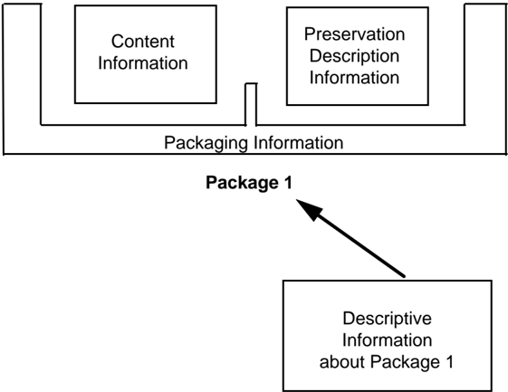

The Content Information is that information which is the original target of preservation. It consists of the Content Data Object (Physical Object or Digital Object, i.e., bits) and its associated Representation Information needed to make the Content Data Object understandable to the Designated Community. For example, the CDO may be an image that

is provided as the bit content of one CD-ROM file together with other files, on the same CDROM, that contain Representation Information.

Only after the Content Information has been clearly defined can an assessment of the Preservation Description Information be made. The Preservation Description Information applies to the Content Information and is needed to preserve the Content Information, to ensure it is clearly identified, and to understand the environment in which the Content Information was created. The Preservation Description Information is divided into four types of preserving information called Provenance, Context, Reference, and Fixity. Briefly, they are the following:

- -Provenance describes the source of the Content Information, who has had custody of it since its origination, and its history (including processing history).
- -Context describes how the Content Information relates to other information outside the Information Package. For example, it would describe why the Content Information was produced, and it may include a description of how it relates to another Content Information object that is available.
- -Reference provides one or more identifiers, or systems of identifiers, by which the Content Information may be uniquely identified. Examples include an ISBN number for a book, or a set of attributes that distinguish one instance of Content Information from another.
- -Fixity provides a wrapper, or protective shield, that protects the Content Information from undocumented alteration. For example, it may involve a check sum over the Content Information of a digital Information Package.

The Packaging Information is that information which, either actually or logically, binds, identifies and relates the Content Information and PDI. For example, if the Content Information and PDI are identified as being the content of specific files on a CD-ROM, then the Packaging Information would include the ISO 9660 volume/file structure on the CDROM, as well as the names and directory information of the files on CD-ROM disk.

The Descriptive Information is that information which is used to discover which package has the Content Information of interest. Depending on the setting, this may be no more than a descriptive title of the Information Package that appears in some message, or it may be a full set of attributes that are searchable in a catalog service.

## 2.2.3 INFORMATION PACKAGE VARIANTS

It is necessary to distinguish between an Information Package that is preserved by an OAIS and the Information Packages that are submitted to, and disseminated from, an OAIS. These variant packages are needed to reflect the reality that some submissions to an OAIS will have insufficient Representation Information or PDI to meet final OAIS preservation requirements. In addition, these may be organized very differently from the way the OAIS organizes the information it is preserving. Finally, the OAIS may provide information to

## CCSDS RECOMMENDATION FOR AN OAIS REFERENCE MODEL CCSDS HISTORICAL DOCUMENT

Consumers that does not include all the Representation Information or all the PDI with the associated Content Information being disseminated. These variants are referred to as the Submission Information Package (SIP), the Archival Information Package (AIP), and the Dissemination Information Package (DIP).

The Submission Information Package (SIP) is that package that is sent to an OAIS by a Producer. Its form and detailed content are typically negotiated between the Producer and the OAIS. Most SIPs will have some Content Information and some PDI, but it may require several SIPs to provide a complete set of Content Information and associated PDI to form an AIP. A single SIP may contain information that is to be included in several AIPs. The Packaging Information will always be present in some form.

Within the OAIS one or more SIPs are transformed into one or more Archival Information Packages (AIP) for preservation. The AIP has a complete set of PDI for the associated Content Information. The AIP may also contain a collection of other AIPs, and this is discussed and modeled in section 4. The Packaging Information of the AIP will conform to OAIS internal standards, and it may vary as it is managed by the OAIS.

In response to a request, the OAIS provides all or a part of an AIP to a Consumer in the form of a Dissemination Information Package (DIP) . The DIP may also include collections of AIPs, and it may or may not have complete PDI. The Packaging Information will necessarily be present in some form so that the Consumer can clearly distinguish the information that was requested. Depending on the dissemination media and Consumer requirements, the Packaging Information may take various forms.

## 2.3 OAIS HIGH-LEVEL EXTERNAL INTERACTIONS

The following subsections present a high-level view of the interaction between the entities identified in the OAIS environment. Figure 2-4 is a data flow diagram that represents the operational OAIS archive external data flows. This diagram concentrates on the flow of information among Producers, Consumers and the OAIS and does not include flows that involve Management. These flows are dealt with further in section 4.

Figure 2-4: OAIS Archive External Data

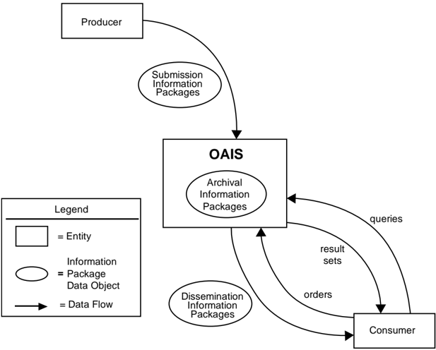

## 2.3.1 MANAGEMENT INTERACTION

Management provides the OAIS with its charter and scope. The charter may be developed by the archive, but it is important that Management formally endorse archive activities. The scope determines the breadth of both the Producer and Consumer groups served by the archive.

Some examples of typical interactions between the OAIS and Management include:

- -Management is often the primary source of funding for an OAIS and may provide guidelines for resource utilization (personnel, equipment, facilities).
- -Management will generally conduct some regular review process to evaluate OAIS performance and progress toward long-term goals.
- -Management determines, or at least endorses, pricing policies, as applicable, for OAIS services.
- -Management participates in conflict resolution involving Producers, Consumers and OAIS internal administration.

Effective Management should also provide support for the OAIS by establishing procedures that assure OAIS utilization within its sphere of influence. For example, management policies should require that all funded activities within its sphere of influence submit data products to the archive and also adhere to archive standards and procedures.

## 2.3.2 PRODUCER INTERACTION

The first contact between the OAIS and the Producer is a request that the OAIS preserve the data products created by the Producer. This contact may be initiated by the OAIS, the Producer or Management. The Producer establishes a Submission Agreement with the OAIS, which identifies the SIPs to be submitted and may span any length of time for this submission. Some Submission Agreements will reflect a mandatory requirement to provide information to the OAIS, while others will reflect a voluntary offering of information. Even in the case where no formal Submission Agreement exists, such as a World Wide Web (WWW) site, a virtual Submission Agreement may exist specifying the file formats and the general subject matter the site will accept.

Within the Submission Agreement, one or more Data Submission Sessions are specified. There may be significant time gaps between the Data Submission Sessions. A Data Submission Session will contain one or more SIPs and may be a delivered set of media or a single telecommunications session. The Data Submission Session content is based on a data model negotiated between the OAIS and the Producer in the Submission Agreement. This data model identifies the logical components of the SIP (e.g., the Content Information, PDI, Packaging Information, and Descriptive Information) that are to be provided and how (and whether) they are represented in each Data Submission Session. All data deliveries within a Submission Agreement are recognized as belonging to that Submission Agreement and will generally have a consistent data model, which is specified in the Submission Agreement. For example, a Data Submission Session may consist of a set of Content Information corresponding to a set of observations, which are carried by a set of files on a CD-ROM. The Preservation Description Information is split between two other files. All of these files need Representation Information which must be provided in some way. The CD-ROM and its directory/file structure are the Packaging Information, which provides encapsulation and identification of the Content Information and PDI in the Data Submission Session. The Submission Agreement indicates how the Representation Information for each file is to be provided, how the CD-ROM is to be recognized, how the Packaging Information will be used to identify and encapsulate the SIP Content Information and PDI, and how frequently Data Submission Sessions (e.g., one per month for two years) will occur. It also gives other needed information such as access restrictions to the data.

Each SIP in a Data Submission Session is expected to meet minimum OAIS requirements for completeness. However, in some cases multiple SIPs may need to be received before an acceptable AIP can be formed and fully ingested within the OAIS. In other cases, a single SIP may contain data to be included in many AIPs. A Submission Agreement also includes, or references, the procedures and protocols by which an OAIS will either verify the arrival and completeness of a Data Submission Session with the Producer or question the Producer on the contents of the Data Submission Session.

## 2.3.3 CONSUMER INTERACTION

There are many types of interactions between the Consumer and the OAIS. These interactions include questions to a help desk, requests for literature, catalog searches, orders

## CCSDS HISTORICAL DOCUMENT

## CCSDS RECOMMENDATION FOR AN OAIS REFERENCE MODEL

and order status requests. The ordering process is of special interest to the OAIS Reference Model, since it deals with the flow of archive holdings between the OAIS and the Consumer.

The Consumer establishes an Order Agreement with the OAIS for information. This information may currently exist in the archive or be expected to be ingested in the future. The Order Agreement may span any length of time, and under it one or more Data Dissemination Sessions may take place. A Data Dissemination Session may involve the transfer of a set of media or a single telecommunications session. The Order Agreement identifies one or more AIPs of interest, how those AIPs are to be transformed and mapped into Dissemination Information Packages (DIPs) and how those DIPs will be packaged in a Data Dissemination Session. The Order Agreement will also specify other needed information such as delivery information (e.g., name or mailing address), and any pricing agreements as applicable. There are two common order types initiated by Consumers: the Event Based Order and the Adhoc Order .

In the case of an Adhoc Order, the Consumer establishes an Order Agreement with the OAIS for information available from the archive. If the Consumer does not know a priori what specific holdings of the OAIS are of interest, the Consumer will establish a Search Session with the OAIS. During this Search Session the Consumer will use the OAIS Finding Aids that operate on Descriptive Information, or in some cases on the AIPs themselves, to identify and investigate potential holdings of interest. This may be accomplished by the submission of queries and the return of result sets to the Consumer. This searching process tends to be iterative, with a Consumer first identifying broad criteria and then refining these criteria based on previous search results. Once the Consumer identifies the OAIS AIPs of interest, the Consumer may provide an Order Agreement that documents the identifiers of the AIPs the Consumer wishes to acquire, and how the DIPs will be acquired from the OAIS. If the AIPs are available, an Adhoc Order will be placed. However if the AIPs desired are not yet available, an Event Based Order may be placed.

In the case of an Event Based Order, the Consumer establishes an Order Agreement with the OAIS for information expected to be received on the basis of some triggering event. This event may be periodic, such as a monthly distribution of any AIPs ingested by the OAIS from a specific Producer, or it may be a unique event such as the ingestion of a specific AIP. The Order Agreement will also specify other needed information such as the trigger event for new Data Dissemination Sessions and the criteria for selecting the OAIS holdings to be included in each new Data Dissemination Session.

The Order Agreement does not have to be a formal document. In general an OAIS will have a general pricing policy and maintain an information base of the electronic and physical mailing addresses of its users. In this case, the process of developing an Order Agreement may be no more than the completion of a World Wide Web form to specify the AIPs of interest.

## 3 OAIS RESPONSIBILITIES

Subsection 3.1 identifies the minimal responsibilities that shall be discharged by an OAIS. Subsection 3.2 gives some examples of mechanisms to discharge these responsibilities, although not all of these will be applicable to all OAISs.

## 3.1 MANDATORY RESPONSIBILITIES

This subsection establishes mandatory responsibilities that an organization must discharge in order to operate an OAIS archive.

The OAIS must:

- -Negotiate for and accept appropriate information from information Producers.
- -Obtain sufficient control of the information provided to the level needed to ensure Long-Term Preservation.
- -Determine, either by itself or in conjunction with other parties, which communities should become the Designated Community and, therefore, should be able to understand the information provided.
- -Ensure that the information to be preserved is Independently Understandable to the Designated Community. In other words, the community should be able to understand the information without needing the assistance of the experts who produced the information.
- -Follow documented policies and procedures which ensure that the information is preserved against all reasonable contingencies, and which enable the information to be disseminated as authenticated copies of the original, or as traceable to the original.
- -Make the preserved information available to the Designated Community.

## 3.2 EXAMPLE MECHANISMS FOR DISCHARGING RESPONSIBILITIES

This subsection provides example mechanisms for discharging the responsibilities of 3.1. Not all of these mechanisms will be applicable to all OAISs.

## 3.2.1 NEGOTIATES FOR AND ACCEPTS INFORMATION

An organization operating an OAIS will have established some criteria that aids in determining the types of information that it is willing to, or it is required to, accept. These criteria may include, among others, subject matter, information source, degree of uniqueness or originality, and the nature of the techniques used to represent the information (e.g., physical media, digital media, format). The information may, in general, be submitted using a wide variety of common and not-so-common forms, such as books, documents, maps, data sets, and moon rocks using a variety of communication paths including networks, mail, and special delivery.

The OAIS negotiates with the Producer to ensure it acquires appropriate Content Information and associated PDI for its mission and the Designated Community. Considerable iteration may be required to agree on the right information to be submitted, and to get it into forms acceptable to the OAIS. For example, this may include digitizing audio or video material, or scanning text.

The OAIS should extract, or otherwise obtain, sufficient Descriptive Information to assist the Designated Community in finding the Content Information of interest. It also should ensure that the information meets all OAIS internal standards.

## 3.2.2 OBTAINS SUFFICIENT CONTROL FOR PRESERVATION

It is important for the OAIS to recognize the separation that can exist between physical ownership or possession of Content Information and ownership of intellectual property rights in this information. If it has created the information and is the legal owner of the Content Information, the OAIS already has the independence to do what is required to preserve the information and make it available. When acquiring the Content Information from any other producer or entity, the OAIS must ensure that there is a legally valid transfer agreement that either transfers intellectual property rights to the OAIS, or clearly specifies the rights granted to the OAIS and any limitations imposed by the rightsholder(s). The OAIS must ensure that its subsequent actions to preserve the information and make it available conform with these rights and limitations. When the OAIS does not acquire the intellectual property rights, the agreement should specify what involvement the rightsholder(s) will have in preservation, management or release of the information. In most cases, it will be preferable for the OAIS to negotiate an agreement that specifies the rightsholder(s) requirements and authorizes the OAIS to act in accordance with those requirements without active involvement of the rightsholder(s) in individual cases.

The OAIS must assume sufficient control over the Content Information and Preservation Description Information so that it is able to preserve it for the Long Term. There is no issue with the AIP's Packaging Information because, by definition, this is under internal OAIS control. The problems of assuming sufficient control of the Content Information and Preservation Description Information, when they are largely digital, are addressed in three related categories, as follows:

- -copyright implications; intellectual property and other legal restrictions on use;
- -authority to modify Representation Information;
- -agreements with external organizations.

Copyright implications, intellectual property and other legal restrictions on use: An archive will honor all applicable legal restrictions. These issues occur when the OAIS acts as a custodian. An OAIS should understand the copyright concepts and applicable laws prior to accepting copyright materials into the OAIS. It can establish guidelines for ingestion of information and rules for dissemination and duplication of the information when necessary. It is beyond the scope of this document to provide details of national and international copyright laws.

## CCSDS RECOMMENDATION FOR AN OAIS REFERENCE MODEL CCSDS HISTORICAL DOCUMENT

Authority to modify Representation Information: Although the Fixity information within the Preservation Description Information of an AIP ensures that the Content Informationrelated bits have not been altered, there will come a time when Content Information bits are not in a form that is convenient for the Consumers from the Designated Community. The Content Information bits may be fully documented in available hardcopy forms, so technically the information has not been lost, but practically the information has become inaccessible. The OAIS needs the authority to migrate the Content Information to new representation forms. If it is acting as a custodian, it may need to seek additional permission to make such changes. If the information is copyrighted, the OAIS should already have negotiated permission to make the changes needed to meet preservation objectives. It may employ subject matter experts, from outside the OAIS, to help ensure that information is not lost. Ideally, when this situation arises, both the original AIPs (fully described) and new AIPs will be retained. Digital Migration issues are addressed more fully in section 0.

Agreements with external organizations: An OAIS may establish a variety of agreements with other organizations to assist in its preservation objectives. For example, it may establish an agreement with another OAIS so that it does not have to preserve all the common Representation Information objects related to its Content Information objects. Agreements with other organizations should be monitored to be sure they are being followed and remain useful.

## 3.2.3 DETERMINES DESIGNATED CONSUMER COMMUNITY

The submission, or planned submission, of Content Information and associated PDI requires a determination as to who the expected Consumers, or Designated Community, of this information will be. This is necessary in order to determine if the information, as represented, will be understandable to that community. For example, an archive may decide that certain Content Information should be understandable to the general public and, therefore, this becomes the Designated Community.

For some scientific information, the Designated Community of Consumers might be described as those with a first year graduate level education in a related scientific discipline. This is a more difficult case as it is less clear what degree of specialized scientific terminology might actually be acceptable. The Producers of such specialized information are often familiar with a narrowly recognized set of terminology, so it is especially critical to clearly define the Designated Community for their information and to make the effort to ensure that this community can understand the information.

The possible evolution of the definition of the Designated Community also needs consideration. Information originally intended for a narrowly defined community may need to be made more widely understandable at some future date. For example, information originally intended to be understandable to a particular scientific community may need to be made understandable to the general public. This is likely to mean adding explanations in support of the Representation Information and the Preservation Description Information, and it can become increasingly difficult to obtain this information over time. Selecting a broader definition of the Designated Community (e.g., general public) when the information is first

proposed for Long-Term Preservation can reduce this concern and also improve the likelihood that the information will be understandable to all in the original community.

## 3.2.4 ENSURES INFORMATION IS INDEPENDENTLY UNDERSTANDABLE

The degree to which Content Information and its associated PDI conveys information to a Designated Community is, in general, quite subjective. Nevertheless, it is essential that an archive make this determination in order to maximize information preservation. Digital Content Information and PDI need adequate Representation Information to be Independently Understandable to the Designated Community. Typically there are multiple Representation Information objects involved, and this is discussed in 4.2.

For example, consider Content Information from a digital set of observations of rainfall, temperature, pressure, wind velocities, and other parameters measured all over the world for a year. This type of information is very extensive, and is not usually in a form intended for direct human browsing or reading, but it is in a form appropriate to searching and manipulation by application software. Such content may only be understandable to the original Producers, unless there is adequate documentation of the meaning of the various fields and their inter-relationships, and how the values relate back to the original instrumentation that made the observations. In such specialized fields extra effort is needed to ensure that the Content Information and the Preservation Description Information are understandable to a Designated Community. If the archive does not have this level of expertise in-house, it may have outside community representatives review the information for long-term understandability. Otherwise some of the information may be understandable to only a few specialists and be lost when they are no longer available.

Even when a set of information has been determined to be understandable to a particular Designated Community, over time the Knowledge Base of this community may evolve to the point that important aspects of the information may no longer be readily understandable. At this point it may be necessary for the OAIS to enhance the associated Representation Information so that it is again readily understandable to the Designated Community.

As another example, a manuscript's Content Information may be written in English and therefore its content may be generally understandable to a wide audience. However, unless the purpose for which it was created is clearly documented, much of its meaning may be lost. This 'purpose' information is part of its Context and must be provided in the Preservation Description Information.

Software is needed for efficient access to Digital Content Information. However, maintaining Content Information-specific software over the Long Term has not yet been proven cost effective due to the narrow application of such software. The danger of information loss is great when such software is relied upon for information preservation and understanding because it may cease to function under only small changes to the hardware and software environment. This may not be recognized unless there is a vigorous, ongoing, testing and validation program.

## 3.2.5 FOLLOWS ESTABLISHED PRESERVATION POLICIES AND PROCEDURES

It is essential for an OAIS to have documented policies and procedures for preserving its AIPs, and it should follow those procedures. The appropriate policies and procedures will depend, at minimum, on the nature of the AIPs and any 'backup' relationships the archive may have with other archives. For example, migrations that alter any Content Information or PDI will need to be carefully monitored and the appropriate PDI fully updated. This attention to detail, while also ensuring against processing errors, requires that strong policies and procedures be in place and that they be executed.

The Producer and Consumer communities should be provided with submission and dissemination standards, policies, and procedures to support the preservation objectives of the OAIS.

The Designated Community should be monitored to be sure the Content Information is still understandable to them. The Designated Community may lose its familiarity with some terminology, and the definition of the community may be broadened to include other members with different backgrounds. For example, a periodic review with participants representing the Designated Community could assist in this process.

A long-term technology usage plan, updated as technology evolves, is essential to avoid being caught with very costly system maintenance, emergency system replacements, and costly data representation transformations.

## 3.2.6 MAKES THE INFORMATION AVAILABLE

By definition, an OAIS makes its AIPs visible and available to its Designated Communities. Multiple views of its holdings, supported by various search aids that may cut across collections of AIPs, may be provided. Some AIPs may only exist as the output of algorithms operating on other AIPs. They appear as DIPs that, upon dissemination, should include documentation on how they were derived from other AIPs. The expectations of OAIS Consumers regarding access services will vary widely among archives and over time as technology evolves. Pressures for more effective access must be balanced with the requirements for preservation under the available resource constraints.

Some AIPs may have restricted access and therefore may only be disseminated to Consumers who meet access restrictions. The OAIS should have published policies on access and restrictions so that the rights of all parties are protected.

In general, DIPs may be distributed by all varieties of communication paths, including networks and physical media.

## CCSDS RECOMMENDATION FOR AN OAIS REFERENCE MODEL

## 4 DETAILED MODELS

The purpose of this section is to provide a more detailed model view of the functional entities of the OAIS and the information handled by the OAIS. This aids OAIS designers of future systems and provides a more precise set of terms and concepts for discussion of current systems.

## 4.1 FUNCTIONAL MODEL

The OAIS of figure 2-1 is separated in figure 4-1 into six functional entities and related interfaces. Only major information flows are shown. The lines connecting entities identify communication paths over which information flows in both directions. The lines to Administration and Preservation Planning are dashed only to reduce diagram clutter.

Figure 4-1: OAIS Functional Entities

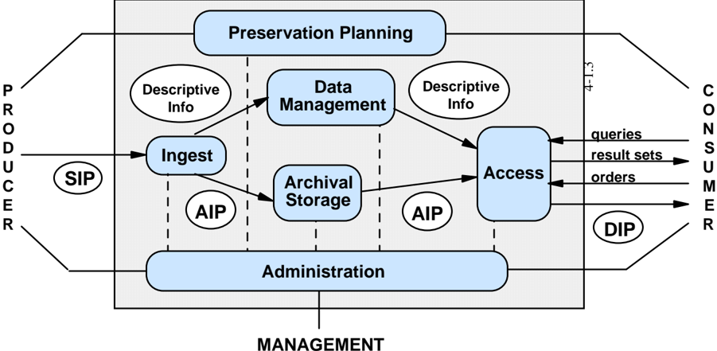

The role provided by each of the entities in figure 4-1 is described briefly as follows:

Ingest : This entity provides the services and functions to accept Submission Information Packages (SIPs) from Producers (or from internal elements under Administration control) and prepare the contents for storage and management within the archive. Ingest functions include receiving SIPs, performing quality assurance on SIPs, generating an Archival Information Package (AIP) which complies with the archive's data formatting and documentation standards, extracting Descriptive Information from the AIPs for inclusion in the archive database, and coordinating updates to Archival Storage and Data Management.

Archival Storage: This entity provides the services and functions for the storage, maintenance and retrieval of AIPs. Archival Storage functions include receiving AIPs from Ingest and adding them to permanent storage, managing the storage hierarchy, refreshing the

## CCSDS HISTORICAL DOCUMENT

## CCSDS RECOMMENDATION FOR AN OAIS REFERENCE MODEL

media on which archive holdings are stored, performing routine and special error checking, providing disaster recovery capabilities, and providing AIPs to Access to fulfill orders.

Data Management: This entity provides the services and functions for populating, maintaining, and accessing both Descriptive Information which identifies and documents archive holdings and administrative data used to manage the archive. Data Management functions include administering the archive database functions (maintaining schema and view definitions, and referential integrity), performing database updates (loading new descriptive information or archive administrative data), performing queries on the data management data to generate result sets, and producing reports from these result sets.

Administration: This entity provides the services and functions for the overall operation of the archive system. Administration functions include soliciting and negotiating submission agreements with Producers, auditing submissions to ensure that they meet archive standards, and maintaining configuration management of system hardware and software. It also provides system engineering functions to monitor and improve archive operations, and to inventory, report on, and migrate/update the contents of the archive. It is also responsible for establishing and maintaining archive standards and policies, providing customer support, and activating stored requests.

Preservation Planning : This entity provides the services and functions for monitoring the environment of the OAIS and providing recommendations to ensure that the information stored in the OAIS remains accessible to the Designated User Community over the long term, even if the original computing environment becomes obsolete. Preservation Planning functions include evaluating the contents of the archive and periodically recommending archival information updates to migrate current archive holdings, developing recommendations for archive standards and policies, and monitoring changes in the technology environment and in the Designated Community's service requirements and Knowledge Base. Preservation Planning also designs IP templates and provides design assistance and review to specialize these templates into SIPs and AIPs for specific submissions. . Preservation Planning also develops detailed Migration plans, software prototypes and test plans to enable implementation of Administration migration goals.

Access: This entity provides the services and functions that support Consumers in determining the existence, description, location and availability of information stored in the OAIS, and allowing Consumers to request and receive information products. Access functions include communicating with Consumers to receive requests, applying controls to limit access to specially protected information, coordinating the execution of requests to successful completion, generating responses (Dissemination Information Packages, result sets, reports) and delivering the responses to Consumers.

In addition to the entities described above, there are various Common Services assumed to be available. These services are considered to constitute another functional entity in this model. This entity is so pervasive that, for clarity, it is not shown in figure 4-1.

## 4.1.1 DETAILED DESCRIPTION OF FUNCTIONAL ENTITIES

In the following subsections, specific flows of information among the entities are identified in italics the first time they appear in the text. The detailed functional descriptions of the subsections are accompanied by diagrams, figure 4-2 4-2 through figure 4-7 4-7 , that depict only the major data flows within and among the entities. Omitted for clarity are minor flows such as acknowledgment notices. Annex F contains a figure that combines figure through figure to demonstrate overall consistency. However, this is not to be taken as a recommended design or implementation.

## 4.1.1.1 Common Services

Modern, distributed computing applications assume a number of supporting services such as inter-process communication, name services, temporary storage allocation, exception handling, security, backup and directory services. Much excellent work has already been done in the area of open system environment reference models. The services described in this subsection are based partially on the services described in the IEEE POSIX OSE Reference Model (reference [5]).

Operating system services provide the core services needed to operate and administer the application platform, and provide an interface between application software and the platform. These services include the following:

- -Kernel operations provide low-level services necessary to create and manage processes, execute programs, define and communicate signals, define and process system clock operations, manage files and directories, and control input-output processing to and from the external environment.
- -Commands and utilities include mechanisms for operations at the operator level, such as comparing, printing, and displaying file contents; editing files; pattern searching; evaluating expressions; logging messages; moving files between directories; sorting data; executing command scripts; and accessing environment information.
- -Real-time extension includes the application and operating system interfaces needed to support those application domains requiring deterministic execution, processing, and responsiveness. The extension defines the applications interface to basic system services for input/output, file system access, and process management.
- -System management includes capabilities to define and manage user resource allocation and access (i.e., what resources are managed and the classes of access defined), configuration and performance management of devices, file systems, administrative processes (job accounting), queues, machine/platform profiles, authorization of resource usage, and system backup.
- -Operating system security services specify the control of access to system data, functions, hardware, and software resources by users and user processes.

Network services provide the capabilities and mechanisms to support distributed applications requiring data access and applications interoperability in heterogeneous, networked environments. These services include the following:

- -Data communication includes API and protocol specifications for reliable, transparent, end-to-end data transmission across communications networks.
- -Transparent file access to available files located anywhere in a heterogeneous network.
- -Personal/micro computer support for interoperability with systems based on other operating systems, particularly microcomputer operating systems, which may not be formally specified in a national or international standard.
- -Remote Procedure Call services include specifications for extending the local procedure call to a distributed environment.
- -Network security services include access, authentication, confidentiality, integrity, and non-repudiation controls and management of communications between senders and receivers of information in a network.

Security services capabilities and mechanisms to protect sensitive information and treatments in the information system. The appropriate level of protection is determined based upon the value of the information to the application end-users and the perception of threats to it. These services include the following:

- -Identification/authentication service confirms the identities of requesters for use of information system resources. In addition, authentication can apply to providers of data. The authentication service may occur at the initiation of a session or during a session.
- -Access control service prevents the unauthorized use of information system resources. This service also prevents the use of a resource in an unauthorized way. This service may be applied to various aspects of access to a resource (e.g., access to communications to the resource, the reading, writing, or deletion of an information/data resource, the execution of a processing resource) or to all accesses to a resource.
- -Data integrity service ensures that data is not altered or destroyed in an unauthorized manner. This service applies to data in permanent data stores and to data in communications messages.
- -Data confidentiality service ensures that data is not made available or disclosed to unauthorized individuals or computer processes. This service will be applied to devices that permit human interaction with the information system. In addition, this service will ensure that observation of usage patterns of communications resources will not be possible.
- -Non-repudiation service ensures that entities engaging in an information exchange cannot deny being involved in it. This service may take one or both of two forms. First, the recipient of data is provided with proof of the origin of the data. This

## CCSDS HISTORICAL DOCUMENT

## CCSDS RECOMMENDATION FOR AN OAIS REFERENCE MODEL

protects against any attempt by the sender to falsely deny sending the data or its contents. Second, the sender of data is provided with proof of delivery of data. This protects against any subsequent attempt by the recipient to falsely deny receiving the data or its contents.

## 4.1.1.2 Ingest

The functions of the Ingest entity are illustrated in figure 4-2.

Figure 4-2: Functions of Ingest

The Receive Submission function provides the appropriate storage capability or devices to receive a SIP from the Producer (or from Administration). Digital SIPs may be delivered via electronic transfer (e.g., FTP), loaded from media submitted to the archive, or simply mounted (e.g., CD-ROM) on the archive file system for access. Non-digital SIPs would likely be delivered by conventional shipping procedures. The Receive Submission function may represent a legal transfer of custody for the Content Information in the SIP, and may require that special access controls be placed on the contents. This function provides a confirmation of receipt of a SIP to the Producer, which may include a request to resubmit a SIP in the case of errors resulting from the SIP submission.

The Quality Assurance function validates ( QA results ) the successful transfer of the SIP to the staging area. For digital submissions, these mechanisms might include Cyclic Redundancy Checks (CRCs) or checksums associated with each data file, or the use of system log files to record and identify any file transfer or media read/write errors.

## CCSDS RECOMMENDATION FOR AN OAIS REFERENCE MODEL CCSDS HISTORICAL DOCUMENT

The Generate AIP function transforms one or more SIPs into one or more AIPs that conform to the archive's data formatting and documentation standards . This may involve file format conversions, data representation conversions or reorganization of the content information in the SIPs. The Generate AIP function may issue report requests to Data Management to obtain reports of information needed by the Generate AIP function to produce the Descriptive Information that completes the AIP. This function sends SIPs or AIPs for audit to the Audit Submission function in Administration, and receives back an audit report .

The Generate Descriptive Information function extracts Descriptive Information from the AIPs and collects Descriptive Information from other sources to provide to Coordinate Updates, and ultimately Data Management. This includes metadata to support searching and retrieving AIPs (e.g., who, what, when, where, why), and could also include special browse products (thumbnails, images) to be used by Finding Aids.

The Coordinate Updates function is responsible for transferring the AIPs to Archival Storage and the Descriptive Information to Data Management. Transfer of the AI P includes a storage request and may represent an electronic, physical, or a virtual (i.e., data stays in place) transfer. After the transfer is completed and verified, Archival Storage returns a storage confirmation indicating (or verifying) the storage identification information for the AIP. The Coordinate Updates function also incorporates the storage identification information into the Descriptive Information for the AIP and transfers it to the Data Management entity along with a database update request . In return, Data Management provides a database update response indicating the status of the update. Data Management updates may take place without a corresponding Archival Storage transfer when the SIP contains Descriptive Information for an AIP already in Archival Storage.

## 4.1.1.3 Archival Storage

The functions of the Archival Storage entity are illustrated in figure 4-3.

## CCSDS RECOMMENDATION FOR AN OAIS REFERENCE MODEL CCSDS HISTORICAL DOCUMENT

4-3.3

Figure 4-3: Functions of Archival Storage

The Receive Data function receives a storage request and an AIP from Ingest and moves the AIP to permanent storage within the archive. The transfer request may need to indicate the anticipated frequency of utilization of the data objects comprising the AIP in order to allow the appropriate storage devices or media to be selected for storing the AIP. This function will select the media type, prepare the devices or volumes, and perform the physical transfer to the Archival Storage volumes. Upon completion of the transfer, this function sends a storage confirmation message to Ingest, including the storage identification of the AIPs.

The Manage Storage Hierarchy function positions, via commands , the contents of the AIPs on the appropriate media based on storage management policies , operational statistics, or directions from Ingest via the storage request. It will also conform to any special levels of service required for the AIP, or any special security measures that are required, and ensures the appropriate level of protection for the AIP. These include on-line, off-line or near-line storage, required throughput rate, maximum allowed bit error rate, or special handling or backup procedures. It monitors error logs to ensure AIPs are not corrupted during transfers. This function also provides operational statistics to Administration summarizing the inventory of media on-hand, available storage capacity in the various tiers of the storage hierarchy, and usage statistics.

The Replace Media function provides the capability to reproduce the AIPs over time. Within the Replace Media function the Content Information and Preservation Description Information (PDI) must not be altered. However, the data constituting the Packaging Information may be changed as long as it continues to perform the same function and there is

## CCSDS HISTORICAL DOCUMENT

## CCSDS RECOMMENDATION FOR AN OAIS REFERENCE MODEL

a straight forward implementation that does not cause information loss. The migration strategy must select a storage medium, taking into consideration the expected and actual rates of errors encountered in various media types, their performance, and their costs of ownership. If media-dependent attributes (e.g., tape block sizes, CD-ROM volume information) have been included as part of the Content Information, a way must be found to preserve this information when migrating to higher capacity media with different storage architectures. Anticipating the terminology of section 0, this function may perform 'Refreshment', 'Replication', and 'Repackaging' that is straightforward. An example of such 'Repackaging' is migration to new media under a new operating system and file system, where the Content Information and PDI are independent of the file systems. However, complex 'Repackaging' and all 'Transformation' are performed under Administration supervision by the Archival Information Update function to ensure information preservation. Refer to section 0 for a detailed description of migration issues.

The Error Checking function provides statistically acceptable assurance that no components of the AIP are corrupted during any internal Archival Storage data transfer. This function requires that all hardware and software within the archive provide notification of potential errors and that these errors are routed to standard error logs that are checked by the Archival Storage staff. The PDI Fixity Information provides some assurance that the Content Information has not been altered as the AIP is moved and accessed. Similar information is needed to protect the PDI itself. A standard mechanism for tracking and verifying the validity of all data objects within the archive may also be used. For example, CRCs could be maintained for every individual data file. A higher level of service, such as Reed-Solomon coding to support combined error detection and correction, could also be provided. The storage facility procedures should provide for random verification of the integrity of data objects using CRCs or some other error checking mechanism.

The Disaster Recovery function provides a mechanism for duplicating the digital contents of the archive collection and storing the duplicate in a physically separate facility. This function is normally accomplished by copying the archive contents to some form of removable storage media (e.g., digital linear tape, compact disc), but may also be performed via hardware transport or network data transfers. The details of disaster recovery policies are specified by Administration.

The Provide Data function provides copies of stored AIPs to Access. This function receives an AIP request that identifies the requested AIP(s ) and provides them on the requested media type or transfers them to a staging area. This function also sends a notice of data transfer to Access upon completion of an order.

## 4.1.1.4 Data Management

The functions of the Data Management entity are illustrated in figure 4-4.

## CCSDS HISTORICAL DOCUMENT

## CCSDS RECOMMENDATION FOR AN OAIS REFERENCE MODEL

Figure 4-4: Functions of Data Management

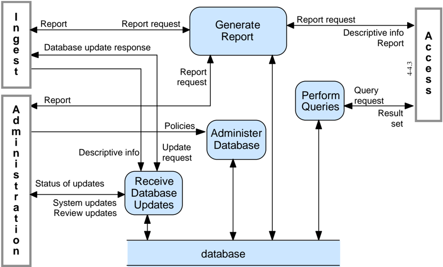

The Administer Database function is responsible for maintaining the integrity of the Data Management database, which contains both Descriptive Information and system information. Descriptive Information identifies and describes the archive holdings, and system information is used to support archive operations. The Administer Database function is responsible for creating any schema or table definitions required to support Data Management functions; for providing the capability to create, maintain and access customized user views of the contents of this storage; and for providing internal validation (e.g., referential integrity) of the contents of the database. The Administer Database function is carried out in accordance with policies received from Administration.

The Perform Queries function receives a query request from Access and executes the query to generate a result set that is transmitted to the requester.

The Generate Report function receives a report request from Ingest, Access or Administration and executes any queries or other processes necessary to generate the report that it supplies to the requester. Typical reports might include summaries of archive holdings by category, or usage statistics for accesses to archive holdings. It may also receive a report request from Access and provides descriptive information for a specific AIP.

The Receive Database Updates function adds, modifies or deletes information in the Data Management persistent storage. The main sources of updates are Ingest, which provides Descriptive Information for the new AIPs, and Administration, which provides system updates and review updates . Ingest transactions consist of Descriptive Information which identifies new AIPs stored in the archive. System updates include all system-related

## CCSDS HISTORICAL DOCUMENT

## CCSDS RECOMMENDATION FOR AN OAIS REFERENCE MODEL

information (operational statistics, Consumer information, and request status). Review updates are generated by periodic reviewing and updating of information values (e.g., contact names, and addresses). The Receive Database Updates function provides regular reports to Administration summarizing the status of updates to the database, and also sends a database update response to Ingest.

## 4.1.1.5 Administration

The functions of the Administration entity are illustrated in figure 4-5.

Figure 4-5: Functions of Administration

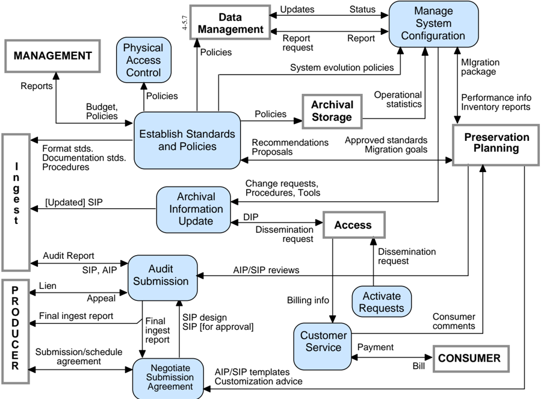

The Negotiate Submission Agreement function solicits desirable archival information for the OAIS and negotiates Submission Agreements with Producers. This function also negotiates a data submission schedule with the Producer. It maintains a calendar of expected Data Submission Sessions that will be needed to transfer one or more SIPs to the OAIS and the resource requirements to support their ingestion. This function receives AIP/SIP templates and customization advise from Preservation Planning and sends SIP designs and SIPs to the Audit Submission function as part of the submission approval process. The data submission formats and procedures must be clearly documented in the archive's data

## CCSDS RECOMMENDATION FOR AN OAIS REFERENCE MODEL CCSDS HISTORICAL DOCUMENT

submission policies, and the deliverables must be identified by the Producer in the Submission Agreement.

The Manage System Configuration function provides system engineering for the archive system to continuously monitor the functionality of the entire archive system and systematically control changes to the configuration. This function maintains integrity and tractability of the configuration during all phases of the system life cycle. It also audits system operations, system performance, and system usage. It sends report requests for system information to Data Management and receives reports ; it receives operational statistics from Archival Storage. It summarizes those reports and periodically provides OAIS performance information and archive holding inventory reports to Preservation Planning. It sends performance information to Establish Standards and Policies. It receives migration packages from Preservation Planning. It receives system evolution policies from the Establish Standards and Procedures function. Based on these inputs it develops and implements plans for system evolution. It sends change requests , procedures and tools to Archive Information Update.

The Archival Information Update function provides a mechanism for updating the contents of the archive. It receives change requests , procedures and tools from Manage System Configuration. It provides updates by sending a dissemination request to Access, updating the contents of the resulting DIPs and resubmitting them as SIPs to Ingest.

The Physical Access Control function provides mechanisms to restrict or allow physical access (doors, locks, guards) to elements of the archive, as determined by archive policies.

The Establish Standards and Policies function is responsible for establishing and maintaining the archive system standards and policies. It receives budget information and policies such as the OAIS charter, scope, resource utilization guidelines, and pricing policies from Management. It provides Management with periodic reports . It receives recommendations for archive system enhancement, and proposals for new archive data standards from Preservation Planning. It also receives performance information and archive holding inventories from Manage System Configuration. Based on these inputs, archive standard s and policies are established and sent to other Administration functions and the other Functional Entities for implementation. The standards includ e format standards, documentation standards and the procedures to be followed during the Ingest process . It provides approved standards and migration goals to Preservation Planning. This function will also develop storage management policies (for the Archival Storage hierarchy), including migration policies to assure that archive storage formats do not become obsolete, and database administration policies. It will develop disaster recovery policies . It will also determine security policies for the contents of the archive, including those affecting Physical Access Control and the application of error control techniques throughout the archive.

The Audit Submission function will verify that submissions ( SIP or AIP ) meet the specifications of the Submission Agreement. This function receives AIP/SIP reviews from Preservation Planning and may also involve an outside committee (e.g., science and technical review). The audit process must verify that the quality of the data meets the requirements of

## CCSDS HISTORICAL DOCUMENT

## CCSDS RECOMMENDATION FOR AN OAIS REFERENCE MODEL

the archive and the review committee. It must verify that there is adequate Representation Information and PDI to ensure that the Content Information is understandable and independently usable to the Designated Community. The formality of the review will vary depending on internal archive policies. The Audit process may determine that some portions of the SIP are not appropriate for inclusion in the archive and must be resubmitted or excluded. An audit report is provided to Ingest. After the audit process is completed, any liens are reported to the Producer, who will then resubmit the SIP to Ingest or appeal the decision to Administration. After the audit is completed, a final ingest report is prepared and provided to the Producer and to Negotiate Submission Agreement. Audit methods potentially include sampling, periodic review, and peer review.

The Activate Requests function maintains a record of event-driven requests and periodically compares it to the contents of the archive to determine if all needed data is available. If needed data is available, this function generates a dissemination request that is sent to Access. This function can also generate orders on a periodic basis where the length of the period is defined by the Consumers or on the occurrence of an event (e.g., a database update).

The Customer Service function will create, maintain and delete Consumer accounts. It will collect billing information from Access and will send bills and collect payment from Consumers for the utilization of archive system resources. It will respond to general information requests. This function will also collect and respond to feedback on Access services and products. Customer Service will summarize these comments and make them available.

## 4.1.1.6 Preservation Planning

The functions of the Preservation Planning entity are illustrated in figure 4-6.

## CCSDS RECOMMENDATION FOR AN OAIS REFERENCE MODEL CCSDS HISTORICAL DOCUMENT

Figure 4-6: Functions of Preservation Planning

The Monitor Designated Community function interacts with archive Consumers and Producers to track changes in their service requirements and available product technologies . Such requirements might include data formats, media choices, preferences for software packages, new computing platforms, and mechanisms for communicating with the archive. This function may be accomplished via surveys , via a periodic formal review process, via community workshops where feedback is solicited or by individual interactions. It provides reports , requirements alerts and emerging standards to the Develop Preservation Strategies and Standards function. It sends preservation requirements to Develop Packaging Designs.

The Monitor Technology function is responsible for tracking emerging digital technologies, information standards and computing platforms (i.e., hardware and software) to identify technologies which could cause obsolescence in the archive's computing environment and prevent access to some of the archives current holdings. This function may contain a

## CCSDS HISTORICAL DOCUMENT

## CCSDS RECOMMENDATION FOR AN OAIS REFERENCE MODEL

prototyping capability for better evaluation of emerging technologies and receive prototype requests from Develop Preservation Strategies and Standards and from Develop Package Designs and Migration Plans. This function sends reports , external data standards , prototype results and technology alerts to Develop Preservation Strategies and Standards. It also sends prototype results to Develop Package Designs and Migration Plans.

The Develop Preservation Strategies and Standards function is responsible for developing and recommending strategies and standards to enable the archive to better anticipate future changes in the Designated Community service requirements or technology trends that would require migration of some current archive holdings or new submissions. This function receives reports from the Monitor Designated Communities and Monitor Technology functions, and it receives performance information , inventory reports and summarized consumer comments from Administration. This function sends recommendations on system evolution to Administration. This function also receives external data standards from Monitor Technology and produces profiles of those standards that are sent to Administration as proposals on their potential usage. This function also receives issues from Develop Packaging Designs and Migration Plans in the case of unanticipated submission requirements, and responds with advice to handle the new requirements.

The Develop Packaging Designs and Migration Plans function develops new IP designs and detailed migration plans and prototypes, to implement Administration policies and directives. This activity also provides advice on the application of these IP designs and Migration plans to specific archive holdings and submissions. This function receives archive approved standards and migration goals from Administration. The standards include format standards, metadata standards and documentation standards. It applies these standards to preservation requirements and provides AIP and SIP template designs to Administration. This function also provides customization advice and AIP/SIP review to Administration on the application of those designs. If this function encounters submissions that are not covered by existing standards and procedures, it can send issues to Develop Preservation Strategies and Standards and receive advice , including new standards, to assist in meeting the new submission requirements.

The migration goals received by this function tend to involve transformations of the AIP, including transformations of the Content Information to avoid loss of access due to technology obsolescence. The response to the migration goals may involve the development of new AIP designs, prototype software, test plans, community review plans and implementation plans for phasing in the new AIPs. This process may call on expertise or resources from other functions within Preservation Planning, such as prototype development from the Monitor Technology. This effort also will require consultation from the other functional areas and from the Designated Community. Once the migration plan, associated AIP designs, and software have been tested and approved, this function will send the entire migration package to Administration, which will schedule and perform the actual migration.

## 4.1.1.7 Access

The functions of the Access entity are illustrated in figure 4-7.

## CCSDS HISTORICAL DOCUMENT

## CCSDS RECOMMENDATION FOR AN OAIS REFERENCE MODEL

Figure 4-7: Functions of Access

The Coordinate Access Activities function provides a single user interface to the information holdings of the archive. This interface will normally be via computer network or dial-up link to an on-line service, but might also be implemented in the form of a walk-in facility, printed catalog ordering service, or fax-back type service. Three categories of Consumer requests are distinguished: query requests, which are executed in Data Management and return immediate result sets for presentation to the user; report requests, which may require a number of queries and produce formatted reports for delivery to the Consumer; and orders, which may access either or both Data Management and Archival Storage to prepare a formal Dissemination Information Package (DIP) for on- or off-line delivery. An order may be an Adhoc Order that is executed only once, or an Event Based Order that will be maintained by the Activate Requests function in Administration, and initiated by a dissemination request that may result in periodic deliveries of requested items. The Archival Information Update function in Administration also submits dissemination requests to obtain DIPs needed to perform its update functions. Other special request types are allowed, but are not detailed. This function will determine if resources are available to perform a request, assure that the user is authorized to access and receive the requested items, and notify the Consumer that a request has been accepted or rejected (possibly with an estimate of request cost and an option to cancel the request). It will then transfer the request to Data Management or to the Generate DIP function for execution. This function also provides assistance to OAIS Consumers including providing status of orders and other Consumer support activities in response to an assistance request .

The Generate DIP function accepts a dissemination request , retrieves the AIP from Archival Storage, and moves a copy of the data to a staging area for further processing. This function

## CCSDS HISTORICAL DOCUMENT

## CCSDS RECOMMENDATION FOR AN OAIS REFERENCE MODEL

also transmits a report request to Data Management to obtain Descriptive Information needed for the DIP. If special processing is required, the Generate DIP function accesses data objects in staging storage and applies the requested processes. The types of operations, which may be carried out, include statistical functions, sub-sampling in temporal or spatial dimensions, conversions between different data types or output formats, and other specialized processing (e.g., image processing). This function places the completed DIP response in the staging area and notifies the Coordinate Access Activities function that the DIP is ready for delivery.

The Deliver Response function handles both on-line and off-line deliveries of responses ( DIPs , result sets , reports and assistance ) to Consumers. For on-line delivery, it accepts a response from Coordinate Access Activities and prepares it for on-line distribution in real time via communication links. It identifies the intended recipient, determines the transmission procedure requested, places the response in the staging area to be transmitted, and supports the on-line transmission of the response. For off-line delivery it retrieves the response from the Coordinate Access Activities function, prepares packing lists and other shipping records, and then ships the response. When the response has been shipped, a notice of shipped order is returned to the Coordinate Access Activities function and billing information is submitted to Administration.

## 4.1.2 DATA FLOW DIAGRAMS

The flow of data items among the OAIS functional entities is diagrammed in this subsection. Figure 4-8 shows the more significant data flows. To avoid complicating this figure, the Administration data flows, which are generally background activities, are isolated to an Administration context diagram, figure 4-9. Data flows associated with Common Services are implicit in the illustrated functions, and are therefore not shown.

Figure 4-8: OAIS Data Flow Diagram

## CCSDS RECOMMENDATION FOR AN OAIS REFERENCE MODEL CCSDS HISTORICAL DOCUMENT

Figure 4-9: Administration Context Diagram

## 4.2 INFORMATION MODEL

This subsection builds on the concepts presented in section 2 to further describe the types of information that are exchanged and managed within the OAIS. This subsection also defines the specific Information Objects that are used within the OAIS to preserve and access the information entrusted to the archive. This more detailed model of OAIS-related Information Objects is intended to aid the architect or designer of future OAIS systems. The objects discussed in this subsection are conceptual and should not be taken to imply any specific implementations.

## CCSDS HISTORICAL DOCUMENT

## CCSDS RECOMMENDATION FOR AN OAIS REFERENCE MODEL

As discussed in section 2, the primary goal of an OAIS is to preserve information for a designated community over an indefinite period of time. In order to preserve this information an OAIS must store significantly more than the contents of the object it is expected to preserve. This subsection analyzes those information requirements used to describe the object classes of data associated with an OAIS. This subsection uses Universal Modeling Language (UML) object model diagrams to illustrate the concepts discussed in the text. An overview of the notation used and critical object modeling concepts is presented in annex C of this document. An understanding of this notation is required for a full understanding of the concepts presented in this subsection.

Subsection 4.2.1 provides a model of the information required for effective Long Term Preservation of information. Subsection 4.2.2 describes the conceptual objects and containers that represent the contents of an OAIS.

## 4.2.1 LOGICAL MODEL FOR ARCHIVAL INFORMATION

## 4.2.1.1 Information Object

A basic concept of the OAIS Reference Model is the concept of information being a combination of data and Representation Information. The UML diagram in figure illustrates this concept. The Information Object is composed of a Data Object that is either physical or digital, and the Representation Information that allows for the full interpretation of the data into meaningful information. This model is valid for all the types of information in an OAIS. 4-10

Figure 4-10: Information Object

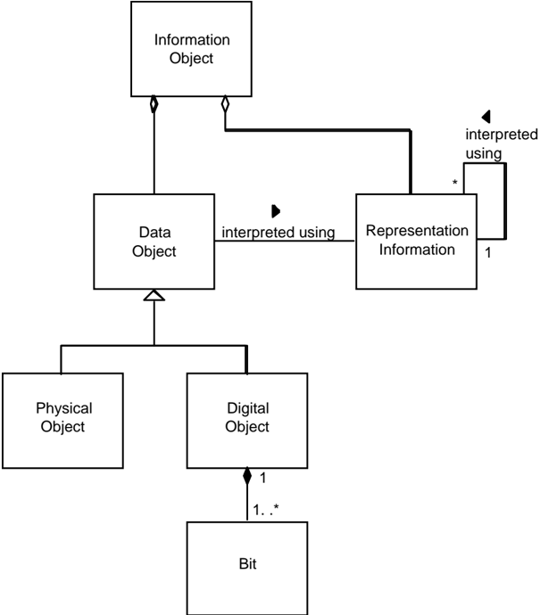

## 4.2.1.2 Data Object

The Data Object may be expressed as either a physical object (e.g., a moon rock) together with some Representation Information, or it may be expressed as a digital object (i.e., a sequence of bits) together with the Representation Information giving meaning to those bits.

## 4.2.1.3 Representation Information

The Representation Information accompanying a physical object like a moon rock may give additional meaning, as a result of some analysis, to the physically observable attributes of the rock. This information may have been developed over time and the results, if provided, would be part of the Information Object.

The Representation Information accompanying a digital object, or sequence of bits, is used to provide additional meaning. It typically maps the bits into commonly recognized data types such as character, integer, and real and into groups of these data types. It associates these with higher-level meanings that can have complex inter-relationships that are also described.

## CCSDS RECOMMENDATION FOR AN OAIS REFERENCE MODEL CCSDS HISTORICAL DOCUMENT

The remainder of this subsection focuses on the Representation Information object when the Data Object is specialized as a Digital Object.

## 4.2.1.3.1 Representation Information Types

The Digital Object, as shown in figure 4-10, is itself composed of one or more bit sequences. The purpose of the Representation Information object is to convert the bit sequences into more meaningful information. It does this by describing the format, or data structure concepts, which are to be applied to the bit sequences and that in turn result in more meaningful values such as characters, numbers, pixels, arrays, tables, etc. These common computer data types, aggregations of these data types, and mapping rules which map from the underlying data types to the higher level concepts needed to understand the Digital Object are referred to as the Structure Information of the Representation Information object. These structures are commonly identified by name or by relative position within the associated bit sequences.

The Representation Information provided by the Structure Information is seldom sufficient. Even in the case where the Digital Object is interpreted as a sequence of text characters, and described as such in the Structure Information, the additional information as to which language was being expressed should be provided. This type of additional required information is referred to as the Semantic Information . When dealing with scientific data, for example, the information in the Semantic Information can be quite varied and complex. It will include special meanings associated with all the elements of the Structural Information, operations that may be performed on each data type, and their interrelationships. Figure 4-11 emphasizes the fact that Representation Information contains both Structure Information and Semantic Information, although in some implementations the distinction is subjective.

This figure also shows that Representation Information may contain references to other Representation Information. When this is coupled with the fact that Representation Information is an Information Object that may have its own Digital Object and other Representation Information associated with understanding each Digital Object, as shown in a compact form by the 'interpreted using' association, the resulting set of objects can be referred to as a Representation Network .

As an example, ISO 9660 (reference [13]) describes text as conforming to the ASCII standard, but it does not actually describe how ASCII is to be implemented. It simply references the ASCII standard which is additional Representation Information that is needed for a full understanding. Therefore the ASCII standard is a part of the Representation Net associated with ISO 9660 and needs to be obtained by the OAIS in some form, or the OAIS needs to track the availability of this standard so that it may take appropriate steps in the future to ensure its ISO 9660 Representation Information is fully understandable.

Figure 4-11: Representation Information Object

## 4.2.1.3.2 Representation Networks

Representation Information, which is itself an Information Object, may be expressed in physical forms (e.g., a paper document) or in digital forms. When the Representation Information is in digital form, additional Representation Information is needed to understand the bits of the Representation Information as described in the previous subsection. In principle, this recursion continues until physical forms are encountered. For example, Representation Information expressed in ASCII needs the additional Representation Information for ASCII, which might be a physical document giving the ASCII standard. Each item of Representation Information can have multiple components, including multiple referenced Representation Information components; each with is own Representation Information

To preserve the meaning of an Information Object, its Representation Information must also be preserved. This is most easily accomplished when the Representation Information objects are expressed in forms that are easily understandable, such as text descriptions that use widely supported standards such as ASCII characters for electronic versions. One problem with the use of only text descriptions is that such descriptions can be ambiguous. This is addressed by the use of standardized, formal description languages containing well-defined constructs with which to describe data structures. These languages may need to be augmented with text descriptions to fully convey the semantics of the Representation Information

Two special types of Representation Information are Representation Rendering Software and Access Software. Representation Rendering Software is able to display the Representation Information in understandable forms. For example, the file and directory

## CCSDS RECOMMENDATION FOR AN OAIS REFERENCE MODEL CCSDS HISTORICAL DOCUMENT

structure of many CD-ROMs conforms to ISO 9660. This standard is Representation Information describing how most CD-ROM file structures are to be implemented, and it may be obtained as a paper document. However it may also be obtained as a digital object that needs to be understood as a PDF object. Rather than actually obtaining the documentation of PDF and writing software to understand the ISO 9660 object, an OAIS may use available PDF display software to render the ISO 9660 documentation humanly visible and readable. In this role the PDF display software is referred to as Representation Rendering Software because it is used to render the Representation Information. If the OAIS does not also obtain the associated description of PDF, it needs to record and track this fact because when PDF objects are no longer cost-effective for access and display, the ISO 9660 documentation expressed as a PDF object will need to be migrated to a new form.

Access Software presents some or all of the information content of an Information Object in forms understandable to humans or systems. It may also provide some types of access service, such as displaying, manipulating, processing, or sub-setting, to an Information Object. For some types of Digital Objects, such software may be widely available. It is not necessary for the OAIS to maintain or provide such software. The OAIS may want to maintain and provide this software for more specialized types of Digital Objects.

Since Access software will incorporate some understanding of the Representation Information, some archives may attempt to use Access Software as a substitute for full Representation Information. Access Software source code, which embodies at least a partial understanding of the associated Representation Information, may be used as documentation expressing such Representation Information. A problem with this approach is that the desired Representation Information may not be clearly identifiable as it may be mixed with various processing and display algorithms, and may be incomplete since the code assumes an underlying operating environment. It may be difficult to tell, from the software code, what Representation Information is missing. The use of Access Software executables, without the source code, such as may occur with proprietary formats, presents a much greater risk for loss of information because it is more difficult to maintain an operating environment for software than to migrate documentation over time. The practical use of emulation techniques, to preserve working software, has not yet been shown to be cost-effective. This is a significant issue for those desiring to preserve a look and feel to information access. Migration and software preservation are discussed more fully in section 5

## 4.2.1.4 Taxonomy of Information Object Classes Used by OAIS

There are many types of information involved in the long-term preservation of information in an OAIS. Each of these types can be viewed as a complete Information Object in that it contains a data object and adequate Representation Information to understand the data. This subsection builds on the discussions in 2.2 about the types of supporting information needed to enable long-term preservation and the discussion in the previous subsection on the role of Representation Information. The information modeling in this subsection discusses several types of Information Objects that are used in the OAIS. The objects are categorized by their content and function in the operation of an OAIS into Content Information objects, Preservation Description Information objects, Packaging Information objects, and

Descriptive Information objects. The following subsections discuss the contents of each of the types of Information Object. Figure 4-12 shows a taxonomy of those Information Objects used within the OAIS.

Figure 4-12: Information Object Taxonomy

## 4.2.1.4.1 Content Information

The Content Information is the set of information that is the original target of preservation by the OAIS. Deciding what is the Content Information may not be obvious and may need to be negotiated with the Producer. The Content Information, which is an Information Object as shown in figure 4-9, is the Content Data Object together with its Representation Information. The Content Data Object in the Content Information may be either a Digital Object or a Physical Object (e.g., a physical sample, microfilm). Any Information Object may serve as Content Information.

The Representation Information for a digital Content Data Object (both semantic and syntactic) is needed to fully transform the bits into the Content Information. In principal, this even extends to the inclusion of definitions (e.g., dictionary and grammar) of any natural language (e.g., English) used in expressing the Content Information. Over long time periods the meaning of natural language expressions can evolve significantly in both general and in specific discipline usage.

As a practical matter, the OAIS needs to have enough Representation Information associated with the bits of the Content Data Object in the Content Information that it feels confident that the members of the Designated Community can enter the Representation Network with enough knowledge to begin accurately interpreting the Representation Information. This is a significant risk area for an OAIS, particularly for those with an expert Designated Community, because jargon and apparently widely understood terms may be short-lived. In such cases extra care needs to be exercised to ensure that the natural evolution of the Designated Community Knowledge Base does not effectively cause information loss from the Content Information.

## CCSDS HISTORICAL DOCUMENT

## CCSDS RECOMMENDATION FOR AN OAIS REFERENCE MODEL

As described above for an Information Object in general, the Representation Information can also be viewed as being augmented by Access Software that supports the presentation of the Content Information to the Consumer. Examples of this type of software include word processors supporting complex document format representations of Content Information and scientific visualization systems supporting representations of Content Information as a time series or a multidimensional array. The software uses its knowledge of the underlying Representation Information to provide these services.

Often required information will be embedded in the software packages used by the Designated Community to present and analyze the Content Information. A reason for preserving working Access Software arises from a convenience factor. Even with a complete set of Representation Information, practical access to all or part of a digital Content Data Object requires the use of Access Software. Thus a software module that provides useful access to a digital Content Data Object may be preserved in a working state as a matter of convenience.

This is not difficult to do as long as the environment, which supports the software module, is readily available. This environment consists of some underlying hardware and an operating system, various utilities that effectively augment the operating system and storage and display devices and their drivers. A change to any of these may cause the software module to no longer function, to function incorrectly, or to be unable to present results to the application or human user. The complexity of these interactions is what traditionally makes the preservation of working software such an arduous task.

In summary, the use of Access Software to replace Representation Networks is attractive from the point of view of minimizing the resources needed to ingest data and provide current users with access to data. However the reliance on working software can provide major problems for Long-Term Preservation when that software ceases to function. Indefinite long-term information preservation requires a full and understandable description of the Representation Information. Subsection 5.2 (Access Preservation) discusses some techniques that can be used to preserve software over time and the risks associated with this approach.

An important function of the OAIS is deciding what parts of the Content Information are the Content Data Object and what parts are the Representation Information. This aspect is critical to a clear understanding of what is being preserved. The identification of digital Content Information with its Representation Information objects can be addressed by a series of steps, as follows:

- 1) Identify the bits comprising the Content Data Object of the Content Information.
- 2) Identify a Representation Information object that, in some way, addresses all the bits of the Content Data Object and converts them into more meaningful information.
- 3) For the Representation Information object identified, examine its content to identify if it requires other Representation Information objects. If it does, obtain

the required Representation Information objects. Repeat this step until no additional Representation Information objects are identified.

- 4) For each Representation Information object addressed in step 3, that is held as a Digital Object, identify any required Representation Information object and repeat steps 3 and 4 until no new Representation Information objects are identified.
- 5) The Content Information consists of the Content Data Object and each of the Representation Information objects identified in steps 2 through 4.

As an example of this practice, consider an electronic file containing a sequence of values obtained from a sensor looking at the Earth's environment. There is a second file, encoded using ASCII, which provides information on how to understand the first file. It describes how to interpret the bits of the first file to obtain meaningful numbers. It explains what these numbers mean in terms of the physics of the observation being conducted. It provides the date and time period over which the observations were made, an average value for the observed values, and who made the observations. These two files are submitted to an OAIS for preservation.

Assume that the OAIS determines that the Content Information to be preserved is the observed bits together with their values as numbers and the physics meaning of these numbers. This information is conveyed by the bit sequence within the first file together with the Representation Information from the second file that is needed to transform the first file's bits into meaningful physical values. Note that neither the first file's underlying media nor the particular file system carrying the bits is part of the Content Information in this example. Only part of the second file's content is considered a part of the Content Information and this is the part that enables the transformation of the bits from the first file into meaningful physical values. In fact this second file does not carry all the Representation Information needed to make this transformation, because the following additional information is needed:

- -information that the second file is encoded in ASCII so that it can be read as meaningful characters;
- -information on how the characters are used to express the transformations from bits to numbers to meaningful physics values.

This information, typically referred to as a combination of format information and data dictionary information, may also include instrument calibration values and information on how the calibrations are to be applied. All this information may be widely understandable once the ASCII characters are visible because it has all been expressed in English (or some other natural language), or some of it may be in more structured forms that will need additional Representation Information to be understood.

Therefore, the Representation Information of the second file needs additional Representation Information, and this information may need additional Representation Information, etc., forming a linked set of Representations of Representations. This is a good example of the complex Representation Net.

## CCSDS RECOMMENDATION FOR AN OAIS REFERENCE MODEL CCSDS HISTORICAL DOCUMENT

Recall that in the example above, there was a determination that the Content Information consisted of the observed sensor values and their meanings. This is by no means the only determination that could have been made. It could just as easily have been determined that the Content Data Object of the desired Content Information was the bit sequences within the first file together with the all the bit sequences within the second file. The fact that some of these latter bit sequences are used to interpret the first files bit sequences is just an example of a set of bits that is somewhat self-describing. It is irrelevant that some of the bits in the second file are the basis for information on the date and time period over which the observations were made, the average value for the observed values, and who made the observations. Once it has been determined that all these bits constitute the Content Data Object of the Content Information, then the Representation Information is that information needed to turn them into meaningful information. How extensive this meaning is to be carried and how far the Representation Network needs to be carried are local issues for the OAIS and its related Producer and Consumer communities.

As another example, consider an electronic file containing a word processing document. This binary data object will have a complex format that can be seen as a document only after it has been viewed through use of associated Representation Information. In common practice, this viewing will be provided by Access Software that incorporates an understanding of the Representation Information. The Content Data Object is most likely to be defined as the bit sequence content of the electronic file. The Representation Information is a description of the word processing format, at a minimum, and may include information deemed needed to adequately understand the meaning of the document as viewed. If the word processing format is proprietary, and it can not be acquired even to the level of simply viewing the document, it may be necessary to migrate the document to a non- proprietary format to ensure its Long Term Preservation.

As a variation on the above example, it may be decided that the Content Information to be preserved is not the full word processing view of the document, but simply a sequence of text paragraphs that can be adequately represented by ASCII characters. In this case, the OAIS may decide to extract the relevant text characters and save them as a text file. The Content Data Object would be defined, most likely, as the bit stream made up of these characters. The Representation Information would be a description of how to interpret this bit stream as characters, together with any additional information deemed needed to adequately understand the meaning of the text.

## 4.2.1.4.2 Preservation Description Information

In addition to Content Information, the Archival Information must include information that will allow the understanding of the Content Information over an indefinite period of time. The specific set of Information Objects, which are required for this function, is collectively called Preservation Description Information (PDI). The PDI must include information that is necessary to adequately preserve the particular Content Information with which it is associated. It is specifically focused on describing the past and present states of the Content Information, ensuring it is uniquely identifiable, and ensuring it has not been unknowingly altered.

## CCSDS RECOMMENDATION FOR AN OAIS REFERENCE MODEL CCSDS HISTORICAL DOCUMENT

This information is typical for all types of archives and has been classified in the context of traditional archives. However, the class definitions must be extended for digital archives. The following definitions are based on the categories discussed in the paper 'Preserving Digital Information' (reference [2]). The relationship between the concepts in OAIS Reference Model and the Preserving Digital Information paper are discussed in annex B of this document. Table 4-1 provides illustrative examples of this information for various popular Content Information types.

- -Reference Information : This information identifies, and if necessary describes, one or more mechanisms used to provide assigned identifiers for the Content Information. It also provides those identifiers that allow outside systems to refer, unambiguously, to this particular Content Information. Examples of these systems include taxonomic systems, reference systems and registration systems. In the OAIS Reference Model most if not all of this information is replicated in Package Descriptions, which enable Consumers to access Content Information of interest.
- -Context Information : This information documents the relationships of the Content Information to its environment. This includes why the Content Information was created and how it relates to other Content Information objects existing elsewhere.
- -Provenance Information : This information documents the history of the Content Information. This tells the origin or source of the Content Information, any changes that may have taken place since it was originated, and who has had custody of it since it was originated. This gives future users some assurance as to the likely reliability of the Content Information. Provenance can be viewed as a special type of context information.
- -Fixity Information : This information provides the Data Integrity checks or Validation/Verification keys used to ensure that the particular Content Information object has not been altered in an undocumented manner. Fixity Information includes special encoding and error detection schemes that are specific to instances of Content Objects. Fixity Information does not include the integrity preserving mechanisms provided by the OAIS underlying services, error protection supplied by the media and device drivers used by Archival Storage. The Fixity Information may specify minimum quality of service requirements for these mechanisms.

Table 4-1: Examples of PDI Types

| Content Information Type | Reference | Context | Provenance Fixity |
|-------------------------------------------------------------------------------------|---------------------------------------------------------------------------------------------------------------------------------------------------------------------------------------------------------------------------------------------------------------------------------------|--------------------------------------------------------------------------------------------------------------------------------------------|----------------------------|
| • Object identifier • Journal reference • Mission, instrument, title, attribute set | • Instrument description • Processing history • Sensor description • Instrument • Instrument mode • Decommutation map • Software interface specification | Calibration history Related data sets Mission Funding history • CRC • Checksum • Reed-Solomon coding | Space Science Data • • • • |
| Digital Library Collections • Bibliographic description • Persistent identifier | • For scanned collections: • metadata about the digitisation process • pointer to master version • For born-digital publications: • pointer to the digital original • Metadata about the preservation process: • pointers to earlier versions of the collection item • change history | • Pointers to related documents in original environment at the time of publication • Digital signature • Checksum • Authenticity indicator | |
| • Name • Author/Originator • Version number • Serial number | • Revision history • License holder • Registration • Copyright | • Help file • User guide • Related software • Language • Certificate • Checksum • Encryption • CRC | Software Package |

The OAIS needs to explicitly decide what the exact definition of Content Information is in order to be able to ensure that it also has the PDI needed to preserve the Content Information. Once the Content Information has been determined, it is possible to assess the Preservation Description Information.

## 4.2.1.4.3 Packaging Information

The Packaging Information is that information which, either actually or logically, binds or relates the components of the package into an identifiable entity on specific media. For example, if the Content Information and PDI are identified as being the content of specific files on a CD-ROM, then the Packaging Information may include the ISO 9660 volume/file structure on the CD-ROM. These choices are the subject of local archive definitions or conventions. The Packaging Information does not necessarily need to be preserved by an

OAIS since it does not contribute to the Content Information or the PDI. However, there are cases where the OAIS may be required to reproduce the original submission exactly. In this case the Content Information is defined to include all the bits submitted.

The OAIS should also avoid holding PDI or Content Information only in the naming conventions of directory or file name structures. These structures are most likely to be used as Packaging Information. Packaging Information is not preserved by Migration. Any information saved in file names or directory structures may be lost when the Packaging Information is altered. The subject of Packaging Information is an important consideration to the Migration of Information within an OAIS to newer media. This subject is addressed in detail in section 5 of this document.

## 4.2.1.4.4 Descriptive Information

The Information Objects described previously in this section provide the information necessary to enable the Long Term Preservation function of the archive. In addition to preserving information, the OAIS must provide adequate features to allow Consumers to locate information of potential interest, analyze that information, and order desired information. This is accomplished through a specialization of the Information Object called Descriptive Information, which contain the data that serves as the input to documents or applications called Access Aids . The Descriptive Information is generally derived from the Content Information and PDI. The Descriptive Information can be viewed as an index to enable efficient access to the associated Information Package via associated Access Aids. Access Aids are documents or applications that can be used to locate, analyze, retrieve, or order information from the OAIS.

## 4.2.2 LOGICAL MODEL OF INFORMATION IN AN OPEN ARCHIVAL INFORMATION SYSTEM (OAIS)

The previous subsection defines the types of Information Objects that are needed by an OAIS to enable the Long Term Preservation of information and effective access to the preserved information by the Designated Community. This subsection uses those Information Object descriptions to model the conceptual information structures required to accomplish these functions. The models presented in this subsection are not intended to imply an implementation, but rather to highlight the relationship among the types of information needed in the archival process.

## 4.2.2.1 Information Package

The conceptual structure for supporting Long Term Preservation of information is the Information Package. An Information Package is a container that contains two types of Information Objects, the Content Information and the Preservation Description Information (PDI); the Information Package can be associated with two other types of Information Objects, Packaging Information and Package Descriptions. There are several types of

## CCSDS HISTORICAL DOCUMENT

## CCSDS RECOMMENDATION FOR AN OAIS REFERENCE MODEL

Information Packages that are used within the archival process. These Information Packages may be used to structure and store the OAIS holdings; to transport the required information from the Producer to the OAIS, or to transport requested information between the OAIS and Consumers. There are differing information requirements for each of these functions. The UML diagram in figure 4-13 illustrates the conceptual view of an Information Package. This UML diagram shows that an Information Package contains 0 or 1 Content Information objects, 0 or more PDI objects and is associated with exactly one piece of Packaging Information, which identifies and delimits the Information Package. The Information Package is also associated with 0 or more Package Descriptions that describe the Content Object to enable efficient access.

Figure 4-13: Information Package Contents

## 4.2.2.2 Types of Information Packages

There are three subtypes of the Information Package identified in 2.2: the Submission Information Package (SIP), the Archival Information Package (AIP), and the Dissemination Information Package (DIP). The definitions of these package types in section 2 are based on the function of the archival process, which uses the package, and the translation from one package to another as it passes through the archival process. This taxonomy of Information Package types is shown in figure 4-14.

Figure 4-14: Information Package Taxonomy

It is necessary to distinguish between an Information Package that is preserved by an OAIS and the Information Packages that are submitted to, and disseminated from, an OAIS. These variant packages are needed to reflect the reality that some submissions to an OAIS will have insufficient Representation Information or PDI to meet final OAIS preservation requirements. In addition, they may be organized very differently from the way the OAIS organizes the information it is preserving. Finally, the OAIS may provide information to Consumers that does not include all the Representation Information or all the PDI with the associated Content Information being disseminated. These variants are referred to as the Submission Information Package (SIP), the Archival Information Package (AIP), and the Dissemination Information Package (DIP). Although these are all Information Packages, they differ in mandatory content and the multiplicity of the associations among contained classes.

The Submission Information Package (SIP) is that package that is sent to an OAIS by a Producer. Its form and detailed content is typically negotiated between the Producer and the OAIS. Most SIPs will have some Content Information and some PDI, but it may require several SIPs to provide a complete set of Content Information and associated PDI. The Content Information and the PDI both have associated Representation Information, and if there are multiple SIPs involved that use the same Representation Information, it is likely that such Representation Information will only be provided once to the OAIS. As another variation, since some types of PDI will apply to multiple SIPs from the same source, such PDI may be provided in a separate SIP that is without Content Information. The Packaging Information will always be present in some form.

The Descriptive Information associated with a SIP is likely to be provided prior to submitting the SIP to the OAIS, but it may be provided at any time. It may be no more than a text description with a name or title, carried by the Packaging Information, by which the SIP may be recognized.

## CCSDS HISTORICAL DOCUMENT

## CCSDS RECOMMENDATION FOR AN OAIS REFERENCE MODEL

Within the OAIS, one or more SIPs are transformed into one or more Archival Information Packages (AIP) for preservation. The AIP has a complete set of PDI for the associated Content Information. The AIP may also contain a collection of other AIPs and this is discussed and modeled later in this subsection. The Packaging Information of the AIP will conform to OAIS internal standards, and it may vary as it is managed by the OAIS. The Descriptive Information associated with an AIP may be extensive and will be managed by the OAIS so that Consumers can find and order the Content Information of interest.

In response to an Order, the OAIS provides all or a part of an AIP to a Consumer in the form of a Dissemination Information Package (DIP). The DIP may also include collections of AIPs, and it may or may not have complete PDI. The Packaging Information will always be present in some form so that the Consumer can clearly distinguish the information ordered. The Packaging Information may take several forms depending on the dissemination media and Consumer requirements. The Descriptive Information associated with a DIP may be provided with the transfer of the DIP, or it may be provided at any time before or after the transfer. Its purpose is to give the Consumer enough information to recognize the DIP from among possible similar packages. It may be no more than a text description with a name or title, as carried by the Packaging Information, by which the DIP may be recognized.

Though the implementation of the AIP may vary from archive to archive, the specification of the AIP as a container that contains all the needed information to allow Long Term Preservation and access to archive holdings remains valid. The information model for the AIP presented in 4.2.2.3 should be used as a reference to establish the types of information required to enable long-term preservation and access.

The exact information contents of the SIP and DIP and their relationship to the corresponding AIP are dependent on the agreements between the archive and its Producers and Consumers. The model for both of these packages is the same as for the Information Package shown in figure 4-13 both in mandatory content and the multiplicity of the associations among contained classes. The subject of transformations between SIP and AIP and between AIP and DIP is further discussed in 4.3.

## 4.2.2.3 The Archival Information Package

An Archival Information Package (AIP), which is modeled in figure 4-15, is a specialization of the Information Package. The AIP is defined to provide a concise way of referring to a set of information that has, in principle, all the qualities needed for permanent, or indefinite, Long Term Preservation of a designated Information Object. The AIP is itself an Information Object that is a container of other Information Objects. Within the AIP is the designated Information Object and it is called the Content Information.

## CCSDS RECOMMENDATION FOR AN OAIS REFERENCE MODEL CCSDS HISTORICAL DOCUMENT

Figure 4-15: Archival Information Package (AIP)

Also within the AIP is an Information Object called the Preservation Description Information (PDI). The PDI contains additional information about the Content Information and is needed to make the Content Information meaningful for the indefinite long-term.

The Preservation Description Information requirements in an AIP are much more stringent than the requirements for Preservation Description Information in the general Information Package. While no PDI objects are mandatory in an Information Package, all classes of PDI information must be present in an AIP. This is illustrated in figure 4-16. The contents of each type of PDI are left to the discretion of the individual archive.

For example, in some OAIS holdings a statement that the creator of the Content Information is unknown may be adequate Provenance Information while in other OAIS holdings it may be mandatory that more complete provenance be researched.

Figure 4-16: Preservation Description Information (PDI)

The AIP is delimited and identified by the Packaging Information. The Packaging Information may actually be present as a structure on the media that contains the AIP or, it

## CCSDS RECOMMENDATION FOR AN OAIS REFERENCE MODEL CCSDS HISTORICAL DOCUMENT

may be virtual in that it is contained in the OAIS Archival Storage function. However, the delimitation and internal identification functions must be well defined in an OAIS.

Each AIP is associated with a structured form of Descriptive Information called the Package Description , which enables the Consumer to locate information of potential interest, analyze that information, and order desired information. The information needed for one Access Aid is called an Associated Description . A single Package Description may contain several Associated Descriptions depending on the number of different Access Aids that can locate, visualize, retrieve or order the associated Content Information and PDI. Figure 4-17 is a UML diagram that models the Package Description and Access Aids.

Figure 4-17: Package Description

The Package Description must contain one Associated Description that supplies data for a Retrieval Aid that allows authorized users to retrieve the Content Information and PDI described by the Package Description. This Retrieval Aid is generally part of the Archival Storage functional area. It translates from the unique identifier assigned by the OAIS to identify the AIP into the set of operations and filenames needed to retrieve the AIP from the file management system used in Archival Storage, then returns the Content Information and PDI for the requested AIP. In most current archives, only internal archive processes and operations personnel and functions are authorized to use this Access Aid. However, as technology advances increase the processing power of the archive and the bandwidth

## CCSDS HISTORICAL DOCUMENT

## CCSDS RECOMMENDATION FOR AN OAIS REFERENCE MODEL

between the archive and the user, such access methods as 'content based queries' and 'data mining' may provide the user with direct read only access to the content Information.

The Package Description may also contain any number of Associated Descriptions, each of which contains data for one or more Access Aids. Two additional subtypes of Access Aid are Finding Aid and Ordering Aid .

A Finding Aid is an application that assists the Consumer in locating information of interest. A single AIP may have a number of Associated Descriptions that describe the Content Information using different technologies.

An Ordering Aid is an application that assists the Consumer to discover the cost of and order AIPs of interest. The Ordering Aids also allow users to specify transformations to be applied to the AIPs prior to dissemination. These transformations can include data object transformations such as subsetting, subsampling or format transformations. The transformations can also involve modifying the PDI in the AIP prior to dissemination.

The Package Description is not required for the Long Term Preservation of the Content Information but is needed to provide visibility and access into the contents of an archive. The contents of the Package Description are highly dependent on the structure of the Content Information and PDI it describes. The uses and types of Package Descriptions in an OAIS are further defined in 4.2.2.4.

Figure 4-18 gives a detailed view of the Archival Information Package by expanding the PDI and the Content Information. All the 'contains' relationships discussed in this subsection are logical containment relationships. This type of containment relationship may be physical or may be accomplished via a pointer to another object in storage.

## CCSDS RECOMMENDATION FOR AN OAIS REFERENCE MODEL CCSDS HISTORICAL DOCUMENT

Figure 4-18: Archival Information Package (Detailed View)

## 4.2.2.4 Specialization of the AIP and Package Descriptions

Two specializations of the AIP are discussed in this subsection, the Archival Information Unit (AIU) and the Archive Information Collection (AIC) . Figure 4-19 is a UML diagram illustrating this specialization. Both AIU and AIC are subtypes of the AIP and as such contain constructs to enable both Long Term Preservation and Consumer access. The AIU represents the type used for the preservation function of a single content atomic object. The AIC organizes a set of AIPs (AIUs and other AICs) along a thematic hierarchy, which can support flexible and efficient access by the Consumer community. Conceptually all the AIPs organized by an AIC are contained in the Content Information of that AIC. The differences between AIUs and AICs is the complexity of their Content Information and their associated Package Descriptions and Packaging Information. This reference model considers the differences in the Content Information and associated Packaging and Description functionality between AIU and AIC to be adequately complex and linked to justify the definition of separate classes.

## CCSDS RECOMMENDATION FOR AN OAIS REFERENCE MODEL

Figure 4-19: Archival Specialization of the AIP

From an Access viewpoint, new subsetting and manipulation capabilities are beginning to blur the distinction between AICs and AIUs. Content objects which used to be viewed as atomic can now be viewed as containing a large variation of contents based on the subsetting parameters chosen. In a more extreme example, the Content Information of an AIU may not exist as a physical entity. The Content Information could consist of several input files (or pointers to the AIPs containing these data files) and an algorithm which uses these files to create the data object of interest.

From an information preservation viewpoint, the distinction between AIU and AIC remains clear. An AIU is viewed as having a single content Information Object that is described by exactly one set of PDI. An AIC Content Information is viewed as a collection of other AICs and AIUs, each of which has its own PDI. In addition, the AIC has its own PDI that describes the collection criteria and process.

There are two specializations of the Package Description, the Unit Description and the Collection Description. Figure 4-20 is a UML diagram illustrating this specialization. The difference in these two classes is based on the functionality needed to effectively access the contents of an atomic AIU versus the functionality needed to effectively access AIPs that are contained in an AIC.

Figure 4-20: Archival Specialization of the Package

To aid in the understanding of these constructs, the next two subsections of this document will use an example of a company setting up an OAIS of digital versions of movies. This example will focus on the information content of constructs in an AIP. Subsection 4.3 will illustrate more of the details of the information transformations and data flows in an OAIS.

## 4.2.2.5 Archival Information Unit

The AIUs can be viewed as the 'atoms' of information that the archive is tasked to store. A single AIU contains exactly one Content Information object (which may consist of multiple files) and exactly one set of PDI. When an Information Object is ingested into the OAIS a Unit Description , which is a subtype of a Package Description, is created by extracting information from the Content Information and the PDI and adding OAIS specific information such as a unique identifier. The AIU is illustrated in figure 4-21.

In the example of an OAIS for digital movies, the AIU for a single movie can be viewed as three objects, one containing a digital encoding of the movie in a proprietary format, one containing the Representation Information needed to understand the proprietary format (these two objects form the Content Information), and the other containing facts about the movie such as date of creation, featured actors, director, producer, sequels, movie studio, and a checksum to ensure the integrity of the digital movie (PDI). Since the OAIS reference model is implementation independent, each of these objects could be implemented as one file or multiple files. This type of implementation dependent information is contained in the Packaging Information. When a movie is ingested into the OAIS a Unit Description for an Ordering Aid can be created by extracting information from the Content Information and the PDI and appending it to the unique ordering information.

## CCSDS RECOMMENDATION FOR AN OAIS REFERENCE MODEL

Figure 4-21: Archival Information Unit (AIU)

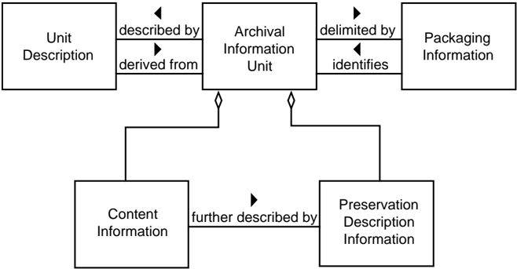

## 4.2.2.6 Unit Description

The Unit Description is a specialization of the Package Description that always contains a set of Associated Descriptions each of which describe the AIU Content Information from the point of view of a single Access Aid. Figure 4-22 is a UML diagram that illustrates the Unit Description contents.

## CCSDS RECOMMENDATION FOR AN OAIS REFERENCE MODEL

Figure 4-22: Unit Description

All Unit Descriptions must supply an Associated Description for a Retrieval Aid that enables authorized users to retrieve the AIU described by the Unit Description from Archival Storage. This description includes the unique identifier assigned to the AIP by Archival Storage during the Ingest Process.

An important type of Access Aid is the Finding Aid, which is an application that assists the Consumer in locating information of interest. A single AIU may have a number of Associated Descriptions that describe the Content Information using different technologies. Additionally, as new description extraction and display technologies become available, an archive may want to update the Unit Description associated with each of its AIUs, in order to add a new Associated Description that utilizes the new technology to better describe the AIUs.

In the OAIS for digital movies example, initially, there may be one Associated Description that is a free text description of a movie, another that is a five-minute clip and another that is a row in a relational database that is used by movie collectors to locate movies of interest. After the archive has been operational for a period of time a technique for supplying compressed digital movies may be developed based on recording every tenth frame. The archivist may decide to create an additional type of Associated Description that is populated

## CCSDS RECOMMENDATION FOR AN OAIS REFERENCE MODEL

using the results of this new technique. If desired, the user can run each of the AIUs contained in the archive though this compression technique and create a new Associated Description for each movie in the archive or simply include this Associated Description for new AIUs as they are ingested into the OAIS.

Another important class of Associated Descriptions supplies data for Ordering Aids that allows the Consumer to discover the cost of and order AIUs of interest. The Ordering Aids also allow users to specify transformations to be applied to the AIUs prior to dissemination. These transformations can include data object transformations such as subsetting, subsampling or format transformations. The transformations can also involve modifying the PDI in the AIU prior to dissemination.

For example, the OAIS for digital movies could allow a user to order a digital movie as a VHS tape, a laser disc or an MPEG object delivered on-line. Each of these would involve a format transformation and, in theory, an update to the PDI information in the AIP to create accurate PDI for the DIP.

## 4.2.2.7 Archival Information Collections

The AIU and its associated Unit Description provide the information necessary for a Consumer to locate and order AIUs of interest. However, it can be impossible for a Consumer to sort through the millions of Unit Descriptions contained in a large archive. This problem is addressed here.

The content information of an AIC is composed of complete AIPs each of which have their own Content Information, PDI, and associated Packaging Information and Package Descriptions. These AIPs are then aggregated into Archive Information Collections (AIC) using criteria determined by the archivist. Generally AICs are based on the AIUs of interest having common themes or origins and a common set of Associate Descriptions. At a minimum all OAIS can be viewed has having at least one AIC which contains all the AIPs held by the OAIS.

For example, the OAIS for digital movies may have AICs based on the subject area of the movie such as mystery, science fiction, or horror. In addition the archive may have AICs based on other factors such as director or lead actor.

A logical model of an AIC is shown in figure 4-23. As in the previous subsections, all of the containment relationships are logical containment and may be physical or may be accomplished via a pointer to another object in storage. For example, the Content Information of an AIC can be created either by creating physical collections of the contained AIPs or by pointing to the contained AIPs. A single AIP can belong to any number of AICs.

## CCSDS RECOMMENDATION FOR AN OAIS REFERENCE MODEL CCSDS HISTORICAL DOCUMENT

Figure 4-23: Archive Information Collections Logical View

For example, a pattern recognition technique might be created for digital movies and the OAIS for digital movies might offer a service to search its archives for large structures such as the pyramids or a New York skyline. Note that this type of service is very processing intensive, involving potentially large numbers of AIUs to be transferred from Archival Storage to Access and then running the appropriate process to analyze the Content Information from each AIU. If the results are generally useful, the archivist could summarize the results of this 'content based query' into an Associated Description of a new AIC that contains movies with large structures. This technique is frequently referred to as data mining.

4-23 An important feature of the AIC, as shown in figure , is the fact that an AIC is a complete AIP which contains PDI. The PDI provides further information about the AIC such as Provenance on when and why it was created, Context to related AICs, and the desired level of security/Fixity information. This is in addition to the PDI contained in member AIPs. This type of information is often necessary for a Consumer to have confidence in the reliability of an AIC. In the above example, the usefulness of the AIC of movies with large structures is to some extent based on the algorithm used and the Provenance of when the AIC was created or last updated.

## CCSDS RECOMMENDATION FOR AN OAIS REFERENCE MODEL

## 4.2.2.8 Collection Descriptions

The Collection Description is a subtype of the Package Description that has added structures to better handle the complex content information of an AIC. The Collection Description, which is modeled in figure 4-24 , contains the information classes that are contained in the Unit Description.

There are two types of Associated Description in a Collection Description:

- -There is one Overview Description that describes the collection as a whole.
- -There are zero or more Member Descriptions that separately describe each member of the collection.

Figure 4-24: Collection Descriptions

The required Associated Description in a Collection Description provides information for Ordering Aids that provide a user with access to the entire set of Content Information of the associated AIC and the PDI for the AIC, but not necessarily to the individual AIPs contained in the AIC. The Collection Description may contain the Package Descriptions of the AIPs contained in the AIC. This containment relationship is logical in that the AIC may either include the Package Descriptions of member Information Packages directly or, more

## CCSDS HISTORICAL DOCUMENT

## CCSDS RECOMMENDATION FOR AN OAIS REFERENCE MODEL

commonly, use pointers to the Package Descriptions of the member Information Packages. This list of the Package Descriptions for contained AIPs in an AIC could provide Access Aids with a method to Retrieve or Order individual members of the AIC.

It also allows alternative concepts for the implementation of Finding Aids that enable the Consumer to locate AIPs of interest that are contained in an AIC. The Associated Descriptions that provide data for these Finding Aids could be implemented either in a centralized fashion searching an Associated Description in the Collection Description or in a distributed fashion by searching the Associated Description of each member Package Description.

Another important benefit of the Collection Descriptions is the ability to define new Access Collections . An Access Collection may be based on new data mining results or it may reflect current phenomena or areas of interest that may not be of permanent interest. Examples of an Access Collection in an OAIS for digital movies might be a new arrivals collection or a 'twenty most popular titles' collection that is updated periodically. Another example of an Access Collection is a collection based on the results of a pattern recognition algorithm that has not been verified.

To create an Access Collection, an archive would create a Collection Description that did not have an associated AIC. The Collection Description could have a customized Associated Member Description that documented the newly mined description data for each member AIP. A specialized finding aid could use this new Associated Member Description in conjunction with existing Associated Descriptions in the Package Description information of each member AIP to locate AIPs of interest to the user. The Package Descriptions of contained AIPs would also supply data for an Ordering Aid, which would allow the Consumer to order the Information Packages of interest to the Consumer.

If an OAIS decides that an Access Collection is valuable enough to be preserved for the long-term, it can store the required Content Information and PDI in Archival Storage thus creating a new AIC.

Another important application of Access Collections is the concept of locating some members of a collection that have been scheduled for ingest at a future time. In this case, the Associated Descriptions supporting a Finding Aid would allow future AIPs to be located. However, the Associated Description for the Ordering Aid and/or the Retrieval Aid would contain the information that this product was not currently available and allow the user to enter an Event Based Order which would be triggered when the AIP of interest became available.

## 4.2.3 DATA MANAGEMENT INFORMATION

Currently, Package Descriptions are stored in persistent storage such as database management systems to enable easy, flexible access and update to the contained Associated Descriptions. In addition to the Package Descriptions discussed in the previous subsections, all the information needed for the operation of an archive could be stored in databases as persistent data classes. Figure 4-25 illustrates the various types of 'data management information' within the OAIS. The Archive Administration Information represents the entire range of information required for the day-to-day operation of the archive. This information includes:

- -Policy information which provides pricing information and availability constraints for ordering archived information.
- -Request tracking information that records the progress of each user transaction with an archive. The request tracking process can be very complicated, involving database events and triggers, or as simple as a flat file tracking Order Requests.
- -Security information that includes user names and any passwords or other mechanisms needed to authenticate the identity and privileges of archive users.
- -Event Based Order information that provides the information needed to support repeating or future requests.
- -Statistical information needed by archive administration and Management to determine future policies and performance tuning for more effective archive operation. Examples of these statistics include the number of times an AIP was ordered over a time period and the average time between receiving an order request and shipping the requested holding
- -Preservation process history information that tracks the migrations of AIPs, including media replacements and AIP transformations
- -Customer profile information that enables the archive to maintain facts such as user name and address to avoid the user having to reenter these facts each time he enters a request.
- -Accounting information that includes the data necessary for the operation of the archive as a business. The accounting data include payroll data, accounts payable data and accounts receivable data.

These classes are intended as examples rather than an exhaustive list of the data required for archive administration. These classes are conceptual and individual OAIS implementations may vary significantly. For example, individual OAIS may choose to combine the Customer related information types such as Security and Customer Profile into a single database.

Figure 4-25: Data Management Information

## CCSDS RECOMMENDATION FOR AN OAIS REFERENCE MODEL

## 4.3 INFORMATION PACKAGE TRANSFORMATIONS

The previous portions of this section have discussed the functional architecture of an OAIS and an information architecture to represent the Information Packages and associated Package Descriptions and Packaging Information. This subsection looks at the transformations, both logical and physical, of the Information Package and its associated objects as they follow a lifecycle from the Producer to the OAIS, and from the OAIS to the Consumer.

Figure 4-26 presents a high-level data flow diagram that depicts the principle data flows involved in OAIS operations. These flows do not include administrative flows such as accounting and billing.

Figure 4-26: High-Level Data Flows in an OAIS

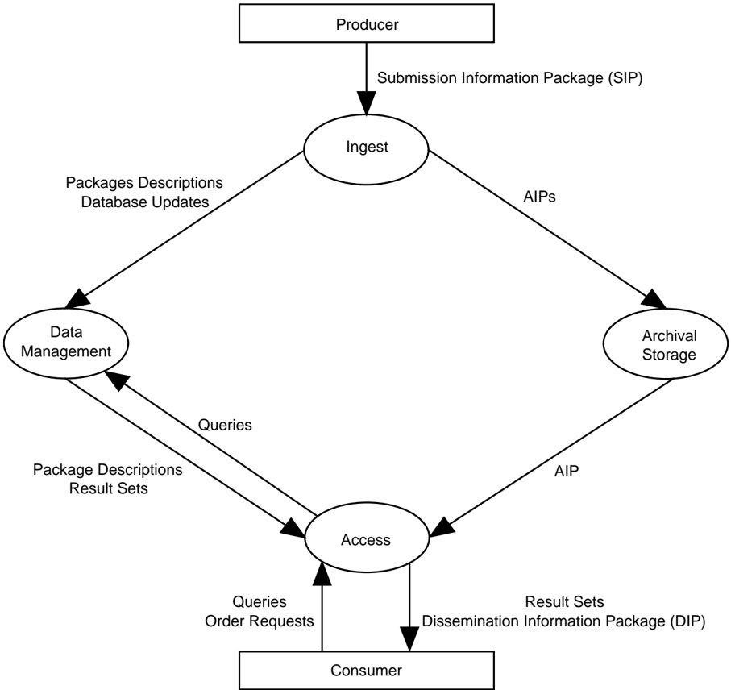

## 4.3.1 DATA TRANSFORMATIONS IN THE PRODUCER ENTITY

The data within the data Producer entity are private and may be in any format the Producer desires. However, when the decision is made to store the data in an OAIS, the Producer who is responsible for the data meets with archivists to negotiate a Submission Agreement as discussed in 2.3.2 of this document. This agreement defines information such as the content, format, and scheduled arrival times of the Submission Information Package (SIP). The SIP is an Information Package that is provided to the OAIS by the Producer. The SIP consists of the Content Information plus the data that is necessary to assure that those data can be maintained by the OAIS and that the data can be interpreted and used by Consumers who withdraw them from the OAIS in the future.

These SIPs are periodically transferred to the OAIS in a Data Submission Session. The number of Data Submission Sessions between an OAIS and a Producer can range from a single session in the transfer of a final data product to multiple sessions a day in the case of active OAIS which store data for experiments which are still in process. The Data Submission Session can be logically viewed as sets of content data objects and description objects, although physically the description or metadata can be included in the digital objects (i.e., self-describing objects) or divided into many separate descriptive items. In addition to the logical view of data (the SIP), the specification of a data delivery session must also include the mapping of the objects to the media on which they are delivered. This mapping includes the encoding of the object and description and the allocation of logical objects to files.

## 4.3.2 DATA TRANSFORMATIONS IN THE INGEST FUNCTIONAL AREA

Once the SIP is within the OAIS, their form and content may change. An OAIS is not always required to retain the information submitted to it in precisely the same format as in the SIP. Indeed, preserving the original information exactly as submitted may not be desirable. For example, the computer medium on which submitted images are recorded may become obsolete, and the images may need to be copied to a more modern medium. In addition, some types of information such as the unique identifier used to locate the Information Package within the OAIS will not be available to the Producer and must be input during the Ingest process to the OAIS.

The mapping between SIPs and AIPs is not one-to-one. Here are some examples:

- -One SIP - One AIP: A government agency is ready to archive its electronic records from the previous fiscal year. All of the year's records are placed onto magnetic tapes that are submitted as one SIP. The archive stores the tapes together as a single AIP.
- -Many SIPs - One AIP: A satellite sensor makes observations of the Earth over a period of one year. Every week all of the latest sensor data are submitted to the archive as a SIP. The archive has a single AIP containing all of the sensor's observations for the year. Ingest merges the Content Information from each weekly

## CCSDS RECOMMENDATION FOR AN OAIS REFERENCE MODEL CCSDS HISTORICAL DOCUMENT

SIP into a specified file/files in Ingest persistent storage. The PDI data for the AIP is sent after the last sensor data for the year has been received. After all of the weekly SIPs and the SIP containing the PDI have arrived, Ingest processes the AIP.

- -One SIP - Many AIPs: A company submits financial records to an archive as one SIP. The archive chooses to store this information as two AIPs: one that contains public information and the other that contains sensitive information. This makes it easier for the archive to manage access to the information.
- -Many SIPs - Many AIPs: An oil and gas company collects information on its wells. Every year it submits SIPs containing all of the well status information for one well to an archive. The archive maintains one AIP for each oil or gas field and breaks out the information on each well to the proper AIP based upon its geographic coordinates.
- -One SIP - No AIPs: An investigator, or archive personnel, creates a new algorithm for detecting hurricanes in images. He runs this algorithm over all the images contained in an archive. This data is combined into either a new Associated Description or a set of Package Description updates which is input as a SIP.

The ingest process transforms the SIPs received in the Data Submission Session into a set of AIPs and Package Descriptors which can be stored and accepted by the Archival Storage and Data Management functional entities. The complexity of this ingest process can vary greatly from OAIS to OAIS or from Producer to Producer within an OAIS. The simplest form of the process involves removing the Content Information, PDI and Package Descriptors from the Producer transfer media and queuing them for storage by the Archival Storage and Data Management functional entities. In more complex cases, the PDI and Package Descriptors may have to be extracted from the Content Information or input by OAIS personnel during the ingest function; the encoding of the information objects or their allocation to files may have to be changed. In the most extreme case, the granularity of the Content Information may be changed, and the OAIS must generate new PDI and Package Descriptors reflecting the newly generated information objects. When many SIPs are required for the creation of one AIP, the Ingest functional area will provide staging storage for the SIPs until all the SIPs required for the AIP arrive.

In addition, the Ingest functional entity will classify incoming information objects and determine in what existing collection or collections each object belongs and will create messages to update the appropriate Collections Descriptions after the AIPs are stored in Archival Storage. The OAIS and external organizations may provide additional Associated Descriptions and finding aids that allow alternative access paths to the information objects of interest. Researchers will develop new and fundamentally different access patterns to information objects. It is important that an OAIS's Ingest and internal data models are sufficiently flexible to incorporate these new descriptions so the general user community can benefit from the research efforts. A good example of this type of new associated description are a phenomenology database in Earth Observation, which allows users to obtain data for a desired event such as a hurricane, or volcano eruption from many instruments with a single

query. It is important to note that such finding aids may become obsolete unless the data they require are preserved as parts of the AIPs they access.

It is expected that the Ingest functional entity will coordinate the updates between Data Management and Archival Storage and provide appropriate coordination and error recovery. The AIP should first be stored in Archival Storage. The confirmation of that operation will include a unique identification to retrieve that AIP from Storage. This identifier should be merged into the Package Description prior to the addition of the Collection Description to Data Management.

## 4.3.3 DATA TRANSFORMATIONS IN THE ARCHIVAL STORAGE AND DATA MANAGEMENT FUNCTIONAL AREAS

The Archival Storage functional entity takes the AIPs produced by the Ingest process and merges it into the permanent archive holdings. The Data Management functional entity takes the Package Descriptions produced by Ingest and augments the existing Collection Descriptions to include their contents. The logical model of the ingested data should already be mapped into the logical model of the archives holdings. Thus the major transformation that occurs in this step is the mapping of the acquisition session from the ingest physical data model. This will tend to be on staging storage, to the permanent storage of the OAIS, which could range from Database Management Systems (DBMS) to Hierarchical File Management Systems (HFMS), or any mixture of the above.

The internal view of the OAIS is the permanent representation of the archived data, so all encoding and mappings must be well documented and understood. The process of transferring the ingest objects is frequently by a software process such as an HFMS driver or a DBMS. In this case, it is the responsibility of the OAIS to maintain an active copy of the software or careful documentation of the internal formats so the data can be transferred to other systems in the future without loss of information.

## 4.3.4 DATA FLOWS AND TRANSFORMATIONS IN THE ACCESS FUNCTIONAL AREA

When a Consumer wishes to use the data within the OAIS, a Finding Aid may be used to locate information of interest. These Finding Aids present Consumers with the logical view of the OAIS holdings so the Consumers can decide which AIPs to acquire. At a minimum, the access view is the high-level logical view of the Collection Descriptions discussed in 4.2.2.8. The OAIS may have to spend significant time and effort developing Associated Descriptions and Finding Aids such as catalogs that will aid the Consumer in locating AIPs or AICs of interest. A Consumer will establish a Search Session with the Access entity. During this Search Session, the Consumer will use the OAIS Finding Aids to identify and investigate potential holdings of interest. This searching process tends to be iterative, first identifying broad criteria and then refining the criteria on the basis of previous search results. When candidate objects of interest are identified, more sophisticated Finding Aids such as browse image viewers or animation may be used to further refine a Result Set.

## CCSDS HISTORICAL DOCUMENT

## CCSDS RECOMMENDATION FOR AN OAIS REFERENCE MODEL

Once the Consumer identifies the OAIS holdings to acquire, the Consumer uses an OAIS supplied Ordering Aid to develop an order request to acquire the data. The Consumer produces a logical view of the desired AIPs and associated Package Descriptions to be included in the Dissemination Information Package and specifies the physical details of the Data Dissemination Session such as media type and object format. This process may involve no visible interaction between the Consumer and the OAIS if adequate defaults exist. This order can also specify any transformations the Consumer wishes applied to the AIPs in creating the DIP.

The Access functional area then records the Order Agreement in the Data Management functional area. When the conditions required to satisfy a recorded Order Agreement are met (note that for many Order Agreements these conditions are met immediately, but if not Administration notifies Access when they are met) the Access functional area coordinates the response. Access contacts the Storage and Data Management functional areas and requests the AIPs and associated Package Descriptions necessary to populate the DIP requested by the Consumer. The Storage and Data Management functional areas create copies of the requested objects in staging storage.

Access then transforms this set of the AIPs and associated Package Descriptions into a set of DIPs and stores those DIPs onto physical distribution (either physical or communications) media to be delivered to the Consumer in a Data Dissemination Session. The complexity of this transformation process can differ greatly on the basis of the level of processing services offered by the OAIS and requested by the Consumer's order. In the simplest case, the DIP contains duplicates of the AIPs and associated Package Descriptions of interest from Storage and Data Management function. In more complex cases, the desired Content Information may have to be extracted from the information objects or inserted into self-describing information objects and the encoding of the information objects or their allocation to physical files may have to be changed. In the most extreme case, when the OAIS supports subsetting services, the granularity of the information objects may be changed, and the Dissemination process may generate DIPs and associated Package Descriptions reflecting the new granularity. The mapping between DIPs and AIPs is 1:1 if no transformations are requested; however, the use of subsetting services and other product processing options could create many DIPs from a single AIP, or a single DIP based on combining many AIPs.

## 5 PRESERVATION PERSPECTIVES

This subsection addresses various practices that have been, or might be, used to preserve digital information and to preserve access services to digital information. It uses the functional and information modeling concepts described in subsection 4.2 and applies them to these practices, and it extends the terminology to distinguish significant aspects of these practices. Subsection 5.1 addresses the preservation of digital information as it is migrated across media and across formats. Subsection 5.2 addresses the preservation of access services to digital information as technology changes and software is ported to new systems, wrapped to maintain consistent interfaces, or emulated to support legacy applications. Some key issues with various approaches are identified.

## 5.1 INFORMATION PRESERVATION

The fast-changing nature of the computer industry and the ephemeral nature of electronic data storage media are at odds with the key purpose of an OAIS: to preserve information over a long period of time. No matter how well an OAIS maintains its current holdings, it will eventually need to migrate much of its holdings to different media and/or to a different hardware or software environment to keep them accessible. Today's digital data storage media can typically be kept at most a few decades before the probability of irreversible loss of data becomes too high to ignore. Further, the rapid pace of technology evolution makes many systems much less cost-effective after only a few years.

Digital Migration is defined to be the transfer of digital information, while intending to preserve it, within the OAIS. It is distinguished from transfers in general by three attributes:

- -a focus on the preservation of the full information content;
- -a perspective that the new archival implementation of the information is a replacement for the old; and
- -full control and responsibility over all aspects of the transfer resides with the OAIS.

This subsection addresses the Digital Migration of AIPs within an OAIS.

## 5.1.1 DIGITAL MIGRATION MOTIVATORS

Three major motivators are seen to drive Digital Migrations of AIPs within an OAIS. These are:

- -Improved Cost-Effectiveness: The rapid pace of hardware (e.g., disk/tape drives) and software evolution provides greatly increasing storage capacities and transfer bandwidths at reducing costs. It also drives the obsolescence of some media types well before they have time to decay. In addition, improved AIP packaging designs may be less dependent on underlying media and supporting systems, and therefore simplified migration efforts may be recognized. To remain cost-effective, an OAIS

## CCSDS RECOMMENDATION FOR AN OAIS REFERENCE MODEL CCSDS HISTORICAL DOCUMENT

must take advantage of these technologies. Depending on the particular technologies involved, the AIP information may have to be moved to new media types not previously supported and it may have to revise its AIP implementations to take advantage of the new technologies.

- -New Consumer-Service Requirements: The Consumers of an OAIS also experience the benefits of new technologies and consequently raise their expectations of the types and levels of service they expect from an OAIS. These increased services may require new forms of DIPs to service particular Designated Communities, which in turn may drive an OAIS to hold new forms of AIPs to reduce output conversions. Additionally, AIPs typically go through popularity swings and the OAIS may need to provide different levels of access performance to meet Consumer demands over time. This is likely to be satisfied by moving some AIPs to different media that provide increased or decreased levels of access performance. Finally, the Designated Community for a given AIP may be broadened, resulting in the need to revise AIP forms so as to be understandable and usable by this broader community. All of these can result in the migration of AIPs within an OAIS.
- -Media Decay: Digital media, over time, become increasingly unreliable as secure preservers of bits. Even those that are used with some level of error correction eventually need to be replaced. The net result of media decay is that AIP information must be moved to newer media.

Digital Migrations are time consuming, costly, and expose the OAIS to greatly increased probabilities of information loss. Therefore, an OAIS has a strong incentive to consider Digital Migration issues and approaches.

## CCSDS RECOMMENDATION FOR AN OAIS REFERENCE MODEL

## 5.1.2 MIGRATION CONTEXT

Key functional and information modeling concepts from section 4, as they relate to migration perspectives, are summarized in figure 5-1.

Figure 5-1: Conceptual View of Relationships Among Names and AIP Components

The OAIS Consumer interface in Access provides one or more Content Information IDs, with associated name spaces, to assist in identifying a particular Content Information object of interest. One or more of these Content Information IDs will be included in the PDI Reference Information associated with that Content Information object. The Descriptive Information in Data Management will map each of these IDs to the same AIP ID. The Access Function uses this information to obtain the AIP ID and gives it to Archival Storage to retrieve the associated AIP.

## CCSDS HISTORICAL DOCUMENT

## CCSDS RECOMMENDATION FOR AN OAIS REFERENCE MODEL

Within Archival Storage, the AIP ID is mapped to the location of AIP Packaging Information by the Archival Storage mapping infrastructure. The AIP Packaging Information, in turn, logically delimits and identifies the Content Information and the PDI, and binds them into a single entity for preservation. For example, if the Content Information and PDI are determined to be the content of several files, the pointers to documents describing the representations of those files, and the documents themselves, then the Packaging Information would logically be defined as the implementation of the file system holding the file content bits, the data structure holding the pointers, the information which is used to distinguish the Content Information from the PDI, and an encapsulating data structure which identifies the files and other data structures as the components of the AIP Package. The associated Archival Storage mapping infrastructure might then be implemented as a database which relates the AIP ID to the location of the encapsulating data structure.

The transfer of any part of the Content Information, PDI, or Packaging Information to the same or new media, with the intent that it replaces that part of the previous AIP, is considered to be a Digital Migration of the AIP. Note that a change to the Archival Storage mapping information only, which is outside of the AIP concept, is not considered to be a migration of the associated AIP, although such changes need to be carefully controlled to ensure that access to the AIP is maintained.

The ways in which AIPs are implemented will have a major influence on both the level of automation and the probability of information loss during migrations. Good AIP designs can both increase migration automation and reduce information loss probabilities. To better understand the impacts of these factors on AIP migrations it is useful to categorize migrations into several types and then to consider some issues associated with selected implementation approaches.

## 5.1.3 MIGRATION TYPES

Based on the models and concepts above, it is possible to identify four primary digital migration types. The primary types, ordered by increasing risk of information loss, are:

- -Refreshment: A Digital Migration where a media instance, holding one or more AIPs or parts of AIPs, is replaced by a media instance of the same type by copying the bits on the medium used to hold AIPs and to manage and access the medium. As a result, the existing Archival Storage mapping infrastructure, without alteration, is able to continue to locate and access the AIP.
- -Replication : A Digital Migration where there is no change to the Packaging Information, the Content Information and the PDI. The bits used to convey these information objects are preserved in the transfer to the same or new media-type instance. Note that Refreshment is also a Replication, but Replication may require changes to the Archival Storage mapping infrastructure.
- -Repackaging : A Digital Migration where there is some change in the bits of the Packaging Information.

- -Transformation : A Digital Migration where there is some change in the Content Information or PDI bits while attempting to preserve the full information content.

There is the smallest risk of information loss under Refreshment because none of the bits that are used to hold AIP information or to support finding and accessing AIPs are altered. There is also little risk of information loss under Replication because none of the bits representing AIP information have changed. However if a new media type is involved there will be some changes needed in the Archival Storage mapping infrastructure (see figure 5-1). The risk is that something may go wrong in the process and some unintended changes to bits may take place. Repackaging recognizes that some bit changes will take place, but these are mostly confined to information used to delimit the Content Information and the PDI, and so generally do not alter the information carried by the Content Information or the PDI. There is the usual risk that something will go wrong, and there are also cases where some interaction between Packaging Information and the Content Information or PDI cannot be avoided. This poses additional risk of information loss. Finally, Transformation poses the most risk because changes to the Content Information or PDI are made.

To understand more clearly what may be involved in these migration types it is necessary to look at possible implementation approaches. It will be seen that some migrations are a mixture of Repackaging and Transformation. It is also important to recall that, for any given AIP the OAIS must first clearly identify what constitutes the Content Information, and only then can the PDI be identified. Following this the Packaging Information can also be identified. Further, there is no single 'correct' definition of what should be the Content Information as this must be determined by the OAIS for each AIP it constructs and stores. All these issues are discussed in more detail in the following subsections using a series of implementation and migration scenarios.

## 5.1.3.1 Refreshment

A migration involves Refreshment when the effect is to replace a media instance with a copy that is sufficiently exact that all Archival Storage hardware and software continues to run as before. Consider the following scenario:

The number of correctable bit errors on a CD-ROM disk has reached a dangerous point and the decision is made to replace it with an exact copy. Once the equivalence between the two has been checked, the new CD-ROM replaces the old CD-ROM and Refreshment has taken place. All AIP components on the CD-ROM are unaltered.

## 5.1.3.2 Replication

A migration involves Replication when there are no bit changes to the Packaging Information, the Content Information, and the PDI. Ensuring that none of these bits has changed may be a significant effort, depending on the implementation. Consider the following scenario:

## CCSDS RECOMMENDATION FOR AN OAIS REFERENCE MODEL CCSDS HISTORICAL DOCUMENT

The Content Information and PDI for an AIP are encapsulated into a standard packaging structure and held in the body of a single file. A Replication migration is easily achieved by simply copying the bit order in the file body to a new file on the same or other media. Changes to the Archival Storage mapping infrastructure may be needed to continue to locate the file, but no change in Packaging, Content Information, or PDI has taken place. Replication, with this type of Packaging Information, affords ease of migration to new media types with maximum automation and little risk of information loss.

## 5.1.3.3 Repackaging

A migration involves Repackaging when there is some change to the Packaging Information during the transfer. The Packaging Information plays the critical role of delimiting and relating, at a minimum, the Content Information and PDI. If the Content Information and PDI are themselves composed of multiple components, the Packaging Information may be asked to delimit and relate these as well. These are implementation decisions that the OAIS needs to explicitly recognize. Consider the following scenario:

All the Content Information and PDI bits for an AIP are contained within the body of three files on a CD-ROM. The Packaging Information consists of the bits used to implement the file and directory structure that provides access to these three files. The contents of the three files are moved to three new files on another media type, with a new directory and file implementation. Even if all the directory and file names have been preserved in the transfer, a Repackaging has taken place because the bits used to represent the Packaging Information have changed.

## 5.1.3.4 Transformation

Digital Migrations that require some changes to the Content Information or PDI are referred to as Transformations. These changes will be to some of the bits in the Content Data Object of the Content Information or PDI with corresponding changes in the associated Representation Information. In all cases the intent is to provide maximum information preservation. The resulting AIP is intended to be a full replacement for the AIP that is undergoing Transformation. The new AIP qualifies as a new Version of the previous AIP. The first Version of the API is referred to as the original AIP and may be retained for verification of information preservation.

The Representation Information plays a key role in Transformations, and the impacts of the changes on the Representation Information may be used to categorize the Transformations. A Representation Information object can be modeled as consisting of a base set of entities, a set of resulting entities, and mapping rules that define the resulting entities and their relationships in terms of the base entities. Using this model of a Representation Information object, two types of Transformation can be defined: Reversible Transformation and NonReversible Transformation .

## CCSDS HISTORICAL DOCUMENT

## CCSDS RECOMMENDATION FOR AN OAIS REFERENCE MODEL

A Reversible Transformation occurs when the new representation defines a set (or a subset) of resulting entities that are equivalent to the resulting entities defined by the original representation. This means that there is a one-to-one mapping back to the original representation and its set of base entities. An example is replacing a representation that uses the ASCII codes 'A through Z' with a representation that uses the UNICODE UTF-16 codes for 'A through Z'. The Transformation will result in the replacement of 7-bit codes with 16bit codes in the AIP object undergoing change. The reverse Transformation can subsequently be performed by replacing the UNICODE UTF-16 codes for 'A through Z' with the ASCII codes for 'A through Z' and the original AIP is recovered.

A Non-Reversible Transformation occurs when a Reversible Transformation cannot be guaranteed. For example, replacing an IBM 7094 floating point value with an IEEE floating point value is a Non-Reversible Transformation because the resulting entities of these two representations are not semantically equivalent. One will have more precision than the other. However, they may be sufficiently equivalent, depending on what the values they represent are being used for, to be effectively interchangeable. If this is the case, a Non-Reversible Transformation effectively preserves the information content. For complex formats, where the meanings and relationships among groups are significant, it may be difficult to establish that a Non-Reversible Transformation has adequately preserved the Content Information. Examples of Reversible and Non-Reversible Transformations are given in the scenarios that follow.

The following scenario identifies a Reversible Transformation that occurs when incorporating a lossless compression function on the Content Information of an AIP.

All the Content Information bits for an AIP are contained within the body of three files on a CD-ROM. The Packaging Information includes the bits used to implement the file and directory structure that provides access to these three files. The contents of the three files are transferred to a new CD-ROM and in the process they are compressed using a lossless compression algorithm. This transfer is a Transformation because the compression process has altered the Content Information, and it is a Reversible Transformation because there is a decompression algorithm that will return the original file content bits. The relevant Representation Information components of the original Content Information needs to be updated to include the decompression algorithm, and the PDI information also needs to be updated, in forming this new AIP Version.

The following scenario identifies a Non-Reversible Transformation that can occur when Content Information is migrated to a new format that can express a more varied data model than the original format.

All the Content Information bits for an AIP are contained within the body of three files on a CD-ROM. The Packaging Information includes the bits used to implement the file and directory structure that provides access to these three files. The contents of the three files are transferred to a new CD-ROM and in the process the third file is altered because there are no longer readily available tools to make effective use of the third file's content in its current form. The new format, which is in common use, employs a different data model from that of the original format and there are many

## CCSDS RECOMMENDATION FOR AN OAIS REFERENCE MODEL CCSDS HISTORICAL DOCUMENT

ways in which the information may be mapped into the new format. This mapping must be carefully done to ensure there is no significant information loss to the Designated Community. This mapping must be included in the PDI, and of course the Representation Information describing the new format will replace that which was describing the previous format. The result is a new AIP Version. This is a Transformation migration that is also a Non-Reversible Transformation when there is no algorithm that will reproduce the original file from the new file.

The following scenario identifies a Reversible Transformation that includes Repackaging. It occurs when the Content Information contains an embedded file name that is a pointer to one of its components, and the Content Information is moved to a new media type with new names for the files.

The Content Information for an AIP is defined to be the body of three files on a CDROM. The first file contains an internal name that links the third file and specifies a relationship between them. The Packaging Information includes the directory and file structure that identifies the three files. During a migration to a new media type, these three files are put into a new directory and given new names. This constitutes a Repackaging migration because there is a new implementation of the directory and file structure, which is providing the packaging function. However, the internal name must also be updated in order to maintain the link between the first and third files. This update changes the Content Information and means that the migration is also a Transformation. If the internal name had been a universal identifier, it would not have needed changing. However the standardized framework supporting the universal identifier would contain the mapping information leading to the location of the third file and therefore would need updating. This approach would be advantageous for an OAIS because it allows updates to be centralized and more easily managed. However, the required technology is more complex and there is no universal agreement on the identification technique to use.

The final scenario identifies a Non-Reversible Transformation that includes Repackaging. It occurs when the Content Information includes file names, directory structure, and associated file attributes. The Content Information is then migrated to a new media type carrying a different implementation of the directory and file name structures that support fewer file attributes.

The Content Information and PDI bits for an AIC are defined to be an aggregation of AIUs where each AIU consists of the body of three files on a CD-ROM together with their file names, file attributes, and directory names. The Packaging Information is the bits used to implement the file and directory structure that provides access to each of the three file instances, but does not include the actual file and directory names. There may be thousands of AIU instances on a single CD-ROM. The transfer of this AIC to a new media type that employs a new representation for the file and directory structure that has fewer file attributes may result in a Non-Reversible Transformation migration as well as a Repackaging migration. This is a Transformation because the Content Information that originally was stored in the file and directory structures must be redistributed among the new file and directory structures and probably within the body of

## CCSDS HISTORICAL DOCUMENT

## CCSDS RECOMMENDATION FOR AN OAIS REFERENCE MODEL

the files themselves. This is a Non-Reversible Transformation if there is a no algorithmic one-to-one mapping between the resulting file and directory structures and file contents, and the original file and directory structures. It is a Repackaging because there is a new implementation of the directory and file structure, which was taken to be part of the packaging. The practice of encoding Content Information into a file or directory name increases the risk of information loss because evolution of a data management environment is facilitated by being able to update directory and file names as needed.

## 5.1.4 DISTINGUISHING AIP VERSIONS, EDITIONS AND DERIVED AIPS

Unless a Digital Migration involves Transformation, it is not considered to create a new AIP Version and it is not required that its PDI be updated. In other words, the AIP version is considered to be independent of Refreshment, Replication, and Repackaging that does not affect the Content Information or PDI. This does not mean that the OAIS does not track such migrations; rather it is not required to update the PDI as part of such tracking. If this process is carried out entirely within Archival Storage, the AIP ID remains the same and there is no implied impact to Associated Descriptions or Access Aids.

A Digital Migration that involves Transformation results in a new Version of the AIP as defined in 5.1.3.4. In this case, the PDI needs to be updated to identify the source AIP and its Version, and to describe what was done and why. The new AIP is viewed as a replacement for the source AIP where the information has been preserved to the maximum extent practical. The AIP is also new, and the Associated Description must be updated. This does not imply any changes are needed to Access Aids unless they have been implemented with 'hardcoded' AIP IDs.

An AIP may, in some environments, be subject to upgrading or improvement over time. This is not a Digital Migration in that the intent is not to preserve information, but to increase or improve it. This type of AIP change may be referred to as creating a new Edition . The new Edition is viewed as a replacement for the previous Edition, but it may be of historical interest to retain the previous Edition. This also results in a new AIP ID with the same impacts on Associated Descriptions and Access Aids as a Digital Migration Transformation.

An OAIS may also find it convenient to provide an AIP that is derived from an existing AIP. It may do this by extracting some information, or by aggregating information from multiple AIPs, to better serve Consumers. This type of resulting AIP may be referred to as a Derived AIP . It does not replace any of the AIPs that it was derived from and it is not a result of a Digital Migration. This also results in a new AIP ID and a new Associated Descriptions. This may also require updates to, or new, Access Aids depending on how they have been implemented.

## 5.2 ACCESS SERVICE PRESERVATION

An OAIS may wish to preserve a Consumer access services in the face of changing technology. To delineate some access service preservation issues and provide terminology, this subsection addresses a set of scenarios.

## 5.2.1 DISSEMINATION API

The first scenario assumes the Designated Community wishes to develop applications that can access AIPs using an Application Programming Interface (API) maintained by the OAIS as Access Software. The OAIS may choose to provide this API as an implementation alternative to the production and delivery of a physical DIP for dissemination. This type of service allows the Consumer, as a client, to develop applications that appear to directly access the AIPs. This sort of access could be very useful for applications such as data mining where the creation and shipping of DIPs containing large AICs is impractical. This API could allow an application to virtually navigate through an AIC, deliver the bits of the Content Data Object of selected AIUs to the application and identify locations for obtaining associated Representation Information and PDI. However as technology evolves, the OAIS moves to new hardware, new media, and new operating systems. If the OAIS wishes to maintain the same API for its Consumers, it will need to provide a 'wrapper' around part of its new infrastructure to match its services to the established API. The API will need to be adequately documented and tested to ensure it correctly delivers the AIU Content Information using this new Access Software. This approach should not result in any changes to software developed by the Consumer community. When the API is applicable across a wide range of AIUs in the OAIS or there are a significant number of Consumer applications based on the API, this wrapping approach is clearly feasible and may result in a favorable cost/benefit ratio to the OAIS and its Designated Community. The 'Layered Model of Information' presented in Annex E of this document further describes some potentially standard APIs.

## 5.2.2 PRESERVATION OF ACCESS SOFTWARE LOOK AND FEEL

The second scenario assumes that the Designated Community wishes to maintain the original 'look and feel' of the Content Information of a set of AIUs as presented by a specified application or set of applications. Conceptually, the OAIS provides an environment that allows the Consumer to view the AIUs Content Information through the application's transformation and presentation capabilities. For example, there may be a desire to use a particular application that extracts data from an ISO 9660 CD-ROM and presents it as a multi-spectral image. This application runs under a particular operating system, requires a set of control information, requires use of a CD-ROM reading device, and presents the information to driver software for a particular display device. In some cases this application may be so pervasive that all members of the Designated Community have access to the environment and the OAIS merely designates the Content Data Object to be the bit string used by the application. Alternatively, an OAIS may supply such an environment, including the Access Software application, when the environment is less readily available. However,

## CCSDS RECOMMENDATION FOR AN OAIS REFERENCE MODEL CCSDS HISTORICAL DOCUMENT

as the OAIS and/or the Designated Community moves to new computing environments, at some point the application will cease to function or will function incorrectly.

The OAIS response to preserving an Access Software application would likely depend, in large part, on whether or not it had or could obtain the source code for the Access Software. Subsection 5.2.2.1 discusses proven methodologies for preserving application access across changes in technology. The major factors in the use of these techniques would be the cost/benefit ratio to the OAIS and the associated Designated Community. If source code or commercial bridges are not available and there is an absolute requirement for the OAIS to preserve the Access look and feel, the OAIS would have to experiment with 'emulation' technology that is currently being researched in the Digital Library domain. This technology is discussed in 5.2.2.2.

## 5.2.2.1 Methodologies Involving Source Code Availability

The OAIS response to preserving an Access Software application execution service would likely depend, in part, on whether or not it had the source code for the application. If the OAIS had the source code and adequate documentation on the application, the expected approach would be to port the application to the new environment and attempt to test it adequately to ensure it was functioning correctly. As described in 4.2, it may not be obvious when the application runs but functions incorrectly. Ideally all possible output values would have been recorded initially so they could be used as the basis for ensuring correct functioning following the port. However, this level of testing is likely to result in an unacceptable cost/benefit ratio for the OAIS. Given that the application was compiled from original source code, it is probable that the algorithms are correct; the production of a test suite, or reuse of a test suite that was provided with the design documentation is probably adequate.

If the Access Software was a proprietary package, which was widely used and available commercially, it is likely that there will be commercially provided bridge (i.e., conversion) software which Transforms the current Content Data Objects to other forms used by the new Access Software having a similar look and feel. If no commercial alternative is seen, the OAIS may contract with the owner of the original Access Software to develop and provide source code for a simplified tool that can read but not modify instances of data written using the format. This approach might not be viable due to cost or legal issues. In any of these cases, the OAIS will need to establish mechanisms to verify that no preserved information has been lost. This requires that criteria have been established to clearly define what constitutes the Content Information as discussed in 5.1. In addition the OAIS must investigate the issues of ensuring that the new Access Software is available to the Designated Community.

## 5.2.2.2 Potential Emulation Approaches

There may be a mandatory requirement from the Designated Community to maintain the look and feel of proprietary Access software due to the large number of AIUs that are dependent on that Access Software. In this case, if the OAIS is unable to obtain the source code, it may find it necessary to investigate use of an emulation approach.

## CCSDS HISTORICAL DOCUMENT

## CCSDS RECOMMENDATION FOR AN OAIS REFERENCE MODEL

The OAIS could consider emulating the application. If the application provides a wellknown set of operations and a well-defined API for access, the API could be adequately documented and tested to attempt an emulation of the application. However, if the Consumer interface is primarily one of display or other devices, which affect human senses (e.g., sound), this reverse engineering becomes nearly impossible. As described in 4.2, it may not be obvious when the application runs but functions incorrectly. To guarantee the discovery all such situations, it would be necessary to record the Access Software's correctly functioning output as data, along with adequate Representation Information and PDI so this information could be preserved. This would need to be checked with the results obtained after moving to a new environment. This may be quite difficult if the application has many different modes of operation. Further, if the application's output is primarily sent to a display device, recording this stream does not guarantee that the display looks the same in the new environment and therefore the combination of application and environment may no longer be giving fully correct information to the Consumer. Maintaining a consistent look and feel may require, as a starting point, capturing that look and feel with a separate recording to use as validation information.

Another approach is emulation of the underlying hardware. One advantage of hardware emulation is the claim that once a hardware platform is emulated successfully all operating systems and applications that ran on the original platform can be run without modification on the new platform. However, this does not take into account dependencies on input/output devices. Emulation has been used successfully when a very popular operating system is to be run on a hardware system for which it was not designed, such as running a version of Windows™ on an Apple™ machine. However even in this case, when strong market forces encourage this approach, not all applications will necessarily run correctly or perform adequately under the emulated environment. For example, it may not be possible to fully simulate all of the old hardware dependencies and timings, because of the constraints of the new hardware environment. Further, when the application presents information to a human interface, determining that some new device is still presenting the information correctly is problematical and suggests the need to have made a separate recording of the information presentation to use for validation. Once emulation has been adopted, the resulting system is particularly vulnerable to previously unknown software errors that may seriously jeopardize continued information access. Given these constraints, the technical and economic hurdles to hardware emulation appear substantial.

There have been investigations of alternative emulation approaches, such as the development of a virtual machine architecture or emulation at the operating system level. These approaches solve some of the issues of hardware emulation, but introduce new concerns. None of the emulation techniques is mature enough for significant comment. In addition, the current emulation research efforts involve a centralized architecture with control over all peripherals. The level of complexity of the interfaces and interactions with a ubiquitous distributed computing environment (i.e., WWW and JAVA) with heterogeneous clients may introduce requirements that go beyond the scope of current emulation efforts.

## 6 ARCHIVE INTEROPERABILITY

Users of multiple OAIS archives may have reasons to wish for some uniformity or cooperation among them. For example, Consumers of several archives may wish to have:

- -common finding aids to aid in locating information across several archives;
- -a common Package Description schema for access;
- -a common DIP schema for dissemination; or
- -a single global access site.

Producers may wish to have:

- -a common SIP schema for submission to different archives; or
- -a single depository for all their products.

Managers may wish to have means for

- -cost reduction through sharing of expensive hardware, software, and preservation efforts; and
- -increasing the uniformity and quality of interactions with several archives.

Therefore, it may be advantageous for archives to cooperate to meet these wishes. The motivation might come from the archives themselves, or an authority that has some influence over them may impose it. In the former case, the archive might be motivated by:

- -desire to reduce costs;
- -desire to keep Consumers happy with their products;
- -desire to keep users happy with their quality of service; or
- -the need to compete with other archives in order to survive or grow.

Situations like this can and have motivated agreements without the need for any explicit federation establishing an external authority. However, in cases where explicit federation is established, the external authority is represented in this Reference Model by Management.

The purpose of this section is to explore the degree of interaction and cooperation among archives. Subsection 6.1 focuses on technical levels interaction, while 6.2 discusses management issues concerning the tension between cooperation and autonomy.

## 6.1 TECHNICAL LEVELS OF INTERACTION BETWEEN OAIS ARCHIVES

OAIS associations can be categorized technically by both external and internal factors. External factors include characteristics of the Producer and Consumer communities. Internal factors could include common implementations of the information models presented in 4.2, or multi-archive sharing of one or more of the functional areas presented in 4.1.

This subsection defines four categories of archive association. The first three categories have successively higher degrees of interaction:

- -Independent : Archives motivated by local concerns with no management or technical interaction among them
- -Cooperating : Archives with potential common producers, common submission standards, and common dissemination standards, but no common finding aids.
- -Federated : Archives with both a Local Community (i.e., the original Designated Community served by the archive) and a Global community (i.e., an extended Designated Community) which has interests in the holdings of several OAIS archives and has influenced those archives to provide access to their holdings via one or more common finding aids. The Access needs of the Local community usually have priority over those of the Global community. Global dissemination and Ingest are optional features.
- -Shared resources : Archives that have entered into agreements with other archives to share resources, perhaps to reduce cost. This requires various standards internal to the archive (such as ingest-storage and access-storage interface standards), but does not alter the user community's view of the archive.

The remainder of this subsection gives a more detailed view of these categories of association.

## 6.1.1 INDEPENDENT ARCHIVES

An independent archive is assumed to serve only a single Designated Community. The archive and the Designated Community must agree on the design of SIPs, DIPs, and Finding Aids. An independent archive may choose to design these structures based on formal or defacto standards, which would allow cooperation with other archives that implement the same standards. However, the design decisions to use these standards are not based on the possibility of inter-operation with other archives, but rather on local requirements and cost savings.

The classification of an archive as independent is not based on its size or distributed functionality. An independent archive may occupy one site, or may be physically distributed over many sites. It may use many standards for a given internal element. However, if there is no interaction with other archives, the archive is independent.

## CCSDS RECOMMENDATION FOR AN OAIS REFERENCE MODEL

## 6.1.2 COOPERATING ARCHIVES

Cooperating archives are based on standards agreements among two or more archives. The simplest form of cooperation between archives is when one archive acts as a Consumer of material from another archive. In this case the consuming archive must support the DIP format of the producing archive as a SIP format. Cooperating archives have related communities of interest, so they order and ingest data from other cooperating archives and possibly have common data Producers. No common access, submission or dissemination standards are assumed. The only requirement for this architecture is that the cooperating groups support at least one common SIP and DIP format for inter-archive requests. The control mechanism for this sort of inter-operation can be Event Based Order requests at each archive.

Figures 6-1 and 6-2 illustrate the concept of cooperating archives.

6-1 6-1 At a rudimentary level of archive interaction, figure represents a simple mutual information exchange agreement between archives. (Note: In this and the following figures, the OAIS is represented as a 'five-port device' following the arrangement of figure . In each case, a two-archive federation is shown for simplicity, although the concept can be extended indefinitely.) The essential requirement for this federation is a set of mutual Submission Agreements, Event Based Orders, and user interface standards to allow DIPs from one archive to be ingested as SIPs by another. Therefore, it assumes that some pairwise compatibility has between established between the archives. This does not necessarily require common access, dissemination and submission methods for all participants, although that might encourage more exchange. This level of agreement would also be useful when the holdings of one archive was consolidated/transferred into another archive due to Management issues.

Figure 6-1: Cooperating Archives with Mutual Exchange Agreement

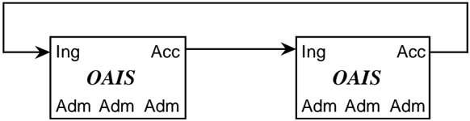

Figure 6-2 is an example of OAIS archives that have standardized their submission and dissemination methods for the benefit of users. No special external element is needed for this. Its disadvantage is that there is no formal mechanism for exchange of Description Information so Consumers must have separate Search Sessions to locate AIPs of interest.

Figure 6-2: Cooperating Archives with Standard Ingest and Access Methods

## 6.1.3 FEDERATED ARCHIVES

Federated Archives are conceptually Consumer-oriented. In addition to the Local Community (i.e., the original Designated Community served by the archive), a Global community (i.e., an extended Designated Community) exists which has interests in the holdings of several OAIS archives and has influenced those archives to provide access to their holdings via one or more common finding aids. However, the Local Consumers are likely to have access priority over the global Consumers.

At the federated level of association, external elements can be introduced to improve interoperability. For example, figure 6-3 6-3 illustrates a functional architecture to solve the Access problem described in 6.1.2, using an entity external to the Federated OAISs. Here, two OAIS archives that have similar Designated Communities have decided to Federate to allow Consumers to locate Information Packages of interest from either OAIS with a single Search Session. The Common Catalog &amp; Manager is the external (global) binding element that serves as a common access point for the information in both archives. DIPs containing the finding aids from each OAIS are ingested into the Common Catalog as is shown by the dotted lines figure . The Common Catalog may limit its activity to being a finding aid or it may include common dissemination of products from either or both OAISs as shown by the dashed lines in the figure.

## CCSDS RECOMMENDATION FOR AN OAIS REFERENCE MODEL CCSDS HISTORICAL DOCUMENT

Figure 6-3: An OAIS Federation Employing a Common Catalog

Federated archives may be further classified into three levels of functionality.

- -Central Site : Global access is accomplished by the export of a standard-format Associated Description to a global site. The global site independently manages a set of descriptors from many archives and has finding aids to locate which archive owns a collection of interest. The Consumer is given a combined view of the holdings of multiple sites, which is maintained centrally. To view details of the documents, the user must access the site that contains the actual document. This is made easier when sites and clients support a standard set of protocols.
- -Distributed Finding Aid : Global access is accomplished by having a global node that can distribute a query to multiple local archives. This means that the local Data Management entity must store an additional Associated Description in the global format or have a translator from the global queries to local queries. An option in this case is to establish a common DIP format to ease the load on Consumers who may be ordering products from many archives.
- -Distributed Access Aid : This adds a standard ordering and dissemination mechanism, available through the global nodes to the functionality of the Distributed Finding Aids

## CCSDS HISTORICAL DOCUMENT

## CCSDS RECOMMENDATION FOR AN OAIS REFERENCE MODEL

discussed above. This is a fully functional, federated system. Here, the global system may influence the Associated Description schema designs in each local archive; it would be optimal to build new local archives based on the global schemas and finding aids to ensure high degrees of inter-operability.

There are several major policy/technology issues that must be addressed when an OAIS joins a Federation or several independent OAIS decide to create a Federation. These issues include:

- -Unique AIP Names for each AIP in the Federation. An OAIS has the responsibility to provide each of its AIPs with a unique identity. When an OAIS joins a Federation, there is no assurance that some of its current OAIS AIP identifiers are not already used by other members of the Federation. An example of a general solution to this problem is to form the AIP identifiers in the Federation by assigning a Unique ID for each OAIS in the Federation and concatenating it to each AIP preserved by that OAIS. This OAIS name could be formatted according to a standard that gives the Customer or other Federation members the information needed to establish a connection to the OAIS that contains the AIP Interest. An example of a standard that accomplishes this is the ISO X.500 Directory Services Naming.
- -Duplicate AIPs in several different OAIS with different AIP names. This problem is caused by the fact that prior to Federation, some OAISs will have duplicated Content Information from AIPs in other OAISs to enable local user access. In this case a Global Consumer will see all the copies as separate, uniquely identified AIPs. Detailed examination of the PDI associated with the Content Information should allow the Consumer to locate the original, authoritative copy, but the search process could be very frustrating to the user. A practical way to handle this is to have a field in the Associated Description of all AIPs that identifies whether they are the original or a copy. This technique is not effective if, prior to federation, two or more archives received the content information from the Producer to archive. In this case the federated archive would view these duplicate AIPs as unique, original AIPs.
- -The Preservation of Federation Access to AIPs when an OAIS terminates operations. Unfortunately, many archives will close while their holdings still are of value to the Federation community. The federation should have an agreement for each member OAIS, which states which OAIS has the responsibility to take over the preservation of a closed OAIS's holdings.
- -User Authentication and Access Management for global users. If an OAIS has a policy that restricts the access to some of its AIPs or charges for the dissemination of some Information Packages, there is a problem of how to identify and authenticate the user who is making requests through the central node. Each OAIS will have implemented an Authentication and Access Management system for its Local Users and the infrastructure for this function will have to be extended to include Global Users. Some examples of techniques used for this in current systems are:
- Default priorities where all members from the Global Node share a common set of access constraints and the Global Node handles all the authentication to verify

the Consumer as a legitimate user of the Global node. The authentication at member OAIS is done assuming that all requests from the global node are from a single user.

- User Credential passing where the specific remote user can be authenticated by any of the Federation OAIS and the global node simply acts as an intermediary to carry the authentication dialog. (This is difficult to do securely with existing technologies, but X.509 certificates used in the WWW show promise).

There are many factors influencing the decision of which of these techniques should be used by a specific Federation. The major criterion is the granularity of the Access Constraints in the Federation. If there is little private data and no charge for data dissemination, a policy that determines a user's access constraints by the source he uses to discover and order AIPs is very reasonable. This involves little modification to the OAIS Authentication system, simply adding the Global Node as a Consumer. The Global Node will have to include mechanisms to identify Global Users to each of the Federated OAIS Authentication mechanisms.

If there are charges for disseminating archived information or significant private data that needs individual user authentication, the proxy techniques will not be sufficient, and User Credential passing techniques such as passwords and Certificates must be applied. The technologies to enable these supporting mechanisms are still evolving.

## 6.1.4 ARCHIVES WITH SHARED FUNCTIONAL AREAS

In this type of association, Management has entered into agreements with archives to share or integrate functional areas. The motive for this may be to share expensive resources such as hierarchical file management system for Archive Storage, peripheral device for Ingest or dissemination of Information Packages or super computers for complicated transformations between SIPs, AIPs or DIPs. This association is fundamentally different from the previous examples, in that we can no longer ignore the internal architecture of the archive.

Figure 6-4 illustrates the sharing of a common storage function, consisting of an Archival Storage entity and a Data Management entity, between two archives, OAIS 1 and OAIS 2. The access, dissemination and ingest facilities can be at any of the previously described levels of inter-operability. In fact, each archive can serve totally independent communities as implied in this figure. However, for the common storage element to succeed, standards are needed at the internal Ingest-storage and Access-storage interfaces. The CNES Long Term Storage Facility is an existing example of this architecture.

Figure 6-4: Archives with Shared Storage

## 6.2 MANAGEMENT ISSUES WITH FEDERATED ARCHIVES

The above examples show that the OAIS model is consistent with federation to accomplish specific objectives. However, it should also be considered that some of these objectives might be accomplished through voluntary action. This is an important dimension in the association of systems, including archives, because it establishes the degree of autonomy for each system. At the heart of the autonomy issue is the ease with which an association may be altered by one of the participants. Some possible characterizations of autonomy levels might be:

- -No interactions and therefore no association.
- -Associations that maintain an association member's autonomy. An association member may have to do certain things to participate, but can leave the association without notice or impact. An example is participation in the Internet, including operation as a domain name server. A member will need to meet certain requirements to participate, including the maintenance of a site with certain characteristics, but the member will in effect be expunged from the association if the site simply stops conforming. However, there is no penalty for this. Therefore, the members maintain full autonomy the whole time because they are free, without penalty, to do what they want.
- -Associations that bind an association member by contract. To change the nature of this association, a member will have to re-negotiate the contract. The amount of autonomy retained depends on how difficult it is to negotiate the changes. The difficulty may rise as more entities become a party to the contract.

## CCSDS RECOMMENDATION FOR AN OAIS REFERENCE MODEL CCSDS HISTORICAL DOCUMENT

So, the autonomy dimension is a key one for interacting archives, determining the ease with which each can effect changes in the nature of the association and the impact/penalty to each for recovering full autonomy. This dimension is different from the degree of technical homogeneity the association implements or supports, but it is not totally independent. For example, a high degree of technical homogeneity can be achieved in a broad association where each participating entity is free to leave without penalty. However, the permanence of such an association can not be guaranteed, and may be improved by making it more difficult to re-negotiate the association, or by establishing penalties for recovering full autonomy. Also, a given degree of technical homogeneity might be achieved more rapidly and at lower cost when the contract is more binding.

## ANNEX A

## EXAMPLES OF EXISTING ARCHIVES

(This annex is not part of the Recommendation.)

## A1 PLANETARY DATA SYSTEM ARCHIVE

## A1.1 DOMAIN

Domain and Consumers . The Planetary Data System (PDS) is chartered to provide data archiving services, data access and expert help to the NASA-funded planetary science community. The PDS is a distributed system with a Central node at the Jet Propulsion Laboratory and discipline nodes (imaging, geosciences, atmospheres, planetary plasma interactions, small bodies, rings) located at universities around the country. The early focus has been on restoring historical mission data and has produced several hundred CD-ROM volumes containing about 80 per cent of the important planetary data archives. There has been an increased emphasis on providing access to the general public for educational outreach over the past several years.

Data Producers . Planetary data sets originate with NASA flight project data management and science teams (new data, some restorations), individual scientists (newly processed or value-added data) or via the PDS discipline nodes (restorations and value-added data). At least 50 percent of the PDS resources have been devoted to restorations over the past seven years, with several more years of work needed to capture all historical data.

## A1.2 INGEST PROCESS AND INGEST INTERFACE

The PDS has developed a very formal interface with the major data producers (flight projects). This interface is documented in the Data Preparation Workbook and involves substantial interaction between node personnel, data engineers and project representatives. A Project Data Management Plan, signed by the PDS project manager provides the basic project data description and agreement to deliver to PDS. Since about 1993 all NASA announcements for Planetary investigations or analysis require that all data generated be delivered to PDS in conformance with PDS standards.

## Submission Agreements

Projects provide a Project Data Management Plan (PDMP). Sometimes a more specific document, the Archive and Transfer Plan, supplements the PDMP, providing extended product documentation and a schedule of deliveries.

Individual scientists can propose to be 'data nodes' and receive funds from a PDS discipline node for preparing restored or value-added data sets for inclusion in the archive. There is no formal submission agreement for data nodes.

## CCSDS HISTORICAL DOCUMENT

## CCSDS RECOMMENDATION FOR AN OAIS REFERENCE MODEL

The PDS discipline nodes each maintain a list of outstanding restorations. These are worked-off based on their priority within discipline. At some point this list will be completed and only new project or data node data sets will be ingested into PDS. There is no formal agreement associated with discipline data restorations.

Each data set that is identified for ingest in PDS is assigned to a Central node data engineer. It is the responsibility of the data engineer to see that all archiving steps are completed. The archiving steps are called out in the PDS Data Preparation Workbook.

Typical Data Delivery Session . Typically a delivery session will consist of a single data set contained on one or more volumes of CD-ROM or CD-Recordable media. A data set is defined within PDS to be a group of homogenous data granules at the same data level (raw, decalibrated, reduced) which differ only in time of acquisition and major category of target body. For example, the images of Jupiter taken by both Voyager spacecraft comprise a single data set. The standard process includes up-front negotiations between PDS and the provider; the production of test products which are evaluated in the peer review; revised final test products which are validated by the data engineering staff at the central node; approval and production of CD-ROM volumes; distribution by the appropriated discipline node or the central node; entry of the data set into the PDS central catalog; and entry of the data set into the NSSDC ordering system.

Transformation Process . In most cases the original data formats are maintained when data is brought into PDS. This allows existing software tools to continue to be used with the data. Much of the data preparation involves carefully documenting the data format and preparing metadata (granule labels, index files and catalog templates).

Validation . Validation is generally performed as part of the peer review of a product or by using validation tools. In some cases (for example, Magellan), the project develops its own internal validation process. The main validation tool of the PDS is the Volume Verifier. This program is run by the Central Node data engineers on each product delivered from a project or a data restoration. It validates the format and content of all product labels, and validates data files using checksums.

Security . The only area where any special security issues exist involves the receipt of proprietary data. Some projects have one-year proprietary periods before data in released to the science community. The PDS policy is to avoid receipt of any proprietary data sets during the proprietary period.

## A1.3 INTERNAL FORMS

The PDS has developed standards for documenting data sets (templates) and individual data products (PDS labels) using a keyword=value label system called the Object Description Language (ODL). Recommendations are also provided for volume organization and data product formatting to optimize the utility of resulting data products.

## CCSDS HISTORICAL DOCUMENT

## CCSDS RECOMMENDATION FOR AN OAIS REFERENCE MODEL

The PDS standards are specified in the PDS Standards Document. Standard documentation requirements include templates describing the data set, instrument, mission, etc. These templates are included on data volumes and also entered in the PDS high-level catalog. Standard terminology is maintained in the Planetary Science Data Dictionary (PSDD), which is jointly maintained by the PDS and the multi-mission ground data system. The metadata values for new data products are carefully compared with the PSDD and existing values used wherever possible. Additions are made to the PSDD to add new standard values to accommodate new data sets and when justified new keywords are added to the PSDD. Data products can have specialized metadata values which are not cataloged in the PSDD.

The PDS product labeling system is flexible enough to allow nearly any data structure to be described. Labels can be attached to the beginning of the data file or detached in a standalone text file which points to the data file. In some cases a single label file is used to describe multiple data files. Detached labels can be used to describe data stored in other formats (FITS or HDF, for example). In cases where complicated raw telemetry formats are stored the Software Interface Specification (SIS) for the product is included in lieu of descriptive labels.

## Archive Volume Components

An archive quality data set is required to contain the following components:

| - | AAREADME.TXT | - Text summary of data contents; |
|-----|----------------|--------------------------------------------------|
| - | VOLDESC.SFD | - Standard volume label; |
| - | VOLINFO.TXT | - Text description of data contents; |
| - | CATALOG | - DATASET.CAT, MISSION.CAT, INST.CAT; |
| - | INDEX | - ASCII index for each granule on the volume; |
| - | SOFTWARE | - Software needed to interpret/display the data; |
| - | CALIB | - Calibration data sets; |
| - | BROWSE | - Browse products for this volume. |

Peer Review. All restoration and data node-produced data sets are required to undergo a peer review before acceptance as archive products. Products produced by flight projects do not go through a formal peer review process. In general, there is ongoing negotiation between the data engineer or the discipline node staff and the data producer. The peer review team consists of a number of scientists familiar with the data set, the discipline node leader and one or more data engineers. All product documentation and sample products and software are supplied to the peer review group for evaluation. The peer review group determines the adequacy of documentation and quality of the data products and either approves the product or provides a set of liens which must be fixed prior to approval. The PDS nodes and data engineers have access to a Volume Verifier tool which aids in validating the quality of an archive volume. The volume verifier checks internal checksums, verifies that the index contains entries for all data products and validates the volume templates as well as the descriptive keywords supplied for each product.

Delivery Media . Discipline restorations and data node products are recorded on CD-ROM or CD-recordable media as a standard practice. Flight projects are urged to provide archive

quality products on CD media but may not be able to due to funding constraints. Products delivered to PDS on magnetic tape media are assigned to the PDS restoration queue. It is the goal of PDS to convert all data sets to CD-ROM or CD-recordable media which is replicated at a separate geographic facility. This separate facility is generally the National Space Science Data Center (NSSDC) at Goddard Space Flight Center.

## A1.4 ACCESS

Nearly all access to PDS data sets is via the CD-ROM volumes which are distributed to the entire research community. Large discipline node data collections including a substantial volume of CD-ROM data are accessible via the Internet. Several of the discipline nodes have developed on-line retrieval systems customized to meet the needs of their discipline scientists.

Finding Aids . The Pilot PDS devoted substantial resources to designing a central catalog system and distributed query and processing capabilities at the discipline nodes. These efforts were largely dropped as the Planetary Data System focused on data restoration rather than data access. In general, most of the user community already had home grown tools for data analysis and were most concerned with getting access to the data sets. The growth of the user community due to Internet and increased usage of CD-ROM readers has spurred to prototype a more consistent finding aid. The PDS Navigator has been developed for selecting images from the Clementine mission. It includes three components, a forms-based traditional database retrieval capability, an image-based retrieval and a text-based retrieval.

Security. The high-level PDS catalog can be accessed via a group account. Most of the data access services at the discipline nodes require the user to obtain a valid account on the node computer. All PDS data sets are certified "General Technical Data Available" by the Department of Commerce and are distributable worldwide.

Customer Service/Support. The order function of the PDS is distributed. Data inventories are kept at NSSDC, the PDS central node and at each discipline node. In general each site serves a special group of users:

- -discipline node - members of the NASA funded discipline;
- -central node - other NASA scientists and engineers, other agencies;
- -NSSDC - other scientists, agencies, public and foreign users.

The PDS Operator at the central node handles requests for PDS documentation or standard data products. The discipline nodes handle data requests from within their discipline and also provide expert help in the utilization and interpretation of the data. Access to tools is also provided.

The vast majority of data dissemination is done via CD-ROM disc. Several hundred copies of over 500 titles have been distributed to date.

## CCSDS RECOMMENDATION FOR AN OAIS REFERENCE MODEL CCSDS HISTORICAL DOCUMENT

Event Based Orders . Nearly all PDS distribution is done via event based orders (i.e., subscriptions or standing distribution lists). It is the responsibility of each discipline node to maintain a distribution list for its discipline scientists. This list determines the order amounts for most CD-ROM titles. The central node maintains a distribution list for engineering and management personnel and for other external recipients (reciprocal distribution, software developers).

Media/Network Use . Nearly all final products are delivered to the user community on CDROM. Archival products that need not be widely distributed are stored on CD-Recordable media, with a duplicate copy provided to the NSSDC. Most PDS data is available for downloading via anonymous ftp connection to a large CD-ROM jukeboxes at the central node and the imaging node.

Data Manipulation . Each discipline has a suite of government developed analysis tools which can be applied to the discipline data sets. These software packages are available for UNIX workstations or VAX VMS platforms. Several nodes provide the user a menu of processing functions that can be performed on selected data and will carry out requested processing and provide the results electronically or via media. The most widely used commercial tool is IDL.

Pricing Policy . The PDS distributes data to legitimate NASA researchers for no charge. There are no charges for on-line computer usage or data processing to NASA researchers. The NSSDC distributes CD-ROMs for $10 per volume.

## A1.5 SPECIAL CHARACTERISTICS

PDS has invested a substantial engineering effort in its common data dictionary, data standards and procedures for preparing archival quality data sets. By having these standards in place the PDS is able to demand better quality data sets of its data providers.

## A2 NATIONAL ARCHIVES AND RECORDS ADMINISTRATION'S ELECTRONIC AND SPECIAL MEDIA RECORDS SERVICES DIVISION

## A2.1 DOMAIN

## Domain and Consumers

The Electronic and Special Media Records Services Division is the organization within the U. S. National Archives and Records Administration (NARA) that appraises, accessions, preserves, and provides access to federal records in a format designed for computer processing. NARA serves as the archives for the records of the United States federal government. Consumers for this data are as diverse as the electronic records they seek to access and range from individuals seeking to assert their rights to other government agencies to academic researchers, private consultants, media personnel, and a wide variety of other users.

## CCSDS RECOMMENDATION FOR AN OAIS REFERENCE MODEL CCSDS HISTORICAL DOCUMENT

## Data Producers

Originally this data is produced (created or received) by agencies of the U.S. federal government (producers). The data may concern virtually any area or subject in which the government is involved. They may come from a variety of computer application such as data processing, word processing, computer modeling, or geographic information systems. They can include records made directly by government employees or indirectly through government grants and contracts.

## Special Features

The most noted special feature of NARA's Electronic Records program is the diversity of the collection of more than two billion logical data records in over 129,000 data sets from more than 100 bureaus, departments, and other components of executive branch agencies and their contractors and from the Congress, the Courts, the Executive Office of the President, and numerous Presidential commissions. A small portion of the data originally were created as early as World War II. An even smaller portion contains information from the nineteenth century that has been converted to an electronic format. Most of the data, however, has been created since the 1960s. The major types of holdings and subject areas include agricultural data, attitudinal data, demographic data, economic and financial statistics, education data, environmental data, health and social services data, international data, and military data.

Scientific and technological data already transferred to NARA include the National Register of Scientific and Technical Personnel; the National Engineers Register; the 1971 Survey of Scientists and Engineers; major portions of the National Ocean Survey's Nautical Chart Data Base; numerous Environmental Protection Agency series relating to pesticide use, hazardous wastes, and pollution abatement; the Nuclear Regulatory Commission's Radiation Exposure Information Reporting System; biometric data sets and epidemiological studies (such as the National Collaborative Perinatal Project) from the National Institutes of Health, the Centers for Disease Control, and the National Center for Health Statistics; and text from presidential commissions on Three Mile Island, coal, and the Space Shuttle Challenger Accident. NARA recently ingested the e-mail of the Executive Office of the President, including the White House Office and the Office of the Vice President for the period from 1986 through January 20, 2001. While NARA's scientific and medical holdings are rich and varied, they do not fully reflect the extent and diversity of federal activity in this area.

## A2.2 INGEST

The ingest process begins with producers (records managers and records creators in federal agencies) inventorying all electronic records and determining how long to retain the records for current agency business. The next step in the process is for the producer and NARA to develop a Request for Records Disposition Authority , Standard Form 115 (SF 115), the formal submission agreement for all federal records. Here information on the content, retention and disposition, and the availability and extent of documentation and related reports is listed in the context of the producer's business needs for the information. Data with continuing value are listed as permanent and the timing and frequency of their transfer to

## CCSDS RECOMMENDATION FOR AN OAIS REFERENCE MODEL CCSDS HISTORICAL DOCUMENT

NARA is established. The producer submits the SF 115 to NARA for its review and appraisal. NARA appraises electronic records items on all SF 115s. Identifying permanently valuable electronic records for retention by NARA's Electronic and Special Media Records Services Division involves cooperation between NARA and the producers. Through the process of scheduling and appraisal, NARA identifies and selects the electronic records it judges to have enduring value. NARA evaluates electronic records in terms of their evidential, legal, and informational value and their long-term research potential. Some of the factors in this appraisal evaluation include estimation of past, present, and probable future research value within the context of the data's origin and current use and its impact on federal programs and policy. Administrative and legal value, as well as the potential for linkage with other data, may bear on the decision. Unaggregated microlevel data sometimes has the greatest potential for future secondary analysis. Once NARA determines that the records have enduring value, it then determines whether the records should be preserved in electronic format.

## Submission Agreements

The actual Submission Information Package (SIP) between NARA and the agency that creates or receives the data is a Request to Transfer, Approval, and Receipt of Records to the National Archives of the United States , Standard Form 258 (SF 258) accompanied by the data object(s) and sufficient documentation and descriptive information to use the data. The SIP transfers physical and legal custody of the electronic records from the producer to NARA. This agreement is the end product of the ingest process described above. The SF 258 also contains any restrictions on access to the data that conform with exemptions listed in the U.S. Freedom of Information Act (FOIA). NARA enforces all legitimate restrictions on access. At the same time NARA also works with the producer to determine if any 'disclosure-free' version of the data can be produced for consumers.

## Typical Delivery Session

This inventorying, scheduling, and appraisal process specifies the data object(s) and related metadata and documentation to be transferred, and establishes the timing and frequency of submissions. Specific instructions for how the data are to be organized and when they should be submitted are established in the Code of Federal Regulations (36 CFR 1228.188). All data should be transferred on either open reel magnetic tape, tape cartridges, or CDROM. NARA negotiates acceptance of other forms of magnetic media such as class 3590E or DLT, with producers. The CFR sets the specific technical requirements in terms of format, block size, and extraneous characters. While the current regulations also require that all SIPs should be transferred in a software-independent format, NARA staff recognize that the research potential and utility of some data would be significantly reduced if they were transferred in such a format. In such cases NARA works with the producers to determine the best mode of transfer.

What are the Information Objects that are Delivered? Producers typically will transfer a series consisting of one or more data sets with the related documentation which minimally should include the record layout and codes, methodology statements, technical information about the data including number of records and size. Ideally, the SIP also includes

## CCSDS RECOMMENDATION FOR AN OAIS REFERENCE MODEL CCSDS HISTORICAL DOCUMENT

associated analyses and reports. Increasingly agency-created metadata also is included. The majority of electronic records come as flat files of data; increasingly, however, text files and output from data base management systems, and geographic information systems also are transferred.

What are Collections? NARA organizes all Archival Information Collections (AIC) on the basis of Provenance and Original Order. Provenance maintains the identity of an Archival Information Package (AIP) or an AIC and preserves as much information as possible about its origins and custodial history. Within NARA this is accomplished through the use of Record Groups which reflect the structure of the federal government and subgroups and subsubgroups which place the AIPs and AICs within the producer's place within its agency. Original order argues for maintaining the contents of an AIP or AIC in the order developed and used by the producer. This helps reveal the producer's organization and how it used the data objects and can provide additional information to consumers. For electronic records, 'original order' is expressed in the logical structure of files and databases and in the indexing which the producer used. Within NARA the basic unit for arrangement and description is the series which is an AIC that can include a number of related AIPs.

What Descriptive Information is Provided? The extent and quality of the descriptive information provided by the producer varies from quite sketchy to extremely detailed. NARA staff attempt to flesh out the producer-created descriptors with AIC level descriptions, title list entries, abstracts, and Dissemination Information Packages (DIP) and to provide the descriptive information in a variety of formats to reach different consumers.

What sorts of Validation Objects are Provided? Producers are required to transfer metadata and descriptors adequate to access, process, and interpret electronic records. For formatted data files the DIP must include a record layout with appropriate field definitions and codes. It frequently also includes methodology statements, input documents, data entry instructions, processing directions, sample outputs, reports and analyses of the information and system manuals.

## What Transformation Processes are Performed Prior to Storage

What Metadata is Created? The most extensive metadata product created by NARA is the DIP. It includes an Introduction which can discuss the origin, creation, and administrative uses of the data object(s), list related objects that are or will be available, and discuss characteristics of the data that could cause problems for consumers based on initial validation processes. The DIP also can include sample printouts of the data and tables and reports related to computer verification of the data. NARA also captures metadata on record layouts, domains, ranges, and links between files in a metadata database as a byproduct of the automated verification process. Other metadata created by NARA staff include AIC descriptions, formatted abstracts, title line entries, and collective descriptions which place the data in a broader context. Increasingly, producer-created metadata is part of the SIP transferred to NARA.

What Validation is Performed? NARA's initial ingest procedures include creating a new preservation master and backup copy of each data object on new certified media to ensure the

## CCSDS RECOMMENDATION FOR AN OAIS REFERENCE MODEL CCSDS HISTORICAL DOCUMENT

best physical media for long-term storage. This procedure includes a 100% byte for byte comparison between the SIP media and the AIC media. At this time staff perform automated verification of the data contents with the record layout and codes, and of the physical structure including the number of records, blocks, and bytes. Staff also perfect the DIP to facilitate secondary use of the data.

## Security

All AICs are maintained off-line. Consumers access only DIPs. The AIC preservation master and backup copies are maintained in separate secure stacks at two different physical locations. AICs that require additional security measures, for example Bureau of the Census data subject to restrictions imposed under Title 13 of the United States Code and national security classified information restricted under Executive Order, are afforded the appropriate level of protection. NARA is moving to provide enhanced access to selected data onsite by providing reference copies on a wider variety of media and by providing a broader range of services and output products. This may include use of vendors who can provide enhanced access to the holdings utilizing 'value-added' services.

## A2.3 INTERNAL FORMS

How do you Store your Data? All preservation master and backup copies of AICs are stored on newly certified class 3480 magnetic tape cartridges. Some of the holdings have not yet been migrated from nine-track, 6250 bpi open-reel magnetic tape. Data are received and stored temporarily on other media including diskettes, 4mm, 8mm, CD-ROM, DLT, and various removable hard drives, although not all of these media conform with regulatory requirements.

Migration (Data). Based on recommendations from the media manufacturers, the National Technology Alliance, the National Institute of Standards and Technology, and various standards organizations, NARA has been migrating its AICs to new class 3480 magnetic tape cartridge when each media unit is ten-years old. NARA continues to reassess storage media. NARA anticipates storing larger AICs on class 3590E and/or DLT cartridges as appropriate.

Migration (Metadata). Metadata has been stored in a variety of formats depending on the original format transferred with each AIC. Traditionally most metadata existed in textual format. The metadata captured in the verification process is maintained in a relational database. There are no current plans for migrating from this format, although the metadata can be exported in flat file format. NARA encourages data producers to create and transfer metadata in electronic form. In the near future NARA will begin scanning and digitally converting metadata so it can be preserved and provided in an electronic format along with the data.

Migration (Format) . The Code of Federal Regulations requires data producers to transfer all data in ASCII or EBCDIC with all extraneous characters removed from the data except record length indicators or tape marks and blocked at no higher than 32,760 bytes per block for open-reel and 37,871 bytes for class 3480 magnetic tape cartridge. When CD-ROM is

## CCSDS RECOMMENDATION FOR AN OAIS REFERENCE MODEL CCSDS HISTORICAL DOCUMENT

used they must conform to ISO 9660 standard and the data must be in discrete files containing only the permanent data. Additional software files and temporary files may be included on the CD-ROM. The CFR also requires all electronic records to be transferred in a software-independent format. NARA works with data producers who cannot meet those requirements to determine the most appropriate transfer and storage formats.

## A2.4 ACCESS

## What Finding Aids are Provided?

Information about the holdings are available in multiple levels of detail and by multiple sources as a way to provide various consumers with information about NARA's holdings. The least specific detail is available in the 1996 three volume Guide to Federal Records in the National Archives of the United States where AICs are described in the context of the larger holdings from a producer. Other collective descriptions include Information About Electronic Records in the National Archives for Perspective Researchers , General Information Leaflet 37, which also is available on the Division's homepage (http://www.nara.gov/nara/electronic), and a title list of data sets available on the Division's homepage and as a printout. Specific AIC descriptions were created as formatted metadata for a portion of the Division's holdings for inclusion in a proposed automated description data base which has not been implemented. The most detailed description for any data set is the DIP. Each DIP may contain a narrative describing the data file(s), the record layout and codes for the data, a methodology, sample input forms and questionnaires, annotations regarding the data validity, and a bibliography. The Division also has established an email site (cer@nara.gov) for queries regarding its holdings and services.

## Security .

All NARA holdings are maintained in environmentally controlled closed stacks which are accessible only by NARA staff. Master and backup copies of the data are stored in separate vaults in separate locations to facilitate disaster recovery. The Division's national security classified data sets are in separate environmentally controlled stacks approved for the storage of classified information. All processing is performed in limited access processing rooms at NARA or at other government computer centers. Computer processing is done on closed systems which require both a registered logon and personal identification number or password to access the system. Researchers do not have direct access to any AIC. Presently they access copies of the data that they have purchased for their own use.

## Customer Service/Support .

The Division has a staff dedicated to providing reference services to the public and to the staffs of other federal agencies. The staff responds to both general and specific inquiries by telephone, letter, email, or in-person visit and fills orders for copies of specific data and their DIPs. For a limited number of AIPs the staff also provides information from records to

## CCSDS HISTORICAL DOCUMENT

## CCSDS RECOMMENDATION FOR AN OAIS REFERENCE MODEL

respond to researcher requests. The staff also functions as a filter between researchers and the data producers when problems develop in understanding or interpreting the data. The staff develop a variety of informational material about NARA's holdings and services, much of which is available online.

## Do You Support Subscriptions?

NARA accepts standing orders (subscription) for electronic records that it receives on a regular, periodic basis from producers of the Federal government. Under current NARA regulations all subscriptions must be prepaid prior to shipment.

## What Media/formats do you use?

Currently NARA provides DIPs on a variety of magnetic media including nine-track openreel magnetic tape or class 3480 magnetic tape cartridges encoded in ASCII or EBCDIC, labeled or unlabeled and written to the maximum block size requested, diskettes for smaller data sets and CD-ROM . NARA also can provide an exact copy of records in nonstandard formats, if the agency transferred them this way, but it cannot validate or verify the contents of these files. In the past these other formats have included packed decimal, zone-decimal, binary, National Information Processing System (NIPS), Statistical Analysis Software (SAS), Statistical Package for the Social Sciences (SPSS), or OSIRSIS. On-line transfer of SIPs to NARA via File Transfer protocol (FTP) was implemented in 2001; providing DIPs via FTP may occur as early as 2002.

## What Transformation (Value Added) is Provided?

NARA currently preserves AICs as received from the producers; it does not routinely provide customized DIPs or other value-added services beyond computer verification of the AIC contents and enhanced documentation. Planned enhancements include value-added services such as custom DIPs and data transformation.

## Pricing Policies.

NARA uses a cost-recovery fee schedule developed by the National Archives Trust Fund. The 2001 charges include a basic order handling fee of $89.00 with an additional fee of $9.00 for each file. Media costs range from $2.50 for diskette to $22.50 for a 9-track open reel. Paper reproductions cost $10.00 for a minimum order of up to 20 pages; additional pages are $0.50 per page. If the documentation is on microfiche, copies are $2.50 per fiche.

## Dissemination Security.

The same security considerations developed in relation to Access apply to Dissemination. NARA's national security classified data is made available only to researchers who have both the appropriate security clearances and the appropriate need-to-know. Other restricted data are made available only with prior written approval of the creating agency or under the terms of the restrictions which must be supported as a legitimate exemption under the Freedom of Information Act.

## A2.5 SPECIAL CHARACTERISTICS

NARA's Electronic and Special Media Records Services Division has a diverse collection which reflects the diverse activities of the federal government. The staff shape the holdings through the process of scheduling, appraisal and accessioning. Currently, NARA acquires less than one percent of all federal records created in an electronic format. The timing of the transfer of electronic records from the creating federal agency to NARA is negotiated with the creator to ensure that the records are available for agency use for as long as necessary for current business and that they are transferred to NARA as soon as practicable to ensure their long term preservation for secondary use. NARA is the only federal agency with an explicit archival mandate for Federal records and thus the only Federal agency that preserves and provides access to a wide range of historically valuable records for the indefinite future. As such it is an archives of last resort for the electronic records of some federal agencies which undertake an active data dissemination function while there is a researcher interest in the data but whose mandate ceases or may cease once the demand wanes or ceases.

## A3 LIFE SCIENCES DATA ARCHIVE

## A3.1 DOMAIN

What is the domain and who are the customers of the Archive and who are the producers of the data? What are the special features of this archive?

The Life Sciences Data Archive (LSDA) is responsible for collecting, cataloging, storing and making accessible the data of NASA funded Life Sciences space flight investigations. There are two general goals for NASA space life science research; one, to find counter measures to problems encountered by human bodies as a result of space flight, and two, to broaden the understanding of the effect of gravity on living systems. The LSDA's designated consumer is the life sciences research community, but it is also used by students, educators and the general public. The data archived in the LSDA is produced by both intramural and extramural investigators funded to perform flight experiments through NASA grants. It is anticipated that the archive may grow to include data from investigations which are completely ground based.

The LSDA is a distributed archive with responsibilities distributed to LSDA Nodes at NASA Centers with life sciences activities. The LSDA Project Nodes at Ames Research Center (ARC), Kennedy Space Center (KSC), and Johnson Space Center (JSC) are responsible for the collection and cataloging of data. The LSDA Central Node is responsible for importing the data from the Project Nodes, integrating and providing access to the data via the World Wide Web. The Central Node is also responsible for maintaining the LSDA Data Dictionary and coordinating development and maintenance of the archiving system.

The LSDA contains animal, plant, and human space flight data. This archive is notable in that it contains a unique collection of data describing, in considerable detail, biology experiments carried out in space by NASA over the past thirty years. The nature of the data is highly varied and spans many life science disciplines.

## CCSDS HISTORICAL DOCUMENT

## CCSDS RECOMMENDATION FOR AN OAIS REFERENCE MODEL

The LSDA is also unique in that it provides both digital and non-digital information. The non-digital data may be either reproducible or non-reproducible. Examples of reproducible, non-digital data are video and audio tape. An example of non-reproducible, non-digital data is a biomedical sample.

## A3.2 INGEST PROCESS

## Submission Agreements

There are two types of data producers to the LSDA: the NASA Flight Project offices that designs the hardware and flies the experiment, and the NASA-funded Principal Investigator (PI).

To acquire data from the NASA Flight Project offices, the LSDA Project Nodes work closely with them to acquire data during flight operations. The LSDA assists the NASA Flight Project Offices in distributing this data to the Principal Investigators and gathering it as an archival product. As the LSDA is relatively new (1993) there is also archiving of past missions being done on a funding available basis.

To acquire data from the NASA funded Principal Investigator, there are a couple of methods of data collection currently being used depending on the 'age' of the experiment. For previously flown experiments (prior to 1994) there is an informal submission agreement between the LSDA and the PIs that is based on cooperation, and is not binding. For experiments being selected for flight (after 1994) the funding agreements include a contractual stipulation that the Principal Investigator must supply the LSDA with raw data, analyzed data and a final science report.

These funding agreements are finalized when proposed investigations are selected for flight. At this time the PIs are sent a letter informing them, that upon acceptance of funding they will be responsible for delivering the data collected as part of their investigation in a form usable by the sciences community after their one year post flight proprietary period.

Submission of data to the LSDA begins one year post flight. To assist in data submission, the LSDA Project nodes send the Principal Investigator a Data Inventory package including forms and instructions. The Principal Investigator fills out the data inventory forms and returns them to the LSDA Project Node. The Project Node then contacts the PI to begin data submission. In order to clarify the 'usable form' requirement throughout the entire LSDA project, the LSDA is in the process of developing a post flight data reporting handbook which explains exactly how the data should be provided to the archive.

## Typical Submission Session

A typical Submission Information Package (SIP) consists of two parts: 1) the Data Inventory forms, and 2) actual data or Content Information. The inventory forms are made up of Preservation Description Information (PDI) (i.e., treatments, parameters measured, research subjects and IDs, date/period of collection, collection location, analysis phase, comments)

## CCSDS RECOMMENDATION FOR AN OAIS REFERENCE MODEL CCSDS HISTORICAL DOCUMENT

and Descriptive Information (i.e., title, description, keywords). The Content Information consists of physical samples, spreadsheets, final science reports, published articles, procedural documents, crew logs, photographs, video tapes, analog tapes, digital or printed images, and other types of digital data files (e.g., HRM).

Upon receipt by the LSDA the SIP will be cataloged with Descriptive and Packaging Information added, including; experiment and mission ID, Principal Investigator and CoInvestigators name, and other Descriptive information.

## Collections

Several SIPs will then be combined to comprise an Archival Information Package (AIP) of one experiment. The Descriptive Information and PDI are entered into a database comprised of LSDA-approved fields and use valid values whenever possible. The Preservation Description Information is developed by the LSDA personnel at the LSDA Project Node responsible for obtaining the data. The Preservation Description Information provides layers of metadata for the data collection that describe the experiment, mission, hardware, personnel, sessions, biospecimen, and research subjects from which the data was collected.

It is anticipated that future uses of the archive will involve the creation of Archival Information Collections (AIC), combining several AIPs based on discipline or measured parameters.

## Transformation Processes

In most cases the Content Information is kept in its original submitted form. Exceptions to this case include data submitted on outdated media requiring transfer to current media. As little transformation as possible is performed on the data at ingest in order to keep costs down and to insure the integrity of the data. There are some instances where the data has been collected in an application format that is not widely available and in this case the Project Node will transform the data into a more commonly accessible format. (e.g., spreadsheets created in Supernova are migrated to MS Excel).

After the AIP is created, the information goes through a validation process. This post-entry validation is accomplished by a second check of the data by the LSDA Project Node Manager. AIP validation is further ensured by sending the completed catalog entries to the data producer (Principal Investigator, Flight Project Offices) for verification. The data producer reviews the information, makes corrections or additions and sends the information back to the Project Node. Edits are then made to the records and the information is once again printed and sent to the data producer. This process is repeated until the Principal Investigator is satisfied that the experiment data is accurately represented. At this point the data producer signs and returns a verification letter to the Project Node. The AIP is now ready for review by the LSDA Project Scientist and LSDA Change Control Board before it is placed in the public record. The Projects upload the data to the Central Node, it is integrated into an intranet server available only to the LSDA CCB and this group, including the LSDA Project Scientist, reviews the data for overall form and cogency. After a two week review period the data is moved to the public web site unless change requests are logged by the

LSDA CCB. If CRs are issued they are resolved before any of the data is made available to the public.

## A3.3 INTERNAL FORMS

## Storage

The LSDA back-up and storage procedures vary between LSDA Node types. The LSDA Master Catalog and on-line data reside on a Microsoft SQL Server. These are backed up daily to tape. At the LSDA Project Nodes most of LSDA's data and metadata are stored on magnetic disks and backed up to tape. Long term storage is provided on CD-ROM. Biospecimens are stored in -80 degree freezers.

AIPs are stored as a piece of Content Information (a spreadsheet, word processing document, strip chart or biospecimen) which is linked to the Descriptive Information which is stored in a database record. These AIPs are linked, through the database, into AICs via an Experiment Number. A space life sciences experiment is, in this sense, an AIC. It is a collection of tens or hundreds of AIPs.

## Migration

The LSDA migration procedures are still in a developmental phase, but there is some ongoing data migration. LSDA Project Nodes are in the process of converting information on outdated media (RA60s, RL02s) to CD-ROM format.

Migration of application formats (e.g., MS-Excel) and in particular, version changes, is an area of concern. The cost of continually updating all LSDA spreadsheets to the current versions is prohibitive, and storing and making available the application is also expensive and complicated. A universal read-only format such as Adobe PDF might be the solution, but it is a proprietary format and as such, its life span is uncertain.

## A3.4 ACCESS

Finding Aids . Users access the LSDA through the World Wide Web (WWW) (http://lsda.jsc.nasa.gov/) where they search and retrieve information via the Master Catalog. The Master Catalog is a relational database with a WWW forms interface, and it allows users to search Descriptive Information across experiments and Missions to find data that meets their search criteria. Users can search within ten information groups; Experiments, Missions, Data Sets, Hardware, Documents, Personnel, Specimen or Subjects, Data Collection Sessions, Biospecimens, and Images.

There is currently no method available for searching data at a 'sub-AIP' level. The AIP record contains a considerable amount of detailed, searchable data so that a collection of AIPs could be found for a particular manual sub-search.

## CCSDS RECOMMENDATION FOR AN OAIS REFERENCE MODEL CCSDS HISTORICAL DOCUMENT

Event Based Order. The LSDA does not support event based orders (or subscriptions) since the Master Catalog is accessible to all users. Most data is made accessible to the user through links in the catalog to an anonymous FTP site from which the data is downloaded. If data are in non-digital format, but are reproducible (i.e., hardcopy documents, or log books), users may request them through on-line ordering forms available in the Master Catalog. The requested information is reproduced via photocopying and shipped US Mail to the requester. There is an e-mail update notification service offered to users.

Media/Formats. The LSDA provides some data on CD-ROM format, but otherwise most data is provided on-line. The LSDA also contains unique non-reproducible pieces of data such as microscope slides and space flight biospecimens. These unique resources are provided to a requester after a scientific proposal has successfully undergone peer review. Biospecimens are used to produce original data which is then ingested into the archive.

Pricing Policies. LSDA data that has been verified and cleared for release is available to the public, free of cost, through the Internet. If significant requests are generated for hardcopy documents, a processing fee for copying the document may be charged. As yet this has not been determined. In the future CD-ROMs may be generated for providing large data sets. These CDs would be priced for cost recovery only.

## A3.5 COMMON SERVICES

Customer Service/Support . The LSDA provides user support for questions and problems concerning the Master Catalog (on-line data request system) and for science questions about the data being provided. The primary means of user feedback and support is through the LSDA Central Node. Questions are addressed to the LSDA through on-line 'What do you think?' links located throughout the system. From these links a WWW forms interface allows users to submit questions. Specific questions about the Content Information are currently answered by the NASA Life Sciences Acquisition Scientist and the LSDA Program Scientist. Questions which can not be answered by these individuals are forwarded to the LSDA Project Node which collects the data. In some instances questions are forwarded to the Principal Investigator or NASA Flight Project Office.

Security . Overall security procedures stipulate that all digital data are backed up on a daily basis with off-site storage. Data on magneto-optical disks are stored in a locked file cabinet in a cipher locked room. Access to on-line servers is controlled through the use of password and/or address port filtering. Only data that is fully validated and approved for release is placed on publicly accessible servers.

The LSDA does not have any special security concerns for access to the Central Node. It is available to anyone with access to the WWW.

The LSDA has strict security measures for data from human subjects which require sensitivity and secure handling due to the Human Data Privacy Act. Only mean-pooled human data is made available to the public.

## A4 NATIONAL COLLABORATIVE PERINATEL PROJECT (NCPP) 1959-1974

## A4.1 DOMAIN

## Domain and Customers

The National Collaborative Perinatal Project was a multi-institutional, multi-year study of pregnant women and the children born from those pregnancies to provide baseline information useful for later determining the causes of neurological diseases which appeared in a portion of the studied population. The data came from medical histories, examinations, and observations. The records also contain socioeconomic, family history, and family health information. The data are used by a variety of medical and other researchers.

## Data Producers

The predecessor to the U.S. National Institutes of Health's National Institute of Neurological Disorders and Strokes (NINDS) began the National Collaborative Perinatal Project in 1958. Fourteen university-affiliated medical centers across the United States participated in the study. Between 1959 and 1965 each cooperating medical center collected information on between 300 and 2000 pregnancies each year for a total of 55,908 pregnant women utilizing their clinic services. This represented between 14% and 100% of the women utilizing these services depending on the sampling rate employed at each clinic. The final population was reduced to 39,215 due to miscarriages prior to twenty weeks, 445 multiple births, exclusion of subsequent or repeat pregnancies, and deletion of incomplete records due to women withdrawing from the study prior to its completion. The children were given neonatal examinations and follow-up examinations through eight years of age. The last examinations were conducted in 1974. The computer data files resulting from the research that NINDS transferred to the National Archives and Records Administration (NARA) consist of approximately 6,200,000 records organized into a Master File, a variable file, and eighteen work files, one of which consists of thirteen distinct data files.

## Special Features

The Collaborative Perinatal Project was a longitudinal multi-disciplinary research effort which sought to relate the events, conditions, and abnormalities of pregnancy, labor, and delivery to the neurological and mental status of the children of these pregnancies and their siblings through eight years of age. The study sought to link any later appearance of cerebral palsy, mental retardation, learning disorders, congenital malfunctions, minimal brain dysfunction, convulsive disorders, visual abnormality, or communicative disorders to patterns during the perinatal period in order to develop strategies for prevention and intervention. The sample population is large enough so that statistically significant numbers of such disorders would appear in the children. Study of the records relating those children could result in the development of predictive factors and possible preventive care or intervention actions which could reduce future incidence rates.

The data are available in two formats; microfilm of the individual case files for the mother and child of approximately 270 pages per case file, and the computer data files. Access to

## CCSDS RECOMMENDATION FOR AN OAIS REFERENCE MODEL CCSDS HISTORICAL DOCUMENT

the microfilm and two of the computer data files is restricted because they contain personal identifiers. The National Archives has created a public use file for the Master File and Work File 16: Serum Specimen Inventory.

## A4.2 INGEST

The ingest process for transferring any federal agency records to NARA begins with the agency identifying the records and assessing their potential evidential, legal or research value. The next step is for the agency to develop a Submission Agreement (Standard Form 115, Request for Records Disposition Authority) , and submit it to NARA. NARA staff then appraise the records in terms of their evidential, legal, and informational value and their long-term research potential. NARA and the creator then establish a transfer date, negotiate any restrictions on access, and initiate the ingest process.

Ingest for the NCPP computer data was a two phase process. In Phase One, from 1958 through 1974, NIH's NINDS funded the project and the cooperating institutions conducted the research. Contractors accumulated the original examination records, created the consolidated case files, microfilmed the records, normalized the data, and developed the Master File, an extract file of frequently used variables, and special files such as 'refined diagnoses'. The data were stored on 23 reels of magnetic computer tape recorded at 1600 bpi. Prior to 1980 the data were available only to NINDS, the cooperating hospitals, and selected government researchers.

In Phase Two NINDS developed the documentation necessary for more generalized use of the data and negotiated a submission agreement, including access provisions, with NARA. Since the data which could not be released could be made anonymous through creation of a Public Use File, the producer and NARA worked on transferring the data files first.

## Submission Agreements

NARA and NIH executed the U.S. Government's standard transfer form, Standard Form 258, Request to Transfer, Approval, and Receipt of Records to the National Archives of the United States , in mid-1985. This transferred legal custody and preservation responsibility to NARA. A similar agreement for the microfilm examination records was executed in 1990 after NARA and NIH resolved the privacy and access concerns and NARA developed a statistical research form.

## Delivery Session

The delivery session was a single transaction in which NIH provided NARA with copies of the 23 reels of magnetic tape containing the NCPP and the related documentation consisting of seven volumes containing the background of the study, the sample, data collection and data processing overviews, record layouts and coding for each variable, sample forms, and a bibliography of all published research through 1985. NINDS transferred the 8000 rolls of microfilm containing the examination records in 1990.

## Transformation Process

NARA has maintained and preserved the original data format. The data are in a hardware and software independent EBCDIC format which facilitates wide researcher access. All data were copied to new nine-track open-reel magnetic tape when received in 1985 and are migrated to new media every ten years to ensure Long Term Preservation. The more than 7000 pages of documentation are available in both a page format and in a microfiche format on 75 fiche. The documentation has not been scanned or digitized.

## Validation

Validation was performed as part of quality control throughout the life of the NCPP. Extensive use of the data during the life of the project (1958-1974) and its use by NIH approved researchers (1958-1985) provided a second de facto validation. NARA also validated sample portions of the data at the time of ingest. Continuing researcher use also validates the data contents.

## Security

The computer data is maintained in environmentally-controlled closed stacks which are accessible only to NARA staff. Master and backup copies of the data are stored in separate vaults in separate locations to facilitate disaster recovery. NARA has created Public Use Files of the restricted data files to prevent unauthorized access to personal and medical data.

## What Descriptive Information is Provided?

NARA has prepared multiple levels of descriptive information for the NCPP. These range from entries for each data file in the Electronic and Special Media Records Services Division Title List, an abstract entry for the series, a series description, a full documentation package, to a series-level entry in the three-volume Guide to Federal Records in the National Archives.

## What Validation Objects are Provided?

During its active life the NCPP established and used elaborate data collection, input and verification procedures. Extensive use also validates the information. NARA's routine transfer and storage procedures also validated the data. The extensive seven-volume documentation includes record layouts and codes, methodology statements, data analyses, and a bibliography of research use.

## What Transformation Processes are Performed Prior to Storage?

What Metadata is Created? NARA staff supplemented the documentation with an abstract and introduction discussing the origin, creation, and uses of the data, including an explanation of restrictions on access and the characteristics of the Public Use File.

What Validation is Performed? NARA's accessioning and storage procedures included creating a new master and backup copy on new certified magnetic media and creating a

Public Use File of the two restricted data files. Sample portions of each data set also were verified against the documentation.

## A4.3 INTERNAL FORMS

Storage . NARA maintains separate sets of the master and backup copies of the data and the Public Use Files on newly certified 3480 class magnetic tape cartridges.

Migration (Data) . NARA migrated the NCPP from 23 nine-track, 1600 bpi open-reel magnetic tapes it received in 1985 and stored the data on seven nine-track, 6250 bpi openreel magnetic tape. NARA migrated the data to four 3480 class magnetic cartridge when the media was ten years old.

Migration (Metadata) . NCPP metadata is available in textual (7000+ pages) and microfiche (75 fiche) forms. There are no plans to scan or digitize the text.

Migration (Format) . The data currently are encoded in EBCDIC with all extraneous characters removed. There are no plans to migrate the format at this time.

## A4.4 ACCESS

What Finding Aids are Provided?

Information (of varying detail) about the NCPP is available in the 1996 three volume Guide to Federal Records in the National Archives of the United States , where the records are described in the context of the larger holdings of the National Institutes of Health; in Information About the Electronic Records in the National Archives for Perspective Researchers , General Information Leaflet 37; in Title List: A Preliminary ad Partial Listing of Data Files in the National Archives and Records Administration ; and in the documentation package for NCPP. Much of this information is available on the Division's homepage (http://www.nara.gov/nara/electronic) or by posting an enquiry to the Division's e-mail site (cer@nara.gov).

## Security

NCPP, like all of NARA's holdings, is maintained in environmentally-controlled closed stacks which are accessible only by authorized staff. Master and backup copies of the data are stored in separate vaults in separate locations to facilitate disaster recovery. Researchers do not have direct access to the data. Presently they acquire copies of the data on a costrecovery basis permitting indefinite use of the data for their own purposes.

## Customer Service/Support

The Division has a staff dedicated to providing reference services to the public and to the staffs of other federal agencies. The reference staff responds to inquiries by telephone, mail correspondence, e-mail, or in-person visits. They fill orders for copies of all or part NCPP

## CCSDS HISTORICAL DOCUMENT

## CCSDS RECOMMENDATION FOR AN OAIS REFERENCE MODEL

and the relevant documentation. The staff also function as a filter between researchers and the NINDS when problems develop in understanding or interpreting the data.

## Do You Support Event Based Orders?

NARA's Trust Fund is willing to establish accounts that allow researchers to acquire data that is transferred on a recurring basis. Since the NCPP stopped collection data in 1974 there is no need for a subscription for this data.

## What Media/Format do you use?

Copies of the 32 data sets comprising the NCPP are available on seven nine-track open-reel magnetic tapes, six 3480 class magnetic tape cartridges, or two CD-ROM.

## What Transformation (Value Added) is Provided?

The NCPP is provided as received from NINDS. NARA has created Public Use Files for the two data files containing personal identifiers in conformance with the Freedom of Information Act and NARA restrictions on access to records whose release might result in unwarranted invasion of personal privacy.

## Pricing Policies

Electronic data sets are available on a cost-recovery fee schedule developed by the National Archives Trust Fund. Currently the charge for an exact copy of all NCPP data on a storage reel or 3480 class cartridge is $80.75 when copied to a 3480 class magnetic tape cartridge and $90.00 when copied to a nine-track open-reel magnetic tape. Copies on CD-ROM are $90.00 for the first file and $24.50 for each additional file written to the CD-ROM. Paper reproductions cost $10.00 for the first 20 pages and $5.00 for each additional block of 20 pages. Microfiche reproductions cost $2.10 per fiche.

## A4.5 SPECIAL CHARACTERISTICS

The National Collaborative Perinatal Project was a prospective study. NINDS expended more than $200 million over two decades to collect information on more than 58,000 pregnant women and their children at fourteen cooperating institutions. It is unlikely that a study of this duration and magnitude will be repeated. The data continue to constitute an important resource for biomedical and behavioral research in many areas of obstetrics, perinatalogy, pediatrics, developmental psychology and other fields.

## A5 ARCHIVE SCENARIO FOR THE CENTRE DES DONNEES DE LA PHYSIQUE DES PLASMAS (CDPP)

## A5.1 DOMAIN AND CUSTOMERS

The CDPP ( Centre des Données de la Physique des Plasmas - Center for Data on Plasma Physics) is a new service currently being set up. It has been developed to ensure the longterm conservation and availability of natural Plasma Physics data (magnetospheric plasma, planetary plasma, etc.) for the international scientific community. More specifically, the data concerned is from either ground-based or space-flown experiments in which France has participated or wholly directed. The CDPP is designed around two principal components:

- -Technical Activity segment, located on the premises of the French space agency, CNES, mainly in charge of developing and maintaining the archive system. The latter has the following functions: addition of data and metadata to the system, preservation of data and metadata, organization of search and product ordering facilities, and dissemination.
- -Scientific Activity segment, located at the CESR ( Centre d'Etudes Spatiales des Rayonnements - Center for the Study of Space Radiation), a science laboratory near CNES. The CESR is in charge of all aspects relating to scientific knowledge of the data: validating data with its producers, ensuring that the data is useable by the scientific community, setting up added-value services, etc. This Center is also responsible for developing a WWW server to present CDPP services, supplying educational information on Plasma Physics to the general public, and guiding users to access and dissemination functions.

The two complementary segments work closely together.

A number of associated laboratories will be able to join the two main components of the CDPP provided they offer a service (data dissemination or information) relating to natural plasma physics.

The archive system is currently being validated. The service is planned to be made available to the scientific community on September 1999.

Data Producers . Data producers are mainly either current or future experiments, or projects concerned with rehabilitating existing data. Ongoing experiments include, for example, the French experiments flown aboard Russian satellites (INTERBALL), aboard the US satellite (WIND), aboard the future European satellites (CLUSTER2), or even some data from the EISCAT radars. The projects to rehabilitate existing data cover a many French experiments performed since 1975, mostly flown on European, US and Soviet satellites or probes.

## A5.2 INGEST

The CDPP has drawn up a specification for deliverable data products. The specification defines the characteristics (either mandatory or optional) that the data and metadata to be

## CCSDS HISTORICAL DOCUMENT

## CCSDS RECOMMENDATION FOR AN OAIS REFERENCE MODEL

delivered to the CDPP must exhibit. It defines the rules systematically applied with respect to:

- -file structure, data encoding and standardization of times and dates;
- -orbit or trajectory data;
- -the minimum content and format of catalogues;
- -complementary information needed to use or interpret the data.

The CDPP provides technical support in order to apply this specification to each data-producing project.

As far as future projects are concerned, the authorities empowered to make decisions on projects will make the drawing up of an obligatory data management plan. The plan must define exactly which data will be archived (physical values, raw data, etc.), how the data will be organized, and when the data will be delivered to the CDPP.

One particular service within the CDPP is the G2ID ( Groupe de Gestion des Informations et des Données - Service for Managing Information and Data), in charge of the interfaces with data-producing projects and the formatting of some metadata before its delivery to the archive system.

Submission Agreements . As far as future projects are concerned, the submission agreement shall be constituted by the project Data Management Plan, to be approved by both the project and the CDPP. As far as existing data to be rehabilitated is concerned, the framework is less formal; there is normally no project team left and no longer a budget specific to that project. Rehabilitation is thus the responsibility of a team of engineers from CNES and those of the Principal Investigator or members of his team. The CDPP suggests priorities for the work to be completed. It also influences the choices and compromises to be made with regard to the level of data to be archived.

## Delivery Session

Data delivery. Data-producing projects must normally store the data produced before delivery. They do so using the facilities offered by the STAF, a multi-mission storage service at CNES. The main function of the STAF ( Service de Transfert et d'Archivage des Fichiers - Service for Transferring and Archiving Files) is the long-term physical storage of files. The interface is stable and therefore the technologies and storage media can thus be replaced or changed in-house without affecting the interface. The STAF also monitors and renews the media used.

From a user project viewpoint, the STAF appears as a virtual tree structure in which files may be stored. When all the data to be delivered has been produced, the delivery process merely amounts to a change of ownership of the STAF directories in which the data is stored. There is no actual physical movement of data.

Delivery of metadata. Metadata generally takes up less space than data. A delivery disk space is set up by the CDPP and the data-producing project has the right to write onto this space. When all the data and metadata has been delivered, the G2ID can begin its checking

## CCSDS RECOMMENDATION FOR AN OAIS REFERENCE MODEL CCSDS HISTORICAL DOCUMENT

and formatting (see below). This process is valid for a complete set of data, a partial delivery or an update of previously delivered metadata.

## Transformation Process

The format of experiment data is not altered during the delivery process. On the other hand, metadata delivered will be subject to a kind of packing (without changing the contents), and new metadata will be created by the G2ID. To give some examples:

- -The archive system manages the descriptions of both data collections and objects, browse data and documentary information in the form of graphs on collections and objects. The delivery of a new collection results in the creation of a new node in the data description graph and logical links with existing collections. The creation of this information, granting a global and consistent view of all the data and metadata available, is not within the domain of the data producer.
- -When the Principal Investigator delivers a Microsoft Word document describing an experiment, he places the corresponding file in the delivery disk space. The G2ID will then use this file to create a documentary object descriptor giving the document title, author, publishing body, language, associated keywords, stating the existence of an abstract, etc.

The insertion of metadata in the archive system is mostly based on use of Parameter Value Language (PVL) and a Data Entity Dictionary (DED), which is configuration managed. One of the roles of the G2ID will thus be to create this new metadata and construct the PVL structure describing it. Generally speaking, metadata appears as an extremely heterogeneous set of information objects. Using PVL means that these heterogeneous objects may be delivered in both a homogeneous and standard format.

## Validation

The G2ID is responsible for ensuring that the deliverable product specifications for each data set have been respected. It also performs a number of coherence checks, such as checking coherence between catalogue data and the files containing experiment data.

Once these checks have been completed, the results, together with all the metadata, are presented at a formal peer review whose purpose is to decide whether the CDPP can accept the data set and issue recommendations in this field. Once accepted, the CDPP becomes the guarantor of the data set. This review brings in scientists from outside both the CDPP and the Principal Investigator team.

Despite the various checks carried out, the scientific validity of the experiment data delivered to the CDPP remains the responsibility of the Principal Investigator or data-producing project.

Security . The delivery process for both data and metadata takes place within a dedicated environment, accessible only by the data producer and the CDPP.

## A5.3 INTERNAL FORMS

Storage . The STAF multi-mission storage service (see above) takes charge of the data and metadata. This service currently uses several StorageTek silos with high capacity Reedwood cartridges (10 and 50 Gigabytes compressed). The objects archived by this service are files. There are several different layers of service with regard to file retrieval time and file duplication. The STAF is in charge of all data migration involved when changing from old to new media or to a new technology medium. They do not affect the upper layers of the system.

Formats . The format of data stored must be independent of all operating systems. In practice, experiment data is usually in IEEE or ASCII code and divided up into sequential files. The application of CCSDS encoding for times and dates is compulsory for all record structure files. The syntax and semantics of each file must be described with EAST and a DED unless self-descriptive structures such as FITS or NCAR are used. As far as documentary information is concerned, no reference standard for the internal representation of documents has yet been applied.

## Data Management

Data management revolves around use of a graph describing data collections and objects. For the purposes of simplification, this graph is usually known as a data graph. It is oriented and non-cyclical. The relations associating a node with its descending nodes are (from an object-oriented viewpoint) inheritance and composition relations. A data set, also known as a terminal collection, thus inherits the characteristics of all the collections above it.

Documentary information, browse data and event tables are also managed through graphs which are nonetheless distinct from the data graph. The graphs contain either explicit metadata or references to external files or documents.

## A5.4 ACCESS

Access facilities are seen by the user through a WWW server. These facilities include aids to search for data collections and objects, means of retrieving certain metadata (such as documents and catalogues) immediately, ways of ordering data products which include special protective mechanisms for data not made public, and finally, generation and delivery of these data products.

## Finding Aids

The aids to search data of interest to the user are based on navigation within the different graphs: the experiment data collection and object graph, the browse data graph, the documentary object graph and the events table graph. These graphs are independent but a certain number of links are used to move from one to another. Navigation within the graphs is, depending on the case, through criteria such as a keyword (parameter measured, location of measurements, etc.), time or other types of criteria.

The data object and collection graph grants several views of the data, and the final objects may be selected after several navigations within the graph.

The events table graph may be used to make indirect selections over time, such as selecting only data corresponding to a given instrument operating mode, or data corresponding to the periods during which a particular type of magnetospheric event was observed, etc.

These aids may be used to select data which is stored either on the main archive site (at CNES) or at an associated laboratory.

## Security

Without exception, metadata is visible and accessible to the general public without any prior authentication. On the other hand, data may only be ordered by a user previously authorized by the CDPP, as it normally implies the consumption of resources. The user makes his request for authorization by a form available on-line, indicating his name, e-mail address, the name of the laboratory he belongs to and the reasons for his request. Once the user has received authorization to order products, he must authenticate his request (name and password) before ordering.

Data archived by the CDPP is usually public in nature, but in the case of recent data, data ordering may be temporarily restricted to one particular user group. The system must therefore be capable of handling access rights to the service (for ordering data) independently from access rights to the data itself.

Finally, the system is designed and has a number of protective measures such that any accidental or deliberate modifications to the data stored in the Center may be avoided.

## Customer Service/Support

The system can handle profiles peculiar to each user, taking into account in particular the capability of the network linking him to Internet and the laboratory to which he belongs (laboratories directly supported by CNES, laboratories involved in cooperative projects with French laboratories, other laboratories, etc.).

The CDPP has a customer support team able to reply to technical questions (how to use the system, read data, etc.). This team can also direct the users to the Principal Investigator or data producers.

## Data Transformation before DIP delivery

The data objects distributed to scientific users are not necessarily identical to the data objects stored in the system. Depending on the standards respected and tools available, a certain number of transformations of archived objects may be requested, in particular:

- -Time-related retrieval which provides data corresponding to one (or more) time periods specified by the user. This kind of retrieval is only possible when times and dates have been encoded in compliance with CCSDS recommendations.

## CCSDS RECOMMENDATION FOR AN OAIS REFERENCE MODEL CCSDS HISTORICAL DOCUMENT

- -Retrieval of fields, which permits the user to select fields of interest on the basis of an EAST data descriptor.

These transformations are known as 'subsetting services'. Other such transformations are planned for future versions, so as (for example) to be able to deliver data in the user's native machine format, or deliver data as physical values although it is stored as raw values.

## Media/Network Use for DIP deliveries

The data from Plasma Physics experiments is often bulky (a data set often contains between ten and several hundred Gigabytes). It is not planned to systematically create pre-defined, widely disseminated products as is often the case for planetary data, particularly as users are often interested in a specific period of time and not the whole data set.

Products may be delivered either over a network or on a variety of media (currently CDROM, DAT or Exabytes). The choice between these two types of delivery depends on the capacity of the network between the user and the CDPP at any given time.

As far as network deliveries are concerned, the system proposes the HTTP protocol at the user's initiative or the FTP protocol at the CDPP's initiative, but at a time specified by the user. The latter choice is subject to certain constraints. Deliveries of data via a network offer optional data compression and grouping facilities in the form of .tar files.

Pricing Policy . The pricing policy has not yet been fully determined. It will include an invoice for dissemination of data on an external medium (CD-ROM, DAT, Exabytes).

## ANNEX B

## RELATIONSHIPS WITH OTHER STANDARDS OR EFFORTS

(This annex is not part of the Recommendation.)

This annex describes relationships between the OAIS reference model and various other standards or efforts. It includes a brief mapping between some terminology used in various domains and that used in the OAIS reference model.

- -Preserving Digital Information: Report of the Task Force on Archiving of Digital Information (reference [2]):

This document was the basis for the Preservation Description Information in the OAIS Information Model detailed in 4.2 of the OAIS Reference Model. The 'Preserving Digital Information Report' did not include the separate information object classes for the Packaging Information and Description Information that have been added in the OAIS Information Model. Therefore the following PDI class definitions are subsets of those discussed in that paper with some of the information allocated to the new Packaging and Description Objects. The primary difference between the OAIS information model and the information model presented in the 'Preserving Digital Information Report' is:

Context Information: This information documents the relationships of the Content Information to its environment. This includes why the Content Information was created, and how it relates to other Content Information objects existing elsewhere. The OAIS Reference Model Context Information differs from the definition in the 'preserving Digital Information Report' in that it does not include the information used in associating logical information with physical media. This type of information is assigned to the Packaging Information in the OAIS Reference Model.

- -Z39.50 Profile for Access to Digital Collections (reference [4]):

This document and related Z39.50 profiles were the basis of the concepts of associated descriptions and finding aids discussed in the Descriptive Data and Access sections of the OAIS Reference Model. However, the OAIS Reference Model has generalized these concepts so the detailed protocol definitions in 'the Digital Collections Profile' are no longer applicable.

- -IEEE's Reference Model for Open Storage Systems Interconnection-Mass Storage System Reference Model Version 5 (reference [6]):

This document provides a set of functionality that fits within the OAIS Archival Storage Functional area. However this functional area may have greater functionality, including the storage of non-digital physical media and the focus on Long Term Preservation requirements.

## CCSDS HISTORICAL DOCUMENT

## CCSDS RECOMMENDATION FOR AN OAIS REFERENCE MODEL

- -IEEE Guide to the POSIX® Open System Environment (OSE) (reference [5]), and Department of Defense Technical Architecture Framework for Information Management . Vol. 2, Technical Reference Model (reference [7]):

These were the basis of the common services defined in 4.1 of the OAIS Reference Model. These documents treat the area of common platform services in greater detail than was needed in the OAIS Reference Model.

CCSDS Panel 2 Standards provide a concrete implementation of many of the Information Object and Information Package concepts discussed in 4.2 of the OAIS Reference Model. These standards include:

- -Standard Formatted Data Units-Structure and Construction Rules (reference [8]).

This standard provides a mechanism which implements the concept of a Representation Network and a platform-independent Information Package.

- -The Data Description Language EAST Specification (CCSD0010) (reference [10] ):

This standard specifies a language that is appropriate for documenting the structural component of Representation Information of most record oriented structures.

- [10] -The Data Description Language EAST Specification (CCSD0010) (reference ):
2. -Data Entity Dictionary Specification Language (DEDSL)-Abstract Syntax (CCSD0011) .

This standard specifies a set of attributes and a notation for describing a portion of the semantics of data entities. This is a mechanism which can be used to provide additional semantics for Representation Information.

- -Data Entity Dictionary Specification Language (DEDSL)-PVL Syntax (CCSD0012) .

This standard specifies a set of attributes and a notation for describing a portion of the semantics of data entities. This is a mechanism which can be used to provide additional semantics for Representation Information.

The following terms have, in some organizational contexts, approximate mappings to OAIS terms. However, they are not to be considered as official OAIS replacement terms.

Archives (traditional archives):

OAIS or OAIS archive

Accession (traditional archives):

Ingest

Record (traditional archives):

Content Information

Primary Audience (journals):

Designated Community

## ANNEX C

## BRIEF GUIDE TO THE UNIFIED MODELING LANGUAGE (UML)

(This annex is not part of the Recommendation.)

A key to object relationships in the UML diagrams of this document is shown in figure C-1.

Figure C-1: Key to UML Relationships

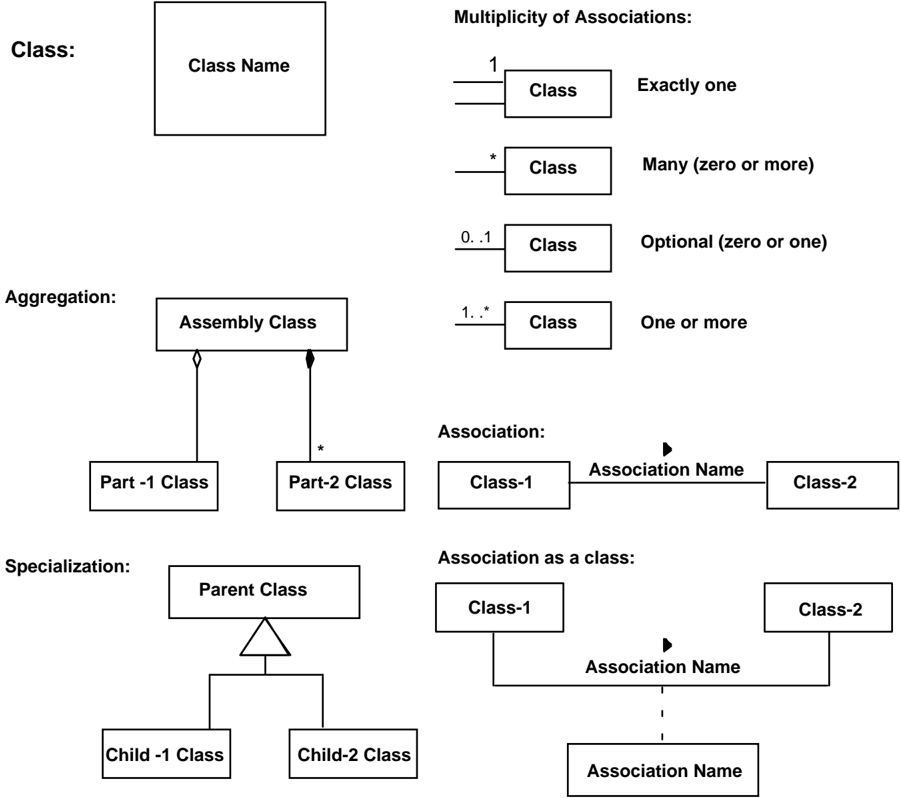

A Class is indicated by a rectangle containing the Class name. The UML representation of a class is a three-compartment rectangle with name in the top compartment attributes in the second compartment and methods in the lowest compartment. In this document the attributes and operations compartments are always empty and UML states empty compartments can be suppressed.

## CCSDS HISTORICAL DOCUMENT

## CCSDS RECOMMENDATION FOR AN OAIS REFERENCE MODEL

Classes of objects are related to one another through Associations and there are various multiplicities that may be attached to these associations as shown. The multiplicity refers to the number of instances, or objects, of that class that are involved in the relationship.

A solid line connecting two classes indicates the general association, among two classes. The line is labeled with an association name, indicating the nature of the association, and a solid arrowhead indicating the direction that the relationship should be read. The multiplicity of each class is shown next to the class near the association line. If the association forms a class that may have its own attributes or methods, that association class is shown as a rectangle connected to the solid line by a dashed line. The multiplicity may be omitted if the association is 1 to 1.

There are two particular associations that are commonly used, aggregation and specialization, and these have particular symbols to indicate them.

An Aggregation association is one where a class is considered to be a part of another class. In UML, a diamond connecting the aggregation association to the aggregated class shows association. There are two types of aggregation defined by UML. Strong aggregation, where the part classes are physically stored as part of the aggregated class, is shown with a solid diamond. In a strong aggregation, if the aggregated class is destroyed, the child classes are also destroyed. Weak aggregation, where the part classes are referred to by the aggregated class, is shown with an empty diamond. In a weak aggregation, if the aggregated class is destroyed, the part classes are not destroyed and may be aggregated into other new classes. Strong aggregation can be thought of as aggregation by value, while weak aggregation can be thought of as aggregation by reference. In figure C-1 , the aggregation association says that the Assembly class contains exactly one Part-1 class instance and zero or more Part-2 class instances. Also if an instance Assembly is destroyed the Part -1 instance will continue to exist but all the Part-2 instances will be destroyed.

C-1 A Specialization association is one where a child class inherits attributes and methods from the parent class. In UML, a broad triangle connecting the aggregation association to the parent class shows specialization. An instance of a child class contains all the attributes and methods contained by its parent class, so an instance of the child class can be used is any operation where an instance of the parent class would be valid. However, the child class may add any number of new attributes or methods so an instance of a parent class is not necessarily a valid replacement for the child class. In figure , the specialization association says that the Parent class attributes and methods are inherited by the Child-1 class and the Child-2 class.

## ANNEX D

## INFORMATIVE REFERENCES

(This annex is not part of the Recommendation.)

- [1] Procedures Manual for the Consultative Committee for Space Data Systems . CCSDS A00.0-Y-7.4. Yellow Book. Issue 7.4 (interim update). Washington, D.C.: CCSDS, January 2001.
- [2] Preserving Digital Information: Report of the Task Force on Archiving of Digital Information . Washington, D.C.: Commission on Preservation and Access, May 1996. &lt;http://www.rlg.org/ArchTF/&gt;
- [3] Unified Modeling Language . Version 1.1. Cupertino, CA: Rational Software Corporation, September 1, 1997. &lt;http://www.rational.com/uml/resources&gt;
- [4] Z39.50 Profile for Access to Digital Collections . Draft 7. Washington, D.C.: Library of Congress, May 1996. &lt;http://lcweb.loc.gov/z3950/agency/profiles/collections.html&gt;
- [5] IEEE Guide to the POSIX® Open System Environment (OSE) . IEEE 1003.0-1995. Piscataway, NJ: IEEE, February 1995.
- [6] IEEE Storage System Standards Working Group. Reference Model for Open Storage Systems Interconnection-Mass Storage System Reference Model Version 5 . New York: IEEE, September 1994. &lt;http://www.ssswg.org/public\_documents.html&gt;
- [7] Department of Defense Technical Architecture Framework for Information Management . Vol. 2, Technical Reference Model . Version 2. Arlington, VA: DISA, 1994.
- [8] Standard Formatted Data Units-Structure and Construction Rules . Recommendation for Space Data System Standards, CCSDS 620.0-B-2. Blue Book. Issue 2. Washington, D.C.: CCSDS, May 1992.
- [10] The Data Description Language EAST Specification (CCSD0010) . Recommendation for Space Data System Standards, CCSDS 644.0-B-2. Blue Book. Issue 2. Washington, D.C.: CCSDS, November 2000.
- [11] Data Entity Dictionary Specification Language (DEDSL)-Abstract Syntax (CCSD0011) . Recommendation for Space Data System Standards, CCSDS 647.1-B-1. Blue Book. Issue 1. Washington, D.C.: CCSDS, June 2001.
- [12] Data Entity Dictionary Specification Language (DEDSL)-PVL Syntax (CCSD0012) . Recommendation for Space Data System Standards, CCSDS 647.2-B-1. Blue Book. Issue 1. Washington, D.C.: CCSDS, June 2001.

- [13] Information Processing-Volume and File Structure of CD-ROM for Information Interchange . ISO 9660:1988.

## ANNEX E

## A MODEL FOR SOFTWARE USE IN REPRESENTATION INFORMATION

(This annex is not part of the Recommendation.)

Subsection 4.2 and section 5 discussed that software is often used to end the Representation Network. A way to view this information is as a layered Information Model as shown figure E-1. In this model there are five layers of software. Each of these layers has well-defined interfaces to the higher layers of the model. These interfaces are known as Application Program Interfaces or Service Access Points in other layered models. The following is an overview of the functionality of each layer and the data that is exchanged at each interface. This overview illustrates the process of getting bits from the media and adding Representation Information needed to make the information usable by the Consumer.

Figure E-1: Layered Information Model

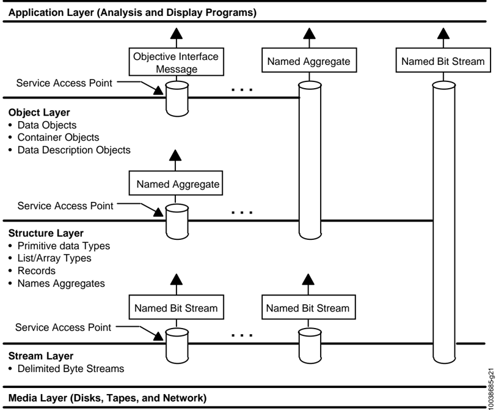

- -The Media Layer simply models the fact that the bit strings are stored on physical or communications media as magnetic domains or as voltages. The function of this

## CCSDS RECOMMENDATION FOR AN OAIS REFERENCE MODEL CCSDS HISTORICAL DOCUMENT

layer is to convert that bit representation to the bit representation that can be used in higher level (i.e., 1 and 0). This layer has as single interface, which enable higher layers to specify the location and size of the bitstream of interest and receive the bits as a string of 1 and 0 bits. In modern computing systems device drivers and chips built into the physical storage interface provide much of this functionality.

- -The Stream Layer hides the unique characteristics of the transport medium by stripping any artifacts of the storage or transmission process (such as packet formats, block sizes, inter-record gaps, and error-correction codes) and provides the higher levels with a consistent view of data that is independent of its medium. The interface between the Stream Layer and higher layers allows the higher layers to request Data Blocks by name and receive a bit/byte string representing those Data Blocks. The term name here means any unique key for locating the data stream of interest. Examples include path names for files or message identifiers for telecommunication messages. In modern computing systems, operating system file systems often provide this layer of functionality.
- -The Structure Layer converts the bit/byte streams from the Stream Layer interface into addressable structures of primitive data types that can be recognized and operated by computer processors and operating systems. For any implementation, the structure layer defines the primitive data types and aggregations that are recognized. This usually means at least characters and integer and real numbers. The aggregation types typically supported, include a record (i.e., a structure that can hold more than one data type) and an array (where each element consists of the same data type). Issues relating to the representation of primitive data types are resolved in this layer. The interface from the Structure Layer to higher levels allows the higher levels to request labeled aggregations of primitive data types and receive them in a structured form that may be internally addressable. In modern computing systems programming language compilers and interpreters generally provides this layer of functionality.
- -The Object Layer, which converts the labeled aggregates of primitive data types into information, represented as objects that are recognizable and meaningful in the application domain. In the scientific domain, this includes objects such as images, spectra, and histograms. The object layer adds semantic meaning to the data treated by the lower layers of the model. Some specific functions of this layer include the following:
- Defines data types based on information content rather than on the representation of those data at the structure layer. For example, many different kinds of objects-images, maps, and tables-can be implemented at the structure level using arrays or records. Within the object layer, images, maps, and tables are recognized and treated as distinct types of information.
- Presents applications with a consistent interface to similar kinds of information objects, regardless of their underlying representations. The interface defines the operations that can be performed on the object, the inputs required for each operation and the output data types from each.

## CCSDS HISTORICAL DOCUMENT

## CCSDS RECOMMENDATION FOR AN OAIS REFERENCE MODEL

- Provides a mechanism to identify the characteristics of objects that are visible to users, operations that may be applied to an object, and the relationships between objects.

The Interface between the Object Layer and the Application Layer allows the higher levels to specify the operation that is to be applied to an object, the parameters needed for that operation and the form in which results of the operations will be returned in. One special interface allows the user to discover the semantics of the objects such as operations available, and relationships to other objects. In modern computing systems subroutine libraries or object repositories and interfaces supply this functionality.

- -The Application Layer contains customized programs to analyze the Data Objects and present the analysis or the data object in a form that a Data Consumer can understand. In modern computing systems application programs supply this functionality.

The problem with using software to end Representation Networks is that the programs that are saved do not include the information needed to enable the lower levels of the layered model to extract the information from the bits on the media. These services are usually provided by the vendor-supplied operating systems, device drivers, and file systems. When data is moved to other media or different software platforms, the interfaces to these levels may be changed. This migration process is further discussed in section 5 of this document.

## ANNEX F

## COMPOSITE FUNCTIONAL VIEW

Figure F-1 is a composite of figures 4-2 through 4-7. It is provided to demonstrate consistency among the individual figures. The reader is cautioned not to assume that this is a recommended design or implementation. It should be useful for discussing concepts and comparing systems.

Figure F-1: Composite of Functional Entities

CCSDS HISTORICAL DOCUMENT