## CCSDS Historical Document

This document's Historical status indicates that it is no longer current. It has either been replaced by a newer issue or withdrawn because it was deemed  obsolete.  Current  CCSDS  publications are  maintained  at the following location:

http://public.ccsds.org/publications/

## Recommendation for Space Data System Practices

## REFERENCE MODEL FOR AN OPEN ARCHIVAL INFORMATION SYSTEM (OAIS)

## RECOMMENDED PRACTICE CCSDS 650.0-M-2

MAGENTA BOOK June 2012

## Recommendation for Space Data System Practices

## REFERENCE MODEL FOR AN OPEN ARCHIVAL INFORMATION SYSTEM (OAIS)

## RECOMMENDED PRACTICE CCSDS 650.0-M-2

## MAGENTA BOOK June 2012

## CCSDS RECOMMENDED PRACTICE FOR AN OAIS REFERENCE MODEL CCSDS HISTORICAL DOCUMENT

## AUTHORITY

Issue:

Recommended Practice, Issue 2

Date:

June 2012

Location:

Washington, DC, USA

This  document  has  been  approved  for  publication  by  the  Management  Council  of  the Consultative  Committee  for  Space  Data  Systems  (CCSDS)  and  represents  the  consensus technical  agreement  of  the  participating  CCSDS  Member  Agencies.    The  procedure  for review and authorization of CCSDS documents is detailed in Organization and Processes for the Consultative Committee for Space Data Systems (CCSDS A02.1-Y-3), and the record of Agency participation in the authorization of this document can be obtained from the CCSDS Secretariat at the address below.

This document is published and maintained by:

CCSDS Secretariat Space Communications and Navigation Office, 7L70 Space Operations Mission Directorate NASA Headquarters Washington, DC 20546-0001, USA

## CCSDS HISTORICAL DOCUMENT

## CCSDS RECOMMENDED PRACTICE FOR AN OAIS REFERENCE MODEL

## STATEMENT OF INTENT

The Consultative Committee for Space Data Systems (CCSDS) is an organization officially established by the management of its members. The Committee meets periodically to address data systems problems that are common to all participants, and to formulate sound technical solutions  to  these  problems.  Inasmuch  as  participation  in  the  CCSDS  is  completely voluntary,  the  results  of  Committee  actions  are  termed Recommendations and  are  not  in themselves considered binding on any Agency.

CCSDS Recommendations take two forms: Recommended Standards that are prescriptive and are the formal vehicles by which CCSDS Agencies create the standards that specify how elements  of  their  space  mission  support  infrastructure  shall  operate  and  interoperate  with others; and Recommended Practices that are more descriptive in nature and are intended to provide general guidance about how to approach a particular problem associated with space mission support. This Recommended Practice is issued by, and represents the consensus of, the  CCSDS members.  Endorsement of this Recommended Practice is  entirely  voluntary and  does  not  imply  a  commitment  by  any  Agency  or  organization  to  implement  its recommendations in a prescriptive sense.

No  later  than  five  years  from  its  date  of  issuance,  this Recommended  Practice will  be reviewed by the CCSDS to determine whether it should: (1) remain in effect without change; (2)  be  changed  to  reflect  the  impact  of  new  technologies,  new  requirements,  or  new directions; or (3) be retired or canceled.

In  those  instances  when  a  new  version  of  a Recommended  Practice is  issued,  existing CCSDS-related member Practices and implementations are not negated or deemed to be nonCCSDS compatible. It is the responsibility of each member to determine when such Practices or implementations are to be modified.  Each member is, however, strongly encouraged to direct  planning  for  its  new  Practices  and  implementations  towards  the  later  version  of  the Recommended Practice.

## CCSDS RECOMMENDED PRACTICE FOR AN OAIS REFERENCE MODEL

## FOREWORD

This  document  is  a  technical  Recommended  Practice  for  use  in  developing  a  broader consensus on what is required for an archive to provide permanent, or indefinite Long Term, preservation of digital information.

This Recommended Practice establishes a common framework of terms and concepts which make  up  an  Open  Archival  Information  System  (OAIS).    It  allows  existing  and  future archives to be more meaningfully compared and contrasted.  It provides a basis for further standardization within an archival context and it should promote greater vendor awareness of, and support of, archival requirements.

CCSDS  has  changed  the  classification  of  Reference  Models  from  Blue  (Recommended Standard) to Magenta (Recommended Practice).

Through  the  process  of  normal  evolution,  it  is  expected  that  expansion,  deletion,  or modification of this document may occur.  This Recommended Practice is therefore subject to CCSDS document management and change control procedures, which are defined in the Procedures  Manual  for  the  Consultative  Committee  for  Space  Data  Systems .    Current versions of CCSDS documents are maintained at the CCSDS Web site:

## http://www.ccsds.org/

Questions  relating  to  the  contents  or  status  of  this  document  should  be  addressed  to  the CCSDS Secretariat at the address indicated on page i.

## CCSDS RECOMMENDED PRACTICE FOR AN OAIS REFERENCE MODEL CCSDS HISTORICAL DOCUMENT

At time of publication, the active Member and Observer Agencies of the CCSDS were:

## Member Agencies

- -Agenzia Spaziale Italiana (ASI)/Italy.
- -Canadian Space Agency (CSA)/Canada.
- -Centre National d'Etudes Spatiales (CNES)/France.
- -China National Space Administration (CNSA)/People's Republic of China.
- -Deutsches Zentrum für Luft- und Raumfahrt e.V. (DLR)/Germany.
- -European Space Agency (ESA)/Europe.
- -Federal Space Agency (FSA)/Russian Federation.
- -Instituto Nacional de Pesquisas Espaciais (INPE)/Brazil.
- -Japan Aerospace Exploration Agency (JAXA)/Japan.
- -National Aeronautics and Space Administration (NASA)/USA.
- -UK Space Agency/United Kingdom.

## Observer Agencies

- -Austrian Space Agency (ASA)/Austria.
- -Belgian Federal Science Policy Office (BFSPO)/Belgium.
- -Central Research Institute of Machine Building (TsNIIMash)/Russian Federation.
- -China Satellite Launch and Tracking Control General, Beijing Institute of Tracking and Telecommunications Technology (CLTC/BITTT)/China.
- -Chinese Academy of Sciences (CAS)/China.
- -Chinese Academy of Space Technology (CAST)/China.
- -Commonwealth Scientific and Industrial Research Organization (CSIRO)/Australia.
- -CSIR Satellite Applications Centre (CSIR)/Republic of South Africa.
- -Danish National Space Center (DNSC)/Denmark.
- -Departamento de Ciência e Tecnologia Aeroespacial (DCTA)/Brazil.
- -European Organization for the Exploitation of Meteorological Satellites (EUMETSAT)/Europe.
- -European Telecommunications Satellite Organization (EUTELSAT)/Europe.
- -Geo-Informatics and Space Technology Development Agency (GISTDA)/Thailand.
- -Hellenic National Space Committee (HNSC)/Greece.
- -Indian Space Research Organization (ISRO)/India.
- -Institute of Space Research (IKI)/Russian Federation.
- -KFKI Research Institute for Particle &amp; Nuclear Physics (KFKI)/Hungary.
- -Korea Aerospace Research Institute (KARI)/Korea.
- -Ministry of Communications (MOC)/Israel.
- -National Institute of Information and Communications Technology (NICT)/Japan.
- -National Oceanic and Atmospheric Administration (NOAA)/USA.
- -National Space Agency of the Republic of Kazakhstan (NSARK)/Kazakhstan.
- -National Space Organization (NSPO)/Chinese Taipei.
- -Naval Center for Space Technology (NCST)/USA.
- -Scientific and Technological Research Council of Turkey (TUBITAK)/Turkey.
- -Space and Upper Atmosphere Research Commission (SUPARCO)/Pakistan.
- -Swedish Space Corporation (SSC)/Sweden.
- -United States Geological Survey (USGS)/USA.

## DOCUMENT CONTROL

| Document        | Title                                                                                         | Date         | Status                                                                       |
|-----------------|-----------------------------------------------------------------------------------------------|--------------|------------------------------------------------------------------------------|
| CCSDS 650.0-B-1 | Reference Model for an Open Archival Information System (OAIS)                                | January 2002 | Original issue (superseded)                                                  |
| CCSDS 650.0-M-2 | Reference Model for an Open Archival Information System (OAIS), Recommended Practice, Issue 2 | June 2012    | Current issue: - updates document based on input from user community (note). |

- NOTE  This  issue  includes:  clarifications  to  many  concepts,  in  particular  Authenticity with the concept of Transformational Information Property introduced; corrections and improvements in diagrams; addition of Access Rights Information  to  PDI.  Annex  A  from  the  previous  issue,  describing  existing archives,  has  been  removed.  A  security  annex  has  been  added  as  required  by CCSDS. Substantive changes are indicated by change bars in the inside margin.

## CCSDS HISTORICAL DOCUMENT

## CCSDS RECOMMENDED PRACTICE FOR AN OAIS REFERENCE MODEL

## CONTENTS

| Section                                                                                                                                                       | Section                                                                                                                                                                                 | Page                                                                                                                                                                                    |
|---------------------------------------------------------------------------------------------------------------------------------------------------------------|-----------------------------------------------------------------------------------------------------------------------------------------------------------------------------------------|-----------------------------------------------------------------------------------------------------------------------------------------------------------------------------------------|
| 1 INTRODUCTION ..........................................................................................................                                     | 1 INTRODUCTION ..........................................................................................................                                                               | 1-1                                                                                                                                                                                     |
| 1.1                                                                                                                                                           | PURPOSE AND SCOPE........................................................................................                                                                               | 1-1                                                                                                                                                                                     |
|                                                                                                                                                               | 1.2 APPLICABILITY...................................................................................................                                                                    | 1-2                                                                                                                                                                                     |
|                                                                                                                                                               | 1.3 RATIONALE..........................................................................................................                                                                 | 1-3                                                                                                                                                                                     |
|                                                                                                                                                               | 1.4 CONFORMANCE..................................................................................................                                                                       | 1-3                                                                                                                                                                                     |
|                                                                                                                                                               | 1.5 ROAD MAP FOR DEVELOPMENT OF RELATED STANDARDS..................                                                                                                                     | 1-4                                                                                                                                                                                     |
|                                                                                                                                                               | 1.6 DOCUMENT STRUCTURE .................................................................................                                                                                | 1-5                                                                                                                                                                                     |
|                                                                                                                                                               | 1.7 DEFINITIONS........................................................................................................                                                                 | 1-7                                                                                                                                                                                     |
| 2                                                                                                                                                             | OAIS CONCEPTS ......................................................................................................... 2-1                                                             | OAIS CONCEPTS ......................................................................................................... 2-1                                                             |
|                                                                                                                                                               | 2.1 OAIS ENVIRONMENT.........................................................................................                                                                           | 2-2                                                                                                                                                                                     |
|                                                                                                                                                               | 2.2 OAIS                                                                                                                                                                                | INFORMATION.......................................................................................... 2-3                                                                               |
|                                                                                                                                                               | 2.3 OAIS HIGH-LEVEL EXTERNAL                                                                                                                                                            | INTERACTIONS.......................................... 2-8                                                                                                                              |
| 3                                                                                                                                                             | OAIS RESPONSIBILITIES .........................................................................................                                                                         | 3-1                                                                                                                                                                                     |
|                                                                                                                                                               | 3.1 MANDATORY RESPONSIBILITIES                                                                                                                                                          | .................................................................. 3-1                                                                                                                  |
|                                                                                                                                                               | 3.2 EXAMPLE MECHANISMS FOR DISCHARGING RESPONSIBILITIES.........                                                                                                                        | 3-1                                                                                                                                                                                     |
| 4                                                                                                                                                             | DETAILED MODELS .................................................................................................. 4-1                                                                  | DETAILED MODELS .................................................................................................. 4-1                                                                  |
|                                                                                                                                                               | 4.1 FUNCTIONAL                                                                                                                                                                          | MODEL........................................................................................ 4-1                                                                                       |
|                                                                                                                                                               | 4.2 INFORMATION                                                                                                                                                                         | MODEL................................................................................... 4-20                                                                                           |
| 5                                                                                                                                                             | 4.3 INFORMATION PACKAGE TRANSFORMATIONS.......................................                                                                                                          | 4-50                                                                                                                                                                                    |
|                                                                                                                                                               | PRESERVATION PERSPECTIVES ...........................................................................                                                                                   | 5-1                                                                                                                                                                                     |
|                                                                                                                                                               | 5.2 PRESERVATION OF ACCESS AND USE SERVICES.................................... 5-10 INTEROPERABILITY ............................................................................. 6-1 | 5.2 PRESERVATION OF ACCESS AND USE SERVICES.................................... 5-10 INTEROPERABILITY ............................................................................. 6-1 |
| 6                                                                                                                                                             | 6.1                                                                                                                                                                                     |                                                                                                                                                                                         |
|                                                                                                                                                               | MANAGEMENT ISSUES WITH FEDERATED ARCHIVES.............................                                                                                                                  |                                                                                                                                                                                         |
|                                                                                                                                                               | ARCHIVE                                                                                                                                                                                 | ARCHIVE                                                                                                                                                                                 |
|                                                                                                                                                               | TECHNICAL LEVELS OF INTERACTION BETWEEN OAIS ARCHIVES.....                                                                                                                              | 6-2                                                                                                                                                                                     |
|                                                                                                                                                               | 6.2                                                                                                                                                                                     | 6-8                                                                                                                                                                                     |
| ANNEX A COMPOSITE FUNCTIONAL VIEW (NORMATIVE) ...........................                                                                                     | ANNEX A COMPOSITE FUNCTIONAL VIEW (NORMATIVE) ...........................                                                                                                               | A-1                                                                                                                                                                                     |
| ANNEX B RELATIONSHIP WITH OTHER STANDARDS OR EFFORTS (INFORMATIVE) .......................................................................................... | ANNEX B RELATIONSHIP WITH OTHER STANDARDS OR EFFORTS (INFORMATIVE) ..........................................................................................                           | B-1                                                                                                                                                                                     |

## CCSDS RECOMMENDED PRACTICE FOR AN OAIS REFERENCE MODEL CCSDS HISTORICAL DOCUMENT

## CONTENTS (continued)

| Section                                                                                                                                                            | Section                                                                                                                                                            | Page                                                                                     |
|--------------------------------------------------------------------------------------------------------------------------------------------------------------------|--------------------------------------------------------------------------------------------------------------------------------------------------------------------|------------------------------------------------------------------------------------------|
| ANNEX C BRIEF GUIDE TO THE UNIFIED MODELING LANGUAGE (UML) (INFORMATIVE) ......................................................................................... | ANNEX C BRIEF GUIDE TO THE UNIFIED MODELING LANGUAGE (UML) (INFORMATIVE) ......................................................................................... | C-1                                                                                      |
| ANNEX D INFORMATIVE REFERENCES (INFORMATIVE) ..............................                                                                                        | ANNEX D INFORMATIVE REFERENCES (INFORMATIVE) ..............................                                                                                        | D-1                                                                                      |
| ANNEX E A MODELFORSOFTWAREUSE IN REPRESENTATION INFORMATION (INFORMATIVE) ...........................................................                              | ANNEX E A MODELFORSOFTWAREUSE IN REPRESENTATION INFORMATION (INFORMATIVE) ...........................................................                              | E-1                                                                                      |
| ANNEX F SECURITY CONSIDERATIONS (INFORMATIVE) ..............................                                                                                       | ANNEX F SECURITY CONSIDERATIONS (INFORMATIVE) ..............................                                                                                       | F-1                                                                                      |
| Figure                                                                                                                                                             | Figure                                                                                                                                                             | Figure                                                                                   |
| 2-1                                                                                                                                                                | Environment Model of an OAIS...................................................................................                                                    | 2-2                                                                                      |
| 2-2                                                                                                                                                                | Obtaining Information from Data.................................................................................                                                   | 2-4                                                                                      |
| 2-3                                                                                                                                                                | Information Package Concepts and Relationships .......................................................                                                             | 2-6                                                                                      |
| 2-4                                                                                                                                                                | OAIS Archive External Data........................................................................................                                                 | 2-8                                                                                      |
| 4-1                                                                                                                                                                | OAIS Functional Entities..............................................................................................                                             | 4-1                                                                                      |
| 4-2                                                                                                                                                                | Functions of the Ingest Functional Entity.....................................................................                                                     | 4-5                                                                                      |
| 4-3                                                                                                                                                                | Functions of the Archival Storage Functional Entity                                                                                                                | ................................................... 4-8                                  |
| 4-4                                                                                                                                                                | Functions of the Data Management Functional Entity...............................................                                                                  | 4-10                                                                                     |
| 4-5                                                                                                                                                                | Functions of the Administration Functional Entity ....................................................                                                             | 4-11                                                                                     |
| 4-6                                                                                                                                                                | Functions of the Preservation Planning Functional Entity .........................................                                                                 | 4-14                                                                                     |
| 4-7                                                                                                                                                                | Functions of the Access Functional Entity .................................................................                                                        | 4-16                                                                                     |
| 4-8                                                                                                                                                                | OAIS Data Flow Diagram ..........................................................................................                                                  | 4-18                                                                                     |
| 4-9                                                                                                                                                                | Administration Context Diagram ...............................................................................                                                     | 4-19                                                                                     |
| 4-10                                                                                                                                                               | Information Object......................................................................................................                                           | 4-21                                                                                     |
| 4-11                                                                                                                                                               | Representation Information Object.............................................................................                                                     | 4-23                                                                                     |
| 4-12                                                                                                                                                               | Information Object Taxonomy                                                                                                                                        | ................................................................................... 4-26 |
| 4-13                                                                                                                                                               | Information Package Contents....................................................................................                                                   | 4-34                                                                                     |
| 4-14                                                                                                                                                               | Information Package Taxonomy.................................................................................                                                      | 4-35                                                                                     |
| 4-15                                                                                                                                                               | Archival Information Package (AIP)..........................................................................                                                       | 4-37                                                                                     |
| 4-16                                                                                                                                                               | Preservation Description Information.........................................................................                                                      | 4-38                                                                                     |
| 4-17                                                                                                                                                               | Package Description ...................................................................................................                                            | 4-39                                                                                     |
| 4-18                                                                                                                                                               | Archival Information Package (Detailed View).........................................................                                                              | 4-40                                                                                     |
| 4-19                                                                                                                                                               | Archival Specialization of the AIP.............................................................................                                                    | 4-41                                                                                     |
| 4-20                                                                                                                                                               | Archival Specialization of the Package......................................................................                                                       | 4-42                                                                                     |
| 4-21                                                                                                                                                               | Archival Information Unit (AIU) ...............................................................................                                                    | 4-43                                                                                     |
| 4-22                                                                                                                                                               | Unit Description..........................................................................................................                                         | 4-44                                                                                     |
| 4-23                                                                                                                                                               | Archive Information Collections Logical View .........................................................                                                             | 4-46                                                                                     |
| 4-24                                                                                                                                                               | Collection Description................................................................................................                                             | 4-47                                                                                     |
| 4-25                                                                                                                                                               | Data Management Information...................................................................................                                                     | 4-50                                                                                     |
| 4-26                                                                                                                                                               | High-Level Data Flows in an OAIS ...........................................................................                                                       | 4-51                                                                                     |
| 5-1                                                                                                                                                                | Conceptual View of Relationships among Names and AIP Components....................                                                                                | 5-3                                                                                      |
| 6-1                                                                                                                                                                | Cooperating Archives with Mutual Exchange Agreement...........................................                                                                     | 6-3                                                                                      |

## CCSDS RECOMMENDED PRACTICE FOR AN OAIS REFERENCE MODEL

## CONTENTS (continued)

| Figure                                                                                          | Page                                                                                                              |
|-------------------------------------------------------------------------------------------------|-------------------------------------------------------------------------------------------------------------------|
| 6-2 Cooperating Archives with Standard Ingest and Access Methods............................... | 6-4                                                                                                               |
| 6-3 An OAIS Federation Employing a Common                                                       | Catalog .................................................. 6-5                                                    |
| 6-4 Archives with Shared Storage                                                                | ...................................................................................... 6-8                        |
| A-1 Composite of Functional Entities                                                            | ................................................................................ A-2                              |
| C-1 Key to                                                                                      | UML Relationships...........................................................................................C-1   |
| E-1 Layered Information                                                                         | Model..........................................................................................E-1                |
| Table                                                                                           | Table                                                                                                             |
| 4-1 Examples of                                                                                 | PDI......................................................................................................... 4-31 |

## 1 INTRODUCTION

## 1.1 PURPOSE AND SCOPE

The  purpose  of  this  document  is  to  define  the  CCSDS  and  International  Organization  for Standardization (ISO) Reference Model for an Open Archival Information System (OAIS). An  OAIS  is  an  Archive,  consisting  of  an  organization,  which  may  be  part  of  a  larger organization,  of  people  and  systems  that  has  accepted  the  responsibility  to  preserve information  and  make  it  available  for  a Designated  Community .    It  meets  a  set  of  such responsibilities  as  defined  in  this  document,  and  this  allows  an  OAIS  Archive  to  be distinguished from other uses of the term 'archive'.  The term 'Open' in OAIS is used to imply that this Recommendation, as well as future related Recommendations and standards, are  developed  in  open  forums,  and  it  does  not  imply  that  access  to  the  Archive  is unrestricted.

The information being maintained has been deemed to need Long Term Preservation , even if  the  OAIS itself is not permanent. Long Term is  long  enough to be concerned with the impacts of changing technologies, including support for new media and data formats, or with a changing user community.  Long Term may extend indefinitely.  In this reference model there is a particular focus on digital information, both as the primary forms of information held  and  as  supporting  information  for  both  digitally  and  physically  archived  materials. Therefore,  the  model  accommodates  information  that  is  inherently  non-digital  (e.g.,  a physical sample), but the modeling and preservation of such information is not addressed in detail.  This reference model:

- -provides  a  framework  for  the  understanding  and  increased  awareness  of  archival concepts needed for Long Term digital information preservation and access;
- -provides the concepts needed by non-archival organizations to be effective participants in the preservation process;
- -provides  a  framework,  including  terminology  and  concepts,  for  describing  and comparing architectures and operations of existing and future Archives;
- -provides a framework for describing and comparing different Long Term Preservation strategies and techniques;
- -provides a basis for comparing the data models of digital information preserved by Archives  and  for  discussing  how  data  models  and  the  underlying  information  may change over time;
- -provides  a  framework  that  may  be  expanded  by  other  efforts  to  cover  Long  Term Preservation  of  information  that  is  NOT  in  digital  form  (e.g.,  physical  media  and physical samples);
- -expands consensus on the elements and processes for Long Term digital information preservation and access, and promotes a larger market which vendors can support;
- -guides the identification and production of OAIS-related standards.

## CCSDS HISTORICAL DOCUMENT

## CCSDS RECOMMENDED PRACTICE FOR AN OAIS REFERENCE MODEL

The reference  model  addresses  a  full  range  of  archival  information  preservation  functions including  ingest,  archival  storage,  data  management,  access,  and  dissemination.    It  also addresses the migration of digital information to new media and forms, the data models used to  represent  the  information,  the  role  of  software  in  information  preservation,  and  the exchange  of  digital  information  among  Archives.    It  identifies  both  internal  and  external interfaces to the Archive functions, and it identifies a number of high-level services at these interfaces. It provides various illustrative examples and some 'best practice' recommendations.  It defines a minimal set of responsibilities for an Archive to be called an OAIS,  and  it  also  defines  a  maximal  Archive  to  provide  a  broad  set  of  useful  terms  and concepts.

## 1.2 APPLICABILITY

The  OAIS  model  in  this  document  may  be  applicable  to  any  Archive.    It  is  specifically applicable to organizations with the responsibility of making information available for the Long Term.  This includes organizations with other responsibilities, such as processing and distribution in response to programmatic needs.

This model is also of interest to those organizations and individuals who create information that may need Long Term Preservation and those that may need to acquire information from such Archives.

The model, including the functional and information modeling concepts, is relevant to the comparison and design of facilities which hold information, on a temporary basis, for two reasons:

- -When  taking  into  consideration  the  rapid  pace  of  technology  changes  or  possible changes in a Designated Community, there is the likelihood that facilities, thought to be holding information on a temporary basis, will in fact find that some or much of their information holdings will need Long Term Preservation attention.
- -Although some facilities holding information may themselves be temporary, some or all of their information may need to be preserved indefinitely.  Such facilities need to be active participants in the Long Term Preservation effort.

Standards developers are expected to use this model as a basis for further standardization in this  area.    A  large  number  of  related  standards  are  possible.    A  road  map  for  such development is briefly addressed in 1.5.

This  reference  model  does  not  specify  a  design  or  an  implementation.    Actual implementations may group or break out functionality differently.

## CCSDS RECOMMENDED PRACTICE FOR AN OAIS REFERENCE MODEL

## 1.3 RATIONALE

A tremendous growth in computational power, and in networking bandwidth and connectivity,  has  resulted  in  an  explosion  in  the  number  of  organizations  making  digital information available.  Transactions among all types of organizations are being conducted using digital forms that are taking the place of more traditional media such as paper.

Preserving information in digital forms is much more difficult than preserving information in forms such as paper and film.  This is not only a problem for traditional Archives, but also for  many  organizations  that  have  never  thought  of  themselves  as  performing  an  archival function.  Along  with  the  many  advantages  in  terms  of,  for  example,  searchability  and replication, the spread of digital technology in every field brings certain disadvantages.  The rapid obsolescence of digital technologies creates considerable technical dangers, particularly  a  much  greater  risk  than  in  the  past  of  losing  the  possibility  of  restoring, rendering or interpreting the information.  Ways of avoiding or reducing these dangers will be detailed throughout this Recommendation.  Nevertheless, it would be unwise to consider the  problem  from  a  solely  technical  standpoint.    There  are  also  organizational,  legal, industrial, scientific and cultural issues to be considered.  To ignore the problems raised by preserving information in digital forms would lead inevitably to the loss of this information.

It is expected that this reference model, by establishing minimum requirements for an OAIS Archive along with a set of archival concepts, will provide a common framework from which to  view  archival  challenges,  particularly  as  they  relate  to  digital  information.    This  should enable more organizations to understand the issues and take the proper steps to ensure Long Term information preservation.  It should also provide a basis for more standardization and, therefore, a larger market that vendors can support in meeting archival requirements.

## 1.4 CONFORMANCE

A  conforming  OAIS  Archive  implementation  shall  support  the  model  of  information described  in  2.2.    The  OAIS  Reference  Model  does  not  define  or  require  any  particular method of implementation of these concepts.

A conforming OAIS Archive shall fulfill the responsibilities listed in 3.1.  Subsection 3.2 provides  examples  of  the  mechanisms  that  may  be  used  to  discharge  the  responsibilities identified in 3.1.  These mechanisms are not required for conformance. A separate standard, as noted in 1.5, has been produced on which accreditation and certification processes can be built.

## A conformant OAIS Archive may provide to users additional services that are beyond those required of an OAIS .

It is assumed that implementers will use this reference model as a guide while developing a specific implementation to provide identified services and content.  This document does not assume  or  endorse  any  specific  computing  platform,  system  environment,  system  design paradigm, system development methodology, database management system, database design

## CCSDS RECOMMENDED PRACTICE FOR AN OAIS REFERENCE MODEL

paradigm,  data  definition  language,  command  language,  system  interface,  user  interface, technology, or media required for implementation.

The OAIS Reference Model is designed as a conceptual framework in which to discuss and compare Archives.  As such, it attempts to address all the major activities of an informationpreserving Archive in order to define a consistent and useful set of terms and concepts.  A standard  and  other  documents  that  claim  to  be  conformant  to  the  OAIS  Reference  Model shall use the terms and concepts defined in the OAIS Reference Model in the same manner.

## 1.5 ROAD MAP FOR DEVELOPMENT OF RELATED STANDARDS

This Reference Model serves to identify areas suitable for the development of OAIS-related standards.  Some of these standards may be developed by CCSDS; others may be developed by other standardization bodies.  However, any such work undertaken by other bodies should be coordinated in order to minimize incompatibilities and efforts.  Some areas for potential OAIS-related standards are listed below together with references to relevant standards and/or initiatives:

- -standard(s) for the interfaces between OAIS type Archives;
- -standard(s) for the submission (ingest) methodology used by an Archive:
- ISO 20652:2006 Space data and information transfer systems-Producer-Archive Interface-Methodology Abstract Standard (the more specific Producer-Archive Interface Specification (PAIS) is under preparation);
- -standard(s) for the submission (ingest) of digital data sources to the Archive;
- -standard(s) for the delivery of digital sources from the Archive;
- -standard(s)  for  the  submission  of  digital  metadata,  about  digital  or  physical  data sources, to the Archive:
- PREMIS  Data  Dictionary  for  Preservation  Metadata.  Version  2.0,  PREMIS Editorial Committee, March 2008;
- ISO 15889:2003 Space data and information transfer systems-Data Description Language-EAST Specification;
- ISO  21961:2003  Space  data  and  information  transfer  systems-Data  Entity Dictionary Specification Language (DEDSL)-Abstract syntax;
- ISO  21962:2003  Space  data  and  information  transfer  systems-Data  Entity Dictionary Specification Language (DEDSL)-PVL syntax;
- ISO  22643:2003  Space  data  and  information  transfer  systems-Data  Entity Dictionary Specification Language (DEDSL)-XML/DTD;
- ISO 13527:2010 Space data and information transfer systems-XML formatted data unit (XFDU) structure and construction rules;

## CCSDS RECOMMENDED PRACTICE FOR AN OAIS REFERENCE MODEL

- -syntax standard(s) for the identification of digital sources within the Archive;
- -protocol  standard(s)  to  search  and  retrieve  metadata  information  about  digital  and physical data sources;
- -standard(s)  for  media  access  allowing  replacement  of  media  management  systems without having to rewrite the media;
- -standard(s) for specific physical media;
- -standard(s) for the migration of information across media and formats;
- -standard(s) for recommended archival practices:
- ISO 15489-1:2001 Information and documentation-Records management. Part 1: General;
- ISO/TR  15489-2:2001  Information  and  documentation-Records  management. Part 2: Guidelines;
- ISO 23081-1:2006 Information and documentation-Records management processes-Metadata for records-Part 1: Principles;
- ISO/TS  23081-2:2007  Information  and  documentation-Records  management processes-Metadata for records-Part 2: Conceptual and implementation issues;
- -standard(s) for certification of Archives:
- CCSDS 652.0-M-1,  Audit and Certification of Trustworthy Digital Repositories (Magenta Book, Issue 1), also available as ISO 16363:2011

## 1.6 DOCUMENT STRUCTURE

## 1.6.1 HOW TO READ THIS DOCUMENT

All readers should read the Purpose and Scope (1.1), Applicability (1.2), and Conformance (1.4) subsections to obtain a view on the objectives and applicability of the document.

Those who want just an overview of the major concepts should also read OAIS Concepts (section 2) and OAIS Responsibilities (section 3).

Those who will implement OAIS Archives or administer them on a daily basis should read the entire document.

## 1.6.2 ORGANIZATION BY SECTION

Section  1  provides  purpose,  scope,  applicability,  and  definitions  sections  typical  of  many standards.    It  also  provides  rationale  for  the  effort,  conformance  requirements,  and  a  road map for development of related standards.

## CCSDS HISTORICAL DOCUMENT

## CCSDS RECOMMENDED PRACTICE FOR AN OAIS REFERENCE MODEL

Section  2  provides  a  high-level  overview  of  the  major  concepts  involved  in  an  OAIS Archive.  It provides a view of the environment of an OAIS Archive and the roles played by those who interact with it.  It discusses what is meant by 'information' and what is necessary to  preserve it  for  the  Long  Term.    It  contains  key  information  concepts  relevant  to  OAISconforming implementations.

Section  3  describes  the  responsibilities  required  of  an  OAIS.  Subsection  3.1  defines mandatory responsibilities  an  OAIS  Archive  must  discharge  in  preserving  its  information, and 3.2 provides clarifying material of the types of activities that may be needed in many Archives to discharge these responsibilities.

Section 4 provides model views needed for a detailed understanding of an OAIS Archive.  It breaks down the OAIS into a number of functional areas and it identifies some high-level services at the interfaces.  It also provides detailed data model views of information using Unified Modeling Language (UML) diagrams.

Section 5 provides some perspectives on the issues of information preservation using digital migration  across  media  and  across  new  formats  or  representations.    It  also  provides  some perspectives on the issues of preserving access services to digital information using software porting, wrapping, and emulation of hardware.

Section 6 is an introduction to the various alternatives for Archive-to-Archive associations to provide increased or more cost-effective services.

The annexes B-F are not part of the Recommendation and are provided for the convenience of the reader:

- -annex A provides a composite diagram of the detailed functional areas described in 4.1;
- -annex B relates parts of this reference model to other standards work;
- -annex C provides a brief tutorial on the Unified Modeling Language (UML);
- -annex D provides a list of informative references;
- -annex E provides a layered model of information;
- -annex F provides an overview of security considerations.

Except where indicated otherwise, diagrams show entities such as people or organisations as square  cornered  rectangles,  functions  or  functional  entities  as  rounded  rectangles  with information between them as arrows, and special information objects as ellipses.

## CCSDS RECOMMENDED PRACTICE FOR AN OAIS REFERENCE MODEL

## 1.7 DEFINITIONS

## 1.7.1 ACRONYMS AND ABBREVIATIONS

| AIC    | Archival Information Collection                    |
|--------|----------------------------------------------------|
| AIP    | Archival Information Package                       |
| AIU    | Archival Information Unit                          |
| API    | Application Programming Interface                  |
| ASCII  | American Standard Code for Information Interchange |
| CCSDS  | Consultative Committee for Space Data Systems      |
| CD-ROM | Compact Disk - Read Only Memory                    |
| CDO    | Content Data Object                                |
| CRC    | Cyclical Redundancy Check                          |
| DBMS   | Data Base Management System                        |
| DIP    | Dissemination Information Package                  |
| DRM    | Digital Rights Management                          |
| FITS   | Flexible Image Transport System                    |
| FTP    | File Transfer Protocol                             |
| HFMS   | Hierarchical File Management System                |
| IEEE   | Institute of Electrical and Electronic Engineers   |
| ISBN   | International Standard Book Number                 |
| ISO    | International Organization for Standardization     |
| MPEG   | Moving Picture Experts Group                       |
| OAIS   | Open Archival Information System                   |
| PDF    | Portable Document Format                           |
| PDI    | Preservation Description Information               |
| QA     | Quality Assurance                                  |
| SIP    | Submission Information Package                     |

## CCSDS RECOMMENDED PRACTICE FOR AN OAIS REFERENCE MODEL

| UML     | Unified Modeling Language   |
|---------|-----------------------------|
| UNICODE | Universal Code              |
| VHS     | Video Home System           |
| WWW     | World Wide Web              |
| XFDU    | XML Formatted Data unit     |
| XML     | eXtensible Markup Language  |

## 1.7.2 TERMINOLOGY

There are many terms which are used in this reference model and which need to have welldefined meanings. These terms are defined in this subsection.  When first used in the text, they are shown in bold and are capitalized.  Subsequent use employs capitalization only.

As this reference model is applicable to all disciplines and organizations that do, or expect to, preserve  and  provide  information  in  digital  form,  these  terms  cannot  match  all  of  those familiar to any particular discipline (e.g., traditional Archives, digital libraries, science data centers).    Rather,  the  approach  taken  is  to  use  terms  that  are  not  already  overloaded  with meaning so as to reduce conveying unintended meanings.  Therefore it is expected that all disciplines  and  organizations  will  find  that  they  need  to  map  some  of  their  more  familiar terms to those of the OAIS Reference Model.  This should not be difficult and is viewed as a contribution,  rather  than  a  deterrent,  to  the  success  of  the  reference  model.    For  example, archival science focuses on preservation of the 'record'.  This term is not used in the OAIS Reference Model, but one mapping might approximately equate it with 'Content Information within an Archival Information Package' (see definitions below, as well as 2.2 and 4.2 for context).  A few such mappings are provided in annex B.

Access  Functional  Entity : The  OAIS  functional  entity  that  contains  the  services  and functions  which  make  the  archival  information  holdings  and  related  services  visible  to Consumers.

Access Rights Information: The information that identifies the access restrictions pertaining to  the  Content  Information,  including  the  legal  framework,  licensing  terms,  and  access control.  It  contains  the  access  and  distribution  conditions  stated  within  the  Submission Agreement, related to both preservation (by the OAIS) and final usage (by the Consumer). It also includes the specifications for the application of rights enforcement measures.

Access  Aid :    A  software  program  or  document  that  allows  Consumers  to  locate,  analyze, order or retrieve information from an OAIS.

Access Collection : A collection of AIPs that is defined by a Collection Description but for which there is no Packaging Information for the collection in Archival Storage.

## CCSDS RECOMMENDED PRACTICE FOR AN OAIS REFERENCE MODEL

Access Software: A type of software that presents part of or all of the information content of an Information Object in forms understandable to humans or systems.

Adhoc Order : A request that is  generated  by  a  Consumer  for  information  the  OAIS  has indicated is currently available.

Administration Functional Entity : The OAIS functional entity that contains the services and functions needed to control the operation of the other OAIS functional entities on a dayto-day basis.

AIP Edition: An AIP whose Content Information or Preservation Description Information has been upgraded or improved with the intent not to preserve information, but to increase or improve it. An AIP edition is not considered to be the result of a Migration.

AIP Version: An AIP whose Content Information or Preservation Description Information has undergone a Transformation on a source AIP and is a candidate to replace the source AIP. An AIP version is considered to be the result of a Digital Migration.

Archival Information Collection (AIC) : An Archival Information Package whose Content Information is an aggregation of other Archival Information Packages.

Archival Information Package (AIP) :  An Information Package, consisting of the Content Information  and  the  associated  Preservation  Description  Information  (PDI),  which  is preserved within an OAIS.

Archival Information Unit (AIU) : An Archival Information Package where the Archive chooses  not  to  break  down  the  Content  Information  into  other  Archival  Information Packages.  An AIU can consist of multiple digital objects (e.g., multiple files).

Archival Storage Functional Entity : The OAIS functional entity that contains the services and functions used for the storage and retrieval of Archival Information Packages.

Archive : An  organization  that  intends  to  preserve  information  for  access  and  use  by  a Designated Community.

Associated Description :  The information describing the content of an Information Package from the point of view of a particular Access Aid.

Authenticity :  The  degree  to  which  a  person  (or  system)  regards  an  object  as  what  it  is purported to be. Authenticity is judged on the basis of evidence.

Collection  Description : A  type  of  Package  Description  that  is  specialized  to  provide information about an Archival Information Collection for use by Access Aids.

Common Services : The  supporting  services  such  as  inter-process  communication,  name services,  temporary  storage  allocation,  exception  handling,  security,  and  directory  services necessary to support the OAIS.

## CCSDS HISTORICAL DOCUMENT

## CCSDS RECOMMENDED PRACTICE FOR AN OAIS REFERENCE MODEL

Consumer : The role played by those persons, or client systems, who interact with OAIS services  to  find  preserved  information  of  interest  and  to  access  that  information  in  detail. This can include other OAISes, as well as internal OAIS persons or systems.

Content  Data  Object :    The  Data  Object,  that  together  with  associated  Representation Information, comprises the Content Information.

Content Information : A set of information that is the original target of preservation or that includes part or all of that information.  It is an Information Object composed of its Content Data Object and its Representation Information.

Context  Information : The  information  that  documents  the  relationships  of  the  Content Information to its environment.  This includes why the Content Information was created and how it relates to other Content Information objects.

Co-operating Archives: Those Archives that have Designated Communities with related interests.    They  may  order  and  ingest  data  from  each  other.    At  a  minimum,  Co-operating Archives must agree to support at least one common Submission Information Package (SIP) and Dissemination Information Package (DIP) for inter-Archive requests.

Data: A reinterpretable representation of information in a formalized manner suitable for communication, interpretation, or processing.  Examples of data include a sequence of bits, a table  of  numbers,  the  characters  on  a  page,  the  recording  of  sounds  made  by  a  person speaking, or a moon rock specimen.

Data Dictionary : A formal repository of terms used to describe data.

Data Dissemination Session : A delivery of media or a single telecommunications session that provides Data to a Consumer.  The Data Dissemination Session format/contents is based on a data model negotiated between the OAIS and the Consumer in the request agreement. This  data  model  identifies  the  logical  constructs  used  by  the  OAIS  and  how  they  are represented on each media delivery or in the telecommunication session.

Data  Management  Functional  Entity : The  OAIS  functional  entity  that  contains  the services  and  functions  for  populating,  maintaining,  and  accessing  a  wide  variety  of information.  Some examples of this information are catalogs and inventories on what may be retrieved from Archival Storage, processing algorithms that may be run on retrieved data, Consumer  access  statistics,  Consumer  billing,  Event  Based  Orders,  security  controls,  and OAIS schedules, policies, and procedures.

Data  Management  Data : The  data  created  and  stored  in  Data  Management  persistent storage that refer to operation of an Archive.  Some examples of this data are accounting data for Consumer billing and authorization, policy data, Event Based Order (subscription) data for  repeating  requests,  preservation  process  history data, and statistical data for generating reports to Archive management.

Data Object : Either a Physical Object or a Digital Object.

## CCSDS HISTORICAL DOCUMENT

## CCSDS RECOMMENDED PRACTICE FOR AN OAIS REFERENCE MODEL

Data Submission Session : A delivery of media or a single telecommunications session that provides Data to an OAIS.  The Data Submission Session format/contents is based on a data model negotiated between the OAIS and the Producer in the Submission Agreement.  This data  model  identifies  the  logical  constructs  used  by  the  Producer  and  how  they  are represented on each media delivery or in the telecommunication session.

Derived AIP: An AIP generated by extracting or aggregating information from one or more source AIPs.

Descriptive  Information : The  set of information, consisting primarily  of  Package Descriptions, which is provided to Data Management to support the finding, ordering, and retrieving of OAIS information holdings by Consumers.

Designated Community : An identified group of potential Consumers who should be able to understand a particular set of information.  The Designated Community may be composed of multiple  user  communities.  A  Designated  Community  is  defined  by  the  Archive  and  this definition may change over time.

Digital Migration : The transfer of digital information, while intending to preserve it, within the OAIS.  It is distinguished from transfers in general by three attributes:

- -a focus on the preservation of the full information content that needs preservation;
- -a perspective that the new  archival implementation of the information is a replacement for the old; and
- -an understanding that full control and responsibility over all aspects of the transfer resides with the OAIS.

Digital Object : An object composed of a set of bit sequences.

Dissemination Information Package (DIP) : An Information Package, derived from one or more AIPs, and sent by Archives to the Consumer in response to a request to the OAIS.

Event Based Order : A request that is generated by a Consumer for information that is to be delivered periodically on the basis of some event or events.

Federated  Archives: A  group  of  Archives  that  has  agreed to  provide  access  to  their holdings via one or more common finding aids.

Finding Aid : A type of Access Aid that allows a user to search for and identify Archival Information Packages of interest.

Fixity Information : The information which documents the mechanisms that ensure that the Content Information object has not been altered in an undocumented manner.  An example is a Cyclical Redundancy Check (CRC) code for a file.

## CCSDS RECOMMENDED PRACTICE FOR AN OAIS REFERENCE MODEL

Global  Community :    An  extended  Consumer  community,  in  the  context  of  Federated Archives, that accesses the holdings of several Archives via one or more common Finding Aids.

Independently  Understandable : A  characteristic of information  that is sufficiently complete to allow it to be interpreted, understood and used by the Designated Community without  having  to  resort  to  special  resources  not  widely  available,  including  named individuals.

Information : Any  type  of  knowledge  that  can  be  exchanged.    In  an  exchange,  it  is represented by data.  An example is a string of bits (the data) accompanied by a description of  how  to  interpret  the  string  of  bits  as  numbers  representing  temperature  observations measured in degrees Celsius (the Representation Information).

Information Object : A Data Object together with its Representation Information.

Information Package : A logical container composed of optional Content Information and optional associated Preservation Description Information. Associated with this Information Package is Packaging Information used to delimit and identify the Content Information and Package Description information used to facilitate searches for the Content Information.

Information Property: That part of the Content Information as described by the Information Property Description. The detailed expression, or value, of that part of the information content is  conveyed  by  the  appropriate  parts  of  the  Content  Data  Object  and  its  Representation Information.

Information  Property  Description :    The  description  of  the  Information  Property.  It  is  a description  of  a  part  of  the  information  content  of  a  Content  Information  object  that  is highlighted for a particular purpose.

Ingest  Functional  Entity : The  OAIS  functional  entity  that  contains  the  services  and functions  that  accept  Submission  Information  Packages  from  Producers,  prepares  Archival Information Packages for storage, and ensures that Archival Information Packages and their supporting Descriptive Information become established within the OAIS.

Knowledge Base :  A set of information, incorporated by a person or system, that allows that person or system to understand received information.

Local Community: The community which would be served by the Archive outside of the context of Federated Archives.

Long Term : A period of time long enough for there to be concern about the impacts of changing technologies, including support for new media and data formats, and of a changing Designated Community, on the information being held in an OAIS.  This period extends into the indefinite future.

## CCSDS HISTORICAL DOCUMENT

## CCSDS RECOMMENDED PRACTICE FOR AN OAIS REFERENCE MODEL

Long Term Preservation : The act of maintaining information, Independently Understandable by a Designated Community, and with evidence supporting its Authenticity, over the Long Term.

Management : The role played by those who set overall OAIS policy as one component in a broader policy domain, for example as part of a larger organization.

Member Description : An Associated Description that describes a member of a collection.

Metadata : Data about other data.

Non-Reversible  Transformation :  A  Transformation  which  cannot  be  guaranteed  to  be  a Reversible Transformation.

Open Archival Information System (OAIS) : An Archive, consisting of an organization, which  may  be  part  of  a  larger  organization,  of  people  and  systems,  that  has  accepted  the responsibility to preserve information and make it available for a Designated Community.  It meets a set of responsibilities, as defined in section 4, that allows an OAIS Archive to be distinguished from other uses of the term 'Archive'.  The term 'Open' in OAIS is used to imply  that  this  Recommendation  and  future  related  Recommendations  and  standards  are developed in open forums, and it does not imply that access to the Archive is unrestricted.

Order  Agreement : An  agreement  between  the  Archive  and  the  Consumer  in  which  the physical details of the delivery, such as media type and format of Data, are specified .

Ordering Aid : An application that assists the Consumer in discovering the cost of, and in ordering, AIPs of interest.

Other  Representation  Information: Representation  Information  which  cannot  easily  be classified  as  Semantic  or  Structural.  For  example  software,  algorithms,  encryption,  written instructions and many other things may be needed to understand the Content Data Object, all of  which  therefore  would  be,  by  definition,  Representation  Information,  yet  would  not obviously be either Structure or Semantics.  Information defining how the Structure and the Semantic  Information  relate  to  each  other,  or  software  needed  to  process  a  database  file would also be regarded as Other Representation Information.

Overview  Description : A  specialization  of  the  Collection  Description  that  describes  the collection as a whole.

Package Description :  The information intended for use by Access Aids.

Packaging Information : The information that is used to bind and identify the components of  an  Information  Package.    For  example,  it  may  be  the  ISO  9660  volume  and  directory information used on a CD-ROM to provide the content of several files containing Content Information and Preservation Description Information.

Physical  Object : An object (such as a moon rock, bio-specimen, microscope slide) with physically  observable  properties  that  represent  information  that  is  considered  suitable  for being adequately documented for preservation, distribution, and independent usage.

## CCSDS RECOMMENDED PRACTICE FOR AN OAIS REFERENCE MODEL

Preservation  Description  Information  (PDI ):    The information  which  is  necessary  for adequate  preservation of the  Content  Information  and  which  can  be  categorized  as Provenance, Reference, Fixity, Context, and Access Rights Information.

Preservation Planning Functional Entity : The OAIS functional entity which provides the services  and  functions  for  monitoring  the  environment  of  the  OAIS  and  which  provides recommendations and preservation plans to ensure that the information stored in the OAIS remains  accessible  to,  and  understandable  by,  and  sufficiently  usable  by,  the  Designated Community  over  the  Long  Term,  even  if  the  original  computing  environment  becomes obsolete.

Producer :  The role played by those persons or client systems that provide the information to be preserved.  This can include other OAISes or internal OAIS persons or systems.

Provenance  Information : The  information  that  documents  the  history  of  the  Content Information.    This  information  tells  the  origin  or  source  of  the  Content  Information,  any changes that may have taken place since it was originated, and who has had custody of it since it was originated.  The Archive is responsible for creating and preserving Provenance Information  from  the  point  of  Ingest;  however,  earlier  Provenance  Information  should  be provided  by  the  Producer.  Provenance  Information  adds  to  the  evidence  to  support Authenticity.

Reference  Information : The  information  that  is  used  as  an  identifier  for  the  Content Information.  It also includes identifiers that allow outside systems to refer unambiguously to a particular Content Information.  An example of Reference Information is an ISBN.

Reference  Model : A  framework  for  understanding  significant  relationships  among  the entities of some  environment, and for the development of consistent standards or specifications supporting that environment.  A reference model is based on a small number of unifying concepts and may be used as a basis for education and explaining standards to a non-specialist.

Refreshment : A Digital Migration where the effect is to replace a media instance with a copy that is sufficiently exact that all Archival Storage hardware and software continues to run as before.

Repackaging : A  Digital  Migration  in  which  there  is  an  alteration  in  the  Packaging Information of the AIP.

Replication : A Digital Migration where there is no change to the Packaging Information, the Content Information, and the PDI.  The bits used to represent these Information Objects are preserved in the transfer to the same or new media instance.

Representation  Information : The  information  that  maps  a  Data  Object  into  more meaningful concepts.   An example of Representation Information for a bit sequence which is a  FITS file  might  consist  of  the  FITS  standard  which  defines  the  format  plus  a  dictionary which  defines  the  meaning  in  the  file  of  keywords  which  are  not  part  of  the  standard.

## CCSDS RECOMMENDED PRACTICE FOR AN OAIS REFERENCE MODEL

Another example is JPEG software which is used to render a JPEG file; rendering the JPEG file  as  bits  is  not  very  meaningful  to  humans  but  the  software,  which  embodies  an understanding of the JPEG standard, maps the bits into pixels which can then be rendered as an image for human viewing.

Representation  Network : The set  of  Representation  Information  that  fully  describes  the meaning  of  a  Data  Object.    Representation  Information  in  digital  forms  needs  additional Representation Information so its digital forms can be understood over the Long Term.

Representation  Rendering  Software: A  type  of  software  that  displays  Representation Information of an Information Object in forms understandable to humans.

Retrieval  Aid :    An  application  that  allows  authorized  users  to  retrieve  the  Content Information and PDI described by the Package Description.

Reversible Transformation :  A  Transformation  in  which  the  new  representation  defines  a set (or a subset) of resulting entities that are equivalent to the resulting entities defined by the original representation.  This means that there is a one-to-one mapping back to the original representation and its set of base entities.

Search  Session : A  session  initiated  by  the  Consumer  with  the  Archive  during  which  the Consumer will use the Archive Finding Aids to identify and investigate potential holdings of interest.

Semantic Information: The Representation Information that further describes the meaning beyond that provided by the Structure Information.

Structure Information : The Representation Information that imparts meaning about how other information is organized.  For example, it maps bit streams to common computer types such as characters,  numbers,  and  pixels  and  aggregations  of  those  types  such  as  character strings and arrays.

Submission Agreement : The agreement reached between an OAIS and the Producer that specifies a data model, and any other arrangements needed, for the Data Submission Session. This data model identifies format/contents and the logical constructs used by the Producer and how they are represented on each media delivery or in a telecommunication session.

Submission Information Package (SIP) : An Information Package that is delivered by the Producer to the OAIS for use in the construction or update of one or more AIPs and/or the associated Descriptive Information.

Succession Plan : The plan of how and when the management, ownership and/or control of the OAIS holdings will be transferred to a subsequent OAIS in order to ensure the continued effective preservation of those holdings.

Transformation : A  Digital  Migration  in  which  there  is  an  alteration  to  the  Content Information  or  PDI  of  an  Archival  Information  Package.    For  example,  changing  ASCII codes to UNICODE in a text document being preserved is a Transformation.

## CCSDS HISTORICAL DOCUMENT

## CCSDS RECOMMENDED PRACTICE FOR AN OAIS REFERENCE MODEL

Transformational  Information  Property: An  Information  Property  the  preservation  of  the value  of  which  is  regarded  as  being  necessary  but  not  sufficient  to  verify  that  any  NonReversible  Transformation  has  adequately  preserved  information  content.  This  could  be important  as  contributing  to  evidence  about  Authenticity.    Such  an  Information  Property  is dependent  upon  specific  Representation  Information,  including  Semantic  Information,  to denote  how  it  is  encoded  and  what  it  means.  (The  term  'significant  property',  which  has various definitions in the literature, is sometimes used in a way that is consistent with its being a Transformational Information Property).

Unit Description : A type of Package Description that is specialized to provide information about an Archival Information Unit for use by Access Aids.

## CCSDS RECOMMENDED PRACTICE FOR AN OAIS REFERENCE MODEL

## 2 OAIS CONCEPTS

The  purpose  of  this  section  is  to  motivate  and  describe  several  key  high-level  OAIS concepts.    A  more  complete  view,  and  a  formal  modeling  of  these  concepts,  is  given  in section 4.

The term 'Archive' has come to be used to refer to a wide variety of storage and preservation functions  and  systems.    Traditional  Archives  are  understood  as  facilities  or  organizations which preserve records, originally generated by or for a government organization, institution, or corporation, for access by public or private communities.  The Archive accomplishes this task  by  taking  ownership  of  the  records,  ensuring  that  they  are  understandable  to  the accessing  community, and managing them so as to preserve their information content and Authenticity.  Historically, these records have been in such forms as books, papers, maps, photographs, and film, which can be read directly by humans, or read with the aid of simple optical magnification and scanning aids.  The major focus for preserving this information has been to ensure that they are on media with Long Term stability and that access to this media is carefully controlled.

The explosive growth of information in digital forms has posed a severe challenge not only for traditional Archives and their information providers, but also for many other organizations in the government, commercial and non-profit sectors.  These organizations are finding,  or  will  find,  that  they  need  to  take  on  the  information  preservation  functions typically  associated  with  traditional  Archives  because  digital  information  is  easily  lost  or corrupted.  The pace of technology evolution is causing some hardware and software systems to become obsolete in a matter of a few years, and these changes can put severe pressure on the ability of the related data structures or formats to continue effective representation of the full information desired.  Because much of the supporting information necessary to preserve this  information  is  more  easily  available  or  only  available  at  the  time  when  the  original information is produced, these organizations need to be active participants in the Long Term Preservation effort, and they need to follow the principles espoused in this OAIS reference model to ensure that the information can be preserved for the Long Term.  Participation in these efforts will minimize the lifecycle costs and enable effective Long Term Preservation of the information.

The explosion of computer processing power and digital media has resulted in many systems where the Producer role and the Archive role are the responsibility of the same entity.  These systems should subscribe to the goals of Long Term Preservation discussed in this document. The  design  process  must  realize  that  some  of  the  Long  Term  Preservation  activities  may conflict with the goals of rapid production and dissemination of products to Consumers.  The designers  and  architects  of  such  systems  should  document  the  solutions  that  have  been reached.

A major purpose of this reference model is to facilitate a much wider understanding of what is required to preserve and access information for the Long Term.  To avoid confusion with simple  'bit  storage'  functions,  the  reference  model  defines  an  Open  Archival  Information System (OAIS) which performs a Long Term information preservation and access function.

An  OAIS  Archive  is  one  that  intends  to  preserve  information  for  access  and  use  by  a Designated  Community,  and  it  meets  the  requirements  given  in  section  3.    It  includes Archives that have to keep up with steady input streams of information as well as those that experience primarily aperiodic inputs.  It includes Archives that provide a wide variety of sophisticated access services as well as those that support only the simplest types of requests. For  the  remainder  of  this  document,  the  term  Archive  and  OAIS  are  equivalent  and understood to refer to an OAIS Archive, unless the context makes it clear otherwise (e.g., traditional Archives).

The  OAIS  model  recognizes  the  already  highly  distributed  nature  of  digital  information holdings and the need for local implementations of effective policies and procedures supporting information preservation. This allows, in principle, a wide  variety of organizational arrangements, including various roles for traditional Archives, in achieving this preservation. It is expected that organizations attempting to preserve information will find that using OAIS terms and concepts will assist them in achieving their information preservation goals.

## 2.1 OAIS ENVIRONMENT

The simple model shown in figure 2-1 depicts the environment surrounding an OAIS.

Figure 2-1:  Environment Model of an OAIS

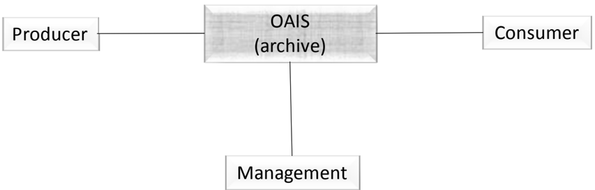

Outside the OAIS are Producers , Consumers , and Management .

- -Producer is  the  role  played  by  those  persons,  or  client  systems,  which  provide  the information to be preserved.
- -Management  is  the  role  played  by  those  who  set  overall  OAIS  policy  as  one component in a broader policy domain, for example as part of a larger organization. In  other  words,  Management  control  of  the  OAIS  is  only  one  of  Management's responsibilities.  Management is not involved in day-to-day Archive operations.  The responsibility  of  managing  the  OAIS  on  a  day-to-day  basis  is  included  within  the OAIS in an administrative functional entity that will be described in 4.1.

- -Consumer is the role played by those persons, or client  systems,  that  interact  with OAIS services to find and acquire preserved information of interest.  A special class of Consumers is the Designated Community. The Designated Community is the set of Consumers who should be able to understand the preserved information. A given individual or system may act in the role of both a Consumer and a Producer.

Other  OAIS  Archives  are  not  shown  explicitly.    Such  Archives  may  establish  particular agreements  among  themselves  consistent  with  Management  and  OAIS  needs.    Other Archives may interact with a particular Archive for a variety of reasons and with varying degrees  of  formalism  for  any  pre-arranged  agreements.    One  OAIS  may  take  the  role  of Producer to another OAIS; an example is when the responsibility for preserving a type of information is to be moved to this other Archive.  One OAIS may take the role of Consumer to another OAIS; an example is when the first OAIS decides to rely on the other OAIS for a type  of  information  it  seldom  needs  and  chooses  not  to  preserve  locally.    Such  reliance should have some formal basis that includes the requirement for communication between the Archives  of  any  policy  changes  that  might  affect  this  reliance.    The  range  of  possible interactions between OAIS Archives is discussed in section 6, Archive Interoperability.

## 2.2 OAIS INFORMATION

## 2.2.1 INFORMATION DEFINITION

A clear definition of information is central to the ability of an OAIS to preserve it.  While formal modeling of information is provided in section 4, some key concepts are provided in this subsection.

A person, or system, can be said to have a Knowledge Base ,  which allows that person or system to understand received information.  For example, a person who has a Knowledge Base  that  includes  an  understanding  of  English  will  be  able  to  read,  and  understand,  an English text.

Information is defined as any type of knowledge that can be exchanged, and this information is always expressed (i.e., represented) by some type of data in an exchange.  For example, the information in a hardcopy book is typically expressed by the observable characters (the data) which,  when  they  are  combined  with  a  knowledge  of  the  language  used  (the  Knowledge Base),  are  converted  to  more  meaningful  information.    If  the  recipient  does  not  already include  English  in  its  Knowledge  Base,  then  the  English  text  (the  data)  needs  to  be accompanied by English dictionary and grammar information (i.e., Representation Information )  in  a  form that is understandable using the recipient's Knowledge Base.  The Designated  Community,  and  its  associated  Knowledge  Base,  for  whom  the  information  is being preserved by the Archive is defined by that Archive, and that Knowledge Base will, as described below, change over time. The definition of Designated Community may be subject to agreement with funders and other stakeholders.

Similarly, the information stored within a CD-ROM file is expressed by the bits (the data) it contains which, when they are combined with the Representation Information for those bits,

## CCSDS HISTORICAL DOCUMENT

## CCSDS RECOMMENDED PRACTICE FOR AN OAIS REFERENCE MODEL

are converted to more meaningful information as long as the Representation Information is understandable  using  the  recipient's  Knowledge  Base.    For  example,  assume  the  bits represent  an  ASCII  table  of  numbers  giving  the  coordinates  of  a  location  on  the  Earth measured in degrees latitude and longitude.  The Representation Information will typically include the definition of ASCII together with descriptions of the format of the numbers and their locations in the file, their definitions as latitude and longitude, and the definition of their units  as  degrees.    It  may  also  include  additional  meaning  that  is  assigned  to  the  table. Another example of Representation Information for a bit sequence which is a FITS file might consist of the FITS standard which defines the format plus a dictionary which defines the meaning of keywords in the file which are not part of the standard. In general, it can be said that  'Data  interpreted  using  its  Representation  Information  yields  Information',  and  this  is shown schematically in figure 2-2.

Figure 2-2:  Obtaining Information from Data

In order for this Information Object to be successfully preserved, it is critical for an OAIS to identify clearly and to understand clearly the Data Object and its associated Representation  Information.    For  digital  information,  this  means  the  OAIS  must  clearly identify the bits and the Representation Information that applies to those bits.  This required transparency to the bit level is a distinguishing feature of digital information preservation, and it runs counter to object-oriented concepts which try to hide these implementation issues. This presents a significant challenge to the preservation of digital information.

As  a  further  complication,  the  recursive  nature  of  Representation  Information,  which typically is composed of its own data and its own Representation Information, typically leads to a network of Representation Information objects.  Since a key purpose of an OAIS is to preserve information for a Designated Community,  the OAIS  must  understand the Knowledge Base of its Designated Community to understand the minimum Representation Information  that  must  be  maintained.    The  OAIS  should  then  make  a  decision  between maintaining the minimum Representation Information needed for its Designated Community, or maintaining a larger amount of Representation Information that may allow understanding by a larger Consumer community with a less specialized Knowledge Base, which would be the  equivalent  of  extending  the  definition  of  the  Designated  Community.    Over  time, evolution  of  the  Designated  Community's  Knowledge  Base  may  require  updates  to  the Representation Information to ensure continued understanding.

The  choice,  for  an  OAIS,  to  collect  all  the  relevant  Representation  Information  or  to reference its existence in another trusted or partner OAIS Archive, is an implementation and organization decision.

## CCSDS RECOMMENDED PRACTICE FOR AN OAIS REFERENCE MODEL

As a practical matter, software, some of which may itself be Representation Information, is used  to  access  the  Information  Object,  and  it  will  incorporate  some  understanding  of  the network of Representation Information objects involved.  However, this software should not be used as rationale for avoiding identifying and gathering readily understandable Representation  Information  that  defines  the  Information  Object,  because  it  is  harder  to preserve working software than to preserve information in digital or hardcopy forms.

The OAIS reference model emphasizes the preservation of information content.  As digital technology  develops,  multimedia  technology  and  the  dependency  on  complex  interplay between the data and presentation technologies will lead some organizations to require that the look and feel of the original presentation of the information be preserved.  This type of preservation requirement may necessitate that the software programs and interfaces used to access the data be preserved.  This problem may be further complicated by the proprietary nature  of  some  of  the  software.    Various  techniques  for  preserving  the  look  and  feel  of information access are currently the subject of research and prototyping.  These techniques, which include hardware level emulation, emulation of various common service APIs, and the development of virtual machines, investigate the preservation of the original bit stream and software  across  technology.    Though  the  OAIS  reference  model  does  not  focus  on  these emerging  techniques,  it  should  provide  an  architectural  basis  for  the  prototyping  and comparison of these techniques.  A more detailed discussion of the issues involved in the preservation of look and feel of information access can be found in 5.2 of this document.

## 2.2.2 INFORMATION PACKAGE DEFINITION

The definition of an Information Object is applicable to all the information types discussed in this and the following subsections.  In other words, they all have associated Representation Information, although this is usually not shown explicitly.

Every  submission  of  information  to  an  OAIS  by  a  Producer,  and  every  dissemination  of information to a Consumer, occurs as one or more discrete transmissions.  Therefore, it is convenient to define the concept of an Information Package .

An  Information  Package  is  a  conceptual  container  of  two  types  of  information  called Content  Information and Preservation  Description  Information  (PDI) . The  Content Information and PDI are viewed as being encapsulated and identifiable by the Packaging Information .    The  resulting  package  is  viewed  as  being  discoverable  by  virtue  of  the Descriptive Information .

These Information Package relationships are shown schematically in figure 2-3.

Figure 2-3:  Information Package Concepts and Relationships

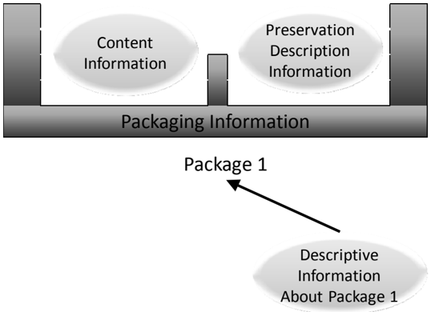

The Content Information is that information which is the original target of preservation.  It consists  of  the  Content  Data  Object  (Physical  Object  or  Digital  Object,  i.e.,  bits)  and  its associated Representation Information needed to make the Content Data Object understandable to the Designated Community.  For example, the Content Data Object may be an image that is provided as the bit content of one CD-ROM file together with other files, on the same CD-ROM, that contain Representation Information.

Only  after  the  Content  Information  has  been  clearly  defined  can  an  assessment  of  the Preservation  Description  Information  be  made.    The  Preservation  Description  Information applies  to  the  Content  Information  and  is  needed  to  preserve  the  Content  Information,  to ensure  it  is  clearly  identified,  and  to  understand  the  environment  in  which  the  Content Information was created.  The Preservation Description Information is divided into five types of preserving information called Provenance, Context, Reference, Fixity and Access Rights. Briefly, they are the following:

- -Provenance describes the source of the Content Information, who has had custody of it since its origination, and its history (including processing history).
- -Context describes how the Content Information relates to other information outside the Information Package. For example,  it  would  describe  why  the  Content Information  was  produced,  and  it  may  include  a  description  of  how  it  relates  to another Content Information object that is available.
- -Reference provides one or more identifiers, or systems of identifiers, by which the Content Information may be uniquely identified.  Examples include an ISBN for a book, or a set of attributes that distinguish one instance of Content Information from another.

- -Fixity provides a wrapper, or protective shield, that protects the Content Information from  undocumented  alteration.    For  example,  it  may  involve  a  checksum  over  the Content Information of a digital Information Package.
- -Access  Rights  provide  the  terms  of  access,  including  preservation,  distribution,  and usage of Content Information. For example, it would contain the statements to grant the OAIS  permissions  for  preservation  operations,  licensing  offers  (for  distribution), specifications for rights enforcement measures, as well as access control specifications.

The  Packaging  Information  is  that  information  which,  either  actually  or  logically,  binds, identifies  and  relates  the  Content  Information  and  PDI.    For  example,  if  the  Content Information and PDI are identified as being the content of specific files on a CD-ROM, then the  Packaging  Information  would  include  the  ISO  9660  volume/file  structure  on  the  CDROM, as well as the names and directory information of the files on CD-ROM disk. Other examples of packaging include XFDU (reference [D11]) where the Packaging Information would be the file identifier and the definition of the packaging method.

The Descriptive Information is that information which is used to discover which package has the Content Information of interest.  Depending on the setting, this may be no more than a descriptive title of the Information Package that appears in some message, or it may be a full set of attributes that are searchable in a catalog service.

## 2.2.3 INFORMATION PACKAGE VARIANTS

It is necessary to distinguish between an Information Package that is preserved by an OAIS and the Information Packages that are submitted to, or disseminated from, an OAIS.  These variant packages are needed to reflect the reality that some submissions to an OAIS will have insufficient Representation Information or PDI to meet OAIS preservation requirements.  In addition,  these  may  be  organized  very  differently  from  the  way  the  OAIS  organizes  the information it is preserving.  Finally, the OAIS may provide to Consumers information that does  not  include  all  the  Representation  Information  or  all  the  PDI  with  the  associated Content Information being disseminated.  These variants are referred to as the Submission Information Package (SIP), the Archival Information Package (AIP), and the Dissemination Information Package (DIP).

The Submission Information Package (SIP) is  that  package that is sent to an OAIS by a Producer.  Its form and detailed content are typically negotiated between the Producer and the OAIS (see related standards in 1.5).  Most SIPs will have some Content Information and some PDI.

The relationships between SIPs and AIPs can be complex; as well as a simple one-to-one relationship in which one SIP produces one AIP, other possibilities include: one AIP being produced  from  multiple  SIPs  produced  at  different  times  by  one  Producer  or  by  many Producers; one SIP resulting in a number of AIPs; and many SIPs from one or more sources being unbundled and recombined in different ways to produce many AIPs. Even in the first case, the OAIS may have to perform a number of transformations on the SIP.  The Packaging Information will always be present in some form.

## CCSDS HISTORICAL DOCUMENT

## CCSDS RECOMMENDED PRACTICE FOR AN OAIS REFERENCE MODEL

Within the OAIS one or more SIPs are transformed into one or more Archival Information Packages (AIPs) for  preservation.    The  AIP  has  a  complete  set  of  PDI  for  the  associated Content  Information.    The  AIP  may  also  contain  a  collection  of  other  AIPs,  and  this  is discussed and modeled in section 4.  The Packaging Information of the AIP will conform to OAIS internal standards, and it may vary as it is managed by the OAIS.

In response to a request, the OAIS provides all or a part of an AIP to a Consumer in the form of a Dissemination Information Package (DIP) .  The DIP may also include collections of AIPs, and it may or may not have complete PDI.  The Packaging Information will necessarily be present in some form so that the Consumer can clearly distinguish the information that was  requested.    Depending  on  the  dissemination  media  and  Consumer  requirements,  the Packaging Information may take various forms.

## 2.3 OAIS HIGH-LEVEL EXTERNAL INTERACTIONS

The following subsections present a high-level view of the interaction between the entities identified in the OAIS environment.  Figure 2-4 is a data flow diagram that represents the operational  OAIS  Archive  external  data  flows.    This  diagram  concentrates  on  the  flow  of information  among  Producers,  Consumers  and  the  OAIS  and  does  not  include  flows  that involve Management.  These flows are dealt with further in section 4.

Figure 2-4:  OAIS Archive External Data

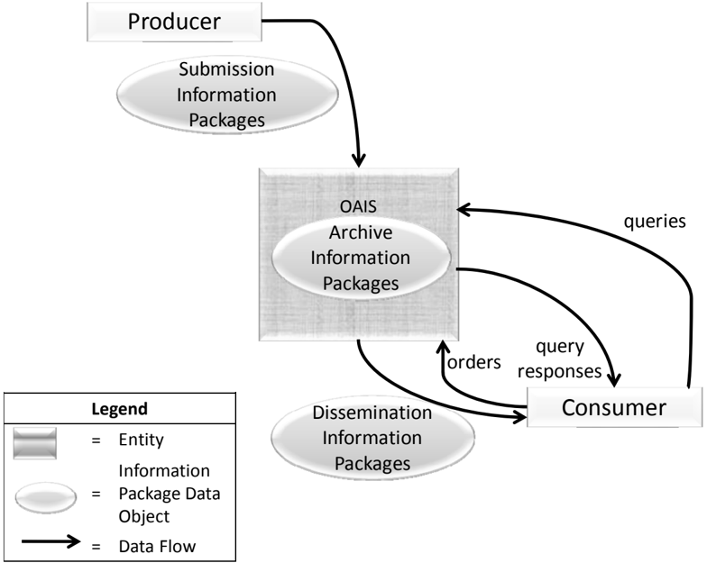

## 2.3.1 MANAGEMENT INTERACTION

Management provides the OAIS with its charter and scope.  The charter may be developed by  the  Archive,  but  it  is  important  that  Management  formally  endorse  Archive  activities. The scope determines the breadth of both the Producer and Consumer groups served by the Archive.

Some examples of typical interactions between the OAIS and Management include:

- -Management is often the primary source of funding for an OAIS and may provide guidelines for resource utilization (personnel, equipment, facilities).
- -Management  will  generally  conduct  some  regular  review  process  to  evaluate  the OAIS  performance  and  progress  toward  Long  Term  goals,  and  assess  the  risks  to which the OAIS and its holdings are exposed.
- -Management  determines,  or  at  least  endorses,  pricing  policies,  as  applicable,  for OAIS services.
- -Management participates in conflict resolution involving Producers, Consumers and OAIS internal administration.

Effective Management should also provide support for the OAIS by establishing procedures that  assure  OAIS  utilization  within  its  sphere  of  influence.    For  example,  management policies  should  require  that  all  funded  activities  within  its  sphere  of  influence  submit  data products to the Archive and also adhere to Archive standards and procedures.

## 2.3.2 PRODUCER INTERACTION

The first contact between the OAIS and the Producer is a request that the OAIS preserve the data  products  created  by  the  Producer.    This  contact  may  be  initiated  by  the  OAIS,  the Producer  or  Management.    The  Producer  establishes  a Submission  Agreement with  the OAIS, which identifies the SIPs to be submitted and may span any length of time for this submission.  Some Submission Agreements will reflect a mandatory requirement to provide information to the OAIS, while others will reflect a voluntary offering of information and others may reflect any payments which may be involved.  Even in the case where no formal Submission Agreement exists such as in  the  archiving  of  many  World  Wide  Web  sites,  a virtual Submission Agreement may exist specifying the file formats and the general subject matter the OAIS will accept.

Within the  Submission  Agreement,  one  or  more Data Submission Sessions are  specified. There  may  be  significant  time  gaps  between  the  Data  Submission  Sessions.    A  Data Submission Session will contain one or more SIPs delivered as a set of media or via a single telecommunications session.  The Data Submission Session content is based on a data model negotiated  between  the  OAIS  and  the  Producer  in  the  Submission  Agreement.    This  data model  identifies  the  logical  components  of  the  SIP  (e.g.,  the  Content  Data  Objects, Representation Information, PDI, Packaging Information, and Descriptive Information) that

## CCSDS HISTORICAL DOCUMENT

## CCSDS RECOMMENDED PRACTICE FOR AN OAIS REFERENCE MODEL

are  to  be  provided  and  how  (and  whether)  they  are  represented  in  each  Data  Submission Session.  All data deliveries within a Submission Agreement are recognized as belonging to that  Submission  Agreement  and  will  generally  have  a  consistent  data  model,  which  is specified  in  the  Submission  Agreement.    For  example,  a  Data  Submission  Session  may consist  of  a  set  of  Content  Information  corresponding  to  a  set  of  observations,  which  are carried by a set of files on a CD-ROM.  The Preservation Description Information is in this example split between two other files.  All of these files need Representation Information which must be provided in some way.  The CD-ROM and its directory/file structure are the Packaging  Information,  which  provides  encapsulation  and  identification  of  the  Content Information and PDI in the Data Submission Session.  The Submission Agreement indicates how the Representation Information for each file is to be provided, how the CD-ROM is to be recognized, how the Packaging Information will be used to identify and encapsulate the SIP Content Information and PDI, and how frequently Data Submission Sessions (e.g., one per month for two years) will occur.  It also gives other needed information such as access restrictions to the data and enforcement requirements.

Each SIP in a Data Submission Session is expected to meet minimum OAIS requirements for completeness.    However,  in  some  cases  multiple  SIPs  may  need  to  be  received  before  an acceptable AIP can be formed and fully ingested within the OAIS.  In other cases, a single SIP may contain data to be included in many AIPs.  A Submission Agreement also includes, or references, the procedures and protocols by which an OAIS will either verify the arrival and completeness of a Data Submission Session with the Producer or question the Producer on the contents of the Data Submission Session.

## 2.3.3 CONSUMER INTERACTION

There  are  many  types  of  interactions  between  the  Consumer  and  the  OAIS.    These interactions include questions to a help desk, requests for literature, catalog searches, orders and order status requests.  The ordering process is of special interest to the OAIS Reference Model,  since  it  deals  with  the  flow  of  Archive  holdings  between  the  OAIS  and  the Consumer.

The  Consumer  establishes  an Order  Agreement with  the  OAIS  for  information.  This information may currently exist in the Archive or be expected to be ingested in the future.  The Order Agreement may span any length of time, and under it one or more Data Dissemination Sessions may take place.  A Data Dissemination Session may involve the transfer of a set of media or a single telecommunications session.  The Order Agreement identifies one or more AIPs  of  interest,  how  those  AIPs  are  to  be  transformed  and  mapped  into  Dissemination Information  Packages  (DIPs)  and  how  those  DIPs  will  be  packaged  in  a  Data  Dissemination Session.    The  Order  Agreement  will  also  specify  other  needed  information  such  as  delivery information  (e.g.,  name  or  mailing  address),  rights  information  (e.g.,  usage  restrictions, authorized Consumers, or license fees) and any pricing agreements as applicable.  There are two  common  order  types  initiated  by  Consumers:    the Event  Based  Order and  the Adhoc Order .

## CCSDS HISTORICAL DOCUMENT

## CCSDS RECOMMENDED PRACTICE FOR AN OAIS REFERENCE MODEL

In the case of an Adhoc Order, the Consumer establishes an Order Agreement with the OAIS for information available from the Archive.  If the Consumer does not know a priori what specific holdings of the OAIS are of interest, the Consumer will establish a Search Session with the OAIS.  During this Search Session the Consumer will use the OAIS Finding Aids that  operate  on Descriptive  Information, or  in  some  cases  on  the  AIPs  themselves,  to identify  and  investigate  potential  holdings  of  interest.    This  may  be  accomplished  by  the submission of queries and the return of query responses, e.g., result sets, to the Consumer. This searching process tends to be iterative, with a Consumer first identifying broad criteria and  then  refining  these  criteria  based  on  previous  search  results.    Once  the  Consumer identifies  the  OAIS  AIPs of interest,  the  Consumer may provide an Order Agreement that documents the identifiers of the AIPs the Consumer wishes to acquire, and how the DIPs will be  acquired  from  the  OAIS.    If  the  AIPs  are  available,  an  Adhoc  Order  will  be  placed. However, if the AIPs desired are not yet available, an Event Based Order may be placed.

In the case of an Event Based Order, the Consumer establishes an Order Agreement with the OAIS for information expected to be received on the basis of some triggering event.  This event  may  be  periodic,  such  as  a  monthly  distribution  of  any  AIPs  ingested  by  the  OAIS from a specific Producer, or it may be a unique event such as the ingestion, or creation,  of a specific AIP.  The Order Agreement will also specify other needed information such as the trigger  event  for  new  Data  Dissemination  Sessions and the criteria for selecting the OAIS holdings to be included in each new Data Dissemination Session.

The Order Agreement does not have to be a formal document.  In general an OAIS will have a general pricing policy and maintain an information base of the electronic and physical mailing addresses of its users.  In this case, the process of developing an Order Agreement may be no more than the completion of a World Wide Web form to specify the AIPs of interest.

## 3 OAIS RESPONSIBILITIES

Subsection 3.1 identifies the minimum responsibilities that shall be discharged by an OAIS. Subsection  3.2  gives  some  examples  of  mechanisms  to  discharge  these  responsibilities, although  not  all  of  these  will  be  applicable  to  all  OAISes,  and  1.5  provides  references  to some relevant standards.

## 3.1 MANDATORY RESPONSIBILITIES

This subsection establishes mandatory responsibilities that an organization must discharge in order to operate an OAIS Archive.

The OAIS shall:

- -Negotiate for and accept appropriate information from information Producers.
- -Obtain sufficient  control  of  the  information  provided  to  the  level  needed  to  ensure Long Term Preservation.
- -Determine, either by itself or in conjunction with other parties, which communities should  become  the  Designated  Community  and,  therefore,  should  be  able  to understand the information provided, thereby defining its Knowledge Base.
- -Ensure that the information to be preserved is Independently Understandable to  the Designated  Community.    In  particular,  the  Designated  Community  should  be  able  to understand the information without needing special resources such as the assistance of the experts who produced the information.
- -Follow  documented  policies  and  procedures  which  ensure  that  the  information  is preserved against all reasonable contingencies, including the demise of the Archive, ensuring that it is never deleted unless allowed as part of an approved strategy. There should be no ad-hoc deletions.
- -Make the preserved information available to the Designated Community and enable the  information  to  be  disseminated  as  copies  of,  or  as  traceable  to,  the  original submitted Data Objects with evidence supporting its Authenticity.

## 3.2 EXAMPLE MECHANISMS FOR DISCHARGING RESPONSIBILITIES

This  subsection  provides  example  mechanisms  for  discharging  the  responsibilities  of  3.1. Not all of these mechanisms will be applicable to all OAISes.

## 3.2.1 NEGOTIATES FOR AND ACCEPTS INFORMATION

An  organization  operating  an  OAIS  should  have  established  some  criteria  that  aid  in determining the types of information that it is willing to, or it is required to, accept.  These criteria may include, among others, subject matter, information source, degree of uniqueness or originality,  and  the  nature  of  the  techniques  used  to  represent  the  information (e.g.,  physical media, digital  media,  format).    The  information  may,  in  general,  be  submitted  using  a  wide variety of common and not-so-common forms, such as books, documents, maps, data sets, and physical objects using a variety of communication paths including networks, mail, and special delivery.

The  OAIS  should  negotiate  with  the  Producer  to  ensure  it  acquires  appropriate  Content Information and associated PDI for its mission and the Designated Community.  Considerable iteration may be required to agree on the right information to be submitted, and to get it into forms  acceptable  to  the  OAIS.    For  example,  this  may  include  digitizing  audio  or  video material, or scanning text.

Negotiation can embrace a range of possible actions, and may sometimes be a null step. It may be  carried  out  for  each  SIP,  for  each  Producer,  or  for  a  class  of  Producers.  It  may  involve extensive  human  contact  or  machine-machine  negotiations,  such  as  that  which  takes  place between a web crawler and a web server when deciding what, if any, content the server will permit the crawler to have (the former acting as a Producer, the latter as an OAIS).

The OAIS should extract, or otherwise obtain, sufficient Descriptive Information to assist the Designated Community in finding the Content Information of interest.  It also should ensure that the information meets all OAIS internal standards.

## 3.2.2 OBTAINS SUFFICIENT CONTROL FOR PRESERVATION

It  is  important  for  the  OAIS  to  recognize  the  separation  that  can  exist  between  physical ownership or possession of Content Information and ownership of intellectual property rights in this information.  If it has created the information and is the legal owner of the Content Information, the OAIS already has the independence to do what is required to preserve the information and make it available.  When acquiring the Content Information from any other producer or entity, the OAIS should ensure that there is a legally valid transfer agreement that  either  transfers  intellectual  property  rights  to  the  OAIS,  or  clearly  specifies  the  rights granted to the OAIS and any limitations imposed by the rightsholder(s).  The OAIS should ensure that its subsequent actions to preserve the information and make it available conform with these rights and limitations.  When the OAIS does not acquire the intellectual property rights,  the  agreement  should  specify  what  involvement  the  rightsholder(s)  will  have  in preservation, management or release of the information.  In most cases, it will be preferable for  the  OAIS to negotiate an agreement that specifies the rightsholder(s) requirements and authorizes the OAIS to act in accordance with those requirements without active involvement of the rightsholder(s) in individual cases.

## CCSDS HISTORICAL DOCUMENT

## CCSDS RECOMMENDED PRACTICE FOR AN OAIS REFERENCE MODEL

The  OAIS  must  assume  sufficient  control  over  the  Content  Information  and  Preservation Description Information so that it is able to preserve it for the Long Term.  There is no issue with  the  AIP's  Packaging  Information  because,  by  definition,  this  is  under  internal  OAIS control.    The  problems  of  assuming  sufficient  control  of  the  Content  Information  and Preservation Description Information, when they are largely digital, are addressed in three related categories, as follows:

- -copyright implications, intellectual property and other legal restrictions on use;
- -authority to modify Representation Information;
- -agreements with external organizations.

Copyright implications,  intellectual  property  and  other  legal  restrictions  on  use: An Archive will honor all applicable legal restrictions. These issues occur when the OAIS acts as a custodian.  An OAIS should understand the intellectual property rights concepts, such as copyrights and any other applicable laws prior to accepting copyrighted materials into the OAIS.  It can establish guidelines for ingestion of information and rules for dissemination and duplication of the information when necessary.  It is beyond the scope of this document to provide details of national and international copyright laws.

Authority  to  modify  Content  Information: Although  the  Fixity  Information  within  the Preservation Description Information of an AIP ensures that the Content Information-related bits have not been altered, there will come a time when Content Information bits are not in a form that is convenient for the Consumers from the Designated Community.  The Content Information bits  may  be  fully  documented  in  available  hardcopy  forms,  so  technically  the information has not been lost, but practically the information has become inaccessible.  The OAIS needs the authority to migrate the Content Information to new representation forms.  If it is acting as a custodian, it may need to seek additional permission to make such changes. If  the  information  is  copyrighted,  the  OAIS  should  already  have  negotiated  permission  to make  the  changes  needed  to  meet  preservation  objectives.    It  may  employ  subject  matter experts, from outside the OAIS, to help ensure that information is not lost.  Ideally, when this situation  arises,  both  the  original  AIPs  (fully  described)  and  new  AIPs  will  be  retained. Digital Migration issues are addressed more fully in 5.1

Agreements with external organizations: An OAIS may establish a variety of agreements with other organizations to assist in its preservation objectives.  For example, it may establish an  agreement  with  another  OAIS  so  that  it  does  not  have  to  preserve  all  the  common Representation  Information  objects  related  to  its  Content  Information  objects.    Agreements with other organizations should be monitored to be sure they are being followed and remain useful.

## 3.2.3 DETERMINES DESIGNATED COMMUNITY

The submission, or planned submission, of Content Information and associated PDI requires a  determination  as  to  who  the  expected  Consumers,  or  Designated  Community,  of  this information  will  be.    This  is  necessary  in  order  to  determine  if  the  information,  as represented, will be understandable to that community.  For example, an Archive may decide that  certain  Content  Information  should  be  understandable  to  the  general  public  and, therefore, this becomes the Designated Community.

For  some  scientific  information,  the  Designated  Community  of  Consumers  might  be described as those with a first year graduate level education in a related scientific discipline. This  is  a  more  difficult  case  as  it  is  less  clear  what  degree  of  specialized  scientific terminology might actually be acceptable.  The Producers of such specialized information are often familiar with a narrowly recognized set of terminology, so it is especially critical to clearly  define  the  Designated  Community  for  their  information  and  to  make  the  effort  to ensure that this community can understand the information.

The possible changes to the definition of the Designated Community also need consideration. Information  originally  intended  for  a  narrowly  defined  community  may  need  to  be  made more  widely  understandable  at  some  future  date.    For  example,  information  originally intended  to  be  understandable  to  a  particular  scientific  community  may  need  to  be  made understandable to the general public.  This is likely to mean adding explanations in support of the Representation Information and the Preservation Description Information, and it can become  increasingly  difficult  to  obtain  this  information  over  time.    Selecting  a  broader definition of the Designated Community (e.g., general public) when the information is first proposed  for  Long  Term  Preservation  can  reduce  this  concern  and  also  improve  the likelihood that the information will be understandable to all in the original community.

## 3.2.4 ENSURES INFORMATION IS INDEPENDENTLY UNDERSTANDABLE

The degree to which Content Information and its associated PDI conveys information to a Designated Community is, in general, quite subjective.  Nevertheless, it is essential that an Archive  make  this  determination  in  order  to  maximize  information  preservation.    Digital Content Information and PDI need adequate Representation Information to be Independently Understandable to the Designated Community.  Typically there are multiple Representation Information objects involved, and this is discussed in 4.2.

For  example,  consider  Content  Information  from  a  digital  set  of  observations  of  rainfall, temperature, pressure, wind velocities, and other parameters measured all over the world for a year.  This type of information is very extensive and is not usually in a form intended for direct  human  browsing  or  reading;  but  it  is  in  a  form  appropriate  to  searching  and manipulation  by  application  software.    Such  content  may  only  be  understandable  to  the original  Producers,  unless  there  is  adequate  documentation  of  the  meaning  of  the  various fields and their inter-relationships, and how  the values relate back to the original instrumentation that made the observations.  In such specialized fields extra effort is needed to  ensure  that  the  Content  Information  and  the  Preservation  Description  Information  are

## CCSDS RECOMMENDED PRACTICE FOR AN OAIS REFERENCE MODEL

understandable  to  a  Designated  Community.    If  the  Archive  does  not  have  this  level  of expertise  in-house,  it  may  have  outside  community  representatives  review  the  information for Long Term understandability.  Otherwise some of the information may be understandable to only a few specialists and be lost when they are no longer available.

Even when a set  of  information  has  been  determined  to  be  understandable  to  a  particular Designated Community, over time the Knowledge Base of this community may evolve to the point that important aspects of the information may no longer be readily understandable.  At this  point  it  may  be  necessary  for  the  OAIS  to  enhance  the  associated  Representation Information so that it is again readily understandable to the Designated Community.

As  another  example,  a  manuscript's  Content  Information  may  be  written  in  English  and therefore its content may be generally understandable to a wide audience.  However, unless the purpose for which it was created is clearly documented, much of its meaning may be lost. This 'purpose' information is part of its Context and must be provided in the Preservation Description Information.

Software is needed for efficient access to Digital Content Information. However, maintaining  Content  Information-specific  software  over  the  Long  Term  has  not  yet  been proven  cost  effective  because  of  the  narrow  application  of  such  software.    The  danger  of information loss is great when such software is relied upon for information preservation and understanding because it may cease to function under only small changes to the hardware and software environment.  This may not be recognized unless there is a vigorous, ongoing, testing and validation program. A related approach is to employ an emulator that maintains a consistent environment for a range of application specific software.  A major concern with this approach is the need to upgrade and maintain the emulator over time while ensuring it runs all the application specific software with fidelity, and to do this cost-effectively.

## 3.2.5 FOLLOWS ESTABLISHED PRESERVATION POLICIES AND PROCEDURES

It  is  essential  for  an  OAIS  to  have  documented  policies  and  procedures  for  preserving  its AIPs,  and  it  should  follow  those  procedures.  In  particular  AIPs  should  never  be  deleted unless  allowed  as  part  of  an  approved  policy;  there  should  be  no  ad-hoc  deletions.  The appropriate policies and procedures will depend, at minimum, on the nature of the AIPs and any  'backup'  relationships  the  Archive  may  have  with  other  Archives.    For  example, migrations that alter any Content Information or PDI will need to be carefully monitored and the  appropriate  PDI  fully  updated.    This  attention  to  detail,  while  also  ensuring  against processing errors, requires that strong policies and procedures be in place and that they be executed.

The  Producer  and  Consumer  communities  should  be  provided  with  submission  and dissemination standards, policies,  and  procedures  to  support  the  preservation  objectives  of the OAIS.

## CCSDS RECOMMENDED PRACTICE FOR AN OAIS REFERENCE MODEL

The Designated Community should be monitored to be sure the Content Information is still understandable  to  them.    The  Designated  Community  may  lose  its  familiarity  with  some terminology,  and  the  definition  of  the  community  may  be  broadened  to  include  other members  with  different  backgrounds.    For  example,  a  periodic  review  with  participants representing the Designated Community could assist in this process.

A Long Term technology usage plan, updated as technology evolves, is essential to avoid being  caught  with  very  costly  system  maintenance,  emergency  system  replacements,  and costly data representation transformations.

The  Archive  should  have  a  formal  Succession  Plan,  contingency  plans,  and/or  escrow arrangements  in  place  in  case  the  Archive  ceases  to  operate  or  the  governing  or  funding institution substantially changes its scope.

## 3.2.6 MAKES THE INFORMATION AVAILABLE

By definition, an OAIS makes the Content Information in its AIPs visible and available to its Designated Communities.  Multiple views of its holdings, supported by various search aids that may cut across collections of AIPs, may be provided.  Some AIPs may only exist as the output of algorithms operating on other AIPs.  They appear as DIPs that, upon dissemination, should include documentation on how they were derived from other AIPs.  The expectations of  OAIS Consumers regarding access services will vary widely among Archives and over time as technology evolves.  Pressures for more effective access should be balanced with the requirements for preservation under the available resource constraints.

Some AIPs may have restricted access and therefore may only be disseminated to Consumers who  meet  access  restrictions.    The  OAIS  should  have  published  policies  on  access  and restrictions so that the rights of all parties are protected.

In  general,  DIPs  may  be  distributed  by  all  varieties  of  communication  paths,  including networks and physical media.

## CCSDS RECOMMENDED PRACTICE FOR AN OAIS REFERENCE MODEL

## 4 DETAILED MODELS

The purpose of this section is to provide a more detailed model view of the functional entities of the OAIS and the information handled by the OAIS.   This aids OAIS designers of future systems  and  provides  a  more  precise  set  of  terms  and  concepts  for  discussion  of  current systems.

## 4.1 FUNCTIONAL MODEL

The  OAIS  of  figure  2-1  is  separated  in  figure  4-1  into  six  functional  entities  and  related interfaces.  Only major information flows are shown.  The lines connecting entities identify communication  paths  over  which  information  flows  in  both  directions.    The  lines  to Administration and Preservation Planning are dashed only to reduce diagram clutter.

Figure 4-1:  OAIS Functional Entities

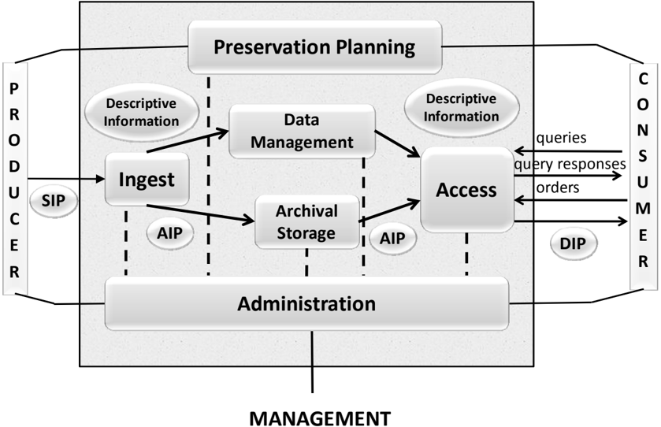

The role provided by each of the entities in figure 4-1 is described briefly as follows:

The Ingest  Functional Entity (labeled  'Ingest'  in  the  figures  in  this  section)  provides  the services and functions to accept Submission Information Packages (SIPs) from Producers (or from  internal  elements  under  Administration  control)  and  prepare  the  contents  for  storage and management within the Archive.  Ingest functions include receiving SIPs, performing quality  assurance  on  SIPs,  generating  an  Archival  Information  Package  (AIP)  which complies  with  the  Archive's  data  formatting  and  documentation  standards,  extracting

## CCSDS RECOMMENDED PRACTICE FOR AN OAIS REFERENCE MODEL CCSDS HISTORICAL DOCUMENT

Descriptive Information from the AIPs for inclusion in the Archive database, and coordinating updates to Archival Storage and Data Management.

The Archival Storage Functional Entity (labeled 'Archival Storage' in the figures in this section)  provides  the  services  and  functions  for  the  storage,  maintenance  and  retrieval  of AIPs.  Archival Storage functions include receiving AIPs from Ingest and adding them to permanent storage, managing the storage hierarchy, refreshing the media on which Archive holdings  are  stored,  performing  routine  and  special  error  checking,  providing  disaster recovery capabilities, and providing AIPs to Access to fulfill orders.

The Data  Management  Functional  Entity (labeled  'Data  Management'  in  the  figures  in this section) provides the services and functions for populating, maintaining, and accessing both Descriptive Information which  identifies and documents  Archive  holdings and administrative  data  used  to  manage  the  Archive.    Data  Management  functions  include administering the Archive database functions (maintaining schema and view definitions, and referential  integrity),  performing  database  updates  (loading  new  descriptive  information  or Archive administrative data), performing queries on the data management data to generate query responses, and producing reports from these query responses.

The Administration  Functional  Entity (labeled  'Administration'  in  the  figures  in  this section) provides the services and functions for the overall operation of the Archive system. Administration  functions  include  soliciting  and  negotiating  submission  agreements  with Producers, auditing submissions to ensure that they meet Archive standards, and maintaining configuration  management  of  system  hardware  and  software.    It  also  provides  system engineering functions to monitor and improve Archive operations, and to inventory, report on, and migrate/update the contents of the Archive.  It is also responsible for establishing and maintaining  Archive  standards  and  policies,  providing  customer  support,  and  activating stored requests.

The Preservation  Planning Functional  Entity (labeled  'Preservation  Planning'  in  the figures in this section) provides the services and functions for monitoring the environment of the OAIS, providing recommendations and preservation plans to ensure that the information stored in the OAIS remains accessible to, and understandable by, the Designated Community over  the  Long  Term,  even  if  the  original  computing  environment  becomes  obsolete. Preservation Planning functions include evaluating the contents of the  Archive  and periodically  recommending  archival  information  updates,  recommending  the  migration  of current Archive holdings, developing recommendations for Archive standards and policies, providing periodic risk analysis reports, and monitoring changes in the technology environment and in the Designated Community's service requirements and Knowledge Base. Preservation  Planning  also  designs  Information  Package  templates  and  provides  design assistance  and  review  to  specialize  these  templates  into  SIPs  and  AIPs  for  specific submissions. Preservation Planning also develops detailed Migration plans, software prototypes and test plans to enable implementation of Administration migration goals.

The Access Functional Entity (labeled 'Access' in the figures in this section) provides the services  and  functions  that  support  Consumers  in  determining  the  existence,  description,

## CCSDS RECOMMENDED PRACTICE FOR AN OAIS REFERENCE MODEL

location  and  availability  of  information  stored  in  the  OAIS,  and  allowing  Consumers  to request  and  receive  information  products.    Access  functions  include  communicating  with Consumers  to  receive  requests,  applying  controls  to  limit  access  to  specially  protected information,  coordinating  the  execution  of  requests  to  successful  completion,  generating responses (Dissemination Information Packages, query responses, reports) and delivering the responses to Consumers.

In addition to the entities described above, there are various Common Services assumed to be  available.    These  services  are  considered  to  constitute  another  functional  entity  in  this model.  This entity is so pervasive that, for clarity, it is not shown in figure 4-1.

## 4.1.1 DETAILED DESCRIPTION OF FUNCTIONAL ENTITIES

In the following subsections, specific flows of information among the functional entities are identified in italics the first time they appear in the text.  The detailed functional descriptions of the subsections are accompanied by diagrams (figures 4-2 through 4-7) that depict only the major data flows within and among the entities.  Omitted for clarity are minor flows such as acknowledgment notices.  Annex A contains a figure that combines figures 4-2 through 4-7 to demonstrate overall consistency.  However, this is not to be taken as a recommended design or implementation, and actual implementations are not expected to have a one-to-one mapping to the functions shown, and may for example choose to combine functions or break out functionality differently.

## 4.1.1.1 Common Services

Modern, distributed computing applications assume a number of supporting services such as inter-process communication, name  services, temporary storage allocation, exception handling,  security,  backup  and  directory  services.    Much  excellent  work  has  already  been done in the area of open system environment reference models.  Examples of such services include:

Operating system services provide the core services needed to operate and administer the application platform, and provide an interface between application software and the platform. These services include the following:

- -Kernel  operations  provide  low-level  services  necessary  to  create  and  manage processes,  execute  programs,  define  and  communicate  signals,  define  and  process system  clock  operations,  manage  files  and  directories,  and  control  input-output processing to and from the external environment.
- -Commands and utilities include mechanisms for operations at the operator level, such as comparing, printing, and displaying file contents; editing files; pattern searching; evaluating expressions; logging messages; moving files between directories; sorting data; executing command scripts; and accessing environment information.

- -Real-time extension includes the application and operating system interfaces needed to  support  those  application  domains  requiring  deterministic  execution,  processing, and responsiveness.  The extension defines the applications interface to basic system services for input/output, file system access, and process management.
- -System  management  includes  capabilities  to  define  and  manage  user  resource allocation  and  access  (i.e.,  what  resources  are  managed  and  the  classes  of  access defined),  configuration  and  performance  management  of  devices,  file  systems, administrative processes (job accounting), queues, machine/platform profiles, authorization of resource usage, and system backup.
- -Operating  system  security  services  specify  the  control  of  access  to  system  data, functions, hardware, and software resources by users and user processes.

Network services provide the capabilities and mechanisms to support distributed applications requiring data access and applications interoperability in heterogeneous, networked environments.  These services include the following:

- -Data communication includes API and protocol specifications for reliable, transparent, end-to-end data transmission across communications networks.
- -Transparent  file  access  provides  access  to  available  files  located  anywhere  in  a heterogeneous network.
- -Personal/micro computer support provides support for interoperability with systems based  on  other  operating  systems,  particularly  microcomputer  operating  systems, which may not be formally specified in a national or international standard.
- -Remote  Procedure  Call  services  include  specifications  for  extending  the  local procedure call to a distributed environment.
- -Network  security  services  include  access,  authentication,  confidentiality,  integrity, and  non-repudiation  controls  and  management  of  communications  between  senders and receivers of information in a network.

Security services provide capabilities and mechanisms to protect sensitive information and treatments  in  the  information  system.    The  appropriate  level  of  protection  is  determined based upon the value of the information to the application end-users and the perception of threats to it.  These services include the following:

- -Identification/authentication  service  confirms  the  identities  of  requesters  for  use  of information system resources.  In addition, authentication can apply to providers of data.  The authentication service may occur at the initiation of a session or during a session.
- -Access control service prevents the unauthorized use of information system resources.  This service also prevents the use of a resource in an unauthorized way. This service may be applied to various aspects of access to a resource (e.g., access to communications to the resource, the reading, writing, or deletion of an

## CCSDS RECOMMENDED PRACTICE FOR AN OAIS REFERENCE MODEL

information/data resource, the execution of a processing resource) or to all accesses to a resource.

- -Data integrity service ensures that data is not altered or destroyed in an unauthorized manner.    This  service  applies  to  data  in  permanent  data  stores  and  to  data  in communications messages.
- -Data confidentiality  service  ensures  that  data  is  not  made  available  or  disclosed  to unauthorized  individuals  or  computer  processes.    This  service  will  be  applied  to devices that permit human interaction with the information system.  In addition, this service  will  ensure  that  observation  of  usage  patterns  of  communications  resources will not be possible.
- -Non-repudiation  service  ensures  that  entities  engaging  in  an  information  exchange cannot deny being involved in it.  This service may take one or both of two forms. First,  the  recipient  of  data  is  provided  with  proof  of  the  origin  of  the  data.    This protects  against  any  attempt  by  the  sender  to  falsely  deny  sending  the  data  or  its contents.  Second, the sender of data is provided with proof of delivery of data.  This protects against any subsequent attempt by the recipient to falsely deny receiving the data or its contents.

## 4.1.1.2 Ingest

The functions of the Ingest Functional Entity are illustrated in figure 4-2.

Figure 4-2:  Functions of the Ingest Functional Entity

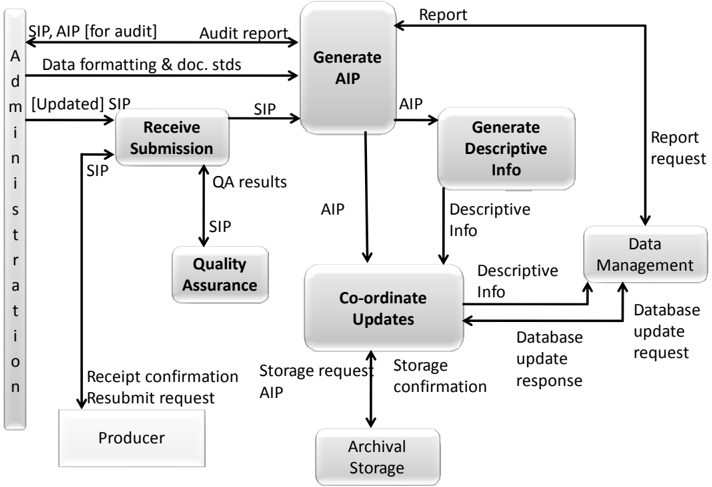

## CCSDS HISTORICAL DOCUMENT

## CCSDS RECOMMENDED PRACTICE FOR AN OAIS REFERENCE MODEL

The Receive Submission function provides the appropriate storage capability or devices to receive a SIP from the Producer (or from Administration).  Digital SIPs may be delivered via electronic  transfer  (e.g.,  FTP),  loaded  from  media  submitted  to  the  Archive,  or  simply mounted (e.g.,  CD-ROM) on the Archive file  system  for  access.    Non-digital  SIPs  would likely be delivered by conventional shipping procedures.  The Receive Submission function may represent a legal transfer of custody for the Content Information in the SIP, and may require  that  special  access  controls  be  placed  on  the  contents.    This  function  provides  a confirmation of receipt of a SIP to the Producer, which may include a request to resubmit a SIP in the case of errors resulting from the SIP submission.

Evidence for Authenticity is provided by the Producer as part of the PDI in the submission, and this evidence is maintained, updated, and/or incremented by the Archive over time. The Producer  may  provide,  or  the  Archive  may  itself  define,  as  part  of  the  Provenance Information, Information Property Descriptions of Information Properties which should be  maintained  over  time,  and  indeed  may  provide  Information  Property  Descriptions  of Information  Properties  which  do  not  need  to  be  maintained  over  time.    An  Information Property  is  that  part  of  the  Content  Information  as  described  by  the  Information  Property Description. An Information Property Description is a description of a part of the information content of a Content Information object that is highlighted for a particular purpose. The detailed expression, or value, of that part of the information content is conveyed by the appropriate parts of the Content Data Object and its Representation Information. For example, consider a simple digital  book  which  when  rendered  appears  as  pages  with  margins,  title,  chapter  headings, paragraphs,  and  text  lines  composed  of  words  and  punctuation.    Information  Property Descriptions  for  Information  Properties  that  must  be  preserved  could  be  expressed  as 'paragraph identification' and 'characters expressing words and punctuation'. The Information Properties would consist of all the book's paragraph identifications, words, and punctuation  as  expressed  by  the  Content  Data  Object  and  its  Representation  Information. This  means  that  all  formatting  other  than  the  recognition  of  paragraphs  and  readable  text could be altered while still maintaining required preservation.  The Archive may express an evaluation of the Authenticity of its holdings, based on community practice and recommendations  (including  best  practices,  guidelines,  standards,  and  legal  requirements). For  example  scientific  Archives  may  have  less  stringent  evaluation  criteria  than  State Archives;  however,  the  Consumer  may  make  his/her  own  judgment  of  the  Authenticity starting with the evidence obtained from PDI.

The Quality Assurance function validates ( QA results ) the successful transfer of the SIP to the temporary storage area.  For digital submissions, these mechanisms might include Cyclic Redundancy  Checks  (CRCs)  or  checksums  associated  with  each  data  file,  or  the  use  of system log files to record and identify any file transfer or media read/write errors.

The Generate AIP function transforms one or more SIPs into one or more AIPs that conform to the Archive's data formatting standards and documentation standards .  This may involve file format conversions, gathering adequate Representation Information, data representation conversions  or  reorganization  of  the  Content  Information  in  the  SIPs.    The  Generate  AIP function  may  issue report  requests to  Data  Management  to  obtain reports of  information needed by the Generate AIP function to produce the Descriptive Information that completes

## CCSDS RECOMMENDED PRACTICE FOR AN OAIS REFERENCE MODEL

the  AIP.    This  function  sends SIPs or AIPs for audit to  the  Audit  Submission  function  in Administration, and receives back an audit report . As a result of the audit report for example, it may be necessary to gather further Representation Information to ensure that the Content Information is understandable and usable by the Designated Community

The Generate Descriptive Information function extracts Descriptive Information from the AIPs and  collects Descriptive  Information from  other  sources  to  provide  to  Coordinate Updates, and ultimately Data Management.  This includes metadata to support searching and retrieving AIPs (e.g., who, what, when, where, why), and could also include special browse products (thumbnails, images) to be used by Finding Aids.

The Coordinate  Updates function  is  responsible  for  transferring  the AIPs to  Archival Storage and the Descriptive Information to Data Management.  Transfer of the AI P includes a storage request and may represent an electronic, physical, or a virtual (i.e., data stays in place)  transfer.    After  the  transfer  is  completed  and  verified,  Archival  Storage  returns  a storage confirmation indicating (or verifying) the storage identification information for the AIP. The  Coordinate Updates function also incorporates the storage identification information  into  the  Descriptive  Information  for  the  AIP  and  transfers  it  to  the  Data Management  entity  along  with  a database  update  request .    In  return,  Data  Management provides a database update response indicating the status of the update.  Data Management updates  may  take  place  without  a  corresponding  Archival  Storage  transfer  when  the  SIP contains Descriptive Information for an AIP already in Archival Storage.

## 4.1.1.3 Archival Storage

The  functions  of  the  Archival  Storage  Functional  Entity  are  illustrated  in  figure  4-3.  The term  'media'  is  used  to  designate  one  or  more  mechanisms,  local  or  remote,  for  storing digitally encoded information.

## CCSDS HISTORICAL DOCUMENT

## CCSDS RECOMMENDED PRACTICE FOR AN OAIS REFERENCE MODEL

Figure 4-3:  Functions of the Archival Storage Functional Entity

The Receive Data function receives a storage request and an AIP from Ingest and moves the AIP to permanent storage within the Archive.  The transfer request may need to indicate the anticipated frequency of utilization of the Data Objects making up the AIP in order to allow the appropriate storage devices or media to be selected for storing the AIP.  This function will select the media type, prepare the devices or volumes, and perform the physical transfer to  the  Archival  Storage  volumes.    Upon  completion  of  the  transfer,  this  function  sends  a storage confirmation message to Ingest, including the storage identification of the AIPs.

The Manage Storage Hierarchy function positions, via commands , the contents of the AIPs on  the  appropriate  media  based  on  storage management  policies ,  operational  statistics,  or directions from Ingest via the storage request.  It will also conform to any special levels of service required for the AIP, or any special security measures that are required, and ensures the appropriate level of protection for the AIP.  These include on-line, off-line or near-line storage,  required  throughput  rate,  maximum  allowed  bit  error  rate,  or  special  handling  or backup procedures.  It monitors error logs to ensure AIPs are not corrupted during transfers. This  function  also  provides operational  statistics to  Administration  summarizing  the inventory  of  media  on-hand,  available  storage  capacity  in  the  various  tiers  of  the  storage hierarchy, and usage statistics.

The Replace  Media function  provides  the  capability  to  reproduce  the AIPs over  time. Within  the  Replace  Media  function  the  Content  Information  and  Preservation  Description Information  (PDI)  must  not  be  altered.    However,  the  data  constituting  the  Packaging Information may be changed as long as it continues to perform the same function and there is

## CCSDS HISTORICAL DOCUMENT

## CCSDS RECOMMENDED PRACTICE FOR AN OAIS REFERENCE MODEL

a  straightforward  implementation  that  does  not  cause  information  loss.    The  migration strategy must select a storage medium, taking into consideration the expected and actual rates of  errors  encountered  in  various  media  types,  their  performance,  and  their  costs  of ownership. If media-dependent  attributes  (e.g.,  tape  block  sizes,  CD-ROM  volume information) have been included as part of the Content Information, a way must be found to preserve  this  information  when  migrating  to  higher  capacity  media  with  different  storage architectures. Anticipating the terminology of 5.1.3, this function may perform 'Refreshment',  'Replication',  and  'Repackaging'  that  is  straightforward.    An  example  of such 'Repackaging' is migration to new media under a new operating system and file system, where  the  Content  Information  and  PDI  are  independent  of  the  file  systems.    However, complex  'Repackaging'  and  all  'Transformation'  are  performed  under  Administration supervision by the Archival Information Update function to ensure information preservation. (Refer to 5.1.3 for a detailed description of migration issues.)

The Error Checking function provides statistically acceptable assurance that no components of  the  AIP  are  corrupted  in  Archival  Storage  or  during  any  internal  Archival  Storage  data transfer.  This function requires that all hardware and software within the Archive provide notification of potential errors and that these errors are routed to standard error logs that are checked by the Archival Storage staff.  The PDI Fixity Information provides some assurance that the Content Information has not been altered as the AIP is moved and accessed.  Similar information  is  needed  to  protect  the  PDI  itself.    A  standard  mechanism  for  tracking  and verifying the validity of all Data Objects within the Archive may also be used.  For example, CRCs could be maintained for every individual data file.  A higher level of service, such as Reed-Solomon  coding  to  support  combined  error  detection  and  correction,  could  also  be provided.    The  storage  facility  procedures  should  provide  for  random  verification  of  the integrity of Data Objects using CRCs or some other error checking mechanism.

The Disaster Recovery function provides a mechanism for duplicating the digital contents of the  Archive  collection  and,  for  example,  storing  the  duplicate  in  a  physically  separate facility.  This function is normally accomplished by copying the Archive contents to some form  of  removable  storage  media  (e.g.,  digital  linear  tape,  CD-ROM),  but  may  also  be performed via hardware transport or network data transfers.  The details of disaster recovery policies are specified by Administration.

The Provide Data function provides copies of stored AIPs to Access.  This function receives an AIP request that identifies the requested AIP(s ) and provides them on the requested media type or transfers them to a temporary storage area.  This function also sends a notice of data transfer to Access upon completion of an order.

## CCSDS RECOMMENDED PRACTICE FOR AN OAIS REFERENCE MODEL

## 4.1.1.4 Data Management

The functions of the Data Management Functional Entity are illustrated in figure 4-4.

Figure 4-4:  Functions of the Data Management Functional Entity

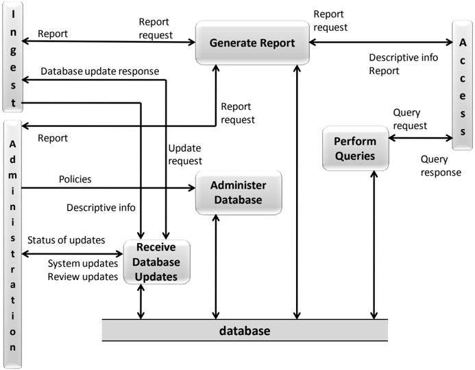

The Administer Database function is responsible for maintaining the integrity of the data management database, which provides a storage mechanism, which can be queried in some way,  for storing both Descriptive Information  and  system  information. Descriptive Information identifies and describes the Archive holdings, and system information is used to support Archive operations.  The Administer Database function is responsible for creating any  schema  or  table  definitions  required  to  support  Data  Management  functions;  for providing the capability to create, maintain and access customized user views of the contents of  this  storage;  and  for  providing  internal  validation  (e.g.,  referential  integrity)  of  the contents of the database.  The Administer Database function is carried out in accordance with policies received from Administration.

The Perform Queries function receives a query request from Access and executes the query to generate a query response that is transmitted to the requester.

The Generate  Report function receives a report request from Ingest, Access or Administration and executes any queries or other processes necessary to generate the report that  it  supplies  to  the  requester.    Typical  reports  might  include  summaries  of  Archive holdings  by  category,  or  usage  statistics  for  accesses  to  Archive  holdings.    It  may  also receive a report request from Access and provides descriptive information for a specific AIP.

## CCSDS RECOMMENDED PRACTICE FOR AN OAIS REFERENCE MODEL

The Receive Database Updates function adds, modifies or deletes information in the Data Management  persistent  storage.    The  main  sources  of  updates  are  Ingest,  which  provides Descriptive  Information for  the  new  AIPs,  and  Administration,  which  provides system updates and review updates .    Ingest  transactions  consist  of  Descriptive  Information  which identifies  new  AIPs  stored  in  the  Archive.    System  updates  include  all  system-related information  (operational  statistics,  Consumer  information,  and  request  status).    Review updates are generated by periodic reviewing and updating of information values (e.g., contact names,  addresses,  access  control  and  rights  policies).    The  Receive  Database  Updates function provides regular reports to Administration summarizing the status of updates to the database, and also sends a database update response to Ingest.

## 4.1.1.5 Administration

The functions of the Administration Functional Entity are illustrated in figure 4-5. As stated above  (see  page  4-3)  some  of  the  activities  detailed  in  this  section  will  not  apply  to  all implementations;  for  instance  in  the  customer  service  function,  the  billing  activity  shows where this would occur if required.

Figure 4-5:  Functions of the Administration Functional Entity

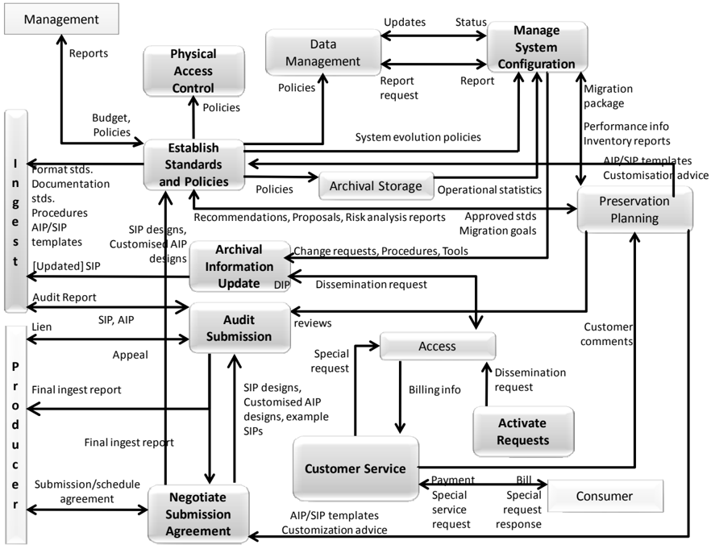

## CCSDS HISTORICAL DOCUMENT

## CCSDS RECOMMENDED PRACTICE FOR AN OAIS REFERENCE MODEL

The Negotiate Submission Agreement function  solicits  desirable  archival  information  for the  OAIS  and  negotiates Submission  Agreements with  Producers.    This  function  also negotiates a data submission schedule with the Producer.  It maintains a calendar of expected Data Submission Sessions that will be needed to transfer one or more SIPs to the OAIS and the  resource  requirements  to  support  their  ingestion.    This  function  receives AIP/SIP templates and customization advice from Preservation Planning and sends SIP designs ,  any customized AIP designs and any example SIPs to  the  Audit Submission function as part of the submission approval process.  It also sends SIP designs and any customized AIP designs to  the  Establish Standards and Policies function for subsequent use by the Ingest function. The data submission formats and procedures must be clearly documented in the Archive's data  submission  policies,  and  the  deliverables  must  be  identified  by  the  Producer  in  the Submission  Agreement.  The  Producer-Archive  Interface  Methodology  Abstract  Standard (ISO 20652:2006) may be applicable here, as may be parts of ISO 15489-1:2001 and ISO/TR 15489-2:2001, and other ISO standards.

The Manage System Configuration function provides system engineering for the Archive system  to monitor continuously the functionality of the entire  Archive  system  and systematically  control  changes  to  the  configuration.    This  function  maintains  integrity  and traceability  of  the  configuration  during  all  phases  of  the  system  life  cycle.    It  also  audits system  operations,  system  performance,  and  system  usage.    It  sends report  requests for system  information  to  Data  Management  and  receives reports ;  it  receives operational statistics from  Archival  Storage.    It  summarizes  those  reports  and  periodically  provides OAIS performance  information and  Archive  holding inventory  reports to  Preservation Planning.    It  receives migration  packages from  Preservation  Planning,  based  on  which  it sends change requests, procedures and tools to the Archival Information Update function.  It receives system evolution policies from the Establish Standards and Policies function.  Based on these inputs it develops and implements plans for system evolution.

The Archival Information Update function provides a mechanism for updating the contents of  the  Archive.    It  receives change  requests , procedures and tools from  Manage  System Configuration.  It provides updates by sending a dissemination request to Access, updating the contents of the resulting DIPs and resubmitting them as SIPs to Ingest.

The Physical  Access  Control function  provides  mechanisms  to  restrict  or  allow  physical access (doors, locks, guards) to elements of the Archive, as determined by Archive policies.

The Establish  Standards  and  Policies function is responsible for establishing and maintaining the Archive system standards and policies.  It receives budget information and policies such as the OAIS charter, scope, resource utilization guidelines, and pricing policies from Management. It provides Management with periodic reports . It receives recommendations for  Archive  system  enhancement, proposals for  new  Archive  data standards, and periodic risk analysis reports from Preservation Planning. It will have to face risks from unforeseen events (unplanned down time due to network outage, software bugs, hardware  failure,  human  error,  disk  crash,  etc.)  and  make  the  appropriate  decisions  to minimize the risk of not fulfilling the Archive's commitments.  It also receives performance information and Archive holding inventories from Manage System Configuration.  Based on

## CCSDS HISTORICAL DOCUMENT

## CCSDS RECOMMENDED PRACTICE FOR AN OAIS REFERENCE MODEL

these inputs and analyses, Archive standard s and policies are  established and sent to other Administration  functions  and  the  other  Functional  Entities  for  implementation.    The standards  includ e  format  standards,  documentation  standards and  the procedures to  be followed during the Ingest process.  In response to the recommendations from Preservation Planning on AIP updates it provides approved standards and migration goals to Preservation Planning    (Preservation  Planning  will  respond  with migration  packages to  the  Manage System  Configuration  function).  The  Establish  Standards  and  Policies  function  will  also develop storage  management  policies (for  the  Archival  Storage  hierarchy),  including migration  policies  to  assure  that  Archive  storage  formats  do  not  become  obsolete,  and database  administration  policies.    It  will  develop disaster  recovery  policies .  It  will  also determine security policies for the contents of the Archive, including those affecting Physical Access Control, such as DRM,  and the application of error control techniques throughout the Archive.

The Audit  Submission function  will  verify  that  submissions  ( SIP  or  AIP )  meet  the specifications of the Submission Agreement. In the case of the SIP and in the case of the AIP it  verifies  the  understandability  by  the  Designated  Community.    This  function  receives AIP/SIP  reviews from  Preservation  Planning  and  may  also  involve  an  outside  committee (e.g., science and technical review); these reviews report on whether the AIP/SIP templates have been properly applied in Ingest.  The audit process must verify that the quality of the data meets the requirements of the Archive and the review committee.  It must verify that there is adequate Representation Information and PDI to ensure that the Content Information is understandable and independently usable to the Designated Community.  The formality of the  review  will  vary  depending  on  internal  Archive  policies.    The  Audit  process  may determine that some portions of the SIP are not appropriate for inclusion in the Archive and must  be  resubmitted  or  excluded.    An audit  report is  provided  to  Ingest.    After  the  audit process is completed, any liens are reported to the Producer, who will then resubmit the SIP to Ingest or appeal the decision to Administration. In the case of producing a new version of an  AIP  this  function  checks  that  the  migration  goals  have  been  met.  This  could  include checking usability and checking evidence for Authenticity such as ensuring maintenance of Transformational Information Properties (see 5.2). After the audit is completed, a final ingest report is  prepared  and  provided  to  the  Producer  and  to  Negotiate  Submission  Agreement. Audit methods potentially include sampling, periodic review, and peer review.

The Activate Requests function maintains a record of event-driven requests and periodically compares it to the contents of the Archive to determine if all needed data is available.  If needed data is available, this function generates a dissemination request that is sent to Access.  This function can also generate orders on a periodic basis where the length of the period is defined by the Consumers or on the occurrence of an event (e.g., a database update).

The Customer Service function will create, maintain and delete Consumer accounts.  It will collect billing  information from  Access  and  will  send bills and  collect payment from Consumers  for  the  utilization  of  Archive  system  resources.    It  will  respond  to  general information  requests.    This  function  will  also  collect  and  respond  to  feedback  on  Access services  and  products.    Customer  Service  will  summarize  these comments and  make  them available.

## 4.1.1.6 Preservation Planning

The functions of the Preservation Planning Functional Entity are illustrated in figure 4-6.

Figure 4-6:  Functions of the Preservation Planning Functional Entity

The Monitor  Designated  Community function  interacts  with  Archive  Consumers  and Producers to track changes in their service requirements and available product technologies . Such  requirements  might  include  data  formats,  media  choices,  preferences  for  software packages, new computing platforms, and mechanisms for communicating with the Archive. This function may be accomplished via surveys ,  via  a  periodic  formal  review  process,  via community workshops where feedback is solicited or by individual interactions.  It provides reports , requirements alerts and emerging standards to the Develop Preservation Strategies and Standards function.  It sends preservation requirements to Develop Packaging Designs.

The Monitor Technology function is responsible for tracking emerging digital technologies, information  standards  and  computing  platforms  (i.e.,  hardware  and  software)  to  identify technologies which could cause obsolescence in the Archive's computing environment and prevent  access  to  some  of  the  Archive's  current  holdings.    This  function  may  contain  a prototyping capability for better evaluation of emerging technologies and receive prototype requests from  Develop  Preservation  Strategies  and  Standards  and  from  Develop  Package

## CCSDS RECOMMENDED PRACTICE FOR AN OAIS REFERENCE MODEL

Designs  and  Migration  Plans.    This  function  sends reports , external  data standards , prototype results and technology alerts to Develop Preservation Strategies and Standards.  It also sends prototype results to Develop Package Designs and migration plans.

The Develop Preservation Strategies and Standards function is responsible for developing and recommending strategies and standards, and for assessing risks, to enable the Archive to make informed tradeoffs  as  it  establishes  standards,  sets  policies,  and  manages  its  system infrastructure. Risk management is a suitable methodology to provide balance between needs and  means,  and  between  immediate  activity  imperatives  and  Long  Term  objectives  of  the preservation mission. Risk management can also provide useful metrics to quantify elements that are usually difficult to estimate in the decision-making process.  This function provides periodic risk analysis reports to Administration addressing expected risks and their possible mitigation based on current, and on proposed updates, to operating policies, procedures and standards. This function receives reports , requirements alerts and emerging standards from the  Monitor  Designated  Communities  and  Monitor  Technology  functions,  and  it  receives operating  policies,  procedures  and  standards , performance  information , inventory  reports and  summarized consumer  comments from  Administration.    From  the  information  this function  identifies  those  changes  that  would  require  migration  of  some  current  Archive holdings  or  new  submissions,  for  example  updating  AIPs  with  additional  or  revised Representation Information.  This function sends recommendations on system evolution and on AIP updates to Administration This function also receives external data standards from Monitor Technology and produces profiles of those standards that are sent to Administration as proposals on  their  potential  usage.    This  function  also  receives issues from  Develop Packaging Designs and migration plans in the case of unanticipated submission requirements, and responds with advice to handle the new requirements.

The Develop Packaging Designs and Migration Plans function develops new Information Package designs and detailed migration plans and prototypes, to implement Administration policies and directives.  Migration of the Content Information could involve changes to the Content  Data  Object  and/or  the  Representation  Information.  This  activity  also  provides advice  on  the  application  of  these  Information  Package  designs  and  Migration  plans  to specific  Archive  holdings  and  submissions.    This  function  receives  Archive approved standards and migration goals from Administration.  The standards include format standards, metadata standards and documentation standards.  It applies these standards to preservation requirements and provides AIP and SIP template designs to Administration.  This function also provides customization advice and AIP/SIP review to Administration on the application of  those  designs.    If  this  function  encounters  submissions  that  are  not  covered  by  existing standards  and  procedures,  it  can  send issues to  Develop  Preservation  Strategies  and Standards  and  receive advice ,  including  new  standards,  to  assist  in  meeting  the  new submission requirements.

The preservation  requirements and  the migration  goals received  by  this  function  tend  to involve transformations of the AIP, including transformations of the Content Information to avoid loss  of  access  due  to  technology  obsolescence  (see  section  5).    The  response  to  the migration goals may involve the development of new AIP designs, prototype software, test plans, community review plans and implementation plans for phasing in the new AIPs.  This

## CCSDS HISTORICAL DOCUMENT

## CCSDS RECOMMENDED PRACTICE FOR AN OAIS REFERENCE MODEL

process  may  call  on  expertise  or  resources  from  other  functions  within  Preservation Planning,  such  as  prototype  development  from  Monitor  Technology.  This effort also will require  consultation  from  the  other  functional  areas  and  from  the  Designated  Community. Once  the  migration  plan,  associated  AIP  designs,  and  software  have  been  tested  and approved  by  Administration,  this  function  will  send  the  entire migration  package to Administration. These proposals for the migration plan are received and approval granted (or denied) by  the 'Establish Standards  and  Policies' function of 'Administration'.  The 'Preservation Planning' entity develops, validates and supplies the migration packages on the basis of this approval;  Administration schedules and performs the migration plans.

## 4.1.1.7 Access

The functions of the Access Functional Entity are illustrated in figure 4-7.

Figure 4-7:  Functions of the Access Functional Entity

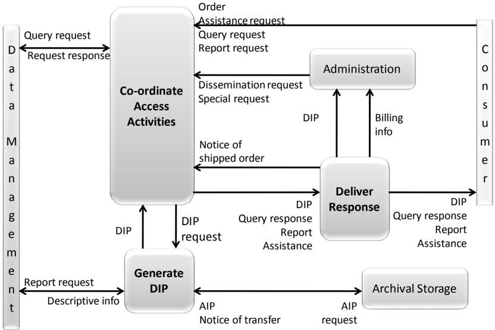

The Coordinate  Access  Activities function provides  one  or more  interfaces to the information holdings of the Archive.  This interface will normally be via computer network or dial-up link to an on-line service, but might also be implemented in the form of a walk-in facility,  printed  catalog  ordering  service,  or  fax-back  type  service.    Three  categories  of Consumer  requests  are distinguished: query requests, which  are executed in Data Management  and  return  immediate query  responses for  presentation  to  the  user; report requests, which may require a number of queries and produce formatted reports for delivery

## CCSDS HISTORICAL DOCUMENT

## CCSDS RECOMMENDED PRACTICE FOR AN OAIS REFERENCE MODEL

to  the  Consumer;  and orders, which  may  access  either  or  both  Data  Management  and Archival Storage to prepare a formal Dissemination Information Package (DIP) for  on-  or off-line delivery.  An order may be an Adhoc Order that is executed only once, or an Event Based Order that will be maintained by the Activate Requests function in Administration, and initiated by a dissemination request that  may result in periodic deliveries of requested items. The Archival Information Update function in Administration also submits dissemination requests to obtain DIPs needed to perform its update functions.  Other special request types are allowed, but are not detailed.  This function will determine if resources are available to perform a request, assure that the user is authorized to access and receive the requested  items,  and  notify  the  Consumer  that  a  request  has  been  accepted  or  rejected (possibly with an estimate of request cost and an option to cancel the request).  It will then transfer the request to Data Management or to the Generate DIP function for execution.  This function also provides assistance to  OAIS Consumers including providing status of orders and other Consumer support activities in response to an assistance request .

The Generate DIP function accepts a dissemination request , retrieves the AIP from Archival Storage, and moves a copy of the data to a temporary storage area for further processing. This  function  also  transmits  a report  request to  Data  Management  to  obtain Descriptive Information needed for the DIP.   If special processing is required, the Generate DIP function accesses Data Objects in temporary storage and applies the requested processes.  The types of  operations  which  may  be  carried  out  include  statistical  functions,  sub-sampling  in temporal or spatial dimensions, conversions between different data types or output formats, and  other  specialized  processing  (e.g.,  image  processing).  Inserting  DRM  information  and filtering  the  personal  data  to  ensure  consistency  with  the  user  rights  also  come  under  this type of operation.  This function places the completed DIP response in the temporary storage area and notifies the Coordinate Access Activities function that the DIP is ready for delivery. It is worth noting that in some implementations the AIP content or the DIPs could be kept in temporary storage for ready availability.

The Deliver  Response function  handles  both  on-line  and  off-line  deliveries  of  responses ( DIPs , query  responses , reports and assistance )  to  Consumers.    For  on-line  delivery,  it accepts a response from Coordinate Access Activities and prepares it for on-line distribution in  real  time  via  communication  links.    It  identifies  the  intended  recipient,  determines  the transmission  procedure  requested,  places  the  response  in  the  temporary  storage  area  to  be transmitted, and supports the on-line transmission of the response.  For off-line delivery it retrieves the response from the Coordinate Access Activities function, prepares packing lists and  other  shipping  records,  and  then  ships  the  response.    When  the  response  has  been shipped, a notice of shipped order is  returned to the Coordinate Access Activities function and billing information is submitted to Administration.

## 4.1.2 DATA FLOW DIAGRAMS

The flow of data items among the OAIS functional entities is diagrammed in this subsection. Figure  4-8  shows  the  more  significant  data  flows.    To  avoid  complicating  this  figure,  the Administration  data  flows,  which  are  generally  background  activities,  are  isolated  to  an Administration context diagram, figure 4-9.  Data flows associated with Common Services are implicit in the illustrated functions, and are therefore not shown.

Figure 4-8:  OAIS Data Flow Diagram

Figure 4-9:  Administration Context Diagram

A significant data flow that is not obvious is that which involves the update of AIPs in order to ensure they are adequate for preservation of the Content Information.

For  example  consider  the  case  of  needing  to  add  Representation  Information  because  of changes in the Knowledge Base of the Designated Community. Although the Data Object that  is  being  preserved  is  not  being  changed,  the  need  to  change  the  Representation Information  means  the  Content  Information  is  being  changed.  This  is  in  general  terms  a Migration of the AIP.

- -Monitoring of the Designated Community  and  general environment ( reports , requirements alerts, emerging standards, external data standards , prototype results and technology  alerts) shows  the  need  to  update  Representation  Information  for  a particular AIP, which could itself be a collection of objects.
- -Preservation Planning provides recommendations,  proposals  and risk analysis reports to  Administration  which  evaluates  the  recommendations  and  decides  what options to look at in more detail, and sends that decision to Preservation Planning as approved standards, preservation requirements and migration goals .

- -Preservation  Planning  then  produces  detailed  plans  based  on  the  instructions  from Administration  and  passes  these  detailed  plans  back  ( AIP  templates,  migration packages and customization advice ) to Administration.
- -Administration then implements these plans (via Manage System Configuration). In general this will require an update (logically or physically) of one or more AIPs. The next steps may be done logically; i.e., the AIP does not necessarily have to be moved in any way.
- -Instructions are then sent to Access ( dissemination request ) to send the original AIP out as a DIP  which  is then received by Ingest, together with the updated Representation Information.
- -On Ingest  a  new  AIP  version  is  created  (in  Generate  AIP)  containing  the  updated Representation Information.

## 4.2 INFORMATION MODEL

This subsection builds on the concepts presented in section 2 to further describe the types of information that are exchanged and managed within the OAIS.  This subsection also defines the  specific  Information  Objects  that  are  used  within  the  OAIS  to  preserve  and  access  the information entrusted to the Archive.  This more detailed model of OAIS-related Information Objects  is  intended  to  aid  the  architect  or  designer  of  future  OAIS  systems.    The  objects discussed  in  this  subsection  are  conceptual  and  should  not  be  taken  to  imply  any  specific implementations.

As  discussed  in  section  2,  the  primary  goal  of  an  OAIS  is  to  preserve  information  for  a designated community over an indefinite period of time.  In order to preserve this information an OAIS must store significantly more than the contents of the object it is expected to preserve. This subsection analyzes those information requirements used to describe the object classes of data associated with an OAIS.  This subsection uses Unified Modeling Language (UML) [D3] object  model  diagrams  to  illustrate  the  concepts  discussed  in  the  text.    An  overview  of  the notation used and critical object modeling concepts is presented in annex C of this document. An understanding of this notation is required for a full understanding of the concepts presented in this subsection.

Subsection  4.2.1  provides  a  model  of  the  information  required  for  effective  Long  Term Preservation of information. Subsection  4.2.2 describes the conceptual objects  and containers that represent the contents of an OAIS.

## 4.2.1 LOGICAL MODEL FOR ARCHIVAL INFORMATION

## 4.2.1.1 Information Object

A  basic  concept  of  the  OAIS  Reference  Model  is  the  concept  of  information  being  a combination  of  Data  and  Representation  Information.    The  UML  diagram  in  figure  4-10 illustrates this concept.  The Information Object is composed of a Data Object that is either

## CCSDS RECOMMENDED PRACTICE FOR AN OAIS REFERENCE MODEL

physical or digital, and the Representation Information that allows for the full interpretation of the data into meaningful information.  This model is valid for all the types of information in an OAIS.

Figure 4-10:  Information Object

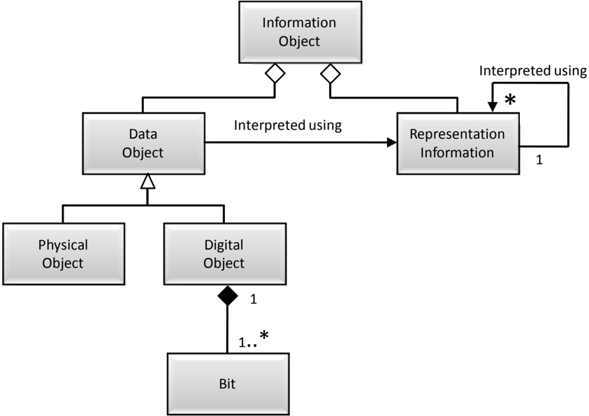

## 4.2.1.2 Data Object

The Data Object may be expressed as either a physical object (e.g., a moon rock) together with  some  Representation  Information,  or  it  may  be  expressed  as  a  digital  object  (i.e.,  a sequence of bits) together with the Representation Information giving meaning to those bits.

## 4.2.1.3 Representation Information

The Representation Information accompanying a digital object, or sequence of bits, is used to provide additional meaning.  It typically maps the bits into commonly recognized data types such as character, integer, and real and into groups of these data types.  It associates these with  higher-level  meanings:  this  includes  the  description  of  the,  possibly  complex,  ways objects  are  interrelated  (for  example,  Representation  Information  could  indicate  that  three numbers represent temperature, latitude  and  longitude;    and  they  are  expressed  in  degrees Celsius and angular degrees; and they are interrelated in that the temperature is measured at the specified longitude/latitude).

## CCSDS RECOMMENDED PRACTICE FOR AN OAIS REFERENCE MODEL

The Representation Information accompanying a physical object like a moon rock may give additional meaning, as a result of some analysis, to the physically observable attributes of the rock.    This  information  may  have  been  developed  over  time  and  the  results,  if  provided, would be part of the Information Object.

The remainder of this subsection focuses on the Representation Information object when the Data Object is specialized as a Digital Object.

## 4.2.1.3.1 Representation Information Types

The Digital Object, as shown in figure 4-10, is itself composed of one or more bit sequences. The purpose of the  Representation  Information  object  is  to  convert  the  bit  sequences  into more  meaningful  information.    It  does  this  by  describing  the  format,  or  data  structure concepts,  which  are  to  be  applied  to  the  bit  sequences  and  that  in  turn  result  in  more meaningful values such as characters, numbers, pixels, arrays, tables, etc.  These common computer data types, aggregations of these data types, and mapping rules which map from the  underlying  data  types  to  the  higher  level  concepts  needed  to  understand  the  Digital Object  are  referred  to  as  the Structure  Information of  the  Representation  Information object.  These structures are commonly identified by name or by relative position within the associated bit sequences. The Structure Information is often referred to as the 'format' of the digital object.

The Representation Information provided by the Structure Information is seldom sufficient. Even in the case where the Digital Object is interpreted as a sequence of text characters, and described  as  such  in  the  Structure  Information,  the  additional  information  as  to  which language  was  being  expressed  should  be  provided.    This  type  of  additional  required information is referred to as the Semantic Information .  When dealing with scientific data, for example, the information in the Semantic Information can be quite varied and complex. It will include special meanings  associated  with all the elements  of the Structural Information, operations that may  be  performed  on  each  data  type, and  their interrelationships.  Figure 4-11 emphasizes the fact that Representation Information contains both Structure  Information  and  Semantic  Information,  although  in  some  implementations  the distinction is subjective. It is useful to remember that the Semantic Information associated with parts of some digitally encoded information is independent of the format. For example, the meaning of numbers in a data file is independent of whether they are encoded as scaled integers or as IEEE Reals; the meaning of words in a document is independent of whether the document is Word or PDF.

This  figure  also  shows  that  Representation  Information  may  contain  Other  Representation Information. This indicates that the taxonomy of Representation Information presented here is far from complete. For example software, algorithms, encryption, written instructions and many  other  things  may  be  needed  to  understand  the  Content  Data  Object,  all  of  which therefore would be, by definition, Representation Information, yet would not obviously be either  Structure  or  Semantics.    Information  defining  how  the  Structure  and  the  Semantic Information  relate  to  each  other,  or  software  needed  to  process  a  database  file  would  be regarded as Other Representation Information.

Structure Information, Semantic Information and Other Representation Information are both sub-types and components of Representation Information.

Representation Information is an Information Object that may have its own Data Object and its  own  Representation  Information  associated  with  understanding  each  Data  Object,  as shown in a compact form by the 'interpreted using' association. The resulting set of objects can be referred to as a Representation Network .

As  an  example,  ISO  9660  (reference  [D10])  describes  text  as  conforming  to  the  ASCII standard,  but  it  does  not  actually  describe  how  ASCII  is  to  be  implemented.    It  simply references the ASCII standard which is additional Representation Information that is needed for a full understanding.  Therefore the ASCII standard is a part of the Representation Net associated with ISO 9660 and needs to be obtained by the OAIS in some form, or the OAIS needs to track the availability  of  this  standard  so  that  it  may  take  appropriate  steps  in  the future to ensure its ISO 9660 Representation Information is fully understandable.

Figure 4-11:  Representation Information Object

## 4.2.1.3.2 Representation Networks

Representation  Information,  which  is  itself  an  Information  Object,  may  be  expressed  in physical  forms  (e.g.,  a  paper  document)  or  in  digital  forms.    When  the  Representation Information is in digital form, additional Representation Information is needed to understand the  bits  of  the  Representation  Information  as  described  in  the  previous  subsection.    In principle,  this  recursion  continues  until  physical  forms,  which  can  be  understood  by  the Designated Community,  are encountered. For example, Representation Information expressed in ASCII needs the additional Representation Information for ASCII, which might

## CCSDS HISTORICAL DOCUMENT

## CCSDS RECOMMENDED PRACTICE FOR AN OAIS REFERENCE MODEL

be a physical document giving the ASCII standard.  Each item of Representation Information can  have  multiple  components,  including  multiple  referenced  Representation  Information components; each with its own Representation Information.

To preserve the meaning of an Information Object, its Representation Information must also be preserved.  This is most easily accomplished when the Representation Information objects are  expressed  in  forms  that  are  easily  understandable,  such  as  text  descriptions  that  use widely supported standards such as ASCII characters for electronic versions.  One problem with the use of only text descriptions is that such descriptions can be ambiguous.  This is addressed by the use of standardized, formal description languages containing well-defined constructs  with  which  to  describe  data  structures.    These  languages  may  need  to  be augmented  with  text  descriptions  to  convey  fully  the  semantics  of  the  Representation Information.

As the Knowledge Base of the Designated Community changes over time, the Representation Network may need to change accordingly. As noted in 2.2, an OAIS has a choice of whether to collect all the relevant Representation Information or to reference its existence in another trusted or partner OAIS Archive; this is an implementation and organization decision.

The  Content  Information  must  be  defined  and  separated  into  Content  Data  Object  and Representation Information.  It is again an implementation and organization decision related to  the  way  Data Objects are ingested and stored in the OAIS. For example, in the case of performing  arts,  the  Content  Data  Object  may  be  the  score  as  a  PDF  document,  and  the Representation Information would include whatever information is needed to re-perform (as the way to use and understand) the piece, such as the way to display the PDF file, the audio processing  software  needed,  placements  of  hardware  such  as  loudspeakers,  movement directions, and a description of how these relate to each other and to the Content Data Object, each of which may be quite complex, encoded in a separate way, and not easily described either simply as Structure or as Semantics.  Alternatively, the Content Data Object may be multiple Data Objects including the score, the audio processing software needed, placements of  hardware  and  movement  directions.  Each  of  these  Data  Objects  will  have  its  own Representation Information and there will need to be additional Representation Information that describes how the several Data Objects are related.

Two special types of Representation Information are Representation Rendering Software and Access Software. Representation Rendering Software is able to display the Representation  Information  in  understandable  forms.    For  example,  the  file  and  directory structure  of  many  CD-ROMs  conforms  to  ISO  9660.    This  standard  is  Representation Information describing how most CD-ROM file structures are to be implemented, and it may be obtained as a paper document.  However, it may also be obtained as a digital object that needs to be understood as a PDF object.  Rather than actually obtaining the documentation of PDF and writing software to understand the ISO 9660 object, an OAIS may use available PDF display software to render the ISO 9660 documentation humanly visible and readable. In  this  role  the  PDF  display  software  is  referred  to  as  Representation  Rendering  Software because  it is used to render the Representation Information. It also terminates the Representation Network. If the OAIS does not also obtain the associated description of PDF,

## CCSDS RECOMMENDED PRACTICE FOR AN OAIS REFERENCE MODEL

it needs to record and track this fact because when PDF objects are no longer cost-effective for access and display, the ISO 9660 documentation expressed as a PDF object will need to be migrated to a new form.

Access Software presents some or all of the information content of an Information Object in forms  understandable  to  humans  or  systems.    It  may  also  provide  some  types  of  access services,  such  as  displaying,  manipulating,  processing,  or  sub-setting,  to  an  Information Object.  For some types of Digital Objects, such software may be widely available. It is not necessary  for  the  OAIS  to  maintain  or  provide  such  software.    The  OAIS  may  want  to maintain and provide this software for more specialized types of Digital Objects.

Since Access software will incorporate some understanding of the Representation Information,  some  Archives  may  attempt  to  use  Access  Software  as  a  substitute  for  full Representation Information. Access Software source code, which embodies at least a partial understanding of the associated Representation Information, may be used as documentation expressing  such  Representation  Information.    A  problem  with  this  approach  is  that  the desired Representation Information may not be clearly identifiable as it may be mixed with various processing and display algorithms, and may be incomplete since the code assumes an underlying operating environment.  It may be difficult to tell, from the software code, what Representation Information is missing.   The use of Access Software executables, without the source code, such as may occur with proprietary formats, presents a much greater risk for loss  of  information  because  it  is  more  difficult  to  maintain  an  operating  environment  for software than to migrate documentation over time.  The practical use of emulation techniques to  preserve  working  software  is  an  area  of  active  research.    This  is  a  significant  issue  for those  desiring  to  preserve  a  look  and  feel  to  information  access.    Migration  and  software preservation are discussed more fully in section 5.

## 4.2.1.4 Taxonomy of Information Object Classes Used by OAIS

There are many types of information involved in the Long Term Preservation of information in an OAIS.  Each of these types can be viewed as a complete Information Object in that it contains a Data Object and adequate Representation Information to understand the data.  This subsection builds on the discussions in 2.2 about the types of supporting information needed to enable Long Term Preservation and the discussion in the previous subsection on the role of  Representation  Information.    The  information  modeling  in  this  subsection  discusses several types of Information Objects that are used in the OAIS.  The objects are categorized by  their  content  and  function  in  the  operation  of  an  OAIS  including  Content  Information objects,  Preservation  Description  Information  objects,  Packaging  Information  objects,  and Descriptive Information objects.  The following subsections discuss the contents of each of the  types  of  Information  Object.    Figure  4-12  shows  a  taxonomy  of  those  Information Objects used within the OAIS.

## CCSDS RECOMMENDED PRACTICE FOR AN OAIS REFERENCE MODEL

Figure 4-12:  Information Object Taxonomy

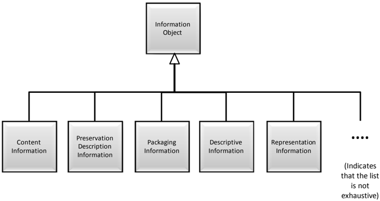

## 4.2.1.4.1 Content Information

The Content Information is the set of information that is the original target of preservation by the OAIS.  Deciding what the Content Information is may not be obvious and may need to be negotiated with the Producer.  The Content Information, which is an Information Object as shown  in  figure 4-12, is the Content  Data  Object  together with its  Representation Information.  The Content Data Object in the Content Information may be either a Digital Object or a Physical Object (e.g., a physical sample, microfilm).  Any Information Object may serve as Content Information.

The  Representation  Information  for  a  digital  Content  Data  Object  (both  semantic  and syntactic) is needed to fully transform the bits into the Content Information.  In principal, this even  extends  to  the  inclusion  of  definitions  (e.g.,  dictionary  and  grammar)  of  any  natural language (e.g., English) used in expressing the Content Information.  Over long time periods the meaning of natural language expressions can evolve significantly in both general and in specific discipline usage.

As a practical matter, the OAIS needs to have enough Representation Information associated with the bits of the Content Data Object in the Content Information that it feels confident that the  members  of  the  Designated  Community  can  enter  the  Representation  Network  with enough knowledge to begin accurately interpreting the Representation Information.  This is a significant risk area  for  an  OAIS,  particularly  for  those  with  an  expert  Designated Community, because jargon and apparently widely understood terms may be short-lived.  In such  cases  extra  care  needs  to  be  exercised  to  ensure  that  the  natural  evolution  of  the Designated Community Knowledge Base does not effectively cause information loss from the Content Information.

As described above for an Information Object in general, the Representation Information can also be viewed as being augmented by Access Software that supports the presentation of the

## CCSDS HISTORICAL DOCUMENT

## CCSDS RECOMMENDED PRACTICE FOR AN OAIS REFERENCE MODEL

Content  Information  to  the  Consumer.    Examples  of  this  type  of  software  include  word processors supporting complex document format representations of Content Information and scientific visualization systems supporting representations of Content Information as a time series or a multidimensional array.  Access Software may include rights enforcement tools that allow the access to protected content. The software uses its knowledge of the underlying Representation Information to provide these services.

Often required information will be embedded in the software packages used by the Designated Community to present and analyze the Content Information.  A reason for preserving working Access Software arises from a convenience factor.  Even with a complete set of Representation Information, practical access to all or part of a digital Content Data Object requires the use of Access Software.  Thus a software module that provides useful access to a digital Content Data Object may be preserved in a working state as a matter of convenience.

This is not difficult to do as long as the environment, which supports the software module, is readily available.  This environment consists of some underlying hardware and an operating system,  various  utilities  that  effectively  augment  the  operating  system  and  storage  and display devices and their drivers.  A change to any of these may cause the software module to  no  longer  function,  to  function  incorrectly,  or  to  be  unable  to  present  results  to  the application or human user.  The complexity of these interactions is what traditionally makes the preservation of working software such an arduous task.

In  summary,  the  use  of  Access  Software  to  replace  Representation  Networks  is  attractive from the point of view of minimizing the resources needed to ingest data and provide current users  with  access  to  data.    However,  the  reliance  on  working  software  can  provide  major problems for Long Term Preservation when that software ceases to function.  Indefinite Long Term  information  preservation  requires  a  full and  understandable  description  of the Representation  Information.    Subsection  5.2  (Preservation  of  Access  and  Use  Services) discusses  some  techniques  that  can  be  used  to  preserve  software  over  time  and  the  risks associated with this approach.

An important function of the OAIS is deciding what parts of the Content Information are the Content  Data  Object  and  what  parts  are  the  Representation  Information.    This  aspect  is critical  to  a  clear  understanding  of  what  is  being  preserved.    The  identification  of  digital Content Information with its Representation Information objects can be addressed by a series of steps, as follows:

- 1) Identify the bits comprising the Content Data Object of the Content Information.
- 2) Identify a Representation Information object that, in some way, addresses all the bits of the Content Data Object and converts them into more meaningful information.
- 3) For the Representation Information object identified, examine its content to identify if it  requires  additional  Representation  Information  objects.    If  it  does,  obtain  the required  Representation  Information  objects.    Repeat  this  step  at  least  until  no additional  Representation  Information  objects  are  identified  as  required  for  the Designated Community.

## CCSDS HISTORICAL DOCUMENT

## CCSDS RECOMMENDED PRACTICE FOR AN OAIS REFERENCE MODEL

- 4) Of the Representation Information objects addressed in step 3, for each that is held as a Digital Object, identify any required Representation Information object and repeat steps 3 and 4 until no new Representation Information objects are identified.
- 5) The  Content  Information  consists  of  the  Content  Data  Object  and  each  of  the Representation Information objects identified in steps 2 through 4.

As an example of this practice, consider an electronic file containing a sequence of values obtained from a sensor looking at the Earth's environment.  There is a second file, encoded using ASCII, which provides information on how to understand the first file.  It describes how to interpret the bits of the first file to obtain meaningful numbers.  It explains what these numbers mean in terms of the physics of the observation being conducted.  It provides the date  and  time  period  over  which  the  observations  were  made,  an  average  value  for  the observed values, and who made the observations.  These two files are submitted to an OAIS for preservation.

Assume  that  the  OAIS  determines  that  the  Content  Information  to  be  preserved  is  the observed  bits  together  with  their  values  as  numbers  and  the  physical  meaning  of  these numbers.  This information is conveyed by the bit sequence within the first file together with the Representation Information from the second file that is needed to transform the first file's bits  into  meaningful  physical  values.    Neither  the  first  file's  underlying  media  nor  the particular  file  system  carrying  the  bits  is  part  of  the  Content  Information  in  this  example. Only part of the second file's content is considered a part of the Content Information and this is  the  part  that  enables  the  transformation  of  the  bits  from  the  first  file  into  meaningful physical values.  In fact this second file does not carry all the Representation Information needed to make this transformation, because the following additional information is needed:

- -information  that  the  second  file  is  encoded  in  ASCII  so  that  it  can  be  read  as meaningful characters;
- -information on how the characters are used to express the transformations from bits to numbers to meaningful physics values.

This  information,  typically  referred  to  as  a  combination  of  format  information  and  data dictionary  information,  may  also  include  instrument  calibration  values  and  information  on how the calibrations are to be applied.  All this information may be widely understandable once the ASCII characters are visible because it has all been expressed in English (or some other  natural  language),  or  some  of  it  may  be  in  more  structured  forms  that  will  need additional Representation Information to be understood.

Therefore, the Representation Information of the second file needs additional Representation Information,  and  this  information  may  need  additional  Representation  Information,  etc., forming a linked set of Representations of Representations.  This is a good example of the complex Representation Net.

In the example above, there was a determination that the Content Information consisted of the observed sensor values and their meanings.  This is by no means the only choice that could have been made.  It could just as easily have been decided that the Content Data Object of the desired

## CCSDS RECOMMENDED PRACTICE FOR AN OAIS REFERENCE MODEL

Content  Information  was  the  bit  sequences  within  the  first  file  together  with  the  all  the  bit sequences within the second file.  The fact that some of these latter bit sequences are used to interpret the first file's bit sequences is just an example of a set of bits that is somewhat selfdescribing.   It is irrelevant that some of the bits in the second file are the basis for information on the date and time period over which the observations were made, the average value for the observed values, and who made the observations.  Once it has been determined that all these bits constitute  the  Content  Data  Object  of  the  Content  Information,  then  the  Representation Information  is  that  information  needed  to  turn  them  into  meaningful  information.    How extensive  this  meaning  is  to  be  carried  and  how  far  the  Representation  Network  needs  to  be carried are local issues for the OAIS and its related Producer and Consumer communities.

As  another  example,  consider  an  electronic  file  containing  a  word  processing  document. This binary Data Object will have a complex format that can be seen as a document only after it has been viewed through use of associated Representation Information.  In common practice, this viewing will be provided by Access Software that can use internal, or external, Representation Information.   The Content Data Object is most likely to be defined as the bit sequence content of the electronic file.  The Representation Information is a description of the word processing format, at a minimum, and may include information deemed needed to adequately  understand  the  meaning  of  the  document  as  viewed.    If  the  word  processing format is proprietary, and if adequate Representation Information cannot be acquired which will  at  the  least  allow  simply  viewing,  to  ensure  its  Long  Term  Preservation  it  may  be necessary  to  migrate  the  document  to  another  (possibly  non-proprietary)  format  for  which Representation Information is more openly available.

As a variation on the above example, it may be decided that the Content Information to be preserved is not the full word processing view of the document, but simply a sequence of text paragraphs that can be adequately represented by ASCII characters.  In this case, the OAIS may decide to extract the relevant text characters and save them as a text file.  The Content Data Object would be defined, most likely, as the bit stream made up of these characters. The Representation Information would be a description of how to interpret this bit stream as characters, together with any additional information deemed needed to adequately understand the meaning of the text.

## 4.2.1.4.2 Preservation Description Information

In addition to Content  Information, the  Archival  Information  Package  must  include information  that  will  support  the  trust  in,  the  access  to  and  context  of  the  Content Information over an indefinite period of time.  The specific set of Information Objects, which are required for this function, is collectively called Preservation Description Information (PDI).    The  PDI  must  include  information  that  is  necessary  to  adequately  preserve  the particular  Content  Information  with  which  it  is  associated.    It  is  specifically  focused  on describing  the  past  and  present  states  of  the  Content  Information,  ensuring  it  is  uniquely identifiable, and ensuring it has not been unknowingly altered.

This information is typical for all types of Archives and has been classified in the context of traditional Archives.  However, the class definitions must be extended for digital Archives.

## CCSDS HISTORICAL DOCUMENT

## CCSDS RECOMMENDED PRACTICE FOR AN OAIS REFERENCE MODEL

The  following  definitions  are  largely  based  on  the  categories  discussed  in  the  paper 'Preserving Digital Information' (reference [D2]).  The relationship between the concepts in OAIS  Reference  Model  and  the  Preserving  Digital  Information  paper  are  discussed  in annex B of this document.  Table 4-1 provides illustrative examples of this information for various popular Content Information types.

- -Reference Information identifies, and if necessary describes, one or more mechanisms used to provide assigned identifiers for the Content Information.  It also provides those identifiers that allow outside systems to refer, unambiguously, to this particular  Content  Information.    Examples  of  these  systems  include  taxonomic systems, reference systems and registration systems.  In the OAIS Reference Model most if not all of this information is replicated in Package Descriptions, which enable Consumers to access Content Information of interest.
- -Context Information documents the relationships of the Content Information to its environment.    This  includes  why  the  Content  Information  was  created  and  how  it relates to other Content Information objects existing elsewhere.
- -Provenance Information documents  the  history  of  the  Content  Information.    This tells the origin or source of the Content Information, any changes that may have taken place since it was originated, and who has had custody of it since it was originated, providing an audit trail  for  the  Content  Information.    This  gives  future  users  some assurance as to the likely reliability  of  the  Content  Information  as  it  contributes  to evidence  supporting  Authenticity.    Provenance  can  be  viewed  as  a  special  type  of context information.
- -Fixity Information provides the Data integrity checks or validation/verification keys used to ensure that the particular Content Information object has not been altered in an  undocumented  manner.  Fixity  Information  includes  special  encoding  and  error detection schemes that are specific to instances of Content Objects. Fixity Information  does  not  include  the  integrity  preserving  mechanisms  provided  by  the OAIS underlying services, error protection supplied by the media and device drivers used by Archival Storage.  The Fixity Information may specify minimum quality of service requirements for these mechanisms.
- -Access  Rights  Information identifies  the  access  restrictions  pertaining  to  the Content  Information,  including  the  legal  framework,  licensing  terms,  and  access control. It contains the access and distribution conditions stated within the Submission Agreement, related to both preservation (by the OAIS) and final usage (by  the  Consumer).  It  also  includes  the  specifications  for  the  application  of  rights enforcement measures.

These classifications provide a minimum set of PDI; they do not specify a data structure.

Table 4-1:  Examples of PDI

| Content Information Type    | Reference                                                                           | Provenance                                                                                                                                                                                                                                                                                                                | Context                                                                             | Fixity                                                  | Access Rights                                                                                                                                                                                                                                                                                                                                                |
|-----------------------------|-------------------------------------------------------------------------------------|---------------------------------------------------------------------------------------------------------------------------------------------------------------------------------------------------------------------------------------------------------------------------------------------------------------------------|-------------------------------------------------------------------------------------|---------------------------------------------------------|--------------------------------------------------------------------------------------------------------------------------------------------------------------------------------------------------------------------------------------------------------------------------------------------------------------------------------------------------------------|
| Space Science Data          | • Object identifier • Journal reference • Mission, instrument, title, attribute set | • Instrument description • Principal Investigator • Processing history • Storage and handling history • Sensor description • Instrument • Instrument mode • Decommutati on map • Software interface specification • Information Property Description                                                                      | • Calibration history • Related data sets • Mission • Funding history               | • CRC • Checksum • Reed- Solomon coding                 | • Identification of the properly authorized Designated Community (Access Control) • Permission grants for preservation and for distribution • Pointers to Fixity and Provenance Information (e.g., digital signatures, and rights holders)                                                                                                                   |
| Digital Library Collections | • Bibliographic description • Persistent identifier                                 | • For scanned collections: • metadata about the digitization process • pointer to master version • For born- digital publications: • pointer to the digital original • Metadata about the preservation process: • pointers to earlier versions of the collection item • change history • Information Property Description | • Pointers to related documents in original environme nt at the time of publication | • Digital signature • Checksum • Authenticity indicator | • Legal framework(s) • Licensing offers • Specifications for rights enforcement measures applied at dissemination time • Permission grants for preservation and for distribution • Information about watermarking applied at submission and preservation time • Pointers to Fixity and Provenance Information (e.g., digital signatures, and rights holders) |

## CCSDS HISTORICAL DOCUMENT

## CCSDS RECOMMENDED PRACTICE FOR AN OAIS REFERENCE MODEL

| Content Information Type   | Reference                                                    | Provenance                                                                       | Context                                                | Fixity                                      | Access Rights                                                                                                                                                                                                                                |
|----------------------------|--------------------------------------------------------------|----------------------------------------------------------------------------------|--------------------------------------------------------|---------------------------------------------|----------------------------------------------------------------------------------------------------------------------------------------------------------------------------------------------------------------------------------------------|
| Software Package           | • Name • Author/ Originator • Version number • Serial number | • Revision history • Registration • Copyright • Information Property Description | • Help file • User guide • Related software • Language | • Certificate • Checksum • Encryption • CRC | • Designated Community • Legal framework(s) • Licensing offers • Specifications for rights enforcement measures applied at dissemination time • Pointers to Fixity and Provenance Information (e.g., digital signatures, and rights holders) |

The OAIS needs to explicitly decide what the exact definition of Content Information is in order to be able to ensure that it also has the PDI needed to preserve the Content Information. Once the Content Information has been determined, it is possible to assess the Preservation Description Information.

## 4.2.1.4.3 Packaging Information

The Packaging Information is that information which, either actually or logically, binds or relates  the  components  of  the  package  into  an  identifiable  entity  on  specific  media.    For example, if the Content Information and PDI are identified as being the content of specific files in a TAR file, then the Packaging Information may include the name of the TAR file and the fact that it is a TAR file including details of any specific encoding. On the other hand if the Content Information and PDI are files on a CD-ROM, then the Packaging Information may include  the  ISO  9660  volume/file  structure  on  the  CD-ROM.    These  choices  are  the subject  of  local  Archive  definitions  or  conventions.    The  Packaging  Information  does  not necessarily  need  to  be  preserved  by  an  OAIS  since  it  does  not  contribute  to  the  Content Information  or  the  PDI.    However,  there  are  cases  where  the  OAIS  may  be  required  to reproduce the original submission exactly.  In this case the Content Information is defined to include all the bits submitted.

The  OAIS  should  also  avoid  holding  PDI  or  Content  Information  only  in  the  naming conventions of directory or file name structures.  These structures are most likely to be used as Packaging Information.  Packaging Information is not preserved by all Digital Migrations. Any information saved in file names or directory structures may be lost when the Packaging Information is altered.  The subject of Packaging Information is an important consideration to the Migration of Information within an OAIS to newer media.  This subject is addressed in detail in section 5 of this document.

## 4.2.1.4.4 Descriptive Information

The  Information  Objects  described  previously  in  this  section  provide  the  information necessary  to  enable  the  Long  Term  Preservation  function  of  the  Archive.    In  addition  to preserving  information,  the  OAIS  must  provide  adequate  features  to  allow  Consumers  to locate information of potential interest, analyze that information, and order desired information.  This is accomplished through a specialization of the Information Object called Descriptive  Information,  which  contains  the  data  that  serves  as  the  input  to  documents  or applications called Access Aids . The Descriptive Information is generally derived from the Content Information and PDI.  The Descriptive Information can be viewed as an index to enable  efficient  access  to  the  associated  Information  Package  via  associated  Access  Aids. Access Aids are  documents or applications that can be used to locate, analyze, retrieve, or order information from the OAIS.

## 4.2.2 LOGICAL MODEL OF INFORMATION IN AN OPEN ARCHIVAL INFORMATION SYSTEM (OAIS)

The previous subsection defines the types of Information Objects that are needed by an OAIS to enable the Long Term Preservation of information and effective access to the preserved information by the Designated Community.  This subsection uses those Information Object descriptions  to  model  the  conceptual  information  structures  required  to  accomplish  these functions. The  models  presented  in this subsection are not intended to imply  an implementation,  but  rather  to  highlight  the  relationship  among  the  types  of  information needed in the archival process.

## 4.2.2.1 Information Package

The  conceptual  structure  for  supporting  Long  Term  Preservation  of  information  is  the Information  Package.    An  Information  Package  is  a  container  that  contains  two  types  of Information Objects, the Content Information and the Preservation Description Information (PDI);  the  Information  Package  can  be  associated  with  two  other  types  of  Information Objects,  Packaging  Information  and  Package  Descriptions.    There  are  several  types  of Information Packages that are used within the archival process.  These Information Packages may be used to structure and store the OAIS holdings; to transport the required information from the Producer to the OAIS, or to transport requested information between the OAIS and Consumers.  There are differing information requirements for each of these functions.  The UML diagram in figure 4-13 illustrates the conceptual view of an Information Package.  This UML diagram shows that an Information Package contains zero or one Content Information objects,  zero  or  more  PDI  objects,  and  is  associated  with  exactly  one  piece  of  Packaging Information,  which  identifies  and  delimits  the  Information  Package.    The  Information Package is also associated with one or more Package Descriptions that describe the Content Object to enable efficient access.

## CCSDS HISTORICAL DOCUMENT

## CCSDS RECOMMENDED PRACTICE FOR AN OAIS REFERENCE MODEL

Figure 4-13:  Information Package Contents

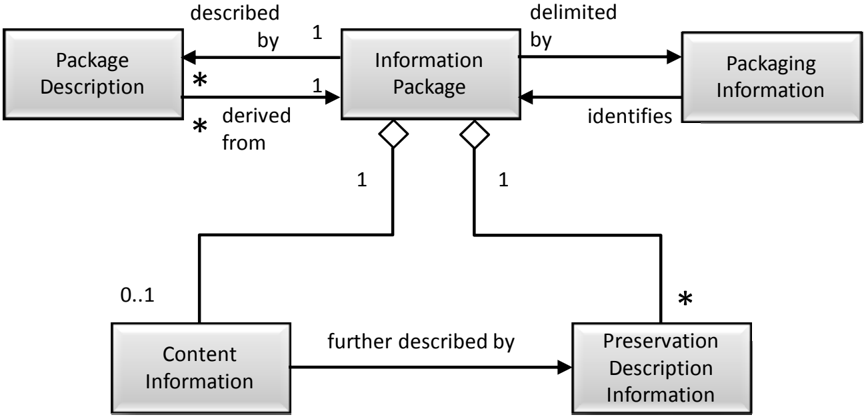

## 4.2.2.2 Types of Information Packages

There  are  three  subtypes  of  the  Information  Package  identified  in  2.2:  the  Submission Information Package (SIP), the Archival Information Package (AIP), and the Dissemination Information Package (DIP).  The definitions of these package types in section 2 are based on the function of the archival process, which uses the package, and the translation from one package to another as it passes through the archival process.  This taxonomy of Information Package types is shown in figure 4-14.

## CCSDS RECOMMENDED PRACTICE FOR AN OAIS REFERENCE MODEL CCSDS HISTORICAL DOCUMENT

Figure 4-14:  Information Package Taxonomy

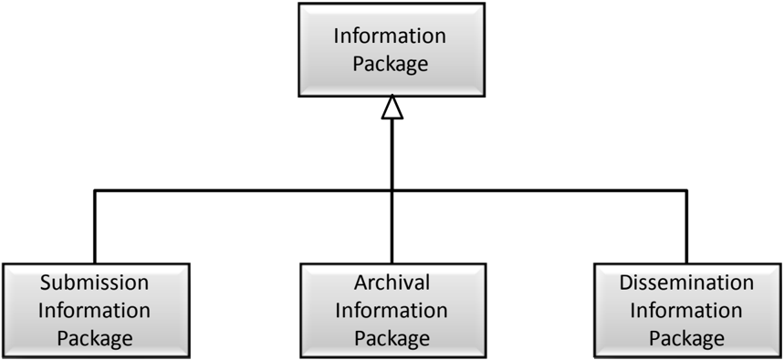

It is necessary to distinguish between an Information Package that is preserved by an OAIS and the Information Packages that are submitted to, and disseminated from, an OAIS.  These variant packages are needed to reflect the reality that some submissions to an OAIS will have insufficient Representation Information or PDI to meet final OAIS preservation requirements.  In addition, they may be organized very differently from the way the OAIS organizes  the  information  it  is  preserving.    Finally,  the  OAIS  may  provide  information  to Consumers that does not include all the Representation Information or all the PDI with the associated  Content  Information  being  disseminated.    These  variants  are  referred  to  as  the Submission  Information  Package  (SIP),  the  Archival  Information  Package  (AIP),  and  the Dissemination  Information  Package  (DIP).    Although  these  are  all  Information  Packages, they  differ  in  mandatory  content  and  the  multiplicity  of  the  associations  among  contained classes.

The Submission Information Package (SIP) is  that  package that is sent to an OAIS by a Producer.  Its form and detailed content is typically negotiated between the Producer and the OAIS.  Most SIPs will have some Content Information and some PDI, but it may require several  SIPs  to  provide  a  complete  set  of  Content  Information  and  associated  PDI.    The Content  Information  and  the  PDI  both  have  associated  Representation  Information,  and  if there  are  multiple  SIPs  involved  that  use  the  same  Representation  Information,  it  is  likely that such Representation Information will only be provided once to the OAIS.  As another variation, since some types of PDI will apply to multiple SIPs from the same source, such PDI may be provided in a separate SIP that is without Content Information.  The Packaging Information will always be present in some form.

The Descriptive Information associated with a SIP is likely to be provided prior to submitting the  SIP  to  the  OAIS,  but  it  may  be  provided  at  any  time.    It  may  be  no  more  than  a  text

## CCSDS HISTORICAL DOCUMENT

## CCSDS RECOMMENDED PRACTICE FOR AN OAIS REFERENCE MODEL

description with a name or title, carried by the Packaging Information, by which the SIP may be recognized.

Within the OAIS, one or more SIPs are transformed into one or more Archival Information Packages  (AIPs)  for  preservation.    The  AIP  has  a  complete  set  of  PDI  for  the  associated Content  Information.    The  AIP  may  also  contain  a  collection  of  other  AIPs  and  this  is discussed and modeled later in this subsection.  The Packaging Information of the AIP will conform to OAIS internal standards, and it may vary as it is managed by the OAIS.  The Descriptive Information associated with an AIP may be extensive and will be managed by the OAIS so that Consumers can find and order the Content Information of interest.

In response to an Order, the OAIS provides all or a part of an AIP to a Consumer in the form of  a  Dissemination  Information  Package  (DIP).    The  DIP  may  also  include  collections  of AIPs, and it may or may not have complete PDI.  The Packaging Information will always be present in some form so that the Consumer can clearly distinguish the information ordered. The Packaging Information may take several forms depending on the dissemination media and  Consumer  requirements.    The  Descriptive  Information  associated  with  a  DIP  may  be provided with the transfer of the DIP, or it may be provided at any time before or after the transfer.  Its purpose is to give the Consumer enough information to recognize the DIP from among possible similar packages.  It may be no more than a text description with a name or title, as carried by the Packaging Information, by which the DIP may be recognized.

Though the implementation of the AIP may vary from Archive to Archive, the specification of  the  AIP  as  a  container  that  contains  all  the  needed  information  to  allow  Long  Term Preservation and access to Archive holdings remains valid.  The information model for the AIP presented in 4.2.2.3 should be used as a reference to establish the types of information required to enable Long Term Preservation and access.

The exact information contents of the SIP and DIP  and their relationship to the corresponding AIP are dependent on the agreements between the Archive and its Producers and Consumers.  The model for both of these packages is the same as for the Information Package  shown  in  figure  4-13  both  in  mandatory  content  and  the  multiplicity  of  the associations among contained classes.  The subject of transformations between SIP and AIP and between AIP and DIP is further discussed in 4.3.

## 4.2.2.3 The Archival Information Package

An Archival Information Package (AIP), which is modeled in figure 4-15, is a specialization of the Information Package.  The AIP is defined to provide a concise way of referring to a set of  information  that  has,  in  principle,  all  the  qualities  needed  for  permanent,  or  indefinite, Long  Term  Preservation  of  a  designated  Information  Object.    The  AIP  is  itself  an Information Object that is a container of other Information Objects.  Within the AIP is the designated Information Object, and it is called the Content Information.

## CCSDS RECOMMENDED PRACTICE FOR AN OAIS REFERENCE MODEL CCSDS HISTORICAL DOCUMENT

Figure 4-15:  Archival Information Package (AIP)

Also within the AIP is an Information Object called the Preservation Description Information (PDI).  The PDI contains additional information about the Content Information and is needed to make the Content Information meaningful for the indefinite Long Term.

The Preservation Description Information requirements in an AIP are much more stringent than  the  requirements  for  Preservation  Description  Information  in  the  general  Information Package.  While no PDI objects are mandatory in an Information Package, all classes of PDI information must be present in an AIP.  This is illustrated in figure 4-16.  The contents of each type of PDI are left to the discretion of the individual Archive.

For example, in some OAIS holdings a statement that the creator of the Content Information is unknown may be adequate Provenance Information while in other OAIS holdings it may be mandatory that more complete provenance be researched.

## CCSDS RECOMMENDED PRACTICE FOR AN OAIS REFERENCE MODEL

Figure 4-16:  Preservation Description Information

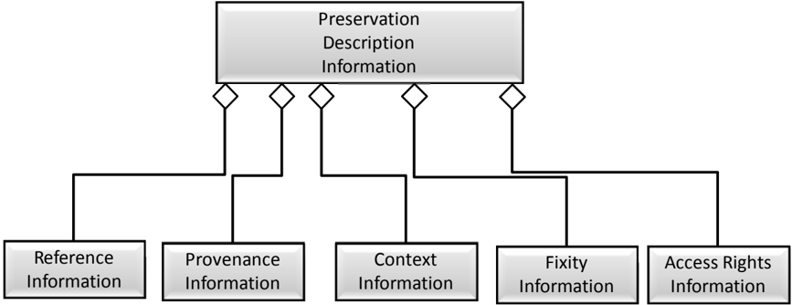

The  AIP  is  delimited  and  identified  by  the  Packaging  Information.    The  Packaging Information may actually be present as a structure on the media that contains the AIP or, it may be virtual in that it is contained in the OAIS Archival Storage function.  However, the delimitation and internal identification functions must be well defined in an OAIS.

Each AIP is associated with a structured form of Descriptive Information called the Package Description , which enables the Consumer to locate information of potential interest, analyze that information, and order desired information.  The information needed for one Access Aid is  called  an Associated  Description . A  single  Package  Description  may  contain  several Associated Descriptions depending on the number of different Access Aids that can locate, visualize,  retrieve  or  order  the  associated  Content  Information  and  PDI.    Figure  4-17  is  a UML diagram that models the Package Description and Access Aids.

## CCSDS HISTORICAL DOCUMENT

## CCSDS RECOMMENDED PRACTICE FOR AN OAIS REFERENCE MODEL

Figure 4-17:  Package Description

The Package Description must contain one Associated Description that supplies data for a Retrieval  Aid  that  allows  authorized  users  to  retrieve  the  Content  Information  and  PDI described by the Package Description.  This Retrieval Aid is generally part of the Archival Storage  functional  area.    It  translates  from  the  unique  identifier  assigned  by  the  OAIS  to identify the AIP into the set of operations and filenames needed to retrieve the AIP from the file management system used in Archival Storage, and then returns the Content Information and PDI for the requested AIP.  In most current Archives, only internal Archive processes and operations personnel and functions are authorized to use this Access Aid.  However, as technology  advances  increase  the  processing  power  of  the  Archive  and  the  bandwidth between the Archive and the user, such access methods as 'content based queries' and 'data mining' may provide the user with direct read-only access to the Content Information.

The Package Description may also contain any number of Associated Descriptions, each of which contains data for one or more Access Aids.  Two additional subtypes of Access Aid are Finding Aid and Ordering Aid .

A Finding Aid is an application that assists the Consumer in locating information of interest. A  single  AIP  may  have  a  number  of  Associated  Descriptions  that  describe  the  Content Information using different technologies.

## CCSDS RECOMMENDED PRACTICE FOR AN OAIS REFERENCE MODEL

An Ordering Aid is  an  application that  assists  the  Consumer  to  discover  the  cost  of  and order AIPs of interest.  The Ordering Aids also allow users to specify transformations to be applied to the AIPs prior to dissemination.  These transformations can include Data Object transformations such as subsetting, subsampling or format transformations. The transformations can also involve modifying the PDI in the AIP prior to dissemination.

The  Package  Description  is  not  required  for  the  Long  Term  Preservation  of  the  Content Information but is needed to provide visibility and access into the contents of an Archive. The contents of the Package Description are highly dependent on the structure of the Content Information and PDI it describes.  The uses and types of Package Descriptions in an OAIS are further defined in 4.2.2.4.

Figure 4-18 gives a detailed view of the Archival Information Package by expanding the PDI and the Content Information.  All the 'contains' relationships discussed in this subsection are logical containment relationships.  This type of containment relationship may be physical or may be accomplished via a pointer to another object in storage, so an AIP is not necessarily a single file.

Figure 4-18:  Archival Information Package (Detailed View)

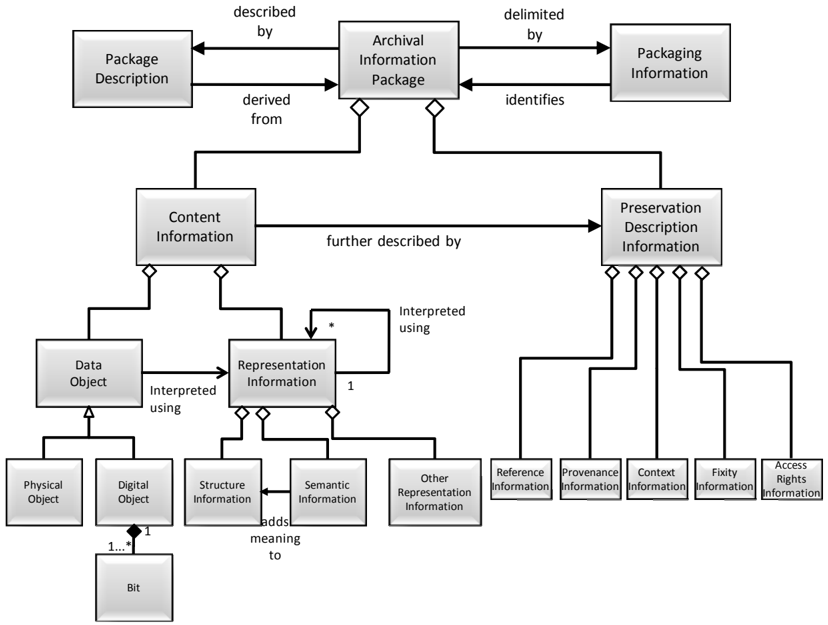

## 4.2.2.4 Specialization of the AIP and Package Descriptions

Two specializations of the AIP are discussed in this subsection, the Archival Information Unit (AIU) and the Archive Information Collection (AIC) .  Figure 4-19 is a UML diagram illustrating  this  specialization.    Both  AIU  and  AIC  are  subtypes  of  the  AIP  and  as  such contain constructs to enable both Long Term Preservation and Consumer access.  The AIU represents  the  type  used  for  the  preservation  function  of  Content  Information  that  is  not broken down into other Archival Information Packages.  The AIC organizes a set of AIPs (AIUs and other AICs) along a thematic hierarchy, which can support flexible and efficient access  by  the  Consumer  community.    Conceptually  all  the  AIPs  organized  by  an  AIC  are contained in the Content Information of that AIC.  The difference between AIUs and AICs is the complexity of their Content Information and their associated Package Descriptions and Packaging  Information.    This  reference  model  considers  the  differences  in  the  Content Information and associated Packaging and Description functionality between AIU and AIC to be adequately complex and linked to justify the definition of separate classes.

Figure 4-19:  Archival Specialization of the AIP

From an Access viewpoint, new subsetting and manipulation capabilities are beginning to blur the distinction between AICs and AIUs.  Content objects which used to be viewed as atomic can now be viewed as containing a large variation of contents based on the subsetting parameters chosen.  In a more extreme example, the Content Information of an AIU may not exist as a physical entity.  The Content Information could consist of several input files (or pointers to the AIPs containing these data files) and an algorithm which uses these files to create the Data Object of interest.

From an information preservation viewpoint, the distinction between AIU and AIC remains clear.  An AIU is viewed as having a single Content Information object that is described by

## CCSDS RECOMMENDED PRACTICE FOR AN OAIS REFERENCE MODEL

exactly one set of PDI.  An AIC Content Information is viewed as a collection of other AICs and  AIUs,  each  of  which  has  its  own  PDI.    In  addition,  the  AIC  has  its  own  PDI  that describes the collection criteria and process.

There  are  two  specializations  of  the  Package  Description,  the  Unit  Description  and  the Collection Description.  Figure 4-20 is a UML diagram illustrating this specialization.  The difference in these two classes is based on the functionality needed to effectively access the contents  of  an  AIU  versus  the  functionality  needed  to  effectively  access  AIPs  that  are contained in an AIC.

Figure 4-20:  Archival Specialization of the Package

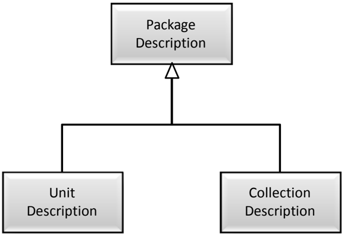

To aid in the understanding of these constructs, the next two subsections of this document will use an example of a company setting up an OAIS of digital versions of movies.  This example  will  focus  on  the  information  content  of  constructs  in  an  AIP.    Subsection  4.3 illustrates more of the details of the information transformations and data flows in an OAIS.

## 4.2.2.5 Archival Information Unit

The AIUs can be viewed as the 'atoms' of information that the Archive is tasked to store.  A single AIU contains exactly one Content Information object (which may consist of multiple files) and exactly one set of PDI.  The Archive is free to decide how to construct the AIU and in  particular  an  AIU  does  not  need  to  be  a  single  file.  When  an  Information  Object  is ingested into the OAIS a Unit Description , which is a subtype of a Package Description, is created  by  extracting  information  from  the  Content  Information  and  the  PDI  and  adding OAIS-specific information such as a unique identifier.  The AIU is illustrated in figure 4-21.

In the example of an OAIS for digital movies, the AIU for a single movie can be viewed as three  objects,  one  containing  a  digital  encoding  of  the  movie  in  a  proprietary  format,  one

## CCSDS RECOMMENDED PRACTICE FOR AN OAIS REFERENCE MODEL CCSDS HISTORICAL DOCUMENT

containing the Representation Information needed to understand the proprietary format (these two objects form the Content Information), and the other containing facts about the movie such  as  date  of  creation,  featured  actors,  director,  producer,  sequels,  movie  studio,  and  a checksum to ensure the integrity of the digital movie (PDI).  Since the OAIS reference model is  implementation  independent,  each  of  these  objects  could  be  implemented  as  one  file  or multiple  files.    This  type  of  implementation-dependent  information  is  contained  in  the Packaging Information.  When a movie is ingested into the OAIS a Unit Description for an Ordering Aid can be created by extracting information from the Content Information and the PDI and appending it to the unique ordering information.

Figure 4-21:  Archival Information Unit (AIU)

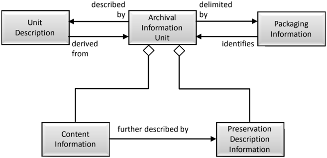

## 4.2.2.6 Unit Description

The Unit Description is a specialization of the Package Description that always contains a set of  Associated  Descriptions  each  of  which  describe  the  AIU  Content  Information  from  the point of view of a single Access Aid.  Figure 4-22 is a UML diagram that illustrates the Unit Description contents.

## CCSDS RECOMMENDED PRACTICE FOR AN OAIS REFERENCE MODEL

Figure 4-22:  Unit Description

All Unit Descriptions must supply an Associated Description for a Retrieval Aid that enables authorized  users  to  retrieve  the  AIU  described  by  the  Unit  Description  from  Archival Storage.    This  description  includes  the  unique  identifier  assigned  to  the  AIP  by  Archival Storage during the Ingest Process.

An important type of Access Aid is the Finding Aid, which is an application that assists the Consumer  in  locating  information  of  interest.    A  single  AIU  may  have  a  number  of Associated Descriptions that describe the Content Information using different technologies. Additionally,  as  new  description  extraction  and  display  technologies  become  available,  an Archive may want to update the Unit Description associated with each of its AIUs, in order to add a new Associated Description that utilizes the new technology to better describe the AIUs.

In the OAIS for digital movies example, initially, there may be one Associated Description that is a free text description of a movie, another that is a five-minute clip and another that is a row in a relational database that is used by movie collectors to locate movies of interest. After  the  Archive  has  been  operational  for  a  period  of  time  a  technique  for  supplying compressed digital  movies  may  be  developed  based  on  recording  every  tenth  frame.    The archivist may decide to create an additional type of Associated Description that is populated using  the  results  of  this  new  technique.    If  desired,  the  user  can  run  each  of  the  AIUs contained  in  the  Archive  though  this  compression  technique  and  create  a  new  Associated Description for each movie in the Archive or simply include this Associated Description for new AIUs as they are ingested into the OAIS.

## CCSDS HISTORICAL DOCUMENT

## CCSDS RECOMMENDED PRACTICE FOR AN OAIS REFERENCE MODEL

Another  important  class  of  Associated  Descriptions  supplies  data  for  Ordering  Aids that allows the Consumer to discover the cost of and order AIUs of interest.  The Ordering Aids also allow users to specify transformations to be applied to the AIUs prior to dissemination. These transformations can include Data Object transformations such as subsetting, subsampling or format transformations.  The transformations can also involve modifying the PDI in the AIU prior to dissemination.

For example, the OAIS for digital movies could allow a user to order a digital movie as a VHS tape, a laser disc or an MPEG object delivered on-line.  Each of these would involve a format transformation and, in theory, an update to the PDI information in the AIP to create accurate PDI for the DIP.

## 4.2.2.7 Archival Information Collections

The  AIU  and  its  associated  Unit  Description  provide  the  information  necessary  for  a Consumer  to  locate  and  order  AIUs  of  interest.    However,  it  can  be  impossible  for  a Consumer to sort  through  the  millions  of  Unit  Descriptions  contained  in  a  large  Archive. This problem is addressed here.

The Content Information of an AIC is composed of complete AIPs each of which have their own  Content Information, PDI, and associated Packaging Information and Package Descriptions.  These AIPs are then aggregated into Archive Information Collections (AIC) using criteria determined by the archivist.  Generally AICs are based on the AIUs of interest having  common  themes  or  origins  and  a  common  set  of  Associate  Descriptions.    At  a minimum all OAISes can be viewed has having at least one AIC which contains all the AIPs held by the OAIS.

For example, the OAIS for digital movies may have AICs based on the subject area of the movie such as mystery, science fiction, or horror.  In addition the Archive may have AICs based on other factors such as director or lead actor.

A logical model of an AIC is shown in figure 4-23.  As in the previous subsections, all of the containment relationships are logical containment and may  be  physical or  may  be accomplished  via  a  pointer  to  another  object  in  storage.    For  example,  the  Content Information of an AIC can be created either by creating physical collections of the contained AIPs or by pointing to the contained AIPs.  A single AIP can belong to any number of AICs.

Figure 4-23:  Archive Information Collections Logical View

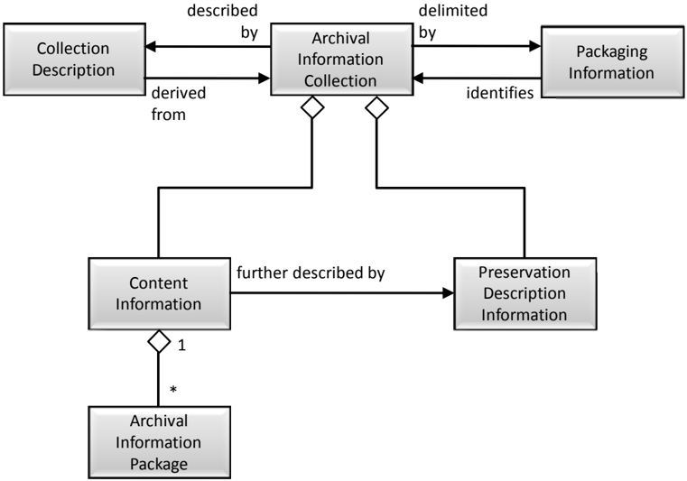

For  example,  a  pattern  recognition  technique  might  be  created  for  digital  movies  and  the OAIS for digital movies might offer a service to search its Archives for large structures such as the pyramids or a New York skyline.  This type of service is very processing intensive, involving  potentially  large  numbers  of  AIUs  to  be  transferred  from  Archival  Storage  to Access and then running the appropriate process to analyze the Content Information from each AIU.  If the results are generally useful, the archivist could summarize the results of this 'content based query' into an Associated Description of a new AIC that contains movies with large structures.  This technique is frequently referred to as data mining.

An  important  feature  of  the  AIC,  as  shown  in  figure  4-23,  is  the  fact  that  an  AIC  is  a complete AIP which contains PDI.  The PDI provides further information about the AIC such as Provenance on when and why it was created, Context to related AICs, the desired level of security/Fixity and Access Rights Information.  This is in addition to the PDI contained in member  AIPs.    This  type  of  information  is  often  necessary  for  a  Consumer  to  have confidence in the reliability of an AIC.  In the above example, the usefulness of the AIC of movies  with  large  structures  is  to  some  extent  based  on  the  algorithm  used  and  the Provenance of when the AIC was created or last updated.

## 4.2.2.8 Collection Descriptions

The Collection  Description is  a  subtype  of  the  Package  Description  that  has  added structures  to  better  handle  the  complex  Content  Information  of  an  AIC.    The  Collection Description,  which  is  modeled  in  figure  4-24,  contains  the  information  classes  that  are contained in the Unit Description.

There are two types of Associated Description in a Collection Description:

- -There is one Overview Description that describes the collection as a whole.
- -There are zero or more Member Descriptions that separately describe each member of the collection.

Figure 4-24:  Collection Description

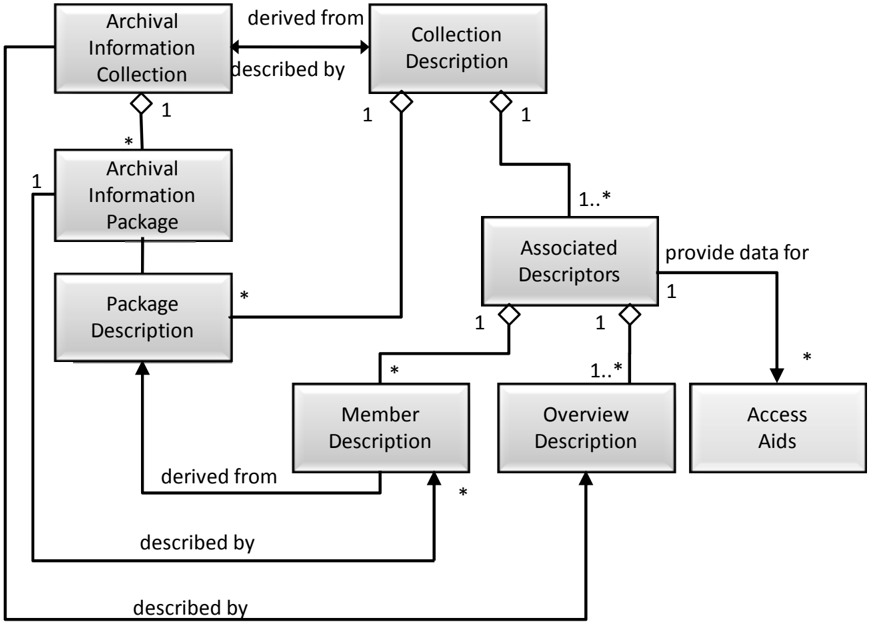

The  required  Associated  Description  in  a  Collection  Description  provides  information  for Ordering Aids that provide a user with access to the entire set of Content Information of the associated AIC and the PDI for the AIC, but not necessarily to the individual AIPs contained in the AIC.  The Collection Description may contain the Package Descriptions of the AIPs contained in the AIC.  This containment relationship is logical in that the AIC may either include  the  Package  Descriptions  of  member  Information  Packages  directly  or,  more commonly, use pointers to the Package Descriptions of the member Information Packages.

## CCSDS HISTORICAL DOCUMENT

## CCSDS RECOMMENDED PRACTICE FOR AN OAIS REFERENCE MODEL

This  list  of  the  Package  Descriptions  for  contained  AIPs  in  an  AIC  could  provide  Access Aids with a method to Retrieve or Order individual members of the AIC.

It  also  allows  alternative  concepts  for  the  implementation  of  Finding  Aids  that  enable  the Consumer  to  locate  AIPs  of  interest  that  are  contained  in  an  AIC.    The  Associated Descriptions  that  provide  data  for  these  Finding  Aids  could  be  implemented  either  in  a centralized fashion searching an Associated Description in the Collection Description or in a distributed  fashion  by  searching  the  Associated  Description  of  each  member  Package Description.

Another important benefit of the Collection Descriptions is the ability to define new Access Collections .    An  Access  Collection  may  be  based  on  new  data  mining  results  or  it  may reflect  current  phenomena  or  areas  of  interest  that  may  not  be  of  permanent  interest. Examples of an Access Collection in an OAIS for digital movies might be a new arrivals collection or a 'twenty most popular titles' collection that is updated periodically.  Another example of an Access Collection is a collection based on the results of a pattern recognition algorithm that has not been verified.

To create an Access Collection, an Archive would create a Collection Description that did not have an associated AIC.  The Collection Description could have a customized Associated Member Description  that  documented  the  newly  mined  description  data  for  each  member AIP.    A  specialized  finding  aid  could  use  this  new  Associated  Member  Description  in conjunction with existing Associated Descriptions in the Package Description information of each  member  AIP  to  locate  AIPs  of  interest  to  the  user.    The  Package  Descriptions  of contained  AIPs  would  also  supply  data  for  an  Ordering  Aid,  which  would  allow  the Consumer to order the Information Packages of interest to the Consumer.

If  an  OAIS  decides  that  an  Access  Collection  is  valuable  enough  to  be  preserved  for  the Long Term, it can store the required Content Information and PDI in Archival Storage thus creating a new AIC.

Another  important  application  of  Access  Collections  is  the  concept  of  locating  some members of a collection that have been scheduled for ingest at a future time.  In this case, the Associated  Descriptions  supporting  a  Finding  Aid  would  allow  future  AIPs  to  be  located. However, the Associated Description for the Ordering Aid and/or the Retrieval Aid would contain the information that this product was not currently available and allow the user to enter  an  Event  Based  Order  which  would  be  triggered  when  the  AIP  of  interest  became available.

## 4.2.3 DATA MANAGEMENT INFORMATION

Currently, Package Descriptions are stored in persistent storage such as database management systems to enable easy, flexible access and update to the contained Associated Descriptions.  In addition to the Package Descriptions discussed in the previous subsections, all  the  information needed for the operation of an Archive could be stored in databases as persistent  data  classes.    Figure  4-25  illustrates  the  various  types  of  'data  management information' within the OAIS.  The Archive Administration Information represents the entire range of information required for the day-to-day operation of the Archive.  This information includes:

- -Policy information which provides pricing information and availability constraints for ordering archived information.
- -Request tracking information that records the progress of each user transaction with an  Archive.    The  request  tracking  process  can  be  very  complicated,  involving database events and triggers, or as simple as a flat file tracking Order Requests.
- -Security information that includes user names and any passwords or other mechanisms needed to authenticate the identity and privileges of Archive users.
- -Event  Based  Order  information  that  provides  the  information  needed  to  support repeating or future requests.
- -Statistical information needed by Archive administration  and  Management  to determine  future policies and  performance  tuning  for  more  effective  Archive operation.    Examples  of  these  statistics  include  the  number  of  times  an  AIP  was ordered over a time period and the average time between receiving an order request and shipping the requested holding.
- -Preservation process history information that tracks the migrations of AIPs, including media replacements and AIP transformations.
- -Customer profile information that enables the Archive to maintain facts such as user name and address to avoid the user's having to reenter these facts each time he or she enters a request.
- -Accounting  information  that  includes  the  data  necessary  for  the  operation  of  the Archive as a business.  The accounting data include payroll data, accounts payable data and accounts receivable data.

These classes are intended as examples rather than an exhaustive list of the data required for Archive administration.  These classes are conceptual and individual OAIS implementations may vary significantly.  For example, individual OAIS may choose to combine the Customer related information types such as Security and Customer Profile into a single database.

Figure 4-25:  Data Management Information

## 4.3 INFORMATION PACKAGE TRANSFORMATIONS

The previous portions of this section have discussed the functional architecture of an OAIS and  an  information  architecture  to  represent  the  Information  Packages  and  associated Package Descriptions and Packaging Information. This subsection looks at the transformations,  both  logical  and  physical,  of  the  Information  Package  and  its  associated objects as they follow a lifecycle from the Producer to the OAIS, and from the OAIS to the Consumer.

Figure  4-26  presents  a  high-level  data  flow  diagram  that  depicts  the  principle  data  flows involved  in  OAIS  operations.    These  flows  do  not  include  administrative  flows  such  as accounting and billing.

Figure 4-26:  High-Level Data Flows in an OAIS

## 4.3.1 DATA TRANSFORMATIONS IN THE PRODUCER ENTITY

The data within the data Producer entity are private and may be in any format the Producer desires.  However, when the decision is made to store the data in an OAIS, the Producer who is  responsible  for  the  data  meets  with  archivists  to  negotiate  a  Submission  Agreement  as discussed in 2.3.2 of this document.  This agreement defines information such as the content, format, and scheduled arrival times of the Submission Information Package (SIP).  The SIP is an Information Package that is provided to the OAIS by the Producer.  The SIP consists of the  Content  Information  plus  the  data  that  is  necessary  to  assure  that  those  data  can  be maintained by the OAIS and that the data can be interpreted and used by Consumers who withdraw them from the OAIS in the future.

These  SIPs  are  periodically  transferred  to  the  OAIS  in  a  Data  Submission  Session.    The number of Data Submission Sessions between an OAIS and a Producer can range from a single session in the transfer of a final data product to multiple sessions a day in the case of active  OAIS  which  store  data  for  experiments  which  are  still  in  process.    The  Data Submission Session can be logically viewed as sets of content Data Objects and description objects, although physically the description can be included in the digital objects (i.e., selfdescribing objects) or divided into many separate descriptive items.  In addition to the logical

## CCSDS RECOMMENDED PRACTICE FOR AN OAIS REFERENCE MODEL

view  of  data  (the  SIP),  the  specification  of  a  data  delivery  session  must  also  include  the mapping of the objects to the media on which they are delivered.  This mapping includes the encoding of the object and description and the allocation of logical objects to files.

## 4.3.2 DATA TRANSFORMATIONS IN THE INGEST FUNCTIONAL AREA

Once the SIP is within the OAIS, its form and content may change.  An OAIS is not always required to retain the information submitted to it in precisely the same format as in the SIP. Indeed, preserving the original information exactly as submitted may not be desirable.  For example,  the  computer  medium  on  which  submitted  images  are  recorded  may  become obsolete,  and  the  images  may  need  to  be  copied  to  a  more  modern  medium.    In  addition, some  types  of  information  such  as  the  unique  identifier  used  to  locate  the  Information Package within the OAIS will not be available to the Producer and must be input during the Ingest process to the OAIS.

The mapping between SIPs and AIPs is not one-to-one.  Here are some examples:

- -One SIP-One AIP:  A government agency is ready to Archive its electronic records from  the  previous  fiscal  year.    All  of  the  year's  records  are  placed  onto  magnetic tapes that are submitted as one SIP.  The Archive stores the tapes together as a single AIP.
- -Many SIPs-One AIP:  A satellite  sensor  makes  observations  of  the  Earth  over  a period  of  one  year.    Every  week  all  of  the  latest  sensor  data  are  submitted  to  the Archive  as  a  SIP.    The  Archive  has  a  single  AIP  containing  all  of  the  sensor's observations for the year.  Ingest merges the Content Information from each weekly SIP into a specified file/files in Ingest persistent storage.  The PDI data for the AIP is sent after the last sensor data for the year has been received.  After all of the weekly SIPs and the SIP containing the PDI have arrived, Ingest processes the AIP.
- -One SIP-Many AIPs:  A company submits financial records to an Archive as one SIP.  The Archive chooses to store this information as two AIPs:  one that contains public information and the other that contains sensitive information.  This makes it easier for the Archive to manage access to the information.
- -Many SIPs-Many AIPs:  An oil and gas company collects information on its wells. Every year it submits SIPs containing all of the well status information for one well to an Archive.  The Archive maintains one AIP for each oil or gas field and breaks out  the  information  on  each  well  to  the  proper  AIP  based  upon  its  geographic coordinates.

The ingest process transforms the SIPs received in the Data Submission Session into a set of AIPs and Package Descriptors which can be stored and accepted by the Archival Storage and Data Management functional entities.  The complexity of this ingest process can vary greatly from OAIS to OAIS or from Producer to Producer within an OAIS.  The simplest form of the process involves removing the Content Information, PDI and Package Descriptors from the Producer  transfer  media  and  queuing  them  for  storage  by  the  Archival  Storage  and  Data

## CCSDS RECOMMENDED PRACTICE FOR AN OAIS REFERENCE MODEL

Management functional entities.  In more complex cases, the PDI and Package Descriptors may have to be extracted from the Content Information or input by OAIS personnel during the ingest function; the encoding of the information objects or their allocation to files may have to be changed.  In the most extreme case, the granularity of the Content Information may be changed, and the OAIS must generate new PDI and Package Descriptors reflecting the newly generated information objects.  When many SIPs are required for the creation of one AIP, the Ingest functional area will provide temporary storage for the SIPs until all the SIPs required for the AIP arrive.

In  addition,  the  Ingest  Functional  Entity  will  classify  incoming  information  objects  and determine  in  what  existing  collection  or  collections  each  object  belongs  and  will  create messages  to  update  the  appropriate  Collections  Descriptions  after  the  AIPs  are  stored  in Archival Storage.  The OAIS and external organizations may provide additional Associated Descriptions and finding aids that allow alternative access paths to the information objects of interest.    Researchers  will  develop  new  and  fundamentally  different  access  patterns  to information  objects.    It  is  important  that  an  OAIS's  Ingest  and  internal  data  models  are sufficiently flexible to incorporate these new descriptions so the general user community can benefit from the research efforts.  A good example of this type of new associated description is a phenomenology database in Earth Observation, which allows users to obtain data for a desired event, such as a hurricane or volcano eruption, from many instruments with a single query.  It is important to note that such finding aids may become obsolete unless the data they require are preserved as parts of the AIPs they access.

It  is  expected  that  the  Ingest  Functional  Entity  will  coordinate  the  updates  between  Data Management and Archival Storage and provide appropriate coordination and error recovery. The AIP should first be stored in Archival Storage.  The confirmation of that operation will include a unique identification to retrieve that AIP from Storage.  This identifier should be merged into the Package Description prior to the addition of the Collection Description to Data Management.

## 4.3.3 DATA TRANSFORMATIONS IN THE ARCHIVAL STORAGE AND DATA MANAGEMENT FUNCTIONAL AREAS

The Archival Storage Functional Entity takes the AIPs produced by the Ingest process and merges them into the permanent Archive holdings.  The Data Management Functional Entity takes  the  Package  Descriptions  produced  by  Ingest  and  augments  the  existing  Collection Descriptions to include their contents.  The logical model of the ingested data should already be mapped into the logical model of the Archive's holdings.  Thus the major transformation that occurs in this step is the mapping of the acquisition session from the ingest physical data model.  This will tend to be on temporary storage, to the permanent storage of the OAIS, which  could  range  from  a  Database  Management  Systems  (DBMS)  to  a  Hierarchical  File Management Systems (HFMS), or any mixture of the above.

The internal view of the OAIS is the permanent representation of the archived data, so all encoding and mappings must be well documented and understood.  The transferring of ingest objects is frequently done by a software process such as an HFMS driver or a DBMS.  In this

## CCSDS RECOMMENDED PRACTICE FOR AN OAIS REFERENCE MODEL

case, it is the responsibility of the OAIS to maintain an active copy of the software or careful documentation of the internal formats so the data can be transferred to other systems in the future without loss of information.

## 4.3.4 DATA FLOWS AND TRANSFORMATIONS IN THE ACCESS FUNCTIONAL AREA

When a Consumer wishes to use the data within the OAIS, a Finding Aid may be used to locate information of interest.  Finding Aids present Consumers with the logical view of the OAIS holdings so the Consumers can decide which AIPs to acquire.  At a minimum, the access view is the high-level logical view of the Collection Descriptions discussed in 4.2.2.8. The OAIS may have to spend significant time and effort developing Associated Descriptions and Finding Aids such as catalogs that will aid the Consumer in locating AIPs or AICs of interest.    A  Consumer will establish a Search Session with the Access entity.  During this Search Session, the Consumer will use the OAIS Finding Aids to identify and investigate potential holdings of interest.  This searching process tends to be iterative, first identifying broad criteria  and  then  refining  the  criteria  on  the  basis  of  previous  search  results.    When candidate objects of interest are identified, more sophisticated Finding Aids such as browse image viewers or animation may be used to further refine a Result Set.

Once the Consumer identifies the OAIS holdings to acquire, the Consumer uses an OAISsupplied  Ordering  Aid  to  develop  an  order  request  to  acquire  the  data.    The  Consumer produces  a  logical  view  of  the  desired  AIPs  and  associated  Package  Descriptions  to  be included in the Dissemination Information Package and specifies the physical details of the Data Dissemination Session such as media type and object format.  This process may involve no visible interaction between the Consumer and the OAIS if adequate defaults exist.  The order  can  also  specify  any  transformations  the  Consumer  wishes  applied  to  the  AIPs  in creating the DIP.

The  Access  functional  area  then  records  the  Order  Agreement  in  the  Data  Management functional area.  When the conditions required to satisfy a recorded Order Agreement are met (for many Order Agreements these conditions are met immediately, but if not Administration notifies  Access  when  they  are  met)  the  Access  functional  area  coordinates  the  response. Access contacts the Storage and Data Management functional areas and requests the AIPs and  associated  Package  Descriptions  necessary  to  populate  the  DIP  requested  by  the Consumer.    The  Storage  and  Data  Management  functional  areas  create  copies  of  the requested objects in temporary storage.

Access then transforms this set of the AIPs and associated Package Descriptions into a set of DIPs and stores those DIPs onto physical distribution (either physical or communications) media to be delivered to the Consumer in a Data Dissemination Session.  The complexity of this transformation process can differ greatly on the basis of the level of processing services offered by the OAIS and requested by the Consumer's order.  In the simplest case, the DIP contains duplicates of the AIPs and associated Package Descriptions of interest from Storage and Data Management function.  In more complex cases, the desired Content Information may  have  to  be  extracted  from  the  information  objects  or  inserted  into  self-describing

## CCSDS RECOMMENDED PRACTICE FOR AN OAIS REFERENCE MODEL CCSDS HISTORICAL DOCUMENT

information  objects,  and  the  encoding  of  the  information  objects  or  their  allocation  to physical files may have to be changed.  In the most extreme case, when the OAIS supports subsetting  services,  the  granularity  of  the  information  objects  may  be  changed,  and  the Dissemination process may generate DIPs and associated Package Descriptions reflecting the new granularity.  The mapping between DIPs and AIPs is one-to-one if no transformations are requested; however, the use of subsetting services and other product processing options could create many DIPs from a single AIP, or a single DIP based on combining many AIPs.

## 5 PRESERVATION PERSPECTIVES

This section addresses various practices that have been, or might be, used to preserve digital information and to preserve access services to digital information.  It uses the functional and information  modeling  concepts  described  in  subsection  4.2  and  applies  them  to  these practices, and it extends the terminology to distinguish significant aspects of these practices. There  will  be  a  number  of  options  available  to  preserve  any  particular  piece  of  digitally encoded information; the particular preservation solution applied should be chosen to match the  requirements  identified  in  the  interactions  between  Administration  and  Preservation Planning.

The fast-changing  nature  of  the  computer  industry  and  the  ephemeral  nature  of  electronic data storage media are at odds with the key purpose of an OAIS:  to preserve information over a long period of time.  No matter how well an OAIS maintains its current holdings, it will eventually need to migrate much of its holdings to different media (which may or may not  involve  changing  the  bit  sequences)  and/or  to  a  different  hardware  or  software environment to keep them accessible.  Today's digital data storage media can typically be kept at most a few decades before the probability of irreversible loss of data becomes too high to ignore.  Further, the rapid pace of technology evolution makes many systems much less cost-effective after only a few years. Even more daunting, as operating systems evolve, is  maintenance  of  operational  software  as  a  part  of  the  Representation  Information,  which means  that  it  is  essential  for  the  preservation  of  Content  Information.    In  addition  to  the technology  changes  there  will  be  changes  to  the  Knowledge  Base  of  the  Designated Community which will affect the Representation Information needed.

Fundamentally, approaches to information preservation in the face of changing technologies and  Designated  Community  requirements  require  digital  migration  as  it  is  defined  and addressed in section 5.1.  Digital migration of an AIP can include:

- -copying Content Data Object or Representation Information bits to new media
- -altering or adding to Content Data Object or Representation Information bits
- -altering or adding to PDI bits
- -altering  or  adding  to  operational  software  whose  role  is  essential  to  Content Information preservation (i.e., it is part of Representation Information)
- -altering or adding to the bits that make up the AIP's Packaging Information

Subsection 5.1 discusses digital migration in general terms; subsection 5.2 then discusses in more  detail  the  roles  of  software  both  simply  as  a  convenience  for  access  to  Content Information and as a key component of the Content Information

## 5.1 DIGITAL MIGRATION

Digital  Migration is  defined  to  be  the  transfer  of  digital  information,  while  intending  to preserve it, within the OAIS.  It is distinguished from transfers in general by three attributes:

- -a focus on the preservation of the full information content intended for preservation;
- -a perspective that the new  archival implementation of the information is a replacement for the old; and
- -full control and responsibility over all aspects of the transfer resides with the OAIS.

It should be noted that 'transfer' as found in the definition of Digital Migration is used in a broad way such that when any changes are made to Content Information or to PDI bits for the purpose of information preservation, then this is a Digital Migration even if it appears the changes occurred 'in place'.

## 5.1.1 DIGITAL MIGRATION MOTIVATORS

Three major motivators are seen to drive Digital Migrations of AIPs within an OAIS.  These are:

- -Improved Cost-Effectiveness:  The rapid pace of hardware (e.g., disk/tape drives) and software evolution provides greatly increasing storage capacities and transfer bandwidths at reducing costs.  It also drives the obsolescence of some media types well  before  they  have  time  to  decay  and  it  drives  the  obsolescence  of  software employed  as  part  of  Representation  Information.    In  addition,  improved  AIP packaging  designs  may  be  less  dependent  on  underlying  media  and  supporting systems,  and  therefore  simplified  migration  efforts  may  be  recognized.    To  remain cost-effective, an OAIS must take advantage of these technologies.  Depending on the particular technologies involved, the AIP information may have to be moved to new media types not previously supported, and it may  have to revise its AIP implementations to maintain information preservation.
- -New Consumer-Service Requirements:  The Consumers of an OAIS also experience the  benefits  of  new  technologies  and  consequently  raise  their  expectations  of  the types and levels of service they expect from an OAIS.  These increased services may require new forms of DIPs to service particular Designated Communities, which in turn  may  drive  an  OAIS  to  hold  new  forms  of  AIPs  to  reduce  output  conversions. Additionally, AIPs typically go through popularity swings and the OAIS may need to provide different levels of access performance to meet Consumer demands over time. This is  likely  to  be  satisfied  by  moving  some  AIPs  to  different  media  that  provide increased  or  decreased  levels  of  access  performance.    Finally,  the  Designated Community for a given AIP may be broadened, resulting in the need to revise AIP forms so as to be understandable and usable by this broader community.  All of these can result in the migration of AIPs within an OAIS.

## CCSDS RECOMMENDED PRACTICE FOR AN OAIS REFERENCE MODEL CCSDS HISTORICAL DOCUMENT

- -Media Decay:  Digital  media,  over  time,  become  increasingly  unreliable  as  secure preservers  of  bits.    Even  those  that  are  used  with  some  level  of  error  correction eventually need to be replaced.  The net result of media decay is that AIP information must be moved to newer media.

Digital  Migrations  are  time  consuming,  costly,  and  expose  the  OAIS  to  greatly  increased probabilities  of  information  loss.    Therefore,  an  OAIS  has  a  strong  incentive  to  consider Digital Migration issues and approaches.

## 5.1.2 MIGRATION CONTEXT

Key functional and information modeling concepts from section 4, as they relate to migration perspectives, are summarized in figure 5-1.

Figure 5-1:  Conceptual View of Relationships among Names and AIP Components

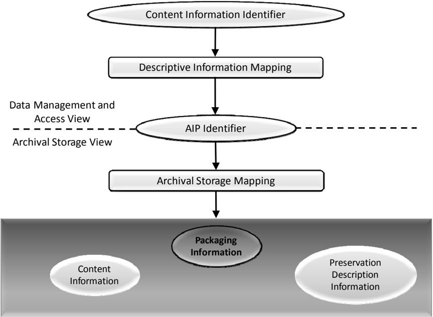

The  OAIS  Consumer  interface  in  Access  provides  one  or  more  Content  Information  IDs, with associated name spaces, to assist in identifying a particular Content Information object of  interest.    One  or  more  of  these  Content  Information  IDs  will  be  included  in  the  PDI Reference  Information  associated  with  that  Content  Information  object.    The  Descriptive

## CCSDS RECOMMENDED PRACTICE FOR AN OAIS REFERENCE MODEL

Information  in  Data  Management  will  map  each  of  these  IDs  to  the  same  AIP  ID.    The Access Function uses this information to obtain the AIP ID and gives it to Archival Storage to retrieve the associated AIP.

Within Archival Storage, the AIP ID is mapped to the location of AIP Packaging Information by the Archival Storage mapping infrastructure.  The AIP Packaging Information, in turn, logically delimits and identifies the Content Information and the PDI, and binds them into a single  entity  for  preservation.    For  example,  if  the  Content  Information  and  PDI  are determined  to  be  the  content  of  several  files,  the  pointers  to  documents  describing  the representations of those files, and the documents themselves, then the Packaging Information would logically be defined as the implementation of the file system holding the file content bits, the data structure holding the pointers, the information which is used to distinguish the Content Information from the PDI, and an encapsulating data structure which identifies the files  and  other  data  structures  as  the  components  of  the  AIP  Package.    The  associated Archival  Storage  mapping  infrastructure  might  then  be  implemented  as  a  database  which relates the AIP ID to the location of the encapsulating data structure.

The transfer of any part of the Content Information, PDI, or Packaging Information to the same  or  new  media,  with  the  intent  that  it  replaces  that  part  of  the  previous  AIP,  is considered to be a Digital Migration of the AIP.  A change to the Archival Storage mapping information only, which is outside of the AIP concept, is not considered to be a migration of the  associated  AIP,  although  such  changes  need  to  be  carefully  controlled  to  ensure  that access to the AIP is maintained.

The ways in which AIPs are implemented will have a major influence on both the level of automation and the probability of information loss during migrations.  Good AIP designs can both  increase  migration  automation  and  reduce  information  loss  probabilities.    To  better understand the impacts of these factors on AIP migrations it is useful to categorize migrations into  several  types  and  then  to  consider  some  issues  associated  with  selected  implementation approaches.

## 5.1.3 MIGRATION TYPES

Based  on  the  models  and  concepts  above,  it  is  possible  to  identify  four  primary  Digital Migration types.  The primary types, ordered by increasing risk of information loss, are:

Operations which do not change the bit sequences

- -Refreshment: A Digital  Migration  where  a  media  instance,  holding  one  or  more AIPs or parts of AIPs, is replaced by a media instance of the same type by copying the bits on the medium used to hold AIPs and to manage and access the medium.  As a  result,  the  existing  Archival  Storage  mapping infrastructure, without alteration, is able to continue to locate and access the AIP.
- -Replication :    A  Digital  Migration  where  there  is  no  change  to  the  Packaging Information,  the  Content  Information  and  the  PDI.    The  bits  used  to  convey  these information  objects  are  preserved  in  the  transfer  to  the  same  or  new  media-type

instance.  Refreshment is also a Replication, but Replication may require changes to the Archival Storage mapping infrastructure.

Operations which change the bit sequences

- -Repackaging :    A  Digital  Migration  where  there  is  some  change  in  the  bits  of  the Packaging Information.
- -Transformation :    A  Digital  Migration  where  there  is  some  change  in  the  Content Information or PDI bits while attempting to preserve the full information content.

There is the smallest risk of information loss under Refreshment because none of the bits that are used to hold AIP information or to support finding and accessing AIPs are altered.  There is also little risk of information loss under Replication because none of the bits representing AIP information have changed.  However, if a new media type is involved there will be some changes needed in the Archival Storage mapping infrastructure (see figure 5-1).  The risk is that something may go wrong in the process and some unintended changes to bits may take place.  Repackaging recognizes that some bit changes will take place, but these are mostly confined  to  information  used  to  delimit  the  Content  Information  and  the  PDI,  and  so generally do not alter the information carried by the Content Information or the PDI.  There is  the  usual  risk  that  something  will  go  wrong,  and  there  are  also  cases  where  some interaction  between  Packaging  Information  and  the  Content  Information  or  PDI  cannot  be avoided.    This  poses  additional  risk  of  information  loss.    However,  it  is  expected  that  the OAIS  will  verify  that  Refreshment,  Replication,  or  Repacking  Migrations  have  not  lost information.  Finally,  Transformation  poses  the  most  risk  because  changes  to  the  Content Information or PDI are made.

To understand more clearly what may be involved in these migration types it is necessary to look  at  possible  implementation  approaches.    It  will  be  seen  that  some  migrations  are  a mixture of Repackaging and Transformation.  It is also important to recall that, for any given AIP the OAIS must first clearly identify what constitutes the Content Information, and only then  can  the  PDI  be  identified.    Following  this  the  Packaging  Information  can  also  be identified.    Further,  there  is  no  single  'correct'  definition  of  what  should  be  the  Content Information as this must be determined by the OAIS for each AIP it constructs and stores. All these issues are discussed in more detail in the following subsections using a series of implementation and migration scenarios.

## 5.1.3.1 Refreshment

A migration involves Refreshment when the effect is to replace a media instance with a copy that is sufficiently exact that all Archival Storage hardware and software continues to run as before.  The following scenario is an example of Refreshment:

The number of correctable bit  errors  on  a  CD-ROM  disk  has  reached  a  dangerous point and the decision is made to replace it with an exact copy.  Once the equivalence between the two has been checked, the new CD-ROM replaces the old CD-ROM and Refreshment has taken place.  All AIP components on the CD-ROM are unaltered.

## 5.1.3.2 Replication

A  migration  involves Replication when  there  are no  bit changes  to  the  Packaging Information,  the  Content  Information,  and  the  PDI.    Ensuring  that  none  of  these  bits  has changed  may  be  a  significant  effort,  depending  on  the  implementation.    The  following scenario is an example of Replication:

The  Content  Information  and  PDI  for  an  AIP  are  encapsulated  into  a  standard packaging structure and held in the body of a single file.  A Replication migration is easily achieved by simply copying the bit order in the file body to a new file on the same or other media.  Changes to the Archival Storage mapping infrastructure may be needed  to continue to locate the file,  but  no  change  in  Packaging,  Content Information,  or  PDI  has  taken  place.    Replication,  with  this  type  of  Packaging Information, affords ease of migration to new media types with maximum automation and little risk of information loss.

## 5.1.3.3 Repackaging

A migration involves Repackaging when there is some change to the Packaging Information during  the  transfer.    The  Packaging  Information  plays  the  critical  role  of  delimiting  and relating,  at  a  minimum, the Content Information and PDI.  If the Content Information and PDI are themselves composed of multiple components, the Packaging Information may be asked to delimit and relate these as well.  These are implementation decisions that the OAIS needs to explicitly recognize.  The following scenario is an example of Repackaging:

All the Content Information and PDI bits for an AIP are contained within the body of three  files  on  a  CD-ROM.    The  Packaging  Information consists of the bits used to implement the  file  and  directory  structure  that  provides  access  to  these  three  files. The contents of the three files are moved to three new files on another media type, with a new directory and file implementation.  Even if all the directory and file names have been preserved in the transfer, a Repackaging has taken place because the bits used to represent the Packaging Information have changed.

## 5.1.3.4 Transformation

Digital Migrations that require some changes to the Content Information or PDI are referred to as Transformations.  These changes will be to some of the bits in the Content Information or  PDI  with  corresponding  changes  in  the  associated  Representation  Information.    In  all cases  the  intent  is  to  provide  maximum  information  preservation.    The  resulting  AIP  is intended to be a full replacement for the AIP that is undergoing Transformation.  The new AIP qualifies  as  a  new AIP Version of  the  previous  AIP.  The  first  version  of  the  AIP  is referred  to  as  the  original  AIP  and  may  be  retained  for  verification  of  information preservation.

## CCSDS RECOMMENDED PRACTICE FOR AN OAIS REFERENCE MODEL

The Representation Information plays a key role in Transformations, and the impacts of the changes on the Representation Information may be used to categorize the Transformations. A Representation Information object can be modeled as consisting of a base set of entities, a set  of  resulting  entities,  and  mapping  rules  that  define  the  resulting  entities  and  their relationships in terms of the base entities.  Software, as a type of Representation Information, can  be  modeled  in  the  same  manner.  Using  this  model  of  a  Representation  Information object, two types of Transformation can be defined: Reversible Transformation and NonReversible Transformation .

A Reversible Transformation occurs when the new representation defines a set (or a subset) of  resulting  entities  that  are  equivalent  to  the  resulting  entities  defined  by  the  original representation.    This  means  that  there  is  a  one-to-one  mapping  back  to  the  original representation and its set of base entities.  An example is replacing a representation that uses the ASCII codes 'A through Z' with a representation that uses the UNICODE UTF-16 codes for 'A through Z'.  The Transformation will result in the replacement of 7-bit codes with 16bit codes in the AIP  object undergoing change. The  reverse Transformation can subsequently  be  performed  by  replacing  the  UNICODE  UTF-16  codes  for  'A  through  Z' with the ASCII codes for 'A through Z' and the original AIP is recovered.

A  Non-Reversible  Transformation  occurs  when  a  Reversible  Transformation  cannot  be guaranteed.  For example, replacing an IBM 7094 floating point value with an IEEE floating point  value  is  a  Non-Reversible  Transformation  because  the  resulting  entities  of  these  two representations are not semantically equivalent.  One will have more precision than the other. However, they may be sufficiently equivalent, depending on what the values they represent are being  used  for,  to  be  effectively  interchangeable.    If  this  is  the  case,  a  Non-Reversible Transformation effectively preserves the information content.  For complex formats, where the meanings and relationships among groups are significant, it may be difficult to establish that a Non-Reversible Transformation has adequately preserved the Content Information.  A Content Data  Object  for  which  software  is  playing  a  key  role  in  providing  much  of  Representation Information may be transformed into a new Content Data Object with new software.  Such a Transformation  is  generally  a  Non-Reversible  Transformation  because  the  underlying  data models will likely be quite complex and different.

It  is  useful to define a Transformational Information Property as an Information Property the preservation of the value of which is regarded as being necessary but not sufficient to verify that  any  Non-Reversible  Transformation  has  adequately  preserved  information  content.  This could  be  important  as  contributing  to  evidence  about  Authenticity.    Such  an  Information Property is dependent upon specific Representation Information, including Semantic Information, to denote how it is encoded and what it means. (The term 'significant property', which has various definitions in the literature, is sometimes used in a way that is consistent with its being a Transformational Information Property.)  Following the example from 4.1.1.2, one can consider a simple digital book which when rendered appears as pages with margins, title,  chapter  headings,  paragraphs,  and  text  lines  composed  of  words  and  punctuation. Information  Property  Descriptions  for Information  Properties  that  must  be  preserved (Transformational  Information  Properties)  could  be  expressed  as  'paragraph  identification' and  'characters  expressing  words  and  punctuation'.    The  Transformational  Information

## CCSDS RECOMMENDED PRACTICE FOR AN OAIS REFERENCE MODEL

Properties would consist of all the book's paragraph identifications, words, and punctuation as expressed by the Content Data Object and its Representation Information. This means that all  formatting  other  than  the  recognition  of  paragraphs  and  readable  text  could  be  altered while  still  maintaining  required  preservation.    Examples  of  Reversible  and  Non-Reversible Transformations are given in the scenarios that follow.

The following scenario identifies a Reversible Transformation that occurs when incorporating a lossless compression function on the Content Information of an AIP.

All the Content Information bits for an AIP are contained within the body of three files on a CD-ROM.  The Packaging Information includes the bits used to implement the file and directory structure that provides access to these three files.  The contents of  the  three  files  are  transferred  to  a  new  CD-ROM  and  in  the  process  they  are compressed using a lossless compression algorithm. This transfer is a Transformation because the compression process has altered the Content Information, and it is a Reversible Transformation because there is a decompression algorithm that will  return  the  original  file  content  bits.    The  relevant  Representation  Information components of the original Content Information needs to be updated to include the decompression  algorithm,  and  the  PDI  information  also  needs  to  be  updated,  in forming this new AIP Version.

The  following  scenario  identifies  a  Non-Reversible  Transformation  that  can  occur  when Content Information is migrated to a new format that can express a more varied data model than the original format.

All the Content Information bits for an AIP are contained within the body of three files on a CD-ROM.  The Packaging Information includes the bits used to implement the file and directory structure that provides access to these three files.  The contents of the three files are transferred to a new CD-ROM and in the process the third file is altered because there are no longer readily available tools to make effective use of the third  file's  content  in  its  current  form.    The  new  format,  which  is  in  common  use, employs a different data model from that of the original format and there are many ways in which the information may be mapped into the new format.  This mapping must  be  carefully  done  to  ensure  there  is  no  significant  information  loss  to  the Designated Community. For example, for scientific data a Transformational Information Property could be the values of identified data elements to a specified precision; if the Content Information was a document then the page layout might be a Transformational Information Property. This mapping from the previous format to the new  format  must  be  included  in  the  PDI,  and  of  course  the  Representation Information  describing  the  new  format  will  replace  that  which  was  describing  the previous format.  The result is a new AIP Version.  This is a Transformation type of Migration that is also a Non-Reversible Transformation when there is no algorithm that will reproduce the original file from the new file.

The following scenario identifies a Reversible Transformation that includes Repackaging.  It occurs when the Content Information contains an embedded file name that is a pointer to one

## CCSDS HISTORICAL DOCUMENT

## CCSDS RECOMMENDED PRACTICE FOR AN OAIS REFERENCE MODEL

of  its  components,  and  the  Content  Information  is  moved  to  a  new  media  type  with  new names for the files.

The Content Information for an AIP is defined to be the body of three files on a CDROM.  The first file contains an internal name that links the third file and specifies a relationship  between  them.    The  Packaging  Information  includes  the  directory  and file structure that identifies the three files.  During a migration to a new media type, these three files are put into a new directory and given new names.  This constitutes a Repackaging migration because there is a new implementation of the directory and file structure, which is providing the packaging function.  However, the internal name must also be updated in order to maintain the link between the first and third files. This update changes the Content Information and means that the migration is also a Transformation.    If  the  internal  name  had  been  a  universal  identifier,  it  would  not have  needed  changing.    However,  the  standardized  framework  supporting  the universal identifier would contain the mapping information leading to the location of the third file  and  therefore  would  need  updating.    This  approach  would  be advantageous  for  an  OAIS  because  it  allows  updates  to  be  centralized  and  more easily managed.  However, the required technology is more complex and there is no universal agreement on the identification technique to use.

The final  scenario  identifies  a  Non-Reversible  Transformation  that  includes  Repackaging.    It occurs when the Content Information includes file names, directory structure, and associated file attributes.  The Content Information is then migrated to a new media type carrying a different implementation of the directory and file name structures that support fewer file attributes.

The Content Information and PDI bits for an AIC are defined to be an aggregation of AIUs where each AIU consists of the body of three files on a CD-ROM together with their file names, file attributes, and directory names.  The Packaging Information is the bits used to implement the file and directory structure that provides access to each of the three file instances, but does not include the actual file and directory names.  There may be thousands of AIU instances on a single CD-ROM.  The transfer of this AIC to a new media type that employs a new representation for the file and directory structure that has  fewer  file  attributes  may  result  in  a  Non-Reversible  Transformation  type  of Migration as well as a Repackaging migration.  This is a Transformation because the Content Information that originally was stored in the file and directory structures must be re-distributed among the new file and directory structures and probably within the body of the files themselves.  This is a Non-Reversible Transformation if there is no algorithmic one-to-one mapping between the resulting file and directory structures and file contents, and the original file and directory structures.  It is a Repackaging because there is a new implementation of the directory and file structure, which was taken to be part  of  the  packaging.    The  practice  of  encoding  Content  Information  into  a  file  or directory  name  increases  the  risk  of  information  loss  because  evolution  of  a  data management environment is facilitated by being able to update directory and file names as needed.

## CCSDS RECOMMENDED PRACTICE FOR AN OAIS REFERENCE MODEL

## 5.1.3.5 Distinguishing AIP Versions, AIP Editions and Derived AIPs

Unless a Digital Migration involves Transformation, it is not considered to create a new AIP Version and it is not required that its PDI be updated.  In other words, the AIP version is considered to be independent of Refreshment, Replication, and Repackaging that does not affect the Content Information or PDI.  This does not mean that the OAIS does not track such migrations; rather it is not required to update the PDI as part of such tracking. It is expected that  the  OAIS  will  verify  that  such  migration  have  not  altered  the  Content  Information  or PDI and that any repackaging still binds the same components with the same relationships.  It is  also  expected  that  the  OAIS  will  track  the  existence  of  these  events,  including  the verifications made, as a part of its larger operational provenance as this will lend additional evidence concerning the Authenticity of its holdings. If such migration processes are carried out entirely within Archival Storage, the AIP ID remains the same and there is no implied impact to Associated Descriptions or Access Aids.

A  Digital  Migration  that  involves  Transformation  results  in  a  new  version  of  the  AIP  as defined in 5.1.3.4.  In this case, the PDI needs to be updated to identify the source AIP and its  version,  and  to  describe  what  was  done  and  why.    The  new  AIP  is  viewed  as  a replacement for the source AIP where the information has been preserved to the maximum extent practical.  The AIP is also new, and the Associated Description must be updated.  This does not imply any changes are needed to Access Aids unless they have been implemented with 'hardcoded' AIP IDs.

An AIP may, in some environments, be subject to upgrading or improvement over time.  This is not a Digital Migration in that the intent is not to preserve information, but to increase or improve it.  This type of AIP change may be referred to as creating a new AIP Edition .  The AIP Edition may or may not be viewed as a replacement for the source AIP, but it may be of historical interest to retain the previous AIP.  This also results in a new AIP ID with the same impacts on Associated Descriptions and Access Aids as a Digital Migration Transformation.

An OAIS may also find it convenient to provide an AIP that is derived from an existing AIP.  It may do this by extracting some information, or by aggregating information from multiple AIPs, to better serve Consumers.  This type of resulting AIP may be referred to as a Derived AIP .  It does not replace any of the AIPs that it was derived from and it is not a result of a Digital Migration.  This also results in a new AIP ID and a new Associated Descriptions.  This may also require updates to, or new, Access Aids depending on how they have been implemented.

## 5.2 PRESERVATION OF ACCESS AND USE SERVICES

An  OAIS  may  wish  to  preserve  a  Consumer  access  service  in  the  face  of  changing technology.  To delineate some access service preservation issues and provide terminology, this subsection addresses a set of scenarios in the subsections below.

In  some  cases  the  supporting  tools  such  as  the  original  access  and  use  mechanisms  i.e., Content Data Object [CDO] specific software (referred to as CDO software below) that are not  essential  for  Content  Information  preservation  but  are  convenient  for  access,  are

## CCSDS RECOMMENDED PRACTICE FOR AN OAIS REFERENCE MODEL

determined to remain adequate for an extended period.  However eventually this support tool CDO software will cease to function as the operating environment changes, or at least cease to  function  correctly,  unless  some  action  is  taken.      One  action  is  to  re-implement  that support tool CDO software functionality in the new environment.  This has no impact on the preservation of the Content Information.

Another  action  is  to  decide  that  it  is  too  costly  to  re-implement  the  support  tool  CDO software functionality.  If there is enough CDO software in this category, it may appear costeffective to emulate the original environment and provide this as an additional support tool. This  also  has  no  effect  on  Content  Information  preservation  as  long  as  the  Structure  and Semantic Representation Information are maintained.

In some situations, it may be difficult or impossible to secure the necessary explicit Structure and Semantic Representation Information.  In this case the maintenance of operational CDO specific  software,  which  embodies  some  understanding  of  the  Structure  and  Semantic Representation Information (the rest typically allocated to the operating environment), may be the only near-term practical option.  Such software becomes part of the Representation Information under the Other Representation Information category.  Eventually evolution of the  operating  environment  will  jeopardize  the  functioning  of  the  CDO  specific  software. Either the Content Information will need to be transformed, thus altering both the Content Data Object and the Representation Information and requiring new CDO software for access, or emulation software supporting the original CDO software will be needed.  Such emulation software  logically  becomes  an  extension  of  the  Other  Representation  Information  as  it directly addresses Content Information preservation.

The following matrix shows the various combinations of some of the alternatives discussed above when evolution of the operating environment jeopardizes operational CDO software.

| CDO Software Role                                                                                   | Possible Actions                                                                                                                                                                                                    | Resulting Representation Information                                                                                                                                                                   |
|-----------------------------------------------------------------------------------------------------|---------------------------------------------------------------------------------------------------------------------------------------------------------------------------------------------------------------------|--------------------------------------------------------------------------------------------------------------------------------------------------------------------------------------------------------|
| Support tool only - convenient for access but not essential for preservation of Content Information | - Re-implement CDO software to maintain convenience - Create emulator for environment to maintain original CDO software operational convenience                                                                     | - No change; independent of operational CDO software - No change; independent of operational CDO software                                                                                              |
| Essential for preservation                                                                          | - If possible, transform Content Information into new Content Data Object and new Representation Information - Create emulator to support CDO software; emulator becomes another part of Representation Information | - New Representation Information because original CDO software was part of Representation Information - New Representation Information because emulator becomes part of the Representation Information |

## 5.2.1 DISSEMINATION API

The first  scenario  assumes the Designated Community wishes to develop applications that can access AIPs using an Application Programming Interface (API) maintained by the OAIS as  Access  Software.    The  OAIS  may  choose  to  provide  this  API  as  an  implementation alternative to the production and delivery of a physical DIP for dissemination.  This type of service  allows  the  Consumer,  as  a  client,  to  develop  applications  that  appear  to  directly access  the  AIPs.    This  sort  of  access  could  be  very  useful  for  applications  such  as  data mining where the creation and shipping of DIPs containing large AICs is impractical.  This API could allow an application to virtually navigate through an AIC, deliver the bits of the Content Data Object of selected AIUs to the application and identify locations for obtaining associated Representation Information and PDI.  However, as technology evolves, the OAIS moves to  new  hardware,  new  media,  and  new  operating  systems.    If  the  OAIS  wishes  to maintain the same API for its Consumers, it will need to provide a 'wrapper' around part of its new infrastructure to match its services to the established API.  The API will need to be adequately documented  and  tested to ensure it correctly delivers the  AIU  Content Information using this new Access Software.  This approach should not result in any changes to  software developed by the Consumer community.  When the API is applicable across a

## CCSDS RECOMMENDED PRACTICE FOR AN OAIS REFERENCE MODEL

wide range of AIUs in the OAIS or there are a significant number of Consumer applications based on the API, this wrapping approach is clearly feasible and may result in a favorable cost/benefit  ratio  to  the  OAIS  and  its  Designated  Community.    The  'Layered  Model  of Information'  presented  in  annex  E  of  this  document  further  describes  some  potentially standard APIs.

## 5.2.2 PRESERVATION OF ACCESS SOFTWARE LOOK AND FEEL

The second scenario assumes that the Designated Community wishes to maintain the original 'look  and  feel'  of  the  Content  Information  of  a  set  of  AIUs  as  presented  by  a  specified application or set of applications (CDO specific software). Conceptually, the OAIS provides an environment that allows the Consumer to view the AIUs Content Information through the application's  transformation  and  presentation  capabilities.    For  example,  there  may  be  a desire  to  use  a  particular  application  that  extracts  data  from  an  ISO  9660  CD-ROM  and presents  it  as  a  multi-spectral  image.    This  application  runs  under  a  particular  operating system, requires a set of control information, requires use of a CD-ROM reading device, and presents the information to driver software for a particular display device.  In some cases this application may be so pervasive that all members of the Designated Community have access to  the  environment and the OAIS merely designates the Content Data Object to be the bit string  used  by  the  application.  Alternatively,  an  OAIS  may  supply  such  an  environment, including the Access Software application, when the environment is less readily available. However,  as  the  OAIS  and/or  the  Designated  Community  moves  to  new  computing environments,  at  some  point  the  application  will  cease  to  function  or  will  function incorrectly.

The OAIS response to preserving an Access Software application would likely depend, in large part, on whether or not it had or could obtain the source code for the Access Software. Subsection 5.2.2.1 discusses proven methodologies for preserving application access across changes  in  technology.    The  major  factors  in  the  use  of  these  techniques  would  be  the cost/benefit ratio to the OAIS and the associated Designated Community.  If source code or commercial bridges are not available and there is an absolute requirement for the OAIS to preserve the Access look and feel, the OAIS would have to pursue 'emulation' technology that  is  currently  being  researched  in  the  Digital  Library  domain.    This  technology  is discussed briefly in 5.2.2.2.

## 5.2.2.1 Methodologies Involving Source Code Availability

The  OAIS  response  to  preserving  an  Access  Software  application  execution  service  would likely depend, in part, on whether or not it had the source code for the application.  If the OAIS had  the  source  code  and  adequate  documentation  on  the  application,  the  expected  approach would be to port the application to the new environment and attempt to test it adequately to ensure  it  was  functioning  correctly.    As  described  in  4.2,  it  may  not  be  obvious  when  the application runs but functions incorrectly.  Ideally all possible output values would have been recorded initially so they could be used as the basis for ensuring correct functioning following the port.  However, this level of testing is likely to result in an unacceptable cost/benefit ratio

## CCSDS RECOMMENDED PRACTICE FOR AN OAIS REFERENCE MODEL

for the OAIS.  Given that the application was compiled from original source code, it is probable that the algorithms are correct; the production of a test suite, or reuse of a test suite that was provided with the design documentation is probably adequate.  As long as there is independent Representation Information for the Content Data Object, no migration need be involved.

If  the  Access  Software  was  a  proprietary  package,  which  was  widely  used  and  available commercially,  it  is  likely  that  there  will  be  commercially  provided  bridge  (i.e.,  conversion) software which Transforms the current Content Data Objects to other forms used by the new Access  Software  having  a  similar  look  and  feel.    This  would  be  a  Transformation  type  of Migration that is likely to be Non-Reversible. If no commercial alternative is seen, the OAIS may contract with the owner of the original Access Software to develop and provide source code  for  a  simplified  tool  that  can  read  but  not  modify  instances  of  data  written  using  the format.    This  would  also  be  a  Transformation  type  of  Migration  because  of  the  change  in software that is providing much of the Representation Information. This approach might not be viable because of cost or legal issues.  In any of these cases, the OAIS will need to establish mechanisms to verify that no preserved information has been lost.  This requires that criteria have been established to clearly define what constitutes the Content Information as discussed in section 6.  In addition the OAIS must investigate the issues of ensuring that the new Access Software is available to the Designated Community.

## 5.2.2.2 Potential Emulation Approaches

There  may  be  a  mandatory  requirement  from  the  Designated  Community  to  maintain  the look and feel of proprietary Access Software because of the large number of AIUs that are dependent  on  that  Access  Software.    Proprietary  Access  software  will  not  have  readily available Structure and Semantic Representation Information for the Content Data Object. In this case, if the OAIS is unable to obtain the source code, or has the source code but lacks the ability to create the required application for example because of unavailability of a compiler or  operating  environment,  it  may  find  it  necessary  to  investigate  use  of  an  emulation approach.

The  OAIS  could  consider  emulating  the  application.    If  the  application  provides  a  wellknown  set  of  operations  and  a  well-defined  API  for  access,  the  API  could  be  adequately documented and tested to attempt an emulation of the application.

One  approach  is  emulation  of  the  underlying  hardware.    One  advantage  of  hardware emulation is the claim that once a hardware platform is emulated successfully all operating systems and applications that ran on the original platform can be run without modification on the new platform.  However, the level of emulation is relevant (for example whether it goes down to the level of duplicating the timing of CPU instruction execution). Moreover, this does not take into account dependencies on input/output devices.

Emulation has been used successfully when a very popular operating system is to be run on a hardware system for which it was not designed, such as running a version of Windows™ on a SUN™ machine.  However, even in this case, when strong market forces encourage this approach, not all applications will necessarily run correctly or perform adequately under the

## CCSDS HISTORICAL DOCUMENT

## CCSDS RECOMMENDED PRACTICE FOR AN OAIS REFERENCE MODEL

emulated environment.  For example, it may not be possible to fully simulate all of the old hardware  dependencies  and  timings,  because  of  the  constraints  of  the  new  hardware environment.    Further,  when  the  application  presents  information  to  a  human  interface, determining that some new device is still presenting the information correctly is problematical and suggests the need to have made a separate recording of the information presentation to use for validation.  Once emulation has been adopted, the resulting system is particularly vulnerable to previously unknown software errors that may seriously jeopardize continued information access.  Given these constraints, the technical and economic hurdles to hardware emulation appear substantial except where the emulation is of a rendering process, such as displaying an image of a document page or playing a sound within a single system.

There have been investigations of alternative emulation approaches, such as the development of  a  virtual  machine  architecture  or  emulation  at  the  operating  system  level.    These approaches solve some of the issues of hardware emulation, but introduce new concerns. In addition, emulation research efforts often involve a centralized architecture with control over all peripherals.  The level of complexity of the interfaces and interactions with a ubiquitous distributed  computing  environment  (i.e.,  WWW  and  JAVA  or  more  general  client-server architectures)  with  heterogeneous  clients  may  introduce  requirements  that  go  beyond  the scope of current emulation efforts.  Emulating an operating environment with a small number of  applications  to  be  supported  would  make  testing  easier  and  appear  to  offer  less  risk  of information loss.  When emulations are developed to support long-term preservation, their deployment is a logical extension of the Representation Information employed by the Access software  they  support.      Therefore  deploying  such  emulations  is  considered  to  be  a Transformation type of Migration and the process should be documented in the associated PDI of all the AIUs.

## CCSDS RECOMMENDED PRACTICE FOR AN OAIS REFERENCE MODEL

## 6 ARCHIVE INTEROPERABILITY

An OAIS may be geographically distributed but with all parts under the same Management, for example the Archival Storage Functional Entity could be divided over several separate locations to increase resilience against disaster. In other cases OAIS Archives with separate Managements may wish to co-operate as described below.

Users  of  multiple  OAIS  Archives  may  have  reasons  to  wish  for  some  uniformity  or cooperation among them.  For example, Consumers of several Archives may wish to have:

- -common finding aids to aid in locating information across several Archives;
- -a common Package Description schema for access;
- -a common DIP schema for dissemination; or
- -a single global access site.

Producers may wish to have:

- -a common SIP schema for submission to different Archives; or
- -a single depository for all their products.

Managers may wish to have means for

- -cost  reduction  through  sharing  of  expensive  hardware,  software,  and  preservation efforts; and
- -increasing the uniformity and quality of interactions with several Archives.

Therefore,  it  may  be  advantageous  for  Archives  to  cooperate  to  meet  these  wishes.    The motivation  might  come  from  the  Archives  themselves,  or  an  authority  that  has  some influence over them may impose it.  In the former case, the Archive might be motivated by:

- -desire to reduce costs;
- -desire to keep Consumers happy with their products;
- -desire to keep users happy with their quality of service; or
- -the need to compete with other Archives in order to survive or grow.

Situations  like  this  can  and  have  motivated  agreements  without  the  need  for  any  explicit federation establishing an external authority.  However, in cases where explicit federation is established, the external authority is represented in this Reference Model by Management.

The purpose of this section is to explore the degree of interaction and cooperation among Archives.  Subsection 6.1 focuses on the technical levels of interaction, while subsection 6.2 discusses management issues concerning the tension between cooperation and autonomy.

## 6.1 TECHNICAL LEVELS OF INTERACTION BETWEEN OAIS ARCHIVES

In  general  one  OAIS  is  not  interoperable  with  another;  however,  there  are  a  number  of reasons that some level of interoperability may be desirable, motivated for example by Users, Producers  or  Management;  even  interoperable  Archives  may  have  different  Designated Communities-even  for  the  same  digital  objects-and  hence  different  requirements  for Representation Information and/or Descriptive Information.

OAIS  associations  can  be  categorized  technically  by  both  external  and  internal  factors. External factors include characteristics of the Producer and Consumer communities.  Internal factors could include common implementations of the information models presented in 4.2, or multi-Archive sharing of one or more of the functional areas presented in 4.1.

This  subsection  defines  four  categories  of  Archive  association.    The  first  three  categories have successively higher degrees of interaction:

- -Independent :  Archives motivated by local concerns with no management or technical interaction among them.
- -Cooperating :    Archives  with  potential  common  producers,  common  submission standards, and common dissemination standards, but no common finding aids.
- -Federated :    Archives  with  both  a  Local  Community  (i.e.,  the  original  Designated Community  served  by  the  Archive)  and  a  Global  Community  (i.e.,  an  extended Designated  Community)  which  has  interests  in  the  holdings  of  several  OAIS Archives and has influenced those Archives to provide access to their holdings via one  or  more  common  finding  aids.    The  Access  needs  of  the  Local  Community usually have priority over those of the Global Community.  Global dissemination and Ingest are optional features.
- -Shared resources :  Archives that have entered into agreements with other Archives to share resources, perhaps to reduce cost.  This requires various standards internal to the Archive (such as ingest-storage and access-storage interface standards) but does not alter the user community's view of the Archive.

The  remainder  of  this  subsection  gives  a  more  detailed  view  of  these  categories  of association.

## 6.1.1 INDEPENDENT ARCHIVES

An  independent  Archive  is  assumed  to  serve  only  a  single  Designated  Community.    The Archive and the Designated Community must agree on the design of DIPs and Finding Aids. An independent Archive may choose to design these structures based on formal or de-facto standards,  which  would  allow  cooperation  with  other  Archives  that  implement  the  same standards.    However,  the  design  decisions  to  use  these  standards  are  not  based  on  the possibility of inter-operation with other Archives, but rather on local requirements and cost savings.

## CCSDS RECOMMENDED PRACTICE FOR AN OAIS REFERENCE MODEL

The  classification  of  an  Archive  as  independent  is  not  based  on  its  size  or  distributed functionality.    An  independent  Archive  may  occupy  one  site,  or  may  be  physically distributed  over  many  sites.    It  may  use  many  standards  for  a  given  internal  element. However, if there is no interaction with other Archives, the Archive is independent.

## 6.1.2 COOPERATING ARCHIVES

Cooperating Archives are based on standards agreements among two or more Archives.  The simplest form of cooperation between Archives is when one Archive acts as a Consumer of material from another Archive.  In this case the consuming Archive must support the DIP format  of  the  producing  Archive  as  a  SIP  format.    Cooperating  Archives  have  related communities of interest, so they order and ingest data from other cooperating Archives and possibly  have  common  data  Producers.    No  common  access,  submission  or  dissemination standards  are  assumed.    The  only  requirement  for  this  architecture  is  that  the  cooperating groups support at  least  one  common  SIP  and  DIP  format  for  inter-Archive  requests.    The control mechanism for this sort of inter-operation can be Event Based Order requests at each Archive.

Figures 6-1 and 6-2 illustrate the concept of cooperating Archives.

At  a  rudimentary  level  of  Archive  interaction,  figure  6-1  represents  a  simple  mutual information exchange agreement between Archives.

- NOTE  In this and the following figures, the OAIS is represented as a multi-port device following the arrangement of figure 6-1.  In each case, a two-Archive federation is shown for simplicity, although the concept can be extended indefinitely.

The  essential  requirement  for  this  federation  is  a  set  of  mutual  Submission  Agreements, Event  Based  Orders,  and  user  interface  standards  to  allow  DIPs  from  one  Archive  to  be ingested  as  SIPs  by  another.    Therefore,  it  assumes  that  some  pair-wise  compatibility  has between  established  between  the  Archives.    This  does  not  necessarily  require  common access,  dissemination  and  submission  methods  for  all  participants,  although  that  might encourage more exchange.  This level of agreement would also be useful when the holdings of one Archive were consolidated/transferred into another Archive because of Management issues.

Figure 6-1:  Cooperating Archives with Mutual Exchange Agreement

Figure  6-2  is  an  example  of  OAIS  Archives  that  have  standardized  their  submission  and dissemination methods for the benefit of users.  No special external element is needed for this.    Its  disadvantage  is  that  there  is  no  formal  mechanism  for  exchange  of  Description Information so Consumers must have separate Search Sessions to locate AIPs of interest.

Figure 6-2:  Cooperating Archives with Standard Ingest and Access Methods

## 6.1.3 FEDERATED ARCHIVES

Federated Archives are conceptually Consumer-oriented. In addition to the Local Community (i.e., the original Designated Community served by the Archive), there exists a Global  Community  (i.e.,  an  extended  Designated  Community)  which  has  interests  in  the holdings of several OAIS Archives and has influenced those Archives to provide access to their  holdings  via  one  or  more  common  finding  aids.    However,  the  Local  Consumers are likely to have access priority over the global Consumers.

At the federated level of association, external elements can be introduced to improve interoperability.  For example, figure 6-3 illustrates a functional architecture to solve the Access problem  described  in  6.1.2,  using  an  entity  external  to  the  Federated  OAISes.    Here,  two OAIS Archives that have similar Designated Communities have decided to federate to allow Consumers to locate Information Packages of interest from either OAIS with a single Search Session.    The  Common  Catalog  &amp;  Manager  is  the  external  (global)  binding  element  that serves as a common access point for the information in both Archives.  DIPs containing the finding  aids  from  each  OAIS  are  ingested  into  the  Common  Catalog  as  is  shown  by  the dotted lines in figure 6-3.  The Common Catalog may limit its activity to being a finding aid or it may include common dissemination of products from either or both OAISes as shown by the dashed lines in the figure.

- NOTE  Extra access ports are added to the diagram to illustrate the potentially differing views of each consumer community.

Figure 6-3:  An OAIS Federation Employing a Common Catalog

Federated Archives may be further classified into three levels of functionality.

- -Central  Site :    Global  access  is  accomplished  by  the  export  of  a  standard-format Associated Description to a global site.  The global site independently manages a set of descriptors from many Archives and has finding aids to locate which Archive owns a collection of interest.  The Consumer is given a combined view of the holdings of multiple sites, which is maintained centrally.  To view details of the documents, the user must access the site that contains the actual document.  This is made easier when sites and clients support a standard set of protocols.
- -Distributed Finding Aid :  Global access is accomplished by having a global node that can  distribute  a  query  to  multiple  local  Archives.    This  means  that  the  local  Data Management  entity  must  store  an  additional  Associated  Description  in  the  global format or have a translator from the global queries to local queries.  An option in this case is to establish a common DIP format to ease the load on Consumers who may be ordering products from many Archives.
- -Distributed Access Aid :    Global access is accomplished through addition of a standard ordering  and  dissemination  mechanism,  available  through  the  global  nodes  to  the functionality of the Distributed Finding Aids discussed above.  This is a fully functional,

## CCSDS HISTORICAL DOCUMENT

## CCSDS RECOMMENDED PRACTICE FOR AN OAIS REFERENCE MODEL

federated  system.    Here,  the  global  system  may  influence  the  Associated  Description schema designs in each local Archive;  it would be optimal to build new local Archives based on the global schemas and finding aids to ensure high degrees of inter-operability.

There are several major policy/technology issues that must be addressed when an OAIS joins a Federation or several independent OAISes decide to create a Federation.  These issues include:

- -Unique AIP Names for each AIP in the Federation.  An OAIS has the responsibility to provide each of its AIPs with a unique identity.  When an OAIS joins a Federation, there  is  no  assurance  that  some  of  its  current  OAIS  AIP  identifiers  are  not  already used by other members of the Federation.  An example of a general solution to this problem is to form the AIP identifiers in the Federation by assigning a Unique ID for each  OAIS  in  the  Federation  and  concatenating  it  to  each  AIP  preserved  by  that OAIS.  This OAIS name could be formatted according to a standard that gives the Customer  or  other  Federation  members  the  information  needed  to  establish  a connection to the OAIS that contains the AIP Interest.  An example of a standard that accomplishes this is the ISO X.500 Directory Services Naming.
- -Duplicate AIPs in several different OAISes with different AIP names.  This problem is  caused  by  the  fact  that  prior  to  Federation,  some  OAISes will  have  duplicated Content Information from AIPs in other OAISes to enable local user access.  In this case a Global Consumer will see all the copies as separate, uniquely identified AIPs. Detailed  examination  of  the  PDI  associated  with  the  Content  Information  should allow the Consumer to locate the original, authoritative copy, but the search process could be very frustrating to the user.  A practical way to handle this is to have a field in the Associated Description of all AIPs that identifies whether they are the original or a copy.  This technique is not effective if, prior to federation, two or more Archives received  the  content  information  from  the  Producer  to  Archive.    In  this  case  the federated Archive would view these duplicate AIPs as unique, original AIPs.
- -The  Preservation  of  Federation  Access  to  AIPs when  an  OAIS  terminates operations.  Unfortunately, many Archives will close while their holdings still are of value  to  the  Federation  community.    The  federation  should  have  an  agreement  for each member OAIS, which states which OAIS has the responsibility to take over the preservation of a closed OAIS's holdings.
- -User Authentication and Access Management for global users.  If an OAIS has a policy that restricts the access to some of its AIPs or charges for the dissemination of some Information Packages, there is a problem of how to identify and authenticate the  user  who  is  making  requests  through  the  central  node.    Each  OAIS  will  have implemented an Authentication and Access Management system for its Local Users and  the  infrastructure  for  this  function  will  have  to  be  extended  to  include  Global Users.  Some examples of techniques used for this in current systems are:
- Default priorities where all members from the Global Node share a common set of access constraints and the Global Node handles all the authentication to verify the  Consumer  as  a  legitimate  user  of  the  Global  node.    The  authentication  at

## CCSDS RECOMMENDED PRACTICE FOR AN OAIS REFERENCE MODEL

member OAIS is done assuming that all requests from the global node are from a single user.

- User Credential passing where the specific remote user can be authenticated by any of the Federation OAISes and the global node simply acts as an intermediary to carry the authentication dialog.

There are many factors influencing the decision of which of these techniques should be used by a specific Federation.  The major criterion is the granularity of the Access Constraints in the Federation.  If there is little  private  data  and no charge for data dissemination, a policy that determines a user's access constraints by the source he uses to discover and order AIPs is very reasonable.  This involves little modification to the OAIS Authentication system, simply adding the Global Node as a Consumer.  The Global Node will have to include mechanisms to identify Global Users to each of the Federated OAIS Authentication mechanisms.

If  there  are  charges  for  disseminating  archived  information  or  significant  private  data  that needs individual user authentication, the proxy techniques will not be sufficient, and User Credential  passing  techniques  such  as  passwords  and  Certificates  must  be  applied.    The technologies to enable these supporting mechanisms are still evolving.

## 6.1.4 ARCHIVES WITH SHARED FUNCTIONAL AREAS

In an association involving Archives with shared functional areas, Management has entered into  agreements  with  Archives  to  share  or  integrate  functional  areas.    The  motive  for  this may  be  to  share  expensive  resources  such  as  hierarchical  file  management  system  for Archival Storage, peripheral device for Ingest or dissemination of Information Packages or supercomputers  for  complicated  transformations  between  SIPs,  AIPs  or  DIPs.    This association  is  fundamentally  different  from  the  previous  examples,  in  that  it  is  no  longer possible to ignore the internal architecture of the Archive.

Figure 6-4 illustrates the sharing of a common storage function, consisting of an Archival Storage entity and a Data Management entity, between two Archives, OAIS 1 and OAIS 2.

- The Access and Ingest facilities  can  be  at  any  of  the  previously  described  levels  of  interoperability.  In fact, each Archive can serve totally independent communities as implied in this figure.  However, for the common storage element to succeed, standards are needed at the internal Ingest-storage and Access-storage interfaces.

Additional  potential  shared  services  include  registries  of  Representation  Information  and name resolvers such as the DNS. In the former case a registry of Representation Information should also be an OAIS and the Representation Information it holds should be part of the Content Information it holds. The Representation Information it holds might, for example, be part  of  the  Representation  Network  for  the  Content  Information  within  an  AIP  in  another OAIS. In such a case the OAIS holding that AIP may cache copies of the Representation Network held in the registry. Whether it does so or instead relies on the registry to maintain the  Representation  Network,  the  ultimate  responsibility  for  the  understandability  of  the Content Information remains with the OAIS which holds the AIP.

Figure 6-4:  Archives with Shared Storage

## 6.2 MANAGEMENT ISSUES WITH FEDERATED ARCHIVES

The above examples show that the OAIS model is consistent with federation to accomplish specific  objectives.    However,  it  should  also  be  considered  that  some  of  these  objectives might  be  accomplished  through  voluntary  action.    This  is  an  important  dimension  in  the association of systems, including Archives, because it establishes the degree of autonomy for each system.  At the heart of the autonomy issue is the ease with which an association may be altered by one of the participants.  Some possible characterizations of autonomy levels might be:

- -No interactions and therefore no association.
- -Associations  that  maintain  an  association  member's  autonomy.    An  association member may have to do certain things to participate, but can leave the association without  notice  or  impact.    An  example  is  participation  in  the  Internet,  including operation as a  domain  name  server.    A  member  will  need  to  meet  certain requirements to participate, including the maintenance  of  a site with certain characteristics, but the member will in effect be expunged from the association if the site simply stops conforming.  However, there is no penalty for this.  Therefore, the members  maintain  full  autonomy  the  whole  time  because  they  are  free,  without penalty, to do what they want.
- -Associations that bind an association member by contract.  To change the nature of this  association,  a  member  will  have  to  re-negotiate  the  contract.    The  amount  of autonomy  retained  depends  on  how  difficult  it  is  to  negotiate  the  changes.    The difficulty may rise as more entities become a party to the contract.

## CCSDS HISTORICAL DOCUMENT

## CCSDS RECOMMENDED PRACTICE FOR AN OAIS REFERENCE MODEL

So, the autonomy dimension is a key one for interacting Archives, determining the ease with which each can effect changes in the nature of the association and the impact/penalty to each for  recovering  full  autonomy.    This  dimension  is  different  from  the  degree  of  technical homogeneity the association implements or supports, but it is not totally independent.  For example,  a  high  degree  of  technical  homogeneity  can  be  achieved  in  a  broad  association where each participating entity is free to leave without penalty.  However, the permanence of such an association cannot be guaranteed, and may be improved by making it more difficult to  re-negotiate  the  association,  or  by  establishing  penalties  for  recovering  full  autonomy. Also, a given degree of technical homogeneity might be achieved more rapidly and at lower cost when the contract is more binding.

CCSDS RECOMMENDED PRACTICE FOR AN OAIS REFERENCE MODEL

## ANNEX A

## COMPOSITE FUNCTIONAL VIEW

## (NORMATIVE)

Figure  A-1  is  a  composite  of  figures  4-2  through  4-7.    It  is  provided  to  demonstrate consistency among the individual figures.  The reader is cautioned not to assume that this is a recommended design  or  implementation.    It  should  be  useful  for  discussing  concepts  and comparing systems.

## CCSDS HISTORICAL DOCUMENT

Figure A-1:  Composite of Functional Entities

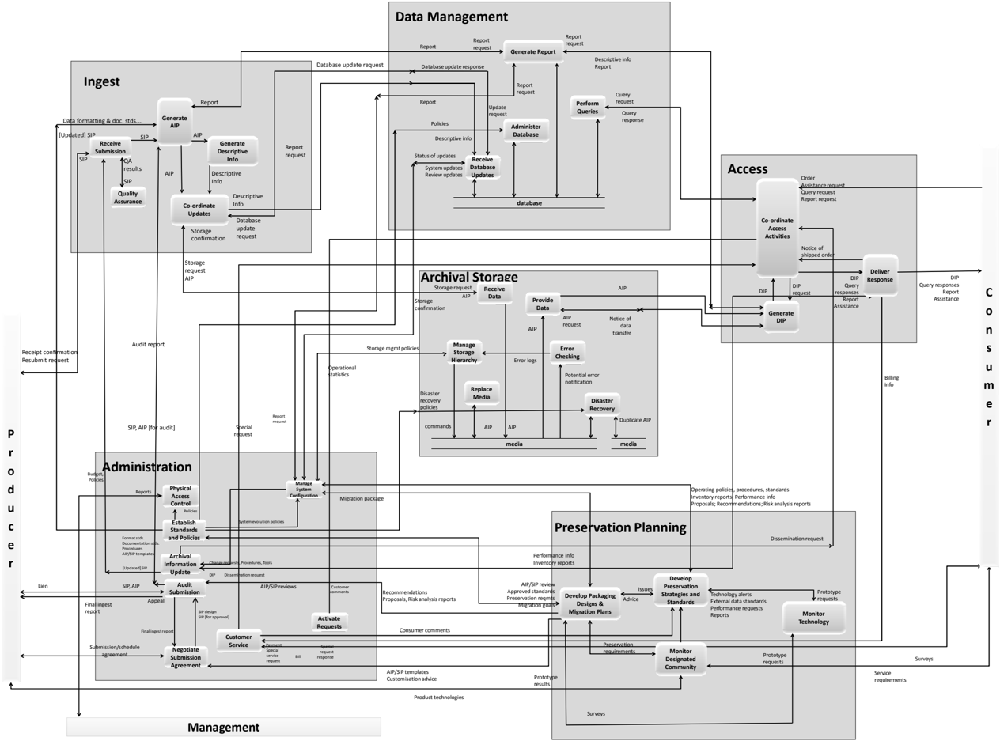

## ANNEX B

## RELATIONSHIP WITH OTHER STANDARDS OR EFFORTS

## (INFORMATIVE)

This  annex  describes  relationships  between  the  OAIS  reference  model  and  various  other standards or efforts.  It includes a brief mapping between some terminology used in various domains and that used in the OAIS reference model.

- -Preserving Digital Information:  Report of the Task Force on Archiving of Digital Information (reference [D2]).

This  document  was  the  basis  for  the  Preservation  Description  Information  in  the OAIS  Information  Model  detailed  in  4.2  of  the  OAIS  Reference  Model.    The 'Preserving  Digital  Information  Report'  did  not  include  the  separate  information object classes for the Packaging Information and Description Information that have been  added  in  the  OAIS  Information  Model.  Therefore  the  following  PDI  class definitions are subsets of those discussed in that paper with some of the information allocated  to  the  new  Packaging  and  Description  Objects.  The  primary  difference between  the  OAIS  information  model  and  the  information  model  presented  in  the 'Preserving Digital Information Report' is:

Context  Information:    This  information  documents  the  relationships  of  the Content Information to its environment. This includes  why  the  Content Information was created, and how it relates to other Content Information objects existing elsewhere. The OAIS Reference Model Context Information differs from the  definition  in  the  'preserving  Digital  Information  Report'  in  that  it  does  not include  the  information  used  in  associating  logical  information  with  physical media.  This type of information is assigned to the Packaging Information in the OAIS Reference Model.

- -Z39.50 Profile for Access to Digital Collections (reference [D4]):

This  document  and  related  Z39.50  profiles  were  the  basis  of  the  concepts  of associated descriptions and finding aids discussed in the Descriptive Data and Access sections of the OAIS Reference Model.  However, the OAIS Reference Model has generalized  these  concepts  so  the  detailed  protocol  definitions  in  'the  Digital Collections Profile' are no longer applicable.

- -IEEE's Reference Model for Open Storage Systems Interconnection-Mass Storage System Reference Model Version 5 (reference [D5]):

This  document  provides  a  set  of  functionality  that  fits  within  the  OAIS  Archival Storage Functional area. However, this functional area may have greater functionality,  including  the  storage  of  non-digital  physical  media  and  the  focus  on Long Term Preservation requirements.

## CCSDS HISTORICAL DOCUMENT

## CCSDS RECOMMENDED PRACTICE FOR AN OAIS REFERENCE MODEL

CCSDS Standards provide a concrete implementation of many of the Information Object and Information  Package  concepts  discussed  in  4.2  of  the  OAIS  Reference  Model.    These standards include:

- -Standard Formatted Data Units-Structure and Construction Rules (reference [D6]).

This standard provides a mechanism which implements the concept of a Representation Network and a platform-independent Information Package.

- -The Data Description Language EAST Specification (CCSD0010) (reference [D7]).

This standard specifies a language that is appropriate for documenting the structural component of Representation Information of most record oriented structures.

- -Data Entity Dictionary Specification Language (DEDSL)-Abstract Syntax (CCSD0011) (reference [D8]).

This standard specifies a set of attributes and a notation for describing a portion of the semantics  of  data  entities.    This  is  a  mechanism  which  can  be  used  to  provide additional semantics for Representation Information.

- -Data Entity Dictionary Specification Language (DEDSL)-PVL Syntax (CCSD0012) (reference [D9]).

This standard specifies a set of attributes and a notation for describing a portion of the semantics  of  data  entities.    This  is  a  mechanism  which  can  be  used  to  provide additional semantics for Representation Information.

The following terms have, in some organizational contexts, approximate mappings to OAIS terms.  However, they are not to be considered as official OAIS replacement terms.

Archives (traditional Archives):

OAIS or OAIS Archive

Accession (traditional Archives):

Ingest

Record (traditional Archives):

Content Information

Primary Audience (journals):

Designated Community

## CCSDS RECOMMENDED PRACTICE FOR AN OAIS REFERENCE MODEL

## ANNEX C

## BRIEF GUIDE TO THE UNIFIED MODELING LANGUAGE (UML)

## (INFORMATIVE)

A key to object relationships in the UML diagrams of this document is shown in figure C-1.

Figure C-1:  Key to UML Relationships

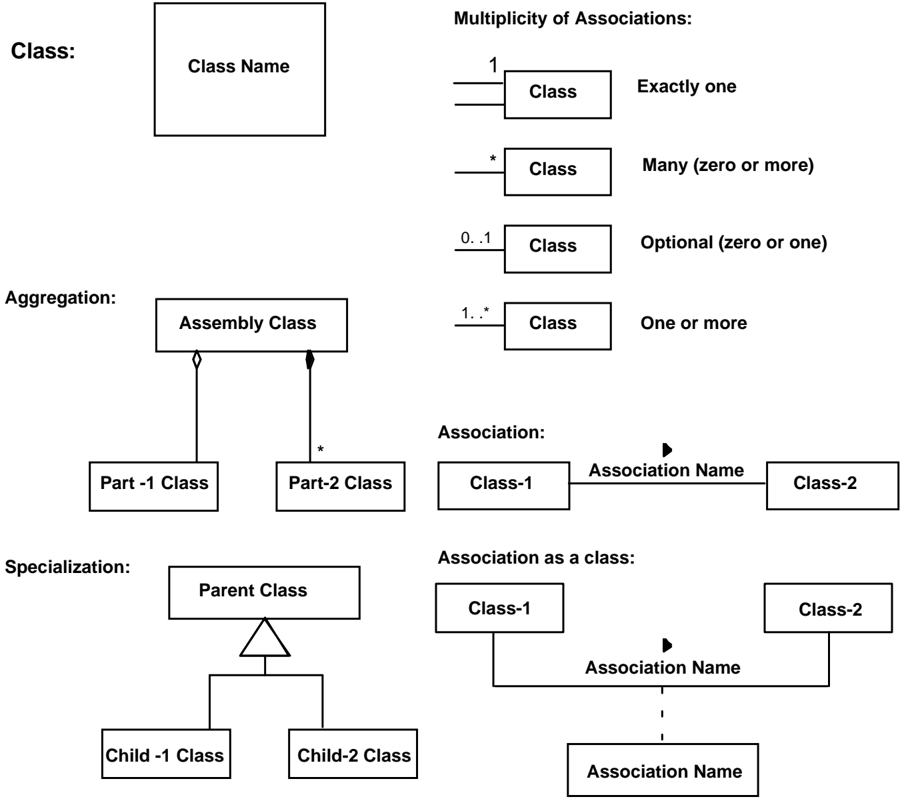

A Class is indicated by a rectangle containing the Class name.  The UML representation of a class  is  a  three-compartment  rectangle  with  name  in  the  top  compartment  attributes  in  the second compartment and methods in the lowest compartment.  In this document the attributes and operations compartments are always empty and UML states empty compartments can be suppressed.

## CCSDS HISTORICAL DOCUMENT

## CCSDS RECOMMENDED PRACTICE FOR AN OAIS REFERENCE MODEL

Classes  of  objects  are  related  to  one  another  through  Associations,  and  there  are  various multiplicities that may be attached to these associations as shown.  The multiplicity refers to the number of instances, or objects, of that class that are involved in the relationship.

A  solid  line  connecting  two  classes  indicates  the  general  association,  among  two  classes. The line is labeled with an association name, indicating the nature of the association, and a solid arrowhead  indicating  the direction that the relationship should  be  read.    The multiplicity  of  each  class  is  shown  next  to  the  class  near  the  association  line.    If  the association forms a class that may have its own attributes or methods, that association class is shown as a rectangle connected to the solid line by a dashed line.  The multiplicity may be omitted if the association is one to one.

There are two particular associations that are commonly used, aggregation and specialization, and these have particular symbols to indicate them.

An Aggregation association is one where a class is considered to be a part of another class. In  UML, a diamond connecting the aggregation association to the aggregated class shows association.  There are two types of aggregation defined by UML.  Composition (sometimes referred to as strong aggregation), where the part classes are physically stored as part of the aggregated class, is shown with a solid diamond.  In a Composition, if the aggregated class is destroyed, the child classes are also destroyed.  Weak aggregation, where the part classes are referred to by the aggregated class, is shown with an empty diamond.  In a weak aggregation, if the aggregated class is destroyed, the part classes are not destroyed and may be aggregated into other new classes.  Composition can be thought of as aggregation by value, while weak aggregation can be thought of as aggregation by reference.  In figure C-1, the aggregation association says that the Assembly class contains exactly one Part-1 class instance and zero or more Part-2 class instances.  Also if an instance Assembly is destroyed the Part-1 instance will continue to exist but all the Part-2 instances will be destroyed.

A Specialization association is one where a child class inherits attributes and methods from the  parent  class.    In  UML,  a  broad  triangle  connecting  the  aggregation  association  to  the parent class shows specialization.  An instance of a child class contains all the attributes and methods contained by its parent class, so an instance of the child class can be used in any operation where an instance of the parent class would be valid.  However, the child class may add  any  number  of  new  attributes  or  methods  so  an  instance  of  a  parent  class  is  not necessarily  a  valid  replacement  for  the  child  class.    In  figure  C-1,  the  specialization association  says  that  the  Parent  class  attributes  and  methods  are  inherited  by  the  Child-1 class and the Child-2 class.

## ANNEX D

## INFORMATIVE REFERENCES

## (INFORMATIVE)

- [D1] Procedures Manual for the Consultative Committee for Space Data Systems .  CCSDS A00.0-Y-9.  Yellow Book.  Issue 9.  Washington, D.C.: CCSDS, November 2003.
- [D2] Donald Waters and John Garrett. Preserving Digital Information .  Report of the Task Force  on  Archiving  of  Digital  Information.    Washington,  DC:  CLIR,  May  1996. &lt;http://www.clir.org/pubs/reports/pub63watersgarrett.pdf&gt;
- [D3] Unified Modeling Language (UML) .  Version 2.2.  Needham, Massachusetts: OMG, February 2009.  &lt;http://www.omg.org/technology/documents/formal/uml.htm&gt;
- [D4] Z39.50 Profile for Access to Digital Collections .  Draft Seven.  Washington, DC: Library of Congress, May 1996.  &lt;http://www.loc.gov/z3950/agency/profiles/collections.html&gt;
- [D5] Reference Model for Open Storage Systems Interconnection-Mass Storage System Reference Model . Version 5. Project 1244. New York: IEEE, 1994. &lt;http://www.ssswg.org/public\_documents.html&gt;
- [D6] Standard Formatted Data Units-Structure and Construction Rules . Recommendation for Space Data System Standards, CCSDS 620.0-B-2.  Blue Book. Issue 2.  Washington, D.C.: CCSDS, May 1992.
- [D7] The Data Description Language EAST Specification (CCSD0010) .  Recommendation for  Space  Data  System  Standards,  CCSDS  644.0-B-2.    Blue  Book.    Issue  2. Washington, D.C.: CCSDS, November 2000.
- [D8] Data Entity Dictionary Specification Language (DEDSL)-Abstract Syntax (CCSD0011) .  Recommendation for Space Data System Standards, CCSDS 647.1-B1.  Blue Book.  Issue 1.  Washington, D.C.: CCSDS, June 2001.
- [D9] Data Entity Dictionary Specification Language (DEDSL)-PVL Syntax (CCSD0012) . Recommendation for Space Data System Standards, CCSDS 647.2-B-1.  Blue Book. Issue 1.  Washington, D.C.: CCSDS, June 2001.
- [D10] Information  Processing-Volume  and  File  Structure  of  CD-ROM  for  Information Interchange .  International Standard, ISO 9660:1988.  Geneva:  ISO, 1988.
- [D11] XML Formatted Data Unit (XFDU) Structure and Construction Rules . Recommendation for Space Data System Standards, CCSDS 661.0-B-1.  Blue Book. Issue 1.  Washington, D.C.: CCSDS, September 2008.

- [D12] The Application of CCSDS Protocols to Secure Systems .    Report Concerning Space Data  System  Standards,  CCSDS  350.0-G-2.    Green  Book.    Issue  2.    Washington, D.C.: CCSDS, January 2006.

## CCSDS RECOMMENDED PRACTICE FOR AN OAIS REFERENCE MODEL

## ANNEX E

## A MODEL FOR SOFTWARE USE IN REPRESENTATION INFORMATION

## (INFORMATIVE)

Subsection  4.2  discusses  that  Representation  Rendering  Software  is  often  used  to  end  the Representation Network.  A way to view this information is as a layered Information Model as  shown  figure E-1.    In  this  model  there  are  five  layers.    Each  of  these  layers  has  welldefined  interfaces  to  the  higher  layers  of  the  model.    These  interfaces  are  known  as Application  Program  Interfaces  or  Service  Access  Points  in  other  layered  models.    The following is an overview of the functionality of each layer and the data that is exchanged at each  interface.    This  overview  illustrates  the  process  of  getting  bits  from  the  media  and adding Representation Information needed to make the information usable by the Consumer.

Figure E-1:  Layered Information Model

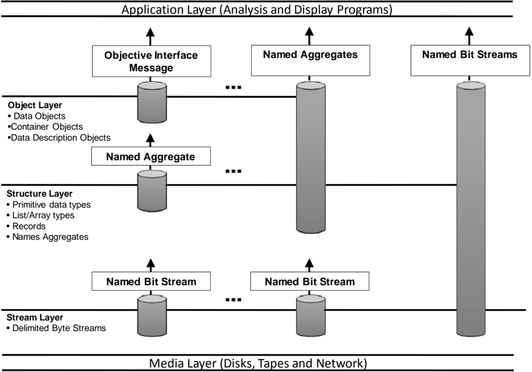

- -The Media Layer simply models the fact that the bit strings are stored on physical or communications  media  as  magnetic  domains  or  as  voltages.    The  function  of  this

## CCSDS HISTORICAL DOCUMENT

## CCSDS RECOMMENDED PRACTICE FOR AN OAIS REFERENCE MODEL

layer is to convert that bit representation to the bit representation that can be used in higher  level  (i.e.,  one  and  zero).    This  layer  has  as  single  interface,  which  enables higher layers to specify the location and size of the bit stream of interest and receive the bits as a string of '1' and '0' bits.  In modern computing systems device drivers and chips built into the physical storage interface provide much of this functionality.

- -The  Stream  Layer  hides  the  unique  characteristics  of  the  transport  medium  by stripping any artifacts of the storage or transmission process (such as packet formats, block  sizes,  inter-record  gaps,  and  error-correction  codes)  and  provides  the  higher levels with a consistent view of data that is independent of its medium.  The interface between the Stream Layer and higher layers allows the higher layers to request Data Blocks by name and receive a bit/byte string representing those Data Blocks.  The term name here  means  any  unique  key  for  locating  the  data  stream  of  interest. Examples include path names for files or message identifiers for telecommunication messages.    In  modern  computing  systems,  operating  system  file  systems  often provide this layer of functionality.
- -The Structure  Layer  converts  the  bit/byte  streams  from  the  Stream  Layer  interface into  addressable  structures  of  primitive  data  types  that  can  be  recognized  and operated by computer processors and operating systems.  For any implementation, the structure layer defines the primitive data types and aggregations that are recognized. This usually means at least characters and integer and real numbers.  The aggregation types typically supported include a record (i.e., a structure that can hold more than one  data  type)  and  an  array  (where  each  element  consists  of  the  same  data  type). Issues relating to the representation of primitive data types are resolved in this layer. The interface  from  the  Structure  Layer  to  higher  levels  allows  the  higher  levels  to request labeled aggregations of primitive data types and receive them in a structured form that may be internally addressable.  In modern computing systems programming language compilers and interpreters generally provides this layer of functionality.
- -The Object Layer, which converts the labeled aggregates of primitive data types into information,  represented  as  objects  that  are  recognizable  and  meaningful  in  the application domain.  In the scientific domain, this includes objects such as images, spectra, and histograms.  The object layer adds semantic meaning to the data treated by the lower layers of the model.  Some specific functions of this layer include the following:
- Defines data types based on information content rather than on the representation of  those  data  at  the  structure  layer.    For  example,  many  different  kinds  of objects-images,  maps,  and  tables-can  be  implemented  at  the  structure  level using  arrays  or  records.    Within  the  object  layer,  images,  maps,  and  tables  are recognized and treated as distinct types of information.
- Presents applications with a consistent interface to similar kinds of information objects, regardless of their underlying representations.  The interface defines the operations  that  can  be  performed  on  the  object,  the  inputs  required  for  each operation and the output data types from each.

## CCSDS RECOMMENDED PRACTICE FOR AN OAIS REFERENCE MODEL

- Provides a mechanism to identify the characteristics of objects that are visible to users, operations that may be applied to an object, and the relationships between objects.

The  Interface  between  the  Object  Layer  and  the  Application  Layer  allows  the higher  levels  to  specify  the  operation  that  is  to  be  applied  to  an  object,  the parameters  needed  for  that  operation  and  the  form  in  which  results  of  the operations will be returned.  One special interface allows the user to discover the semantics of the objects, such as operations available and relationships to other objects.  In modern computing systems subroutine libraries or object repositories and interfaces supply this functionality.

- -The Application Layer contains customized programs to analyze the Data Objects and present  the  analysis  or  the  Data  Object  in  a  form  that  a  Data  Consumer  can understand. In modern  computing  systems  application programs  supply this functionality.

The problem with using Representation Rendering Software to end Representation Networks is that the programs that are saved do not include the information needed to enable the lower levels  of  the  layered  model  to  extract  the  information  from  the  bits  on  the  media.    These services are usually provided by the vendor-supplied operating systems, device drivers, and file  systems.    When  data  is  moved  to  other  media  or  different  software  platforms,  the interfaces  to  these  levels  may  be  changed.    This  migration  process  is  further  discussed  in section 5 of this document.

## ANNEX F

## SECURITY CONSIDERATIONS

## (INFORMATIVE)

CCSDS requires there to be an informative annex which points out security considerations for  implementations of its standards, including those implementing archival systems based on this Reference Model. It must be borne in mind that the OAIS Reference Model itself is not a design and does not specify any particular implementation techniques.

General guidance on security issues may be found in the CCSDS Informational Report, The Application of CCSDS Protocols to Secure Systems (reference [D12]) and references therein.

To  be  conformant  to  this  reference  model  an  implementation  should  use  the  Information Model and follow the mandatory requirements in 3.1; therefore the following annotations on those mandatory requirements provide some guidance on security concerns.

- -Negotiate for and accept appropriate information from information Producers.
- The identity of the information Producer should be validated where appropriate, not  least  to  ensure  that  the  evidence  for  authenticity  of  the  information  can  be relied  upon.  Communications  between  the  Archive  and  Producer  may  require additional safeguards such as electronic signatures and/or digests.
- -Obtain sufficient  control  of  the  information  provided  to  the  level  needed  to  ensure Long Term Preservation.
- Sufficient control includes control of the bits, and would imply adequate security processes for personnel and systems. Security considerations for any agreements with  rights  holders  which  may  be  necessary  should  be  covered  by  normal business  processes.  Any  restrictions  which  the  original  rights  holder  places  on what  the  archive  preserves  should  also  be  respected  over  time  and  adequate security measures should be put in place to ensure that.
- -Determine, either by itself or in conjunction with other parties, which communities should  become  the  Designated  Community  and,  therefore,  should  be  able  to understand the information provided, thereby defining its Knowledge Base.
- No  specific  security  issues  seem  relevant  here  other  than  normal  business processes involved in communication with any other parties involved.
- -Ensure that the information to be preserved is Independently Understandable to the Designated Community. In particular, the Designated Community should be able to understand the information without needing special resources such as the assistance of the experts who produced the information.

- Security  considerations  here  include  respecting  restrictions  imposed  by  the original rights holders and appropriate security and authenticity of the content of the components of the Archival Information Packages, including Representation Information, Provenance Information, and Access Rights.
- -Follow  documented  policies  and  procedures  which  ensure  that  the  information  is preserved against all reasonable contingencies, including the demise of the archive, ensuring that it is never deleted unless allowed as part of an approved strategy. There should be no ad-hoc deletions.
- This  should  include  all  appropriate  security  measures  such  as  physical  access, backups and periodic integrity checking. In the case of the demise of the archive the identity of any successor organization should be verified and transmission of holdings to that organization should be carried out using tamper-proof techniques, including  for  example  the  use  of  electronic  digests  and  signatures  in  order  to ensure the chain of Provenance.
- -Make the preserved information available to the Designated Community and enable the  information  to  be  disseminated  as  copies  of,  or  as  traceable  to,  the  original submitted Data Objects with evidence supporting its Authenticity.
- Implementations of Dissemination Information Packages could include electronic signatures and digests, as well as details of any Transformations which may have been performed to create the DIP, for example where the Consumer needs to be able  to  securely  trace  back  to  the  originally  submitted  Data  Object.  Access controls may also need to be put in place if required. Attacks on an Archive such as denial of service attacks may raise security concerns which would need to be addressed.