## Recommendation for Space Data System Practices

## REFERENCE MODEL FOR AN OPEN ARCHIVAL INFORMATION SYSTEM (OAIS)

## RECOMMENDED PRACTICE CCSDS 650.0-M-3

MAGENTA BOOK December 2024

## Recommendation for Space Data System Practices

## REFERENCE MODEL FOR AN OPEN ARCHIVAL INFORMATION SYSTEM (OAIS)

## RECOMMENDED PRACTICE CCSDS 650.0-M-3

## MAGENTA BOOK December 2024

## AUTHORITY

Issue:

Recommended Practice, Issue 3

Date:

December 2024

Location:

Washington, DC, USA

This document has been approved for publication by the Management Council of the Consultative Committee for Space Data Systems (CCSDS) and represents the consensus technical agreement of the participating CCSDS Member Agencies. The procedure for review and authorization of CCSDS documents is detailed in Organization and Processes for the Consultative Committee for Space Data Systems (CCSDS A02.1-Y-4), and the record of Agency participation in the authorization of this document can be obtained from the CCSDS Secretariat at the email address below.

This document is published and maintained by:

CCSDS Secretariat

National Aeronautics and Space Administration Washington, DC, USA Email: secretariat@mailman.ccsds.org

## CCSDS RECOMMENDED PRACTICE FOR AN OAIS REFERENCE MODEL

## STATEMENT OF INTENT

The Consultative Committee for Space Data Systems (CCSDS) is an organization officially established by the management of its members. The Committee meets periodically to address data systems problems that are common to all participants, and to formulate sound technical solutions to these problems. Inasmuch as participation in the CCSDS is completely voluntary, the results of Committee actions are termed Recommendations and are not in themselves considered binding on any Agency.

CCSDS Recommendations take two forms: Recommended Standards that are prescriptive and are the formal vehicles by which CCSDS Agencies create the standards that specify how elements of their space mission support infrastructure shall operate and interoperate with others; and Recommended Practices that are more descriptive in nature and are intended to provide general guidance about how to approach a particular problem associated with space mission support. This Recommended Practice is issued by, and represents the consensus of, the CCSDS members. Endorsement of this Recommended Practice is entirely voluntary and does not imply a commitment by any Agency or organization to implement its recommendations in a prescriptive sense.

No later than five years from its date of issuance, this Recommended Practice will be reviewed by the CCSDS to determine whether it should: (1) remain in effect without change; (2) be changed to reflect the impact of new technologies, new requirements, or new directions; or (3) be retired or canceled.

In those instances when a new version of a Recommended Practice is issued, existing CCSDS-related member Practices and implementations are not negated or deemed to be nonCCSDS compatible. It is the responsibility of each member to determine when such Practices or implementations are to be modified. Each member is, however, strongly encouraged to direct planning for its new Practices and implementations towards the later version of the Recommended Practice.

## CCSDS RECOMMENDED PRACTICE FOR AN OAIS REFERENCE MODEL

## FOREWORD

This Recommended Practice establishes a common framework of terms and concepts which make up an Open Archival Information System (OAIS). It allows existing and future archives to be more meaningfully compared and contrasted. It provides a basis for further standardization within an archival context and it should promote greater vendor awareness of, and support of, archival requirements.

CCSDS has changed the classification of Reference Models from Blue (Recommended Standard) to Magenta (Recommended Practice).

Through the process of normal evolution, it is expected that expansion, deletion, or modification of this document may occur. This Recommended Practice is therefore subject to CCSDS document management and change control procedures, which are defined in the Organization and Processes for the Consultative Committee for Space Data Systems (CCSDS A02.1-Y-4). Current versions of CCSDS documents are maintained at the CCSDS Web site:

## http://www.ccsds.org/

Questions relating to the contents or status of this document should be sent to the CCSDS Secretariat at the email address indicated on page i.

## CCSDS RECOMMENDED PRACTICE FOR AN OAIS REFERENCE MODEL

At time of publication, the active Member and Observer Agencies of the CCSDS were:

## Member Agencies

- -Agenzia Spaziale Italiana (ASI)/Italy.
- -Canadian Space Agency (CSA)/Canada.
- -Centre National d'Etudes Spatiales (CNES)/France.
- -China National Space Administration (CNSA)/People's Republic of China.
- -Deutsches Zentrum für Luft- und Raumfahrt (DLR)/Germany.
- -European Space Agency (ESA)/Europe.
- -Federal Space Agency (FSA)/Russian Federation.
- -Instituto Nacional de Pesquisas Espaciais (INPE)/Brazil.
- -Japan Aerospace Exploration Agency (JAXA)/Japan.
- -National Aeronautics and Space Administration (NASA)/USA.
- -UK Space Agency/United Kingdom.

## Observer Agencies

- -Austrian Space Agency (ASA)/Austria.
- -Belgian Science Policy Office (BELSPO)/Belgium.
- -Central Research Institute of Machine Building (TsNIIMash)/Russian Federation.
- -China Satellite Launch and Tracking Control General, Beijing Institute of Tracking and Telecommunications Technology (CLTC/BITTT)/China.
- -Chinese Academy of Sciences (CAS)/China.
- -China Academy of Space Technology (CAST)/China.
- -Commonwealth Scientific and Industrial Research Organization (CSIRO)/Australia.
- -Danish National Space Center (DNSC)/Denmark.
- -Departamento de Ciência e Tecnologia Aeroespacial (DCTA)/Brazil.
- -Electronics and Telecommunications Research Institute (ETRI)/Korea.
- -Egyptian Space Agency (EgSA)/Egypt.
- -European Organization for the Exploitation of Meteorological Satellites (EUMETSAT)/Europe.
- -European Telecommunications Satellite Organization (EUTELSAT)/Europe.
- -Geo-Informatics and Space Technology Development Agency (GISTDA)/Thailand.
- -Hellenic National Space Committee (HNSC)/Greece.
- -Hellenic Space Agency (HSA)/Greece.
- -Indian Space Research Organization (ISRO)/India.
- -Institute of Space Research (IKI)/Russian Federation.
- -Korea Aerospace Research Institute (KARI)/Korea.
- -Ministry of Communications (MOC)/Israel.
- -Mohammed Bin Rashid Space Centre (MBRSC)/United Arab Emirates.
- -National Institute of Information and Communications Technology (NICT)/Japan.
- -National Oceanic and Atmospheric Administration (NOAA)/USA.
- -National Space Agency of the Republic of Kazakhstan (NSARK)/Kazakhstan.
- -National Space Organization (NSPO)/Chinese Taipei.
- -Naval Center for Space Technology (NCST)/USA.
- -Netherlands Space Office (NSO)/The Netherlands.
- -Research Institute for Particle &amp; Nuclear Physics (KFKI)/Hungary.
- -Scientific and Technological Research Council of Turkey (TUBITAK)/Turkey.
- -South African National Space Agency (SANSA)/Republic of South Africa.
- -Space and Upper Atmosphere Research Commission (SUPARCO)/Pakistan.
- -Swedish Space Corporation (SSC)/Sweden.
- -Swiss Space Office (SSO)/Switzerland.
- -United States Geological Survey (USGS)/USA.

## DOCUMENT CONTROL

| Document | Title | Date | Status |
|-----------------|-----------------------------------------------------------------------------------------------|---------------|----------------------------------|
| CCSDS 650.0-B-1 | Reference Model for an Open Archival Information System (OAIS) | January 2002 | Original issue, superseded |
| CCSDS 650.0-M-2 | Reference Model for an Open Archival Information System (OAIS), Recommended Practice, Issue 2 | June 2012 | Issue 2, superseded |
| CCSDS 650.0-M-3 | Reference Model for an Open Archival Information System (OAIS), Recommended Practice, Issue 3 | December 2024 | Current issue (see notes below). |

## NOTES

- 1 Changes from the current issue are too numerous to permit meaningful use of change bars.
- 2 This issue has additions to, and clarifications of, concepts and terminology, for example:
- -The relationship between Preservation Description Information (PDI) and Content Data Object has been clarified, emphasizing that, as has been stated since the original version of OAIS, any Information Object may serve as Content Information.
- -The concept of Preservation Objectives has been introduced to allow 'Independently Understandable' to be more consistently testable.
- -Consistency with the Producer-Archive Interface Specification (PAIS) (CCSDS 651.1-B-1) has been improved.
- -Diagram conventions have been clarified.
- -Some definitions in the Glossary have been clarified.
- -Consistency between the diagrams of the Functional Entities and supporting text has been improved.
- -A Preservation Watch function has been added to the Preservation Planning Functional Entity.
- -The definition of the Information Package has been updated for consistency.

## CCSDS RECOMMENDED PRACTICE FOR AN OAIS REFERENCE MODEL

- -Additional preservation techniques have been described explicitly in addition to Migration.
- -Additional types of Archive interaction have been added, including primarysupporting Archives.
- -Annex A is marked as Informative. It had previously erroneously been marked as Normative.

Annex B from the previous issue described the relationship of OAIS to other standards; but its contents were continually out of date as those other standards develop along different directions and timelines as compared to OAIS development. Also, subsection 1.5 from the previous issue, which provided a roadmap to related Standards which could be developed was removed since a number of those standards are now available. Both have been replaced by pointers in annex B to informative documents on the CCSDS web site which can be updated more rapidly.

## CCSDS RECOMMENDED PRACTICE FOR AN OAIS REFERENCE MODEL

## CONTENTS

| Section | | Page |
|---------------------------------------------------------------------------------------------------------------------------|---------------------------------------------------------------------------------------------------------------------------|----------------------------------------------------------------------------------------------------------------|
| 1 INTRODUCTION .......................................................................................................... | 1 INTRODUCTION .......................................................................................................... | 1-1 |
| 1.1 | PURPOSE AND SCOPE........................................................................................1-1 | |
| 1.2 | APPLICABILITY...................................................................................................1-2 | |
| 1.3 | RATIONALE..........................................................................................................1-3 | |
| 1.4 | CONFORMANCE..................................................................................................1-3 | |
| 1.5 | DOCUMENT STRUCTURE..................................................................................1-4 | |
| 1.6 | DEFINITIONS........................................................................................................1-7 | |
| 2 OAIS CONCEPTS ......................................................................................................... | 2 OAIS CONCEPTS ......................................................................................................... | 2-1 |
| 2.1 | GENERAL..............................................................................................................2-1 | |
| 2.2 | OAIS ENVIRONMENT.........................................................................................2-2 | |
| 2.3 | OAIS INFORMATION | ..........................................................................................2-3 |
| 2.4 | PRESERVATION OBJECTIVES..........................................................................2-8 | |
| 2.5 | SUPPLEMENTARY INFORMATION HELD BY THE ARCHIVE....................2-9 | |
| 2.6 | OAIS HIGH-LEVEL EXTERNAL INTERACTIONS ........................................2-10 | |
| 3 OAIS RESPONSIBILITIES .......................................................................................... | 3 OAIS RESPONSIBILITIES .......................................................................................... | 3-1 |
| 3.1 | OVERVIEW | ...........................................................................................................3-1 |
| 3.2 | MANDATORY RESPONSIBILITIES...................................................................3-1 | |
| 3.3 | EXAMPLE MECHANISMS FOR DISCHARGING RESPONSIBILITIES.........3-2 | |
| 4 DETAILED MODELS ................................................................................................... | 4 DETAILED MODELS ................................................................................................... | 4-1 |
| 4.1 | OVERVIEW | ...........................................................................................................4-1 |
| 4.2 | FUNCTIONAL MODEL........................................................................................4-1 | |
| 4.3 | INFORMATION MODEL....................................................................................4-22 | |
| 4.4 | INFORMATION PACKAGE TRANSFORMATIONS.......................................4-55 | |
| 5 PRESERVATION PERSPECTIVES ........................................................................... | 5 PRESERVATION PERSPECTIVES ........................................................................... | 5-1 |
| 5.1 | OVERVIEW | ...........................................................................................................5-1 |
| 5.2 | DIGITAL MIGRATION.........................................................................................5-2 | |
| 5.3 | ADDING REPRESENTATION INFORMATION..............................................5-11 | |
| 5.4 | HANDING OVER TO ANOTHER | OAIS............................................................5-16 |
| 6 | ARCHIVE INTEROPERABILITY ............................................................................. | 6-1 |
| 6.1 | GENERAL..............................................................................................................6-1 | |
| 6.2 | LEVELS OF INTERACTION BETWEEN OAIS ARCHIVES.............................6-2 | |

## CCSDS RECOMMENDED PRACTICE FOR AN OAIS REFERENCE MODEL

## CONTENTS (continued)

| Section | | Page |
|-------------------------------------------------------------------------------------------------------------------------------------------|---------------------------------------------------------------------------------------------------------------------------------------------------------------------------------|--------------------------------------------------------------------------------------------------------------|
| ANNEX A COMPOSITE FUNCTIONAL VIEW (INFORMATIVE) ....................... | ANNEX A COMPOSITE FUNCTIONAL VIEW (INFORMATIVE) ....................... | A-1 |
| ANNEX B RELATIONSHIP WITH OTHER STANDARDS OR EFFORTS (INFORMATIVE) ...................................................................... | ANNEX B RELATIONSHIP WITH OTHER STANDARDS OR EFFORTS (INFORMATIVE) ...................................................................... | B-1 |
| ANNEX C BRIEF GUIDE TO THE UNIFIED MODELING LANGUAGE (UML) (INFORMATIVE) .................................................... | ANNEX C BRIEF GUIDE TO THE UNIFIED MODELING LANGUAGE (UML) (INFORMATIVE) .................................................... | C-1 |
| ANNEX D INFORMATIVE REFERENCES (INFORMATIVE) ................................ | ANNEX D INFORMATIVE REFERENCES (INFORMATIVE) ................................ | D-1 |
| ANNEX E A MODELFORSOFTWAREUSEIN REPRESENTATION INFORMATION (INFORMATIVE) ........................................................... | ANNEX E A MODELFORSOFTWAREUSEIN REPRESENTATION INFORMATION (INFORMATIVE) ........................................................... | E-1 |
| ANNEX F SECURITY CONSIDERATIONS (INFORMATIVE) ............................... | ANNEX F SECURITY CONSIDERATIONS (INFORMATIVE) ............................... | F-1 |
| Figure | Figure | |
| 1-1 | Examples of Diagram Conventions ..............................................................................1-6 | |
| 2-1 | Environment Model of an OAIS...................................................................................2-2 | |
| 2-2 | Obtaining Information from Data | .................................................................................2-4 |
| 2-3 | Information Package Concepts and Relationships........................................................2-6 | |
| 2-4 | OAIS Archive External Data | ......................................................................................2-10 |
| 4-1 | OAIS Functional Entities | ..............................................................................................4-1 |
| 4-2 | Functions of the Ingest Functional Entity.....................................................................4-6 | |
| 4-3 | Functions of the Archival Storage Functional Entity....................................................4-8 | |
| 4-4 | Functions of the Data Management Functional Entity | ...............................................4-10 |
| 4-5 | Functions of the Administration Functional Entity.....................................................4-12 | |
| 4-6 | Functions of the Preservation Planning Functional Entity..........................................4-15 | |
| 4-7 | Functions of the Access Functional Entity | .................................................................4-18 |
| 4-8 | OAIS Data Flow Diagram...........................................................................................4-20 | |
| 4-9 | Administration Context Diagram................................................................................4-21 | |
| 4-10 | Information Object......................................................................................................4-23 | |
| 4-11 | Representation Information Object.............................................................................4-26 | |
| 4-12 | Partial General | RIN.....................................................................................................4-27 |
| 4-13 | Example of a Simplified RIN for a FITS File.............................................................4-28 | |
| 4-14 | Information Object Taxonomy....................................................................................4-31 | |
| 4-15 | Information Package Contents and Its Associated Package Description and Packaging Information......................................................................4-39 | |
| 4-16 | Example of an Information Object Made Up of Content Information and PDI ...................................................................................................4-39 | |
| 4-17 | Information Package Taxonomy.................................................................................4-40 | |
| 4-18 | Archival Information Package (AIP) and Its Associated Package Description and Packaging Information......................................................................4-42 | |
| 4-19 | Preservation Description Information.........................................................................4-43 | |

## CCSDS RECOMMENDED PRACTICE FOR AN OAIS REFERENCE MODEL

## CONTENTS (continued)

| Figure | Page |
|--------------------------------------------------------------------------------------------------------------------------------------------------------------------------------|-----------------------------------------------------------------------------------------------------------------------------------------------------------------------|
| 4-21 Archival Information Package (Detailed View) and Its Associated Package Description and Packaging Information .......................................................4-45 | |
| 4-22 Specialization of the AIP | ............................................................................................4-46 |
| 4-23 Specialization of the Package Description..................................................................4-47 | |
| 4-24 Archival Information Unit (AIU) and Its Associated Unit Description and Packaging Information .....................................................................4-48 | |
| 4-25 Unit Description and Its Associated Archival Information Unit | ................................4-48 |
| 4-26 Archival Information Collections and Its Associated Collection Description and Packaging Information Logical View...............................................4-50 | |
| 4-27 Collection Description and Its Associated Archival Information Collection | .............4-52 |
| 4-28 Data Management Information ...................................................................................4-55 | |
| 4-29 High-Level Data Flows in an OAIS............................................................................4-56 | |
| 5-1 Conceptual View of Relationships among Names and AIP Components | ....................5-4 |
| 6-1 Cooperating Archives with Mutual Exchange Agreement | ...........................................6-4 |
| 6-2 Cooperating Archives with Standard Ingest and Access Methods | ...............................6-5 |
| 6-3 An OAIS Federation Employing a Common Catalog...................................................6-6 | |
| 6-4 Archives with Shared Storage.....................................................................................6-10 | |
| 6-5 Example of a Distributed OAIS Archive for Archival Storage ..................................6-12 | |
| 6-6 Another Example of a Distributed OAIS Archive Entities.................................................................................A-2 | for Archival Storage ....................6-14 |
| A-1 Composite of Functional | |
| C-1 Key to UML Relationships | ..........................................................................................C-1 |
| E-1 Layered Information Model......................................................................................... | E-1 |
| Table | |
| 4-1 Examples of PDI 5-1 CDO Software Roles and Preservation Possible | .........................................................................................................4-36 Actions ...........................................5-14 |

## 1 INTRODUCTION

## 1.1 PURPOSE AND SCOPE

The purpose of this document is to define the CCSDS and International Organization for Standardization (ISO) Reference Model for an Open Archival Information System (OAIS). An OAIS is an Archive system consisting of hardware, software, information, and policy-based processes and procedures put in place and operated by an organization and its staff. The organization has accepted the responsibility to preserve information and make it available for a Designated Community . The organization may be part of a larger organization. The system meets a set of mandatory responsibilities that allow an OAIS Archive to be distinguished from other uses of the term 'archive'. The set of mandatory responsibilities an OAIS Archive must perform are defined in 3.2. The term 'Open' in OAIS is used to imply that this Recommended Practice, as well as future related Recommended Practices and standards, are developed in open forums, and it does not imply that access to the Archive is unrestricted. The information being maintained has been deemed to need Long Term Preservation , even if the OAIS itself is not permanent. Long Term is long enough to be concerned with the impacts of changing technologies, as well as support for new media and data formats, or with a changing Knowledge Base of the Designated Community or changes within the Designated Community or its definition. Long Term may extend indefinitely. In this Reference Model there is a particular focus on digital information, both as the primary forms of information held and as supporting information for both digitally and physically preserved materials. Therefore, the model accommodates information that is inherently non-digital (e.g., a physical sample), but the modelling and preservation of such information is not addressed in detail. This Reference Model:

- -provides a framework for the understanding and increased awareness of archival concepts needed for Long Term digital information preservation and access;
- -provides the concepts needed by non-archival organizations to be effective participants in the preservation process;
- -provides a framework, including terminology and concepts, for describing and comparing architectures and operations of existing and future Archives;
- -provides a framework for describing and comparing different Long Term Preservation strategies and techniques;
- -provides a basis for comparing the data models of digital information preserved by Archives and for discussing how the data models and the underlying information may change over time;
- -provides a framework that may be expanded by other efforts to cover Long Term Preservation of information that is NOT in digital form (e.g., physical media and physical samples);
- -expands consensus on the elements and processes for Long Term digital information preservation and access, and promotes a larger market which vendors can support;
- -guides the identification and production of OAIS-related standards.

## CCSDS RECOMMENDED PRACTICE FOR AN OAIS REFERENCE MODEL

The reference model addresses a full range of archival information preservation functions including ingest, archival storage, data management, access, and dissemination. It also addresses the migration of digital information to new media and forms, the information models used to represent the information, the role of software in information preservation, and the exchange of digital information among Archives. It identifies both internal and external interfaces to the Archive functions, and it identifies a number of high-level services at these interfaces. It provides various illustrative examples and some 'best practice' recommendations. It defines a minimal set of responsibilities for an Archive to be called an OAIS, and it also defines a maximal Archive to provide a broad set of useful terms and concepts.

## 1.2 APPLICABILITY

The OAIS model in this document may be applicable to any Archive. It is specifically applicable to organizations, which may themselves be part of larger organizations, with the responsibility of making information available for the Long Term (as defined in 1.6.2). This includes organizations with other responsibilities, such as receiving, processing and distribution in response to programmatic needs.

Organizations may require their information, from the start, to be re-processable to enable the results created by others to be reproduced, interoperable with other information, and re-used in new ways. Such organizations will find this document relevant because of the requirement that, to be preserved, the information must be understandable and usable.

This model is also of interest to those organizations and individuals who create information that may need Long Term Preservation and those that may need to acquire information from such Archives.

The model, including the functional and information modelling concepts, is relevant to the comparison and design of facilities which hold information, on a temporary basis, for two reasons:

- -When taking into consideration the rapid pace of technology changes or possible changes in a Designated Community, there is the likelihood that facilities, thought to be holding information on a temporary basis, will in fact find that some or much of their information holdings will need Long Term Preservation attention.
- -Although some facilities holding information may themselves be temporary, some or all of their information may need to be preserved indefinitely. Such facilities need to be active participants in the Long Term Preservation effort.

Standards developers are expected to use this model in conjunction with related standards and community documents as a basis for further standardization in this area. Many related standards are possible and some have already been developed. Annex B includes links to websites containing references to a selection of related standards.

This reference model does not specify a design or an implementation. Actual implementations may group or break out functionality differently.

## CCSDS RECOMMENDED PRACTICE FOR AN OAIS REFERENCE MODEL

## 1.3 RATIONALE

A tremendous growth in computational power, and in networking bandwidth and connectivity, has resulted in an explosion in the number of organizations making digital information available. Transactions among all types of organizations are being conducted using digital forms that are taking the place of more traditional media such as paper.

Preserving information in digital forms is much more difficult than preserving information in forms such as paper and film. This is not only a problem for traditional archives, but also for many organizations that have never thought of themselves as performing an archival function. Along with the many advantages in terms of, for example, searchability and replication, the spread of digital technology in every field brings certain disadvantages. The rapid obsolescence of digital technologies creates considerable technical dangers, particularly a much greater risk than in the past of losing the possibility of restoring, rendering or interpreting the information. Ways of avoiding or reducing these dangers will be detailed throughout this Recommended Practice. Nevertheless, it would be unwise to consider the problem from a solely technical standpoint. There are also organizational, legal, industrial, scientific and cultural issues to be considered. To ignore the problems raised by preserving information in digital forms would lead inevitably to the loss of this information. In addition, information is more and more easily altered or faked. Ways to be more sure of the authenticity of information, by knowing its provenance and being sure that it has not been altered, will help to counter these threats

It is expected that this reference model, by establishing minimum requirements for an OAIS Archive along with a set of archival concepts, will provide a common framework from which to view archival challenges, particularly as they relate to digital information. This should enable more organizations to understand the issues and take the proper steps to ensure Long Term information preservation. It should also provide a basis for more standardization and, therefore, a larger market that vendors can support in meeting archival requirements.

## 1.4 CONFORMANCE

A conforming OAIS Archive implementation shall support, and be able to map to the components of, the model of information described in 2.3 and 4.3, which provides more formal definitions of the model using UML. The OAIS Reference Model does not define or require any particular method of implementation of these concepts.

A conforming OAIS Archive shall fulfil the responsibilities listed in 3.2. Subsection 3.3 provides examples of the mechanisms that may be used to discharge the responsibilities identified in 3.2. These mechanisms are not required for conformance.

## A conformant OAIS Archive may provide additional services that are beyond those required of an OAIS .

This reference model does not specify a design or an implementation. Actual implementations may group or break out functionality differently.

## CCSDS RECOMMENDED PRACTICE FOR AN OAIS REFERENCE MODEL

It is assumed that implementers will use this reference model as a guide while developing a specific implementation to provide identified services and content. This document does not assume or endorse any specific computing platform, system environment, system design paradigm, system development methodology, database management system, database design paradigm, data definition language, command language, system interface, user interface, technology, or media required for implementation.

The OAIS Reference Model is designed as a conceptual framework in which to discuss and compare Archives. As such, it attempts to address all the major activities of an informationpreserving Archive in order to define a consistent and useful set of terms and concepts. A standard or other document that claims to be conformant to the OAIS Reference Model shall use the terms and concepts defined in the OAIS Reference Model in the same manner. Subsection 1.6.2 defines OAIS terminology and is normative.

To summarize, to be conformant with OAIS, an Archive must support the basic terminology specified in section 1.6.2, must be able to map its practices to the OAIS Information Model, which is defined at very high level in 2.3 and in more detail in 4.3, and must also fulfill the Mandatory Responsibilities specified in 3.2.

## 1.5 DOCUMENT STRUCTURE

## 1.5.1 HOW TO READ THIS DOCUMENT

All readers should read the Purpose and Scope (1.1), Applicability (1.2), and Conformance (1.4) subsections to obtain a view on the objectives and applicability of the document.

Those who want just an overview of the major concepts should also read OAIS Concepts (section 2) and OAIS Responsibilities (section 3).

Those who will implement OAIS Archives or administer them should read the entire document.

## 1.5.2 ORGANIZATION BY SECTION

Section 1 provides purpose, scope, applicability, and definitions sections typical of many standards. It also provides rationale for the effort and conformance requirements.

Section 2 provides a high-level overview of the major concepts involved in an OAIS Archive. It provides a view of the environment of an OAIS Archive and the roles played by those who interact with it. It discusses what is meant by 'information' and what is necessary to preserve it for the Long Term. It contains key information concepts relevant to OAISconforming implementations.

Section 3 describes the responsibilities required of an OAIS. Subsection 3.2 defines mandatory responsibilities an OAIS Archive must discharge in preserving its information, and 3.3 provides clarifying material of the types of activities that may be needed in many Archives to discharge these responsibilities.

Section 4 provides model views needed for a detailed understanding of an OAIS Archive. It breaks down the OAIS into a number of informative abstract functional entities and it describes some abstract high-level services provided at the interfaces of these entities. It also provides normative information models using Unified Modeling Language (UML) class diagrams.

Section 5 provides some perspectives on the issues of information preservation. It also provides some perspectives on the issues of preserving access services to digital information using software porting, wrapping, and emulation of hardware.

Section 6 is an introduction to the various alternatives for Archive-to-Archive associations to provide increased or more cost-effective services.

The annexes B-F are not part of the Recommended Practice and are provided for the convenience of the reader:

- -annex A provides a composite diagram of the detailed functional entities described in 4.2;
- -annex B contains pointers to external documents which relates parts of this reference model to other standards work and provides a guide for development of related standards;
- -annex C provides a brief tutorial on the Unified Modeling Language class diagrams (UML);
- -annex D provides a list of informative references;
- -annex E provides a layered model of information;
- -annex F provides an overview of security considerations.

## 1.5.3 DIAGRAM CONVENTIONS

Except where indicated otherwise, diagrams show entities such as people or organizations as round cornered long rectangles, functions as rectangles with round corners and functional entities as rectangles with cut corners, with information between them as arrows, and special information objects as ellipses as illustrated in figure 1-1.

Figure 1-1: Examples of Diagram Conventions

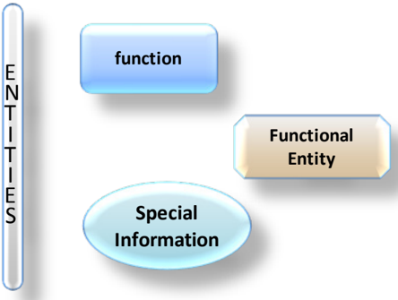

To serve as visual clues, consistent colors have been adopted for each Functional Entity and its component Functions; however, the diagrams do not depend upon these colors to be usable.

## 1.5.4 TYPOGRAPHICAL CONVENTIONS

There are many terms which are used in this reference model and which need to have welldefined meanings. These terms are defined in 1.6.2. When first used in the text, they are shown in bold and are capitalized. Subsequent use employs capitalization only. Because of their extensive use in this document, the defined terms 'data' and 'information' will not always be capitalized unless they are part of another defined term. The defined term 'archive' will not be capitalized unless it is used as the equivalent of an 'OAIS Archive'.

Many diagrams are included throughout this reference model, primarily in sections 4 and 6. In text discussing the diagrams, block names are capitalized and flows are italicized.

## 1.5.5 NOMENCLATURE

## 1.5.5.1 Normative Text

The following conventions apply for the normative specifications in this Recommended Practice:

- a) the words 'shall' and 'must' imply a binding and verifiable specification;
- b) the word 'should' implies an optional, but desirable, specification;
- c) the word 'may' implies an optional specification;
- d) the words 'is', 'are', and 'will' imply statements of fact.

NOTE These conventions do not imply constraints on diction in non-normative text.

## CCSDS RECOMMENDED PRACTICE FOR AN OAIS REFERENCE MODEL

## 1.6 DEFINITIONS

## 1.6.1 ACRONYMS AND ABBREVIATIONS

AIC

Archival Information Collection

AIP

Archival Information Package

AIU

Archival Information Unit

API

Application Programming Interface

ASCII

American Standard Code for Information Interchange

CCSDS

Consultative Committee for Space Data Systems

CD-ROM

Compact Disk-Read Only Memory

CDO

Content Data Object

CPU

Central Processing Unit

CRC

Cyclic Redundancy Check

CSV

Comma Separated Value

DBMS

Data Base Management System

DIP

Dissemination Information Package

DRM

Digital Rights Management

FITS

Flexible Image Transport System

FTP

File Transfer Protocol

HFMS

Hierarchical File Management System

HTTP

HyperText Transfer Protocol.

ID

Identifier

IEEE

Institute of Electrical and Electronics Engineers

IETF

Internet Engineering Task Force

ISBN

International Standard Book Number

ISO

International Organization for Standardization

MPEG

Moving Picture Experts Group

OAIS

Open Archival Information System

PDF

Portable Document Format

## CCSDS RECOMMENDED PRACTICE FOR AN OAIS REFERENCE MODEL

| PDI | Preservation Description Information |
|--------|-------------------------------------------------|
| QA | Quality Assurance |
| RFC | Request For Comment |
| SIP | Submission Information Package |
| TCP/IP | Transmission Control Protocol/Internet Protocol |
| UML | Unified Modeling Language |
| USB | Universal Serial Bus |
| VHS | Video Home System |
| WWW | World Wide Web |
| XFDU | XML Formatted Data Unit |
| XML | eXtensible Markup Language |

## 1.6.2 TERMINOLOGY

This subsection is normative.

There are many terms which are used in this reference model and which need to have welldefined meanings. These terms are defined in this subsection. When first used in the text, they are shown in bold and are capitalized. Subsequent use employs capitalization only.

In other CCSDS documents the terms such as 'service' and 'object' have different definitions from those used here. Where confusion may arise then the terms from this document may be prefixed with 'OAIS'.

As this reference model is applicable to all disciplines and organizations that do, or expect to, preserve and provide information in digital form, these terms cannot match all of those familiar to any particular discipline (e.g., traditional archives, digital libraries, science data centers). Rather, the approach taken is to use terms that are not already overloaded with meaning so as to reduce conveying unintended meanings. Therefore, it is expected that all disciplines and organizations will find that they need to map some of their more familiar terms to those of the OAIS Reference Model. This should not be difficult and is viewed as a contribution, rather than a deterrent, to the success of the reference model. For example, archival science focuses on preservation of the 'record'. This term is not used in the OAIS Reference Model, but one mapping might approximately equate it with 'Content Information within an Archival Information Package' (see definitions below, as well as 2.3 and 4.3 for context).

Access Aid : A software program or document that allows Consumers to locate, analyze, order or retrieve information from an OAIS.

## CCSDS RECOMMENDED PRACTICE FOR AN OAIS REFERENCE MODEL

Access Collection : A collection of AIPs that is defined by a Collection Description but for which there is no Packaging Information for the collection in Archival Storage.

Access Functional Entity : The OAIS functional entity that provides the services and functions that support Consumers in determining the existence, description, location and availability of information stored in the OAIS, and allowing Consumers to request and receive information products.

Access Rights Information: The information that identifies the access restrictions pertaining to the Content Data Object, including the legal framework, licensing terms, and access control. It contains the access and distribution conditions stated within the Submission Agreement, related to both preservation (by the OAIS) and final usage (by the Consumer). It also includes the specifications for the application of rights enforcement measures.

Access Software: A type of software that presents part of or all of the information content of an Information Object in forms understandable to or usable by humans or their proxy systems.

Ad-hoc Order : A request that is generated by a Consumer for information the OAIS has indicated is currently available.

Administration Functional Entity : The OAIS functional entity that provides the services and functions needed to control the operation of the other OAIS functional entities on a dayto-day basis.

AIP Edition: An AIP whose Content Information or Preservation Description Information has been subject to an upgrade or improvement which was not required for preservation. An AIP edition is not considered to be the result of a Migration.

AIP Version: An AIP resulting from changing the Content Information or Preservation Description Information of a source AIP, in order to preserve the information. An AIP Version is considered to be the result of a Migration.

Archival Information Collection (AIC) : An Archival Information Package whose Content Information is an aggregation of other Archival Information Packages.; its PDI must include a description of the collection criteria and process.

NOTE At a minimum all OAISes can be viewed as having at least one AIC which contains all the AIPs held by the OAIS.

Archival Information Package (AIP) : An Information Package, consisting of the Content Information and the associated Preservation Description Information (PDI), which is preserved within an OAIS.

Archival Information Unit (AIU) : An Archival Information Package where the Content Information does not include any other Archival Information Packages. An AIU can consist of multiple digital objects, for example, multiple files.

## CCSDS RECOMMENDED PRACTICE FOR AN OAIS REFERENCE MODEL

Archival Storage Functional Entity : The OAIS functional entity that provides the services and functions used for the storage and retrieval of Archival Information Packages.

Archive : An organization that intends to preserve information for access and use by a Designated Community.

Associated Description : The information describing the content of an Information Package from the point of view of a particular Access Aid.

Authenticity : The degree to which a person (or system) regards an object as what it is purported to be. Authenticity is judged on the basis of evidence.

Collection Description : A type of Package Description that is specialized to provide information about an Archival Information Collection (or an Access Collection) for use by Access Aids.

Common Services : The supporting services such as inter-process communication, name services, temporary storage allocation, exception handling, security, and directory services necessary to support the OAIS.

Consumer : The role played by those persons, or client systems, who interact with OAIS services to find preserved information of interest and to access that information in whatever level of detail is allowed. In addition to the normally expected entities outside the OAIS, this can also include other OAISes, as well as internal OAIS persons or systems.

Content Data Object : The Data Object, that together with associated Representation Information, comprises the Content Information.

Content Information : A set of information that is the original target of preservation. It is an Information Object composed of its Content Data Object and its Representation Information.

Context Information : The information that documents the relationships of the Content Data Object to its environment. This includes why the Content Data Object was created and how it relates to other Content Data Objects.

Co-operating Archives: Those Archives that have Designated Communities with related interests. They may order and ingest data from each other. At a minimum, Co-operating Archives must agree to support at least one common Submission Information Package (SIP) and Dissemination Information Package (DIP) for inter-Archive requests.

Data: A reinterpretable representation of information in a formalized manner suitable for communication, interpretation, or processing.

NOTE Examples of data include a sequence of bits, a table of numbers, the characters on a page, the recording of sounds made by a person speaking, or a moon rock specimen.

Data Dictionary : A formal repository of terms used to describe data.

## CCSDS RECOMMENDED PRACTICE FOR AN OAIS REFERENCE MODEL

Data Dissemination Session : A delivery of media or a single telecommunications session that provides Data to a Consumer. The Data Dissemination Session format/contents is based on a data transfer specification negotiated between the OAIS and the Consumer in the Order Agreement. This specification identifies the logical constructs used by the OAIS and how they are represented on each media delivery or in the telecommunication session.

Data Management Data : The data created and stored in Data Management persistent storage that refer to operation of an Archive.

- NOTE Examples of Data Management Data are accounting data for Consumer billing and authorization, policy data, Event Based Order (subscription) data for repeating requests, preservation process history data, and statistical data for generating reports to Archive management.

Data Management Functional Entity : The OAIS functional entity that provides the services and functions for populating, maintaining, and accessing both Descriptive Information which identifies and documents Archive holdings and administrative data used to manage the Archive.

Data Object : Either a Physical Object or a Digital Object.

Data Submission Session : A delivery of media or a single telecommunications session that provides Data to an OAIS. The Data Submission Session format/contents is based on a data transfer specification negotiated between the OAIS and the Producer in the Submission Agreement. This specification identifies the logical constructs used by the Producer and how they are represented on each media delivery or in the telecommunication session.

Derived AIP: An AIP generated by extracting or aggregating information from one or more source AIPs.

Descriptive Information : An Information Object which is a set of information, consisting primarily of Package Descriptions, which is provided to Data Management to support the finding, ordering, and retrieving of OAIS information holdings by Consumers.

Designated Community : An identified group of potential Consumers who should be able to understand a particular set of information in ways exemplified by the Preservation Objectives. The Designated Community may be composed of multiple user communities. A Designated Community is defined by the Archive and this definition may change over time.

Digital Migration : The transfer of digital information, while intending to preserve it, within the OAIS. It is distinguished from transfers in general by three attributes:

- -a focus on the preservation of the full information content that needs preservation;
- -a perspective that the new archival implementation of the information is a replacement for the old; and

## CCSDS RECOMMENDED PRACTICE FOR AN OAIS REFERENCE MODEL

- -an understanding that full control and responsibility over all aspects of the transfer resides with the OAIS.

Digital Object : An object composed of a set of bit sequences.

Dissemination Information Package (DIP) : An Information Package, derived from one or more AIPs, and sent by Archives to the Consumer in response to a request to the OAIS.

Event Based Order : A request that is generated by a Consumer for information that is to be delivered periodically on the basis of some event or events.

Federated Archives: A group of Archives that has agreed to provide access to their holdings via one or more common Finding Aids.

Finding Aid : A type of Access Aid that allows a user to search for and identify Archival Information Packages of interest.

Fixity Information : The information which documents the mechanisms that ensure that the Content Data Object has not been altered in an undocumented manner.

Global Community : An extended Consumer community, in the context of Federated Archives, that accesses the holdings of several Archives via one or more common Finding Aids.

Independently Understandable : A characteristic of information that is sufficiently complete to allow it to be understood by the Designated Community, as exemplified by the associated Preservation Objectives, without having to resort to special resources not widely available, including named individuals.

Information : Any type of knowledge that can be exchanged. In an exchange, it is represented by data.

NOTE An example of Information is a string of bits (the data) accompanied by a description of how to interpret the string of bits as numbers representing temperature observations measured in degrees Celsius (the Representation Information).

Information Object : A Data Object together with its Representation Information.

Information Package : A logical container composed of optional Information Object(s). Associated with this Information Package is Packaging Information used to delimit and identify the Information Object and optional Package Description information used to facilitate searches for the Information Object.

Information Property: A part of the information content of a Content Information object that is highlighted for a particular purpose.

Information Property Description : The description of the Information Property.

## CCSDS RECOMMENDED PRACTICE FOR AN OAIS REFERENCE MODEL

Ingest Functional Entity : The OAIS functional entity that provides the services and functions to accept Submission Information Packages from Producers (or from internal elements under Administration control), including quality assurance and prepare Archival Information Packages for storage, and ensures that Archival Information Packages and their supporting Descriptive Information become established within the OAIS.

Knowledge Base : A set of information, incorporated by a person or their proxy system that allows that person or their proxy system to understand the received information.

Local Community: The community which would be served by the Archive outside of the context of Federated Archives.

Long Term : A period of time long enough for there to be concern about the impacts of changing technologies, including support for new media and data formats, and of a changing Designated Community or changes to the Designated Community's Knowledge Base, on the information being held in an OAIS. This period extends into the indefinite future.

Long Term Preservation : The act of maintaining information, Independently Understandable by a Designated Community, and with evidence supporting its Authenticity, over the Long Term.

Management : The role played by those who set overall OAIS policy as one component in a broader policy domain, for example as part of a larger organization.

Member Description : An Associated Description that describes a member of a collection.

Metadata : Data about other data.

Non-Reversible Transformation : A Transformation which cannot be guaranteed to be a Reversible Transformation.

Open Archival Information System (OAIS) : An Archive system consisting of hardware, software, information, and policy-based processes and procedures put in place and operated by an organization and its staff. The organization has accepted the responsibility to preserve information and make it available for a Designated Community. The organization may be part of a larger organization. The system meets a set of mandatory responsibilities that allows an OAIS Archive to be distinguished from other uses of the term 'archive'. The term 'Open' in OAIS is used to imply that this Recommended Practice and future related Recommended Practices and standards are developed in open forums, and it does not imply that access to the Archive is unrestricted.

NOTE The set of mandatory responsibilities an OAIS Archive must perform are defined in 3.2.

Order Agreement : An agreement between the Archive and the Consumer in which the physical details of the delivery, such as media type and format of Data, are specified .

Ordering Aid : A type of Access Aid that assists the Consumer to discover AIPs of interest and their cost. It may allow requests for transformation of the information.

## CCSDS RECOMMENDED PRACTICE FOR AN OAIS REFERENCE MODEL

Other Representation Information: A type of Representation Information which cannot easily be classified as Structure Representation Information or Semantic Representation Information. It is a type of Information Object.

- NOTE For example, software, algorithms, encryption, written instructions and many other things may be needed to understand the Content Data Object in ways exemplified by the Preservation Objectives, all of which therefore would be, by definition, Representation Information, yet would not obviously be either Structure Representation Information or Semantic Representation. Information defining how the Structure Representation Information and the Semantic Representation Information relate to each other, or software needed to process a database file would also be regarded as Other Representation Information.

Overview Description : A specialization of the Collection Description that describes the collection as a whole.

Package Description : The information intended for use by Access Aids. It is a type of Information Object.

Packaging Information : The information that describes how the components of an Information Package are logically or physically bound together and how to identify and extract the components. It is a type of Information Object.

Physical Object : An object (such as a moon rock, bio-specimen, microscope slide) with physically observable properties that represent information that is considered suitable for being adequately documented for preservation, distribution, and independent usage.

Preservation Description Information (PDI ): The information, which along with Representation Information, is necessary for adequate preservation of the Content Data Object and which can be categorized as Provenance Information, Context Information, Reference Information, Fixity Information, and Access Rights Information. It is a type of Information Object.

- NOTE Defining PDI (as well as its components: Provenance Information, Context Information, Reference Information, Fixity Information, and Access Rights Information) as relevant to the Content Data Object does not mean that those concerns are any less important for other data objects or at other levels, for example, it is important to apply reference, fixity, provenance, context and access rights to Representation Information, or to any other information the Archive is preserving. Definition of these terms as relevant to the Content Data Object is simply to ease discussion of these concepts at the Content Data Object level.

Preservation Objective: A specific achievable aim which can be carried out using the Information Object.

Preservation Planning Functional Entity : The OAIS functional entity which provides the services and functions for monitoring the environment of the OAIS and which provides recommendations and preservation plans to ensure that the information stored in the OAIS

## CCSDS RECOMMENDED PRACTICE FOR AN OAIS REFERENCE MODEL

remains accessible to, understandable by, and sufficiently usable by, the Designated Community over the Long Term.

Producer : The role played by those persons or client systems that provide the information to be preserved. This can include internal or external OAIS persons or systems.

Provenance Information : The information that documents the history of the Content Data Object. This information tells the origin or source of the Content Data Object, any changes that may have taken place since it was originated, and who has had custody of it since it was originated. The Archive is responsible for creating and preserving Provenance Information from the point of Ingest; however, earlier Provenance Information should be provided by the Producer. Provenance Information adds to the evidence to support Authenticity.

Reference Information : The information that is used as an identifier for the Content Data Object. It also includes identifiers that allow outside systems to refer unambiguously to a particular Content Data Object.

NOTE An example of Reference Information is an ISBN.

Reference Model : A framework for understanding significant relationships among the entities of some environment, and for the development of consistent standards or specifications supporting that environment. A reference model is based on a small number of unifying concepts and may be used as a basis for education and explaining standards to a non-specialist.

Refreshment : A Digital Migration where the effect is to replace a media instance with a copy that is sufficiently exact that all Archival Storage hardware and software continues to run as before.

Repackaging : A Digital Migration in which there is an alteration in the Packaging Information of the AIP.

Replication : A Digital Migration where there is no change to the Packaging Information, the Content Information, and the PDI. The bits used to represent these Information Objects are preserved in the transfer to the same or new media-type instance.

Representation Information : The information that maps a Data Object into more meaningful concepts so that the Data Object may be understood in ways exemplified by Preservation Objectives. It is a type of Information Object.

- NOTE An example of Representation Information for a bit sequence which is a FITS file might consist of the FITS standard which defines the format plus a dictionary which defines the meaning in the file of keywords which are not part of the standard. This would then allow the information in the FITS file to be used by a computer program to display the image which may be contained in the FITS file, together with the associated coordinate system so that a human can identify objects of interest, for example stars or galaxies. Alternatively, the computer program may identify such objects automatically.

## CCSDS RECOMMENDED PRACTICE FOR AN OAIS REFERENCE MODEL

Representation Information Network : The set of Representation Information that fully describes the meaning of a Data Object. Representation Information in digital forms needs additional Representation Information so its digital forms can be understood over the Long Term. It is a type of Information Object.

Representation Information Rendering Software: A type of software that displays a Representation Information object in forms understandable to humans.

Retrieval Aid : An application that allows authorized users to retrieve the Content Information and PDI described by the Package Description.

Reversible Transformation : A Transformation in which the new representation defines a set (or a subset) of resulting entities that are equivalent to the resulting entities defined by the original representation. This means that there is a one-to-one mapping back to the original representation and its set of base entities.

Search Session : A session initiated by the Consumer with the Archive during which the Consumer will use the Archive Finding Aids to identify and investigate potential holdings of interest.

Semantic Representation Information: The Representation Information that further describes the meaning of the Data Object, and its parts or elements, beyond that provided by the Structure Representation Information.

- NOTE For example, Semantic Representation Information may describe the meaning of columns, and perhaps particular values seen in the columns of a spreadsheet.

Structure Representation Information : The Representation Information that imparts information about the arrangement of and the organization of the parts or elements of the Data Object.

- NOTE For example, Structure Representation Information maps bit streams to common computer types such as characters, numbers, and pixels and aggregations of those types such as character strings and arrays.

Submission Agreement : The agreement reached between an OAIS and the Producer that specifies the intended formats and content descriptions, and any other arrangements needed (such as delivery or transmission protocols), for the Data Submission Sessions. Such specifications establish the intended deliverables from the Producer and how they are represented on each delivery through physical media or in a telecommunication dialogue.

Submission Information Package (SIP) : An Information Package that is delivered by the Producer to the OAIS for use in the construction or update of one or more AIPs and/or the associated Descriptive Information.

Succession Plan : The plan of how and when the management, ownership and/or control of the OAIS holdings will be transferred to a subsequent OAIS in order to ensure the continued effective preservation of those holdings.

## CCSDS RECOMMENDED PRACTICE FOR AN OAIS REFERENCE MODEL

Transformation : A Digital Migration in which there is an alteration to the Content Information or PDI of an Archival Information Package.

- NOTE An example of a Transformation is changing ASCII codes to Unicode in a text document being preserved.

Transformational Information Property: An Information Property the preservation of the value of which is regarded as being necessary but not sufficient to verify that any NonReversible Transformation has adequately preserved information content. This could be important as contributing to evidence about Authenticity. Such an Information Property is dependent upon specific Representation Information, including Semantic Representation Information, to denote how it is encoded and what it means.

- NOTE The term 'significant property', which has various definitions in the literature, is sometimes used in a way that is consistent with it being a Transformational Information Property.

Unit Description : A type of Package Description that is specialized to provide information about an Archival Information Unit for use by Access Aids.

## 2 OAIS CONCEPTS

## 2.1 GENERAL

The purpose of this section is to motivate and describe several key high-level OAIS concepts. A more complete view, and a formal modeling of these concepts, is given in section 4.

The term 'archive' has come to be used to refer to a wide variety of storage and preservation functions and systems. Traditional archives are understood as facilities or organizations which preserve records, originally generated by or for a government organization, institution, or corporation, for access by public or private communities. The Archive accomplishes this task by taking custody of the records, ensuring that they are understandable to the accessing community, and managing them so as to preserve their information content and evidence of their Authenticity. Historically, these records have been in such forms as books, papers, maps, photographs, and film, which can be read directly by humans, or read with the aid of simple optical magnification and scanning aids. The major focus for preserving this information has been to ensure that they are on media with Long Term stability and that access to this media is carefully controlled.

The explosive growth of information in digital forms has posed a severe challenge not only for traditional archives and their information providers, but also for many other organizations in the government, commercial and non-profit sectors. These organizations are finding, or will find, that they need to take on the information preservation functions typically associated with traditional archives because digital information is easily lost or corrupted. The pace of technology evolution is causing some hardware and software systems to become obsolete in a matter of a few years, and these changes can put severe pressure on the ability of the related data structures or formats to continue effective representation of the full information desired. Because much of the supporting information necessary to preserve this information is more easily available or only available at the time when the original information is produced, these organizations need to be active participants in the Long Term Preservation effort, and they need to follow the principles espoused in this OAIS Reference Model to ensure that the information can be preserved for the Long Term. Participation in these efforts will minimize the lifecycle costs and enable effective Long Term Preservation of the information.

The explosion of computer processing power and digital media has resulted in many systems where the Producer role and the Archive role are the responsibility of the same entity. These systems should subscribe to the goals of Long Term Preservation discussed in this document. The designers and architects of such systems should realize that some of the Long Term Preservation activities may conflict with the goal of rapid production and dissemination of products to Consumers. The designers and architects of such systems should document the solutions that have been reached.

A major purpose of this Reference Model is to facilitate a much wider understanding of what is required to preserve and access information for the Long Term. To avoid confusion with simple 'bit storage' functions, the Reference Model defines an Open Archival Information System (OAIS) which performs a Long Term information preservation and access function. An OAIS

Archive is one that intends to preserve information for access and use by a Designated Community , and it meets the requirements given in section 3. It includes Archives that have to keep up with steady input streams of information as well as those that experience primarily aperiodic inputs. It includes Archives that provide a wide variety of sophisticated access services as well as those that support only the simplest types of requests. For the remainder of this document, the term Archive and OAIS are equivalent and understood to refer to an OAIS Archive, unless the context makes it clear otherwise (e.g., traditional archives).

The OAIS model recognizes the already highly distributed nature of digital information holdings and the need for local implementations of effective policies and procedures supporting information preservation. This allows, in principle, a wide variety of organizational arrangements, including various roles for traditional archives, in achieving this preservation. It is expected that organizations attempting to preserve information will find that using OAIS terms and concepts will assist them in achieving their information preservation goals.

## 2.2 OAIS ENVIRONMENT

The simple model shown in figure 2-1 depicts the environment surrounding an OAIS.

Figure 2-1: Environment Model of an OAIS

## Outside the OAIS are Producers , Consumers , and Management .

- -Producer is the role played by those persons, or client systems, which provide the information to be preserved.
- -Management is the role played by those who set overall OAIS policy as one component in a broader policy domain, for example as part of a larger organization. In other words, Management control of the OAIS is only one of Management's responsibilities. Management is not involved in day-to-day Archive operations. The responsibility of managing the OAIS on a day-to-day basis is included within the OAIS in an Administrative Functional Entity that will be described in 4.2.
- -Consumer is the role played by those persons, or client systems, that interact with OAIS services to find and acquire preserved information of interest. A special class of

Consumers is the Designated Community. The Designated Community is the set of Consumers who should be able to understand the preserved information. A given individual or system may act in the role of both a Consumer and a Producer.

Other OAIS Archives are not shown explicitly. Such Archives may establish agreements among themselves consistent with Management and OAIS needs. Other Archives may interact with a particular Archive for a variety of reasons and with varying degrees of formalism for any prearranged agreements. One OAIS may take the role of Producer to another OAIS; an example is when the responsibility for preserving a type of information is to be moved to this other Archive. One OAIS may take the role of Consumer to another OAIS; an example is when the first OAIS decides to rely on the other OAIS for a type of information it seldom needs and chooses not to preserve locally. Such reliance should have some formal basis that includes the requirement for communication between the Archives of any policy changes that might affect this reliance. The range of possible interactions between OAIS Archives is discussed in section 6, Archive Interoperability.

## 2.3 OAIS INFORMATION

## 2.3.1 OVERVIEW

Only this subsection of this introductory section is normative.

## 2.3.2 INFORMATION DEFINITION

A clear definition of information is central to the ability of an OAIS to preserve it. While formal modeling of information is provided in section 4, some key concepts are provided in this subsection.

A person, or system, can be said to have a Knowledge Base, which allows that person or system to understand received information. For example, a person who has a Knowledge Base that includes an understanding of written English will be able to read, and understand, an English text.

Information is defined as any type of knowledge that can be exchanged, and this information is always expressed (i.e., represented) by some type of data in an exchange. For example, the information in a hardcopy book is typically expressed by the observable characters (the data) which, when they are combined with a knowledge of the language used (the Knowledge Base), are converted to more meaningful information. If the recipient does not already include English in its Knowledge Base, then the English text (the data) needs to be accompanied by English dictionary and grammar information (i.e., Representation Information ) in a form that is understandable using the recipient's Knowledge Base.

An OAIS is responsible for defining the Designated Community, and its associated Knowledge Base, for whom the information is being preserved by the Archive. The definition of the Designated Community and its associated Knowledge Base may be subject to agreement with funders and other stakeholders. They will likely provide input into those

## CCSDS RECOMMENDED PRACTICE FOR AN OAIS REFERENCE MODEL

definitions and may have agreements with the OAIS regarding those definitions. The Knowledge Base of the Designated Community will probably change over time and the definition of the Designated Community itself may change over time.

Similarly, the information stored within a digital file is expressed by the bits (the data) it contains which, when they are combined with the Representation Information for those bits, are converted to more meaningful information as long as the Representation Information is understandable using the recipient's Knowledge Base. For example, assume the bits represent an ASCII table of numbers giving the coordinates of a location on the Earth measured in degrees latitude and longitude. The Representation Information will typically include the definition of ASCII together with descriptions of the format of the numbers and their locations in the file, their definitions as latitude and longitude, and the definition of their units as degrees. It may also include additional meaning that is assigned to the table. Another example of Representation Information for a bit sequence which is a FITS file might consist of the FITS standard which defines the format plus a dictionary which defines the meaning of keywords in the file which are not part of the standard. In general, it can be said that 'Data interpreted using its Representation Information yields Information', and this is shown schematically in figure 2-2.

Figure 2-2: Obtaining Information from Data

In order for this Information Object to be successfully preserved, it is critical for an OAIS to identify clearly and to understand clearly the Data Object and its associated Representation Information. For digital information, this means the OAIS must clearly identify the bits and the Representation Information that applies to those bits. This required transparency to the bit level is a distinguishing feature of digital information preservation, and it runs counter to object-oriented concepts which try to hide these implementation issues. This presents a significant challenge to the preservation of digital information.

As a further complication, the recursive nature of Representation Information, which typically is composed of its own data and its own Representation Information, typically leads to a network of Representation Information objects. Since a key purpose of an OAIS is to preserve information for a Designated Community, the OAIS must understand the Knowledge Base of its Designated Community to understand the minimum Representation Information that must be maintained. The OAIS should then decide between maintaining the minimum Representation Information needed for its Designated Community and maintaining a larger amount of Representation Information that may allow understanding by a larger Consumer community with a less specialized Knowledge Base, which would be the equivalent of extending the definition of the Designated Community. Over time, evolution of the Designated Community's Knowledge Base may require updates to the Representation Information to ensure continued understanding.

## CCSDS RECOMMENDED PRACTICE FOR AN OAIS REFERENCE MODEL

An OAIS needs to ensure that it has Long Term access to all the relevant Representation Information. A choice must be made whether the OAIS collects all the relevant Representation Information itself or references the existence of the Representation Information in another trusted or partner OAIS Archive. That choice is an implementation and organization decision.

As a practical matter, software, some of which may itself be Representation Information, is used to access the Information Object, and it will incorporate some understanding of the network of Representation Information objects involved. However, this software should not be used as rationale for avoiding identifying and gathering readily understandable Representation Information that defines the Information Object, because it is harder to preserve working software than to preserve information in digital or hardcopy forms.

The OAIS Reference Model emphasizes the preservation of information content. As digital technology develops, multimedia technology and the dependency on complex interplay between the data and presentation technologies will lead some organizations to require that the look and feel of the original presentation of the information be preserved. This type of preservation requirement may necessitate that the software programs and interfaces used to access the data be preserved. This problem may be further complicated by the proprietary nature of some of the software. Various techniques for preserving the look and feel of information access are the subject of research and prototyping. These techniques, which include hardware level emulation, emulation of various common service APIs, and the development of virtual machines, are being investigated for the preservation of the original bit stream and software across technology. Though the OAIS reference model does not focus on these techniques, it should provide an architectural basis for the prototyping and comparison of these techniques. A more detailed discussion of the issues involved in the preservation of look and feel of information access can be found in 5.3 of this document.

## 2.3.3 INFORMATION PACKAGE DEFINITION

The definition of an Information Object is applicable to all the information types discussed in this and the following subsections. In other words, they all have associated Representation Information, although this is usually not shown explicitly.

Every submission of information to an OAIS by a Producer, and every dissemination of information to a Consumer, occurs as one or more discrete transmissions. Therefore, it is convenient to define the concept of an Information Package .

An Information Package is a logical container composed of optional Information Object(s). Associated with this Information Package is Packaging Information that describes how the components of an Information Package are logically or physically bound together and how to identify and extract the components.

These Information Package relationships are shown schematically in figure 2-3.

Figure 2-3: Information Package Concepts and Relationships

The Information Object is a Data Object plus associated Representation Information which is needed to make the Data Object understandable. For example, the Data Object may be an image that is provided as the bit content of one file. Other files would contain Representation Information.

The Packaging Information is that information which describes how the components of an Information Package are logically or physically bound together and how to identify and extract the components.

The Information Object in the package may have various components. Of particular significance is the case in which the Information Object is made up of Content Information , which is the original target of preservation, plus its related Preservation Description Information (PDI). Only after the Content Data Object has been clearly defined can an assessment of the Preservation Description Information be made. The Preservation Description Information applies to the Content Data Object and is needed to preserve the Content Data Object, to ensure it is clearly identified, and to understand the environment in which the Content Data Object was created. The Preservation Description Information is divided into five types of preserving information called Provenance Information, Context Information, Reference Information, Fixity Information and Access Rights Information . Briefly, they are the following:

- -Provenance Information describes the source of the Content Data Object, who has had custody of it since its origination, and its history (including processing history).
- -Context Information describes how the Content Data Object relates to other information outside the Information Package. For example, it would describe why the

Content Information was produced, and it may include a description of how it relates to another Content Information object that is available.

- -Reference Information provides one or more identifiers, or systems of identifiers, by which the Content Data Object may be uniquely identified. Examples include an ISBN for a book, or a set of attributes that distinguish one instance of Content Data Object from another.
- -Fixity Information documents the mechanisms that ensure that the Content Data Object has not been subject to undocumented alteration. Examples include Cyclic Redundancy Check (CRC) codes, checksums, or message digests. The mechanisms are not excluded from being used for other objects but the mechanisms used for Content Data Objects are of particular interest.
- -Access Rights Information provide the terms of access, including preservation, distribution, and usage of the Content Data Object. For example, it would contain the statements to grant the OAIS permissions for preservation operations, licensing offers (for distribution), specifications for rights enforcement measures, as well as access control specifications.

For example, if the Information Object consists of Content Information and PDI which are identified as being the content of specific files, then the Packaging Information would include the information about the file system(s) used, as well as the names and directory information (paths) of the files containing the Content Information and the PDI. Another example of packaging is an XFDU (reference [D8]) where the Packaging Information would be the elements and their tags of the individual components of the XFDU instance following the definition of the XFDU packaging method.

The Descriptive Information is that information which is used to discover which package has the Data Object of interest. Depending on the setting, this may be no more than a descriptive title of the Information Package that appears in some message, or it may be a full set of attributes that are searchable in a catalog service.

## 2.3.4 INFORMATION PACKAGE VARIANTS

It is necessary to distinguish between an Information Package that is preserved by an OAIS and the Information Packages that are submitted to, or disseminated from, an OAIS. These variant packages are needed to reflect the reality that some submissions to an OAIS will have insufficient Representation Information or PDI to meet OAIS preservation requirements. In addition, these may be organized very differently from the way the OAIS organizes the information it is preserving. Finally, the OAIS may provide to Consumers information that does not include all the Representation Information or all the PDI with the associated Data Object being disseminated. These variants are referred to as the Submission Information Package (SIP), the Archival Information Package (AIP), and the Dissemination Information Package (DIP).

## CCSDS RECOMMENDED PRACTICE FOR AN OAIS REFERENCE MODEL

The Submission Information Package (SIP) is that package that is sent to an OAIS by a Producer. Its form and detailed content are typically negotiated between the Producer and the OAIS. Most SIPs will have some Content Information and some PDI.

The relationships between SIPs and AIPs can be complex; as well as a simple one-to-one relationship in which one SIP produces one AIP, other possibilities include: one AIP being produced from multiple SIPs produced at different times by one Producer or by many Producers; one SIP resulting in a number of AIPs; and many SIPs from one or more sources being unbundled and recombined in different ways to produce many AIPs. Even in the first case, the OAIS may have to perform a number of transformations on the SIP. The Packaging Information will always be present in some form.

Within the OAIS one or more SIPs are transformed into one or more Archival Information Packages (AIPs) for preservation. The AIP, which the Archive must use to preserve its Content Information, must have a set of Representation Information, adequate for the Designated Community, and PDI for the associated Content Data Object. The AIP may also contain a collection of other AIPs, and this is discussed and modeled in section 4. The Packaging Information of the AIP will conform to OAIS internal standards, and it may vary as it is managed by the OAIS.

In response to a request, the OAIS provides one or more Dissemination Information Packages (DIPs) to a Consumer. The DIP(s) are derived from one or more AIPs. For dissemination purposes, the DIP's Packaging Information will need to be created such that the Consumer can clearly identify and extract the information that was requested.

## 2.4 PRESERVATION OBJECTIVES

Long Term Preservation is defined as the act of maintaining information, Independently Understandable by a Designated Community, and with evidence supporting its Authenticity, over the Long Term.

To be Independently Understandable the information must be sufficiently complete to allow it to be understood by the Designated Community, as exemplified by the associated Preservation Objectives, without having to resort to special resources not widely available, including named individuals.

Preservation Objectives are intended to allow the repository to make it possible to test whether the information actually is Independently Understandable by members of the Designated Community now and into the future, in particular having adequate Representation Information. In order to facilitate this each Preservation Objective should be:

- -Specific-The objective should be well defined and clear to anyone with the assumed Knowledge Base.
- -Actionable-The objective should be achievable currently and into the future.

- -Measurable-It should be possible to know whether or not the objective has been attained at a given point in time.

Examples of Preservation Objectives include:

- -The ability to render documents, images, videos or sounds in a way which is sufficiently similar to the original. This could be checked by verifying that, for example, the document is readable or the image is viewable. An analysis of the colors could also be compared. A spectral analysis could be performed on the sounds and compared with that of the original.
- -The ability to process a dataset and generate the data products expected. This could be checked by comparing with something generated earlier, for example on Ingest.
- -The ability to understand a dataset and use it in analysis tools to generate results, for example the density of electrons in the upper atmosphere or the structure of a molecule, given certain measurements. These could be compared with results generated earlier.
- -The ability to re-perform an artistic performance. This could be compared with a recording of a previous performance.

Checks on the success of the preservation activity should include confirmation that these aims have been fulfilled. Clearly information needed to make comparisons, as in the examples above, would be expected to be created earlier, perhaps on Ingest, and would need to accompany the information being preserved.

An OAIS must define Preservation Objectives. The definition of the Preservation Objectives may be subject to agreement with funders and other stakeholders. They will likely provide input into those definitions and may have agreements with the OAIS regarding those definitions. The definition of the Designated Community and its Knowledge Base will probably change over time and therefore the definition of the Preservation Objectives may change over time. In this case, funders and other stakeholders would again be consulted.

## 2.5 SUPPLEMENTARY INFORMATION HELD BY THE ARCHIVE

The archive will need to preserve many pieces of information besides the AIPs. The following lists show items mentioned in this document, but the archive may preserve other items.

As long as the objects are being preserved by the archive the following should also be preserved:

- -Definition of the Designated Communities;
- -Preservation Objectives;
- -Transformational Information Properties (checks of the values of these may be part of Provenance Information).

For as long as any specific AIP structure is in use:

- -Packaging Information for the AIPs;
- -Relationship between Editions and Versions of AIPs.

Other information may be useful while the various services are in use:

- -Finding, Ordering, and Retrieval Aids;
- -Packaging Information for SIPs, DIPs.

## 2.6 OAIS HIGH-LEVEL EXTERNAL INTERACTIONS

## 2.6.1 OVERVIEW

The following subsections present a high-level view of the interaction between the entities identified in the OAIS environment. Figure 2-4 is a data flow diagram that represents the operational OAIS Archive external data flows. This diagram concentrates on the flow of information among Producers, Consumers and the OAIS and does not include flows that involve Management. These flows are dealt with further in section 4.

Figure 2-4: OAIS Archive External Data

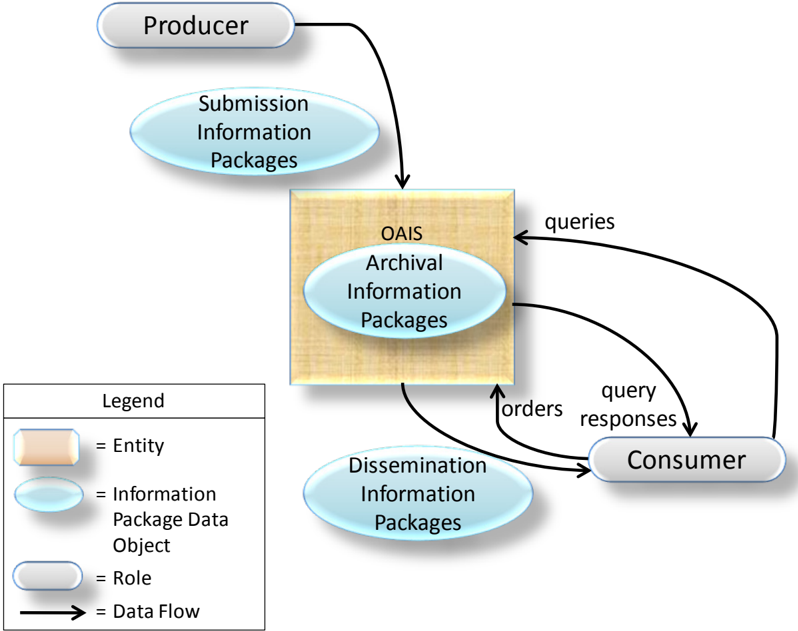

## 2.6.2 MANAGEMENT INTERACTION

Management provides the OAIS with its charter and scope. The charter may be developed by the Archive, but it is important that Management formally endorse Archive activities. The scope determines the breadth of both the Producer and Consumer groups served by the Archive.

Some examples of typical interactions between the OAIS and Management include:

- -Management is often the primary source of funding for an OAIS and therefore should agree the budget for the Archive's activities and may provide guidelines for resource utilization (personnel, equipment, facilities).
- -Management will generally conduct some regular review process to evaluate the OAIS performance and progress toward Long Term goals, and assess the risks to which the OAIS and its holdings are exposed.
- -Management determines, or at least endorses, pricing policies, as applicable, for OAIS services.
- -Management participates in conflict resolution involving Producers, Consumers and OAIS internal administration.

Effective Management should also provide support for the OAIS by establishing procedures that assure OAIS utilization within its sphere of influence. For example, management policies could require that all funded activities within its sphere of influence submit data products to the Archive and also adhere to Archive standards and procedures.

## 2.6.3 PRODUCER INTERACTION

The first contact between the OAIS and the Producer is a request that the OAIS preserve the data products created by the Producer. This contact may be initiated by the OAIS, the Producer or Management. The Producer establishes a Submission Agreement with the OAIS, which among other things identifies the SIPs to be submitted and the schedule of Data Submission Session s. Some Submission Agreements will reflect a mandatory requirement to provide information to the OAIS, while others will reflect a voluntary offering of information and others may reflect any payments which may be involved. Even in the case such as web harvesting where a component of the OAIS itself acts as the Producer, the OAIS should have policies specifying the file formats and the general subject matter the OAIS will accept and those policies will in effect be the Submission Agreement for this data.

The Submission Agreement should make it clear whether the Content Information contains links to other information. If there are such links then the Submission Agreement should make it clear whether that referenced information is included in the SIP. For example, a document submitted may contain hyperlinks to web pages or documents, and a decision should be taken as to how these are to be treated by the Archive.

## CCSDS RECOMMENDED PRACTICE FOR AN OAIS REFERENCE MODEL

The Submission Agreement will normally include a detailed description of the Submission Information Package(s) (SIP). The description formally defines the digital information objects to be transferred by an information Producer to an Archive and how these objects are packed in the form of Submission Information Packages (SIPs). This supports effective transfer and validation of SIP data. This formal definition is a negotiated agreement between the data Producer and the Archive that facilitates production of agreed data by the Producer and validation of received data by the Archive. It does not address the actual transfer of a SIP nor how the Archive does validation upon the received SIP. The extent of such validation will depend on the level of validation required by the Submission Agreement.

Within the Submission Agreement, one or more Data Submission Sessions are specified. There may be significant time gaps between the Data Submission Sessions. A Data Submission Session will contain one or more SIPs delivered as a set of media or via a single telecommunications session. The Data Submission Session content is based on a data model negotiated between the OAIS and the Producer in the Submission Agreement. This data model identifies the logical components of the SIP (e.g., the Content Data Objects, Representation Information, PDI, Packaging Information, and Descriptive Information) that are to be provided and how (and whether) they are represented in each Data Submission Session. All data deliveries within a Submission Agreement are recognized as belonging to that Submission Agreement and will generally have a consistent data model, which is specified in the Submission Agreement. The Producer should provide as much Preservation Description Information as possible and also as much Representation Information as possible to support, where applicable, the Preservation Objectives. Other information to support testing the achievement of Preservation Objectives, and Transformational Information Properties, should also be provided if available.

For example, a Data Submission Session may consist of a set of Content Information corresponding to a set of observations, which are carried by a set of files on a transfer medium. The Preservation Description Information is in this example split between two other files. All of these files need Representation Information which must be provided in some way. The transfer media and its directory/file structure and an understanding of the directory/file structure are the Packaging Information, which provides encapsulation and identification of the Content Information and PDI in the Data Submission Session. The Submission Agreement indicates how the Representation Information for each file is to be provided, how the transfer media is to be recognized, how the Packaging Information will be used to identify and encapsulate the SIP Content Information and PDI, and how frequently Data Submission Sessions (e.g., one per month for two years) will occur. It also gives other needed information such as access restrictions to the data and enforcement requirements.

Each SIP in a Data Submission Session is expected to meet minimum OAIS requirements for completeness as specified in the Submission Agreement. However, in some cases multiple SIPs may need to be received before an acceptable AIP can be formed and fully ingested within the OAIS. In other cases, a single SIP may contain data to be included in many AIPs. A Submission Agreement also includes, or references, the procedures and protocols by which an OAIS will either verify the arrival and completeness of a Data Submission Session with the Producer or question the Producer on the contents of the Data Submission Session.

## 2.6.4 CONSUMER INTERACTION

There are many types of interactions between the Consumer and the OAIS. These interactions include questions to a help desk, requests for literature, catalog searches, orders and order status requests. The ordering process is of special interest to the OAIS Reference Model, since it deals with the flow of Archive holdings between the OAIS and the Consumer.

The Consumer establishes an Order Agreement with the OAIS for information. This information may currently exist in the Archive or be expected to be ingested in the future. The Order Agreement may span any length of time, and under it one or more Data Dissemination Sessions may take place. A Data Dissemination Session may involve the transfer of a set of media or a single telecommunications session. The Order Agreement identifies one or more AIPs of interest, how those AIPs are to be transformed and mapped into Dissemination Information Packages (DIPs) and how those DIPs will be packaged in a Data Dissemination Session. The Order Agreement will also specify other needed information such as delivery information (e.g., name or mailing address), rights information (e.g., usage restrictions, authorized Consumers, or license fees) and any pricing agreements as applicable. The Consumers must also be informed of restrictions, if any, arising from the Access Rights Information associated with the Information and must agree to abide by those restrictions. Such restrictions could include, for example, limitations on commercial use by the Consumer or attributions which must accompany results derived from the Information.

Unless the Order Agreement is very straightforward, the Order Agreement will likely detail a dissemination information schema. The dissemination information schema formally defines the digital information objects to be transferred by an Archive to a Consumer and how these objects are packed in the form of Dissemination Information Packages (DIPs). This supports effective transfer and validation of DIP data. This formal definition is a negotiated agreement between the data Consumer and the Archive that facilitates production of agreed data by the Archive. It does not address the actual transfer of a DIP.

There are two common order types initiated by Consumers: The Event Based Order and the Ad-hoc Order .

In the case of an Ad-hoc Order, the Consumer establishes an Order Agreement with the OAIS for information available from the Archive. If the Consumer does not know a priori what specific holdings of the OAIS are of interest, the Consumer will establish a Search Session with the OAIS. During this Search Session, the Consumer will use the OAIS Finding Aids that operate on Descriptive Information, or in some cases on the AIPs themselves, to identify and investigate potential holdings of interest. This may be accomplished by the submission of queries and the return of query responses, for example, result sets, to the Consumer. This searching process tends to be iterative, with a Consumer first identifying broad criteria and then refining these criteria based on previous search results. Once the Consumer identifies the OAIS AIPs containing information of interest, the Consumer may enter into an Order Agreement with the OAIS that documents the identifiers of the AIPs the Consumer wishes to acquire, what information from the AIPs the Consumer wishes to acquire and how the DIPs will be transmitted to the Consumer in one or more Data

## CCSDS RECOMMENDED PRACTICE FOR AN OAIS REFERENCE MODEL

Dissemination Sessions. If the AIPs are available, an Ad-hoc Order will be placed. However, if the AIPs desired are not yet available, an Event Based Order may be placed.

In the case of an Event Based Order, the Consumer establishes an Order Agreement with the OAIS for information expected to be received on the basis of some triggering event. This event may be periodic, such as a monthly distribution of any AIPs ingested by the OAIS from a specific Producer, or it may be a unique event such as the ingestion, or creation, of a specific AIP. The Order Agreement will also specify other needed information such as the trigger event for new Data Dissemination Sessions and the criteria for selecting the OAIS holdings to be included in each new Data Dissemination Session.

In some cases, a possibly informal, unwritten, Order Agreement will be used and a separate formal, written, Order Agreement may not be generated. In such cases an OAIS will for example have a general pricing policy which could include free products. An OAIS may in some cases only deliver copies of just the Content Data Object or of full AIPs or it may allow for easy selection of the portion of the content needed through on-line forms. An OAIS may deliver its products through direct downloads of content or it may maintain a database of consumer delivery options. The process of generating a virtual Order Agreement could be as simple as the user filling out an online order form, clicking to accept the terms and conditions and clicking the submit button.

## 3 OAIS RESPONSIBILITIES

## 3.1 OVERVIEW

Subsection 3.2 is normative and identifies the minimum responsibilities that shall be discharged by an OAIS. Subsection 3.3 gives some examples of mechanisms to discharge these responsibilities, although not all of these will be applicable to all OAISes. The rest of this section is non-normative.

Annex F discusses security considerations which may apply to 3.2.

## 3.2 MANDATORY RESPONSIBILITIES

This subsection is normative and establishes mandatory responsibilities that an organization must discharge in order to operate an OAIS Archive.

The OAIS shall:

- -Negotiate for and accept appropriate information from information Producers.
- -Obtain sufficient control of the information provided to the level needed to ensure Long Term Preservation.
- -Determine, either by itself or in conjunction with other parties, which entities should become the Designated Community, that is, the communities that should be able to understand the information provided. Definition of the Designated Community includes a determination of their Knowledge Base.
- -Ensure that the information to be preserved is Independently Understandable to the Designated Community. In particular, the Designated Community should be able to understand the information without needing special resources such as the assistance of the experts who produced the information.
- -Follow documented policies and procedures which ensure that the information is preserved against all reasonable contingencies, including the demise of the Archive, ensuring that it is never deleted unless allowed as part of an approved strategy. There should be no ad-hoc deletions.
- -Make the preserved information available to the Designated Community and enable the information to be disseminated as copies of, or as traceable to, the original submitted Content Information with evidence supporting its Authenticity.

## 3.3 EXAMPLE MECHANISMS FOR DISCHARGING RESPONSIBILITIES

## 3.3.1 OVERVIEW

This subsection provides example mechanisms for discharging the responsibilities of 3.2. Not all of these mechanisms will be applicable to all OAISes.

## 3.3.2 NEGOTIATES FOR AND ACCEPTS INFORMATION

An organization operating an OAIS should have established some criteria that aid in determining the types of information that it is willing to, or it is required to, accept. These criteria may include, among others, subject matter, information source, degree of uniqueness or originality, and the nature of the techniques used to represent the information (e.g., physical media, digital media, and format). The information may, in general, be submitted using a wide variety of common and not-so-common forms, such as books, documents, maps, data sets, and physical objects using a variety of communication paths including networks, mail, and special delivery.

The OAIS should negotiate with the Producer to ensure it acquires appropriate Content Information and associated PDI for its mission and the Designated Community. Considerable iteration may be required to agree on the right information to be submitted, and to get it into forms acceptable to the OAIS. For example, this may include digitizing audio or video material, or scanning text.

Negotiation can embrace a range of possible actions. It may sometimes be unnecessary to generate a totally new Submission Agreement because the Producer and OAIS can rely on a previously negotiated Submission Agreement template and simply apply it to the actual content of this submission. It may be carried out for each SIP, for each Producer, or for a class of Producers. It may involve extensive human contact or machine-machine negotiations, such as that which takes place between a web crawler and a web server when deciding what, if any, content the server will permit the crawler to have (the web server acting as a Producer, the web crawler as part of an OAIS).

The OAIS should extract, or otherwise obtain, sufficient Descriptive Information to assist the Designated Community in finding the Content Information of interest. It also should ensure that the information meets all OAIS internal standards.

## 3.3.3 OBTAINS SUFFICIENT CONTROL FOR LONG TERM PRESERVATION

It is important for the OAIS to recognize differences exist between ownership, custody or possession of Content Information and ownership of intellectual property rights over this information. If the OAIS has created the information and is the legal owner of the Content Information, the OAIS may already possess the rights to do what is required to preserve the information and make it available. If instead the OAIS is acquiring the Content Information or PDI from any other Producer or entity, the OAIS should ensure that there is a legally valid

## CCSDS RECOMMENDED PRACTICE FOR AN OAIS REFERENCE MODEL

transfer agreement that either transfers ownership or the intellectual property rights of the item to the OAIS, or clearly specifies the rights granted to the OAIS or others and describes any limitations imposed by the rights holder(s). If only limited rights are transferred, the OAIS will need to determine if the limited rights are sufficient for Long Term Preservation. The OAIS should ensure that its subsequent actions to preserve the information and make it available conform to these rights and limitations. When the OAIS does not acquire the intellectual property rights, the agreement should specify what involvement the rights holder(s) will have in preservation, management or release of the information. In most cases, it will be preferable for the OAIS to negotiate an agreement that specifies the rights holder(s) requirements and authorizes the OAIS to act in accordance with those requirements without active involvement of the rights holder(s) in individual cases.

The OAIS must assume sufficient control over the Content Information and Preservation Description Information so that it is able to preserve it for the Long Term. There is no issue with the AIP's Packaging Information because, by definition, this is under internal OAIS control. The problems of assuming sufficient control of the Content Information and Preservation Description Information, when they are largely digital, are addressed in three related categories, as follows:

- -copyright implications, intellectual property and other legal restrictions on use;
- -authority to modify Content Information;
- -agreements with external organizations.

Copyright implications, intellectual property and other legal restrictions on use: An Archive must honor all applicable legal restrictions. Issues often arise when an OAIS acquires materials that are subject to legal restrictions or materials for which the intellectual property rights are held by a third party. An OAIS should understand the intellectual property rights concepts, such as copyrights, patents and any other applicable laws (e.g., data protection) prior to accepting restricted materials into the OAIS. It can establish guidelines for ingestion of information and rules for dissemination and duplication of the information when necessary. It is beyond the scope of this document to provide details of national and international copyright laws related to such restrictions.

Authority to modify Content Information: Although the Fixity Information within the Preservation Description Information of an AIP ensures that the Content Data Objects-related bits have not been altered, there will come a time when Content Data Objects bits are not in a form that is convenient for the Consumers from the Designated Community. The OAIS needs the authority to migrate the Content Data Objects to new representation forms. When an OAIS acquires materials that are subject to legal restrictions or materials for which the intellectual property rights are held by a third party, it may need to seek additional permission to make such changes. If the information is copyrighted, the OAIS should already have negotiated permission to make the changes needed to meet its mission. Ideally, when this situation arises, both the original AIPs and new AIPs will be retained. Digital Migration issues are addressed more fully in 5.2.

## CCSDS RECOMMENDED PRACTICE FOR AN OAIS REFERENCE MODEL

Agreements with external organizations: An OAIS may establish a variety of agreements with other organizations to assist in carrying out its mission. For example, it may establish an agreement with another OAIS so that it does not have to preserve all the common Representation Information objects related to its Content Data Objects. Agreements with other organizations should be monitored to be sure they are being followed and remain useful.

## 3.3.4 DETERMINES DESIGNATED COMMUNITY

The submission, or planned submission, of Content Information and associated PDI requires a determination as to who the expected Consumers, or Designated Community, of this information will be. This is necessary in order to determine if the information, as represented, will be understandable to that community. For example, an Archive may decide that certain Content Information should be understandable to the general public and, therefore, this becomes the Designated Community.

For some scientific information, the Designated Community of Consumers might be described as those with a first-year graduate level education in a related scientific discipline. This is a more difficult case as it is less clear what degree of specialized scientific terminology might actually be acceptable. The Producers of such specialized information are often familiar with a narrowly recognized set of terminology, so it is especially critical to clearly define the Designated Community for that information and to make the effort to ensure that this community can understand the information.

The possible changes to the definition of the Designated Community also need consideration. Information originally intended for a narrowly defined community may need to be made more widely understandable at some future date. For example, information originally intended to be understandable to a particular scientific community may need to be made understandable to the general public. This is likely to mean adding explanations in support of the Representation Information and the Preservation Description Information, and it can become increasingly difficult to obtain this information over time. Selecting a broader definition of the Designated Community (e.g., general public) when the information is first proposed for Long Term Preservation can reduce this concern and also improve the likelihood that the information will be understandable to all in the original community.

## 3.3.5 ENSURES INFORMATION IS INDEPENDENTLY UNDERSTANDABLE

The degree to which Content Information and its associated PDI conveys information to a Designated Community is, in general, quite subjective. Nevertheless, it is essential that an Archive make this determination in order to maximize information preservation. Therefore, as described in detail in 2.4, Preservation Objectives allow a more objective determination to be made. .Digital Content Information and PDI need adequate Representation Information to be Independently Understandable to the Designated Community. Typically, there are multiple Representation Information objects involved, and this is discussed in 4.3.

## CCSDS RECOMMENDED PRACTICE FOR AN OAIS REFERENCE MODEL

For example, consider Content Information from a digital set of observations of rainfall, temperature, pressure, wind velocities, and other parameters measured all over the world for a year. This type of information is very extensive and is not usually in a form intended for direct human browsing or reading; but it is in a form appropriate to searching and manipulation by application software. Such content may only be understandable to the original Producers, unless there is adequate documentation of the meaning of the various fields and their inter-relationships, and how the values relate back to the original instrumentation that made the observations. In such specialized fields extra effort is needed to ensure that the Content Information and the Preservation Description Information are understandable to a Designated Community. If the Archive does not have this level of expertise in-house, it may have outside community representatives review the information for Long Term understandability. Otherwise some of the information may be understandable to only a few specialists and be lost when they are no longer available.

Even when a set of information has been determined to be understandable, as exemplified by the associated Preservation Objectives, to a particular Designated Community, over time the Knowledge Base of this community may evolve to the point that important aspects of the information may no longer be readily understandable. At this point it may be necessary for the OAIS to enhance the associated Representation Information so that it is again readily understandable to the Designated Community.

The Designated Community should be monitored to be sure the Content Information is still understandable to them. The Designated Community may lose its familiarity with some terminology, and the definition of the community may be broadened to include other members with different backgrounds. For example, a periodic review with participants representing the Designated Community could assist in this process.

As another example, a manuscript's Content Information may be written in English and therefore its content may be generally understandable to a wide audience. However, unless the purpose for which it was created is clearly documented, much of its meaning may be lost. This 'purpose' information is part of its Context Information and must be provided in the Preservation Description Information.

Software is needed for efficient access to digital Content Information. However, maintaining Content Information-specific software over the Long Term has not yet been proven cost effective because of the narrow application of such software. The danger of information loss is great when such software is relied upon for information preservation and understanding because it may cease to function under only small changes to the hardware and software environment. This may not be recognized unless there is a vigorous, ongoing, testing and validation program. A related approach is to employ an emulator that maintains a consistent environment for a range of application specific software. A major concern with this approach is the need to upgrade and maintain the emulator over time while ensuring it runs all the application specific software with fidelity, and to do this cost-effectively.

## 3.3.6 FOLLOWS ESTABLISHED PRESERVATION POLICIES AND PROCEDURES

It is essential for an OAIS to have documented policies and procedures for preserving its AIPs, and it should follow those procedures, capturing an audit trail showing the actions regarding the AIPs. In particular, AIPs shall never be deleted unless the deletions are allowed as part of an approved policy; there should be no ad-hoc deletions.

The appropriate policies and procedures will depend, at minimum, on the nature of the AIPs and any cooperative agreements or relationships the Archive may have with other Archives. For example, in the case of deletions, other Archives may need to be consulted before an AIP is deleted if an agreement has been made that this Archive will hold that particular AIP.

Preservation activities including migrations that alter any Content Information or PDI, and others discussed in section 5, will need to be carefully monitored and the appropriate PDI fully updated. Policies and procedures would be needed, for example, to ensure that emulations are checked as system changes occur at this Archive. This attention to detail, while also ensuring against processing errors, requires that strong policies and procedures be in place and that they be executed.

The Producer and Consumer communities should be provided with submission and dissemination standards, policies, and procedures to support the mission of the OAIS.

A Long Term technology usage plan, updated as technology evolves, is essential to avoid being caught with very costly system maintenance, emergency system replacements, and costly data representation transformations. The technology usage and staffing plans of the Archive will also be influenced by decisions of the Archive on such things as the Designated Communities and Preservation Objectives. There will be implications for the resources required by the Archive.

The Archive should have a formal Succession Plan, contingency plans, and/or escrow arrangements in place in case the Archive ceases to operate or the governing or funding institution substantially changes its scope. The formal Succession Plan should include planning for how the AIPs will be findable once they have been moved to a successor repository.

## 3.3.7 MAKES THE INFORMATION AVAILABLE

By definition, an OAIS makes the Content Information in its AIPs visible and available to its Designated Communities. Multiple views of its holdings, supported by various Access Aids that may cut across collections of AIPs, may be provided. Some DIPs may be created as the output of algorithms operating on one or more AIPs. If necessary, they could include documentation on how they were derived from the source AIPs. The expectations of OAIS Consumers regarding access services will vary widely among Archives and over time as technology evolves. Pressures for more effective access should be balanced with the requirements for preservation under the available resource constraints.

## CCSDS RECOMMENDED PRACTICE FOR AN OAIS REFERENCE MODEL

Some AIPs may have restricted access and therefore may only be disseminated to Consumers who meet access restrictions. The OAIS should have published policies on access and restrictions so that the rights of all parties are protected.

In general, DIPs may be distributed by all varieties of communication paths, including networks and physical media.

The OAIS must be able to provide evidence, to the level of detail required and in a suitable way, to support the Authenticity of the information provided in terms of traceability to the information that was originally submitted.

## 4 DETAILED MODELS

## 4.1 OVERVIEW

The purpose of this section is to provide a more detailed model view of the functional entities of the OAIS and the information handled by the OAIS. This aids OAIS designers of future systems and provides a more precise set of terms and concepts for discussion of current systems.

## 4.2 FUNCTIONAL MODEL

## 4.2.1 OVERVIEW

This entire subsection is informative but provides useful abstractions for understanding how an OAIS might be designed.

## 4.2.2 GENERAL

The OAIS of figure 2-1 is separated in figure 4-1 into six functional entities and related interfaces. Only major information flows are shown. The lines connecting entities identify communication paths over which information flows. The lines to Administration and Preservation Planning are dashed only to reduce diagram clutter.

Figure 4-1: OAIS Functional Entities

## CCSDS RECOMMENDED PRACTICE FOR AN OAIS REFERENCE MODEL

The role provided by each of the entities in figure 4-1 is described briefly as follows:

The Ingest Functional Entity (labeled 'Ingest' in the figures in this section) provides the services and functions to accept Submission Information Packages (SIPs) from Producers (or from internal elements under Administration control), including quality assurance and prepare Archival Information Packages for storage and management within the Archive. Ingest functions include receiving SIPs, performing quality assurance on SIPs, generating an Archival Information Package (AIP) which complies with the Archive's data formatting and documentation standards, gathering or creating Descriptive Information for the AIPs for inclusion in the Archive database, and coordinating updates to Archival Storage and Data Management.

The Archival Storage Functional Entity (labeled 'Archival Storage' in the figures in this section) provides the services and functions for the storage, maintenance and retrieval of AIPs. Archival Storage functions include receiving AIPs from Ingest and adding them to permanent storage, managing the storage hierarchy, refreshing the media on which Archive holdings are stored, performing routine and special error checking, providing disaster recovery capabilities, and providing AIPs to Access to fulfill orders.

The Data Management Functional Entity (labeled 'Data Management' in the figures in this section) provides the services and functions for populating, maintaining, and accessing both Descriptive Information which identifies and documents Archive holdings and administrative data used to manage the Archive. Data Management functions include administering the Archive database functions (maintaining schema and view definitions, and referential integrity), performing database updates (loading new Descriptive Information or Archive administrative data), performing queries on the Data Management Data to generate query responses, and producing reports from these query responses.

The Administration Functional Entity (labeled 'Administration' in the figures in this section) provides the services and functions for the overall operation of the Archive system. Administration functions include soliciting and negotiating Submission Agreements with Producers, auditing submissions to ensure that they meet Archive standards, and maintaining configuration management of system hardware and software. It also provides systems engineering functions to monitor and improve Archive operations, and to inventory, report on, and migrate/update the contents of the Archive. It is also responsible for establishing and maintaining Archive standards and policies, providing customer support, and acting on stored requests such as subscriptions.

The Preservation Planning Functional Entity (labeled 'Preservation Planning' in the figures in this section) provides the services and functions for monitoring the environment of the OAIS, and which provides recommendations and preservation plans to ensure that the information stored in the OAIS remains accessible to, understandable by, and sufficiently usable by, the Designated Community over the Long Term. Preservation Planning functions include evaluating the contents of the Archive and periodically recommending archival information updates, recommending the migration of current Archive holdings, developing recommendations for Archive standards and policies, providing periodic risk analysis reports, and monitoring changes

in the technology environment and in the Designated Community's service requirements and Knowledge Base. Preservation Planning also designs Information Package templates and provides design assistance and review to specialize these templates into SIPs and AIPs for specific submissions. Preservation Planning also develops detailed preservation plans, prototype software and test plans to enable implementation of Preservation Objectives.

The Access Functional Entity (labeled 'Access' in the figures in this section) provides the services and functions that support Consumers in determining the existence, description, location and availability of information stored in the OAIS, and allowing Consumers to request and receive information products. Access functions include communicating with Consumers to receive requests, applying controls to limit access to specially protected information, coordinating the execution of requests to successful completion, generating responses (Dissemination Information Packages, query responses, reports) and delivering the responses to Consumers.

In addition to the entities described above, there are various Common Services assumed to be available. These services are considered to constitute another functional entity in this model. This entity is so pervasive that, for clarity, it is not shown in figure 4-1.

## 4.2.3 DETAILED DESCRIPTION OF FUNCTIONAL ENTITIES

## 4.2.3.1 Overview

In the following subsections, specific flows of information among the functional entities are identified in italics the first time they appear in the text. The detailed functional descriptions of the subsections are accompanied by diagrams (figures 4-2 through 4-7) that depict only the major data flows within and among the entities. Omitted for clarity are minor flows such as acknowledgment notices. Annex A contains a figure that combines figures 4-2 through 4-7 to demonstrate overall consistency. However, this is not to be taken as a recommended design or implementation, and actual implementations are not expected to have a one-to-one mapping to the functions shown, and may for example choose to combine functions or break out functionality differently.

## 4.2.3.2 Common Services

Modern, distributed computing applications assume a number of supporting services such as inter-process communication, name services, temporary storage allocation, exception handling, security, backup and directory services. Much excellent work has already been done in the area of open system environment reference models. Examples of such services include:

Operating system services provide the core services needed to operate and administer the application platform, and provide an interface between application software and the platform. These services include the following:

- -Kernel operations provide low-level services necessary to create and manage processes, execute programs, define and communicate signals, define and process

system clock operations, manage files and directories, and control input-output processing to and from the external environment.

- -Commands and utilities include mechanisms for operations at the user level, such as comparing, printing, and displaying file contents; editing files; pattern searching; evaluating expressions; logging messages; moving files between directories; sorting data; executing command scripts; and accessing environment information.
- -Real-time extension includes the application and operating system interfaces needed to support those application domains requiring deterministic execution, processing, and responsiveness. The extension defines the applications interface to basic system services for input/output, file system access, and process management.
- -System management includes capabilities to define and manage user resource allocation and access (i.e., what resources are managed and the classes of access defined), configuration and performance management of devices, file systems, administrative processes (job accounting), queues, machine/platform profiles, authorization of resource usage, and system backup.
- -Operating system security services specify the control of access to system data, functions, hardware, and software resources by users and user processes.

Network services provide the capabilities and mechanisms to support distributed applications requiring data access and applications interoperability in heterogeneous, networked environments. These services include the following:

- -Data communication includes API and protocol specifications for reliable, transparent, end-to-end data transmission across communications networks.
- -Transparent file access provides access to available files located anywhere in a heterogeneous network.
- -Computer support provides support for interoperability with systems based on other operating systems, particularly computer operating systems, which may not be formally specified in a national or international standard.
- -Remote Procedure Call services include specifications for extending the local procedure call to a distributed environment.
- -Network security services include access, authentication, confidentiality, integrity, and non-repudiation controls and management of communications between senders and receivers of information in a network.

Security services provide capabilities and mechanisms to protect sensitive information and treatments in the information system. The appropriate level of protection is determined based upon the value of the information to the application end-users and the perception of threats to it. These services include the following:

- -Identification/authentication service confirms the identities of requesters for use of information system resources. In addition, authentication can apply to providers of data. The authentication service may occur at the initiation of a session or during a session.
- -Access control service prevents the unauthorized use of information system resources. This service also prevents the use of a resource in an unauthorized way. This service may be applied to various aspects of access to a resource (e.g., access to communications to the resource, the reading, writing, or deletion of an information/data resource, the execution of a processing resource) or to all accesses to a resource.
- -Data integrity service ensures that data is not altered or destroyed in an unauthorized manner. This service applies to data in permanent data stores and to data in communications messages.
- -Data confidentiality service ensures that data is not made available or disclosed to unauthorized individuals or computer processes. This service will be applied to devices that permit human interaction with the information system. In addition, this service will ensure that observation of usage patterns of communications resources will not be possible.
- -Non-repudiation service ensures that entities engaging in an information exchange cannot deny being involved in it. This service may take one or both of two forms. First, the recipient of data is provided with proof of the origin of the data. This protects against any attempt by the sender to falsely deny sending the data or its contents. Second, the sender of data is provided with proof of delivery of data. This protects against any subsequent attempt by the recipient to falsely deny receiving the data or its contents.

## 4.2.3.3 Ingest

The functions of the Ingest Functional Entity are illustrated in figure 4-2.

Figure 4-2: Functions of the Ingest Functional Entity

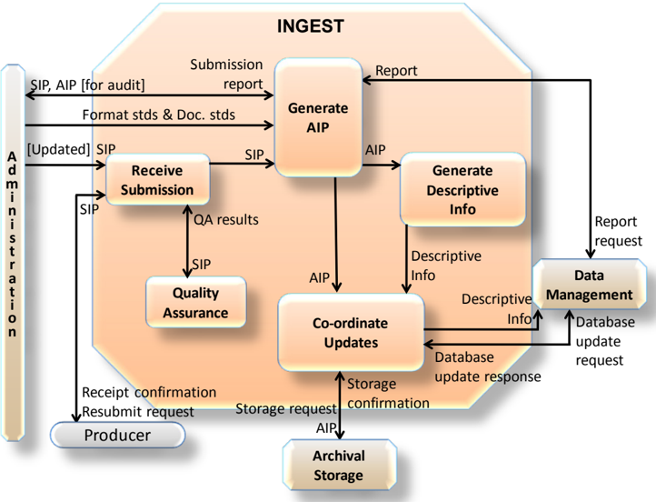

The Receive Submission function provides the appropriate storage capability or devices to receive a SIP from the Producer (or from Administration). Digital SIPs may be delivered via electronic transfer, loaded from media submitted to the Archive, or simply mounted on the Archive file system for access. Non-digital SIPs would likely be delivered by conventional shipping procedures. The Receive Submission function may represent a legal transfer of custody for the Content Information in the SIP, and may require that special access controls be placed on the contents. This function provides a confirmation of receipt of a SIP to the Producer, which may include a request to resubmit a SIP in the case of errors resulting from the SIP submission.

Evidence for Authenticity can take many forms. The evidence is designed to support the assertion that the object is what it is purported to be. The initial evidence is provided by the Producer as part of the PDI in the submission, and this evidence is maintained, updated, and/or incremented by the Archive over time. Over time the object may need to be changed in some ways in order for it to continue to be Independently Understandable to the Designated Community. It is important that these changes are documented as part of the Provenance Information of the object so the object is traceable to the original object submitted to the Archive by the Producer. It is also important that any changes to the object do not change the Content Information to the point that it no longer conveys the intended information of the original object. One method of providing evidence supporting the assertion of the Authenticity of the changed object is the use of Information Property Description s.

## CCSDS RECOMMENDED PRACTICE FOR AN OAIS REFERENCE MODEL

The Producer may provide, or the Archive may itself define, Information Property Descriptions of Information Properties which should be maintained over time (i.e., Transformational Information Property), and indeed may provide Information Property Descriptions of Information Properties which do not need to be maintained over time. An Information Property Description is a description of a part of the information content of a Content Information object that is highlighted for a particular purpose. The detailed expression, or value, of that part of the information content is conveyed by the appropriate parts of the Content Data Object and its Representation Information. For example, for a simple digital book which when rendered appears as pages with margins, title, chapter headings, paragraphs, and text lines composed of words and punctuation, Information Property Descriptions for Information Properties that are to be preserved could be expressed as 'paragraph identification' and 'characters expressing words and punctuation'. The Information Properties would consist of all the book's paragraph identifications, words, and punctuation as expressed by the Content Data Object and its Representation Information. This means that all formatting other than the recognition of paragraphs and readable text could be altered while still maintaining required parts of the intended message conveyed by the previous version of the digital book. The Archive may express an evaluation of the Authenticity of its holdings, based on community practice and recommendations (including best practices, guidelines, standards, and legal requirements). However, the Consumer may make his or her own judgment of the Authenticity of the object starting with the evidence obtained from PDI.

The Quality Assurance function validates ( QA results ) the successful transfer of the SIP to the temporary storage area. For digital submissions, these mechanisms might include Cyclic Redundancy Checks (CRCs) or checksums associated with each data file, or the use of system log files to record and identify any file transfer or media read/write errors.

The Generate AIP function transforms one or more SIPs into one or more AIPs that conform to the Archive's data formatting standards and documentation standards . This may involve file format conversions, determining Transformational Information Properties , gathering adequate Representation Information, data representation conversions or reorganization of the Content Information in the SIPs. The Generate AIP function may issue report requests to Data Management to obtain reports of information needed by the Generate AIP function to produce the Descriptive Information that completes the AIP. This function sends SIPs or AIPs for audit to the Check Submission function in Administration, and receives back an audit report . As a result of the audit report for example, it may be necessary to gather further Representation Information (e.g., from the Producer) to ensure that the Content Information is understandable and usable by the Designated Community.

The Generate Descriptive Information function extracts Descriptive Information from the AIPs and collects Descriptive Information from other sources to provide to Coordinate Updates, and ultimately Data Management. This includes Information to support searching and retrieving AIPs (e.g., who, what, when, where, why, which, which version), and could also include special browse products (thumbnails, images) to be used by Finding Aids.

The Coordinate Updates function is responsible for transferring the AIPs to Archival Storage and the Descriptive Information to Data Management. Transfer of the AIP includes a storage request and may represent an electronic, physical, or a virtual (i.e., data stays in place) transfer. After the transfer is completed and verified, Archival Storage returns a storage confirmation indicating (or verifying) the storage identification information for the AIP. The Coordinate Updates function also incorporates the storage identification information into the Descriptive Information for the AIP and transfers it to the Data Management entity along with a database update request . In return, Data Management provides a database update response indicating the status of the update. Data Management updates may take place without a corresponding Archival Storage transfer when the SIP contains Descriptive Information for an AIP already in Archival Storage.

## 4.2.3.4 Archival Storage

The functions of the Archival Storage Functional Entity are illustrated in figure 4-3. The term 'media' is used to designate one or more mechanisms, local or remote, for storing digitally encoded information.

Figure 4-3: Functions of the Archival Storage Functional Entity

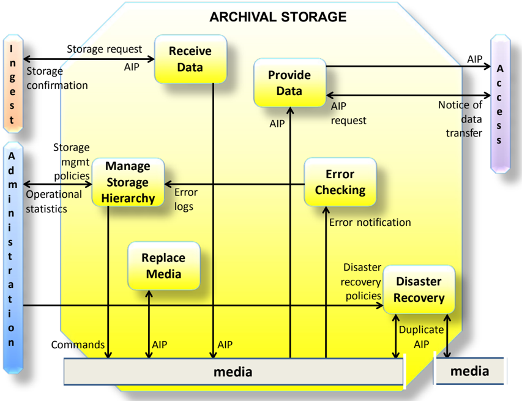

## CCSDS RECOMMENDED PRACTICE FOR AN OAIS REFERENCE MODEL

The Receive Data function receives a storage request and an AIP from Ingest and moves the AIP to permanent storage within the Archive. The storage request may need to indicate the size and anticipated frequency of utilization of the Data Objects making up the AIP in order to allow the appropriate storage devices or media to be selected for storing the AIP. This function will select the media type, prepare the devices or volumes, and perform the transfer to the Archival Storage volumes. Upon completion of the transfer, this function sends a storage confirmation message to Ingest, including the storage identification of the AIPs.

The Manage Storage Hierarchy function based on storage management policies and operational statistics , distributes, via commands , the contents of the AIPs on the appropriate media in the different levels of its storage hierarchy. It will also conform to any special levels of service required for the AIP, or any special security measures that are required, and ensures the appropriate level of protection for the AIP. These include on-line, off-line or near-line storage, required throughput rate, maximum allowed bit error rate, or special handling or backup procedures. It monitors error logs to ensure AIPs are not corrupted during transfers. This function also provides operational statistics to Administration summarizing the inventory of media on-hand, available storage capacity in the various tiers of the storage hierarchy, and usage statistics.

The Replace Media function provides the capability to reproduce the AIPs over time. Within the Replace Media function the Content Information and Preservation Description Information (PDI) should not be altered. However, the data constituting the Packaging Information may be changed as long as it continues to perform the same function and there is a straightforward implementation that does not cause information loss. The preservation plans should select a storage medium, taking into consideration the expected and actual rates of errors encountered in various media types, their performance, and their costs of ownership. If media-dependent attributes, such as naming conventions, have been included as part of the Content Information, a way should be found to preserve this information when migrating to different media with different storage architectures. Anticipating the terminology of 5.2.4, this function may perform 'Refreshment', 'Replication', and 'Repackaging' that is straightforward. An example of such 'Repackaging' is migration to new media under a new operating system and file system, where the Content Information and PDI are independent of the file systems. However, complex 'Repackaging' and all 'Transformations' are performed under Administration supervision by the Archival Information Update function to ensure information preservation. (Refer to 5.2.4 for a detailed description of migration issues.)

The Error Checking function provides statistically acceptable assurance that no components of the AIP are corrupted in Archival Storage or during any internal Archival Storage data transfer. It simplifies the work of this function if all hardware and software within the Archive provide error notification of detected errors and that these errors are routed to standard error logs that are sent to Manage Storage Hierarchy function where they are checked. The PDI Fixity Information provides some assurance that the Content Data Object has not been altered as the AIP is moved and accessed. Similar information is needed to protect the PDI itself. A standard mechanism for tracking and verifying the validity of all Data Objects within the Archive may also be used. For example, CRCs could be maintained for every individual data file. A higher level of service to support combined error detection

and correction, could also be provided. The storage facility procedures should provide for random verification of the integrity of Data Objects using CRCs or some other error checking mechanism.

The Disaster Recovery function provides a mechanism for duplicating the digital contents of the Archive collection and, for example, storing the duplicate in a physically separate facility. This function is sometimes accomplished by copying the Archive contents to some form of removable storage media but may also be performed via hardware transport or network data transfers. The details of disaster recovery policies are specified by Administration.

The Provide Data function provides copies of stored AIPs to Access. This function receives an AIP request that identifies the requested AIP(s ) and provides copies to the Access Functional Entity. This function also sends a notice of data transfer to Access upon completion of an request.

## 4.2.3.5 Data Management

The functions of the Data Management Functional Entity are illustrated in figure 4-4.

Figure 4-4: Functions of the Data Management Functional Entity

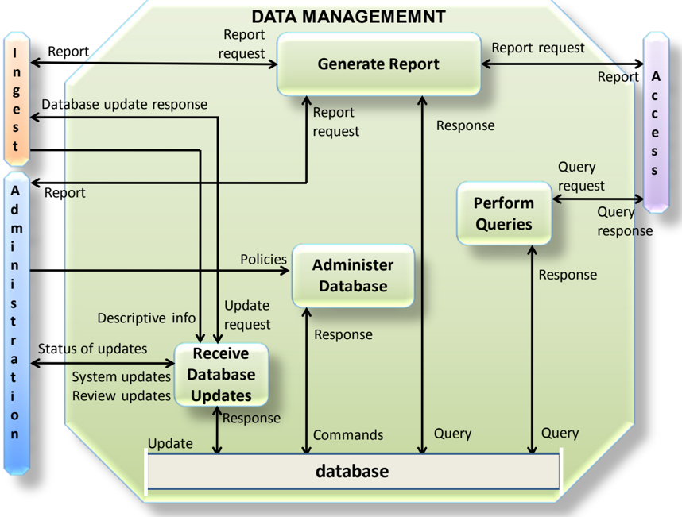

## CCSDS RECOMMENDED PRACTICE FOR AN OAIS REFERENCE MODEL

The Administer Database function is responsible for maintaining the integrity of the data management database, which provides a storage mechanism, which can be queried in some way, for storing both Descriptive Information and system information. Descriptive Information identifies and describes the Archive holdings, and system information is used to support Archive operations. The Administer Database function is responsible for creating any schema or table definitions required to support Data Management functions; for providing the capability to create, maintain and access customized user views of the contents of this storage; and for providing internal validation (e.g., referential integrity) of the contents of the database by sending commands and receiving a response from the database. The Administer Database function is carried out in accordance with Policies received from Administration.

The Perform Queries function receives a query request from Access and executes the query by sending a query to the database from which it receives a response which it uses to generate a query response that is transmitted to Access.

The Generate Report function receives a report request from Ingest, Access or Administration and executes any queries for which it receives responses , or other processes necessary to generate the report that it supplies to the requester. Typical reports might include summaries of Archive holdings by category, or usage statistics for accesses to Archive holdings.

The Receive Database Updates function adds, modifies or deletes information in the database through an update , for which it receives a response . The main sources of updates are Ingest, which provides Descriptive Information for the new AIPs, and Administration, which provides system updates and review updates . Ingest transactions consist of Descriptive Information which identifies new AIPs stored in the Archive. System updates include all system-related information (operational statistics, Consumer information, and request status). Review updates are generated by periodic reviewing and updating of information values (e.g., contact names, addresses, access control and rights policies). The Receive Database Updates function provides regular reports to Administration summarizing the status of updates to the database, and also sends a database update response to Ingest.

## 4.2.3.6 Administration

The functions of the Administration Functional Entity are illustrated in figure 4-5. As stated above (see page 4-3) some of the activities detailed in this section will not apply to all implementations; for instance, in the customer service function, the billing activity shows where this would occur if required. An envelope enclosing the Administration functions is not shown because the required changes to the diagram, including line crossing, would cause confusion.

## CCSDS RECOMMENDED PRACTICE FOR AN OAIS REFERENCE MODEL

Figure 4-5: Functions of the Administration Functional Entity

The Negotiate Submission Agreement function solicits desirable archival information for the OAIS and negotiates Submission Agreements with Producers. This function also negotiates a data submission schedule with the Producer. It maintains a calendar of expected Data Submission Sessions that will be needed to transfer one or more SIPs to the OAIS and the resource requirements to support their ingestion. This function receives AIP/SIP templates and customization advice from Preservation Planning and sends SIP designs , any customized AIP designs and any example SIPs to the Check Submission function as part of the submission approval process. It also sends SIP designs and any customized AIP designs to the Establish Standards and Policies function for subsequent use by the Ingest function. The Submission Agreement must identify formats, contents and the logical constructs used by the Producer and how they are represented in each Data Submission Session.

The Manage System Configuration function provides system engineering for the Archive system to monitor continuously the functionality of the entire Archive system and systematically control changes to the configuration. This function maintains integrity and traceability of the configuration during all phases of the system life cycle. It also audits system operations, system performance, and system usage. It sends report requests for system information to Data Management and receives reports ; it receives operational statistics from Archival Storage. It summarizes those reports and periodically provides OAIS performance

## CCSDS RECOMMENDED PRACTICE FOR AN OAIS REFERENCE MODEL

information , Archive holding inventory reports, operating policies, procedures and standards to Preservation Planning. It receives proposed preservation plans from Preservation Planning, based on which it sends change requests, procedures and tools to the Archival Information Update function. It receives system evolution policies from the Establish Standards and Policies function. Based on these inputs it further develops and implements recommendations for system evolution which it receives from Preservation Planning.

The Archival Information Update function provides a mechanism for updating the contents of the Archive. It receives change requests , procedures and tools from Manage System Configuration. It provides updates by sending a dissemination request to Access, updating the contents of the resulting DIPs and resubmitting them as SIPs to Ingest.

The Physical Access Control function provides mechanisms to restrict or allow physical access (doors, locks, guards) to elements of the Archive, as determined by Archive policies which it receives from Establish Standards and Policies.

The Establish Standards and Policies function is responsible for establishing and maintaining the Archive system standards and policies. It receives approvals and budget information and policies such as the OAIS charter, scope, resource utilization guidelines, and pricing policies from Management. It provides Management with plans or approval and periodic reports . It receives recommendations for Archive system enhancement, proposals for new Archive data standards, and periodic risk analysis reports from Preservation Planning. It will have to face risks from unforeseen events (unplanned down time due to network outage, software bugs, hardware failure, human error, disk crash, etc.) and make the appropriate decisions to minimize the risk of not fulfilling the Archive's commitments. It also receives performance information and Archive inventory reports from Manage System Configuration. Based on these inputs and analyses, Archive standard s and policies are established and sent to other Administration functions and the other Functional Entities for implementation. The standards includ e format standards, documentation standards and the procedures to be followed during the Ingest process. In response to the recommendations from Preservation Planning on AIP updates it provides approved standards and Preservation Objectives to Preservation Planning for example specifying goals relating to Transformational Information Properties and usability of the Content Information. (Preservation Planning will respond with a preservation plan to the Manage System Configuration function.) The Establish Standards and Policies function will also develop storage management policies (for the Archival Storage hierarchy), including Preservation Objectives to assure that Archive storage formats do not become obsolete, and database administration policies. It will develop disaster recovery policies . It will also determine security policies for the contents of the Archive based, for example, upon statutory requirements and legal agreements. Legislation will be different between countries and will develop over time. As a result the legislation may become more extensive and complex, and new specialized areas may be introduced, for example, in the field of data protection and security. As a result, an organization can have several units that would be considered to be within the Administration Functional Entity that co-determine the Archive's standards and policies. These policies should include those affecting Physical Access Control and the application of error control techniques throughout the Archive.

## CCSDS RECOMMENDED PRACTICE FOR AN OAIS REFERENCE MODEL

The Check Submission(s) function receives AIPs or SIP s from Ingest and reviews from Preservation Planning. The Check Submission function will verify that SIPs meet the specifications of the Submission Agreement. In the case of submitted AIPs it verifies the understandability of the Content Information by the Designated Community. It also verifies that the AIPs meet the specifications in the AIP template. This function receives AIP/SIP reviews from Preservation Planning and may also involve an outside committee (e.g., science and technical review); these reviews report on whether the AIP/SIP templates have been properly applied in Ingest.

The Check Submission process must verify that the quality of the data meets the requirements of the Archive. It should also ensure that it meets the requirements of the outside committee if one is used. The Check Submission must verify that there is adequate Representation Information and PDI to ensure that the Content Information is understandable and independently usable to the Designated Community. The formality of the review will vary depending on internal Archive policies. The Check Submission process may determine that some portions of the SIP are not appropriate for inclusion in the Archive and must be resubmitted or excluded. An audit submission report is provided to Ingest. After the Check Submission process is completed, any liens, that is, lists of required corrections or other issues that need to be resolved, are reported to the Producer, who will then resubmit the SIP to Ingest or appeal the decision to Administration. In the case of producing a new version of an AIP this function checks that the Preservation Objectives have been met. This could include checking usability and checking evidence for Authenticity such as ensuring maintenance of Transformational Information Properties (see 5.3). After the Check Submission process is completed, a final ingest report is prepared and provided to the Producer and to Negotiate Submission Agreement. Audit methods potentially include sampling, periodic review, and peer review. A submission report is provided to Ingest.

The Activate Requests function maintains a record of event-driven requests and periodically compares it to the contents of the Archive to determine if all needed data is available. If needed data is available, this function generates a dissemination request that is sent to Access. For example, this function can generate orders on a periodic basis. The length of the period was originally defined by the Consumer in an order agreement . Another example of a trigger is the occurrence of an event (e.g., a database update).

The Customer Service function performs a number of services independently in coordination with services provided by a third party. For example, the archive can independently provide account services or may coordinate with the organization's single sign-on service to ensure appropriate access to the archive. The Customer Service function will create, maintain and delete Consumer accounts. It will, if applicable, collect billing information from Access and will send bills and collect payment from Consumers for the utilization of Archive system resources. It will respond to general information requests. This function will also collect and respond to feedback on Access services and products. Customer Service will summarize these comments and make them available to Preservation Planning. A Consumer may generate a Special Request which Customer Service sends to Access. Special Request types are not detailed.

## 4.2.3.7 Preservation Planning

The functions of the Preservation Planning Functional Entity are illustrated in figure 4-6.

Figure 4-6: Functions of the Preservation Planning Functional Entity

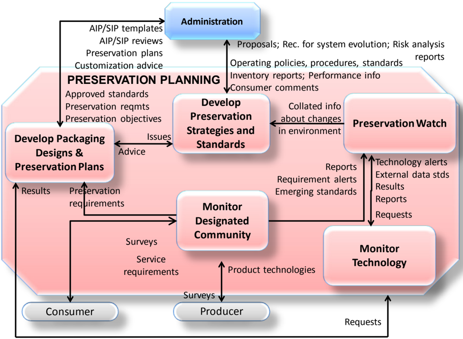

The Monitor Designated Community function interacts with Archive Consumers and Producers to track changes in their service requirements and available product technologies . Such requirements might include data formats, media choices, preferences for software packages, new computing platforms, and mechanisms for communicating with the Archive. This function may be accomplished via surveys , via a periodic formal review process, via community workshops where feedback is solicited or by individual interactions. This function will watch to ensure that the OAIS holdings remain Independently Understandable to the Designated Community. It provides reports , requirement alerts and emerging standards to the Preservation Watch function. It sends preservation requirements to Develop Packaging Designs and Preservation Plans.

The Monitor Technology function is responsible for tracking emerging digital technologies, information standards and computing platforms (i.e., hardware and software) to identify technologies which could cause obsolescence in the Archive's computing environment and

## CCSDS RECOMMENDED PRACTICE FOR AN OAIS REFERENCE MODEL

prevent access to some of the Archive's current holdings. This function may contain a prototyping capability for better evaluation of emerging technologies and receive requests from Preservation Watch and from Develop Package Designs and Preservation Plans. This function sends reports , external data standards and technology alerts to the Preservation Watch function. It also sends reports to Develop Packaging Designs and Preservation Plans.

The Preservation Watch function is the role of collating preservation related information from a variety of internal and external entities. The Preservation Watch function also brings in reports , requirement alerts and emerging standards from the Monitor Designated Community function and technology alerts , external data standards , results and reports from the Monitor Technology function. Changes in the environment of the Archive (financial, political, and environmental) can be part of the Preservation Watch function.

The Develop Preservation Strategies and Standards function is responsible for developing and recommending strategies and standards, and for assessing risks, to enable the Archive to make informed tradeoffs as it establishes standards, sets policies, and manages its system infrastructure. Risk management is a suitable methodology to provide balance between needs and means, and between immediate activity imperatives and Long Term objectives of the preservation mission. Risk management can also provide useful metrics to quantify elements that are usually difficult to estimate in the decision-making process. This function provides periodic risk analysis reports to Administration addressing expected risks and their possible mitigation based on current, and on proposed updates, to operating policies, procedures and standards. This function receives collated information about changes in the environment from the Preservation Watch function, and it receives operating policies, procedures and standards , performance information , inventory reports and summarized consumer comments from Administration. From the information this function identifies those activities required for preservation of current Archive holdings or new submissions, for example updating AIPs with additional or revised Representation Information. This function sends recommendations for system evolution and on AIP updates, and risk analysis reports to Administration This function also receives and produces profiles of those standards that are sent to Administration as proposals on their potential usage. This function also receives issues from Develop Packaging Designs and Preservation Plans in the case of unanticipated submission requirements, and responds with advice to handle the new requirements.

The Develop Packaging Designs and Preservation Plans function develops new Information Package designs such as AIP/SIP templates and detailed preservation plans and prototype software to implement Administration policies and directives. Preservation plans can include any of the activities described in section 5. For example, Migration of the Content Information could involve changes to the Content Data Object and/or the Representation Information and may therefore alter the Information Properties of the Content Information. This may make it necessary to check if and how Transformational Information Properties are affected by the migration (see 5.2.4.5); Representation Information may be added, and this can be checked against Preservation Objectives. This activity also provides advice on the application of these Information Package designs and Preservation plans to specific Archive holdings and submissions. This function receives Archive approved standards and Preservation Objectives from Administration. The standards include format

## CCSDS RECOMMENDED PRACTICE FOR AN OAIS REFERENCE MODEL

standards, metadata standards and documentation standards. It applies these standards to preservation requirements and provides AIP and SIP template designs to Administration. This function also provides customization advice and AIP/SIP reviews to Administration on the application of those designs. If this function encounters submissions that are not covered by existing standards and procedures, it can send issues to Develop Preservation Strategies and Standards and receive advice , including new standards, to assist in meeting the new submission requirements.

The preservation requirements and the Preservation Objectives received by this function tend to involve transformations of the AIP, including transformations of the Content Information to avoid loss of access due to technology obsolescence (see section 5). The response to the Preservation Objectives may involve the development of new AIP designs, prototype software, test plans, community review plans and implementation plans for phasing in the new AIPs. This process may call on expertise or resources from other functions within Preservation Planning, such as obtaining information from Preservation Watch, Monitor Technology and Monitor Designated Community via the Develop Preservation Strategies and Standards function. This effort also will require consultation from the other functional entities and from the Designated Community, for example to discuss usability, acceptable loss of information properties, and authenticity of the transformed Content Information within the framework of reference provided by Transformational Information Properties (see 5.2.4.5). Once the preservation plan, associated AIP designs, and software have been tested and approved by Administration, this function will send the entire preservation plan to Administration. These proposals for the preservation plan are received and approval granted (or denied) by the 'Establish Standards and Policies' function of 'Administration'. The 'Preservation Planning' entity develops, validates and supplies the preservation plan on the basis of this approval; Administration schedules and performs the preservation plan by making changes to the system configuration to update the archive information, as indicated in figure 4-5 .

## 4.2.3.8 Access

The functions of the Access Functional Entity are illustrated in figure 4-7.

Figure 4-7: Functions of the Access Functional Entity

The Coordinate Access Activities function provides one or more interfaces to the information holdings of the Archive. Three categories of Consumer requests are distinguished, responses to which are delivered by Deliver Response: query requests, which are executed in Data Management and return immediate query responses for presentation to the Consumer; report requests, which may require a number of queries and produce formatted reports for delivery to the Consumer; and orders, which may access either or both Data Management and Archival Storage to prepare a formal Dissemination Information Package (DIP) for on-line or off-line delivery. An order may be an Ad-hoc Order that is executed only once, or an Event Based Order that will be maintained by the Activate Requests function in Administration, and initiated by a dissemination request that may result in periodic deliveries of requested items. The Archival Information Update function in Administration (see figure 4-5) also submits dissemination requests to obtain DIPs needed to perform its update functions. Other special request types are allowed, but are not detailed. This function will determine if resources are available to perform a request, assure that the user is authorized to access and receive the requested items, and notify the Consumer that a request has been accepted or rejected, via the

## CCSDS RECOMMENDED PRACTICE FOR AN OAIS REFERENCE MODEL

Deliver Response function. For example, an Archive could include an option to provide an estimate of the request cost or an option to cancel the request, or the timescale for fulfilling the request. It will then transfer the request to Data Management or to the Generate DIP function for execution. This function also provides assistance to OAIS Consumers including providing status of orders and other Consumer support activities in response to an assistance request via the Deliver Response function.

The Generate DIP function accepts a DIP request , makes an AIP request then gets a notice of transfer and retrieves the AIP from Archival Storage, for further processing. This function also transmits a request Descriptive Information to Data Management to obtain Descriptive Information needed for the DIP. If special processing is required, the Generate DIP function accesses Data Objects from the AIPs and applies the requested processes. The types of operations which may be carried out include statistical functions, subsampling in temporal or spatial dimensions, conversions between different data types or output formats, and other specialized processing (e.g., image processing). Inserting DRM information and filtering the personal data to ensure consistency with the user rights also come under this type of operation. This function stages the completed DIP response and notifies the Coordinate Access Activities function that the DIP is ready for delivery . It is worth noting that in some implementations the AIP content or the DIPs could be kept for ready availability (not shown in the figure).

The Deliver Response function handles both on-line and off-line deliveries of responses ( DIPs , query responses , reports and assistance ) to Consumers. For on-line delivery, it accepts a response from Coordinate Access Activities and prepares it for on-line distribution in real time via communication links. It identifies the intended recipient, determines the transmission procedure requested, in co-ordination with the Coordinate Access Activities function, places the response in the temporary storage area to be transmitted, and supports the on-line transmission of the response. For off-line delivery it retrieves the response from the Coordinate Access Activities function, prepares packing lists and other shipping records, and then ships the response. When the response has been shipped, a notice of shipped order is returned to the Coordinate Access Activities function and billing information is submitted to Administration.

## 4.2.4 DATA FLOW DIAGRAMS

The flow of data items among the OAIS functional entities is diagrammed in this subsection. Figure 4-8 shows the more significant data flows. To avoid complicating this figure, the Administration data flows, which are generally background activities, are isolated to an Administration context diagram, figure 4-9. Data flows associated with Common Services are implicit in the illustrated functions, and are therefore not shown.

Figure 4-8: OAIS Data Flow Diagram

Figure 4-9: Administration Context Diagram

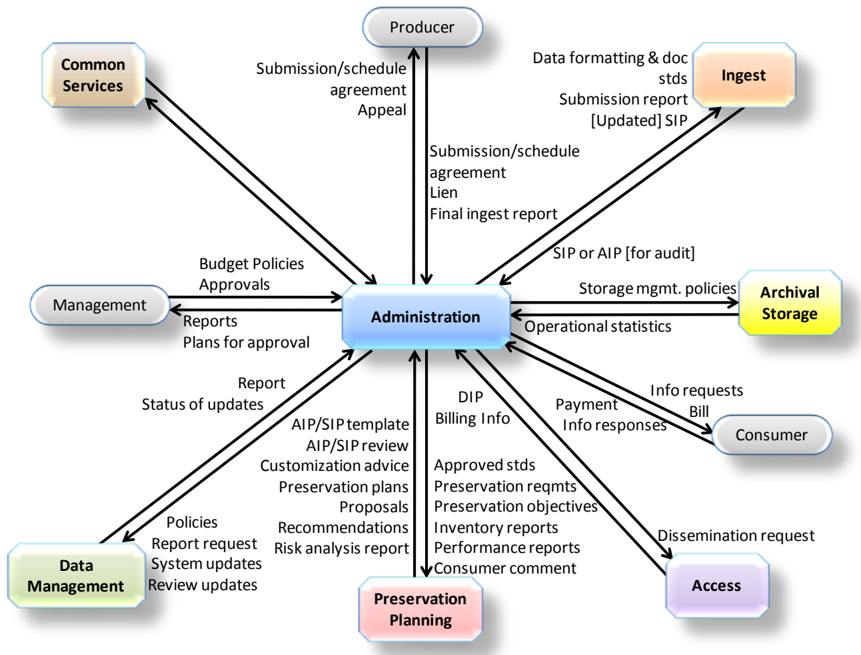

A significant data flow that is not shown is that which involves the update of AIPs in order to ensure they are adequate for preservation of the Content Information.

For example, consider the case of needing to add Representation Information because of changes in the Knowledge Base of the Designated Community. Although the Content Data Object that is being preserved is not being changed, the need to change the Representation Information means the Content Information is being changed.

- -Monitoring of the Designated Community and general environment ( reports , requirements alerts, emerging standards, external data standards , and technology alerts) shows the need to update Representation Information for a particular AIP, which could itself be a collection of objects.
- -Preservation Planning provides recommendations, proposals and risk analysis reports to Administration which evaluates the recommendations and decides what options to look at in more detail, and sends that decision to Preservation Planning as approved standards, preservation requirements and Preservation Objectives .
- -Preservation Planning then produces detailed plans based on the instructions from Administration and passes these detailed plans back ( AIP templates, preservation plan and customization advice ) to Administration.

- -Administration then implements these plans (via its Manage System Configuration function,). In general, this will require an update of one or more AIPs. In a specific implementation each AIP does not necessarily have to be moved in any way. It may be possible in a particular implementation to perform the next steps by updating the AIP in place or updating various pointers that are components of the AIPs.
- -Instructions are then sent by Administration to Access ( dissemination request ) to send a copy of the original AIP out as a DIP together with the updated Representation Information.
- -This is received by Ingest as a SIP.
- -On Ingest a new AIP Version is created (in Generate AIP) containing the updated Representation Information.

## 4.3 INFORMATION MODEL

## 4.3.1 OVERVIEW

This subsection is normative and provides concrete UML class diagrams for the conceptual information objects introduced in 2.3.

This subsection builds on the concepts presented in section 2 to further describe the types of information that are exchanged and managed within the OAIS. This subsection also defines the specific Information Objects that are used within the OAIS to preserve and access the information entrusted to the Archive. This more detailed model of OAIS-related Information Objects is intended to aid the architect or designer of future OAIS systems. The objects discussed in this subsection are conceptual and should not be taken to imply any specific implementations.

As discussed in section 2, the primary goal of an OAIS is to preserve information for a Designated Community over an indefinite period of time. In order to preserve this information an OAIS must store significantly more than the contents of the object it is expected to preserve. This subsection analyzes those information requirements used to describe the object classes of data associated with an OAIS. This subsection uses Unified Modeling Language (UML) (reference [D3]) object model diagrams to illustrate the concepts discussed in the text. An overview of the notation used and critical object modeling concepts is presented in annex C of this document. An understanding of this notation is required for a full understanding of the concepts presented in this subsection.

Subsection 4.3.2 provides a model of the information required for effective Long Term Preservation of information. Subsection 4.3.3 describes the conceptual objects and containers that represent the contents of an OAIS.

## 4.3.2 LOGICAL MODEL FOR ARCHIVAL INFORMATION

## 4.3.2.1 Information Object

A basic concept of the OAIS Reference Model is the concept of information being a combination of Data and Representation Information. The UML diagram in figure 4-10 illustrates this concept. The Information Object is composed of a Data Object that is either physical or digital, and the Representation Information that allows for the full interpretation of the data into meaningful information. This model is valid for all the types of information in an OAIS.

Figure 4-10: Information Object

## 4.3.2.2 Data Object

The Data Object may be expressed as either a physical object (e.g., a moon rock) together with some Representation Information, or it may be expressed as a digital object (i.e., a sequence of bits) together with the Representation Information giving meaning to those bits.

## 4.3.2.3 Representation Information

## 4.3.2.3.1 General

The Representation Information accompanying a digital object, or sequence of bits, is used to provide additional meaning. It typically maps the bits into commonly recognized data types such as character, integer, and real and into groups of these data types. It associates these with higher-level meanings: this includes the description of the, possibly complex, ways objects are interrelated (for example, Representation Information could indicate that three numbers represent temperature, latitude and longitude; and they are expressed in degrees Celsius and angular degrees; and they are interrelated in that the temperature is measured at the specified longitude/latitude).

The Representation Information accompanying a physical object like a moon rock may give additional meaning, as a result of some analysis, to the physically observable attributes of the rock. This information may have been developed over time and the results, if provided, would be part of the Information Object.

There will be special cases where, for a specific Data Object and a specific Designated Community, the Knowledge Base of the Designated Community is adequate for its members to understand or use the Data Object. In such cases the Representation Information could be the statement that no additional Representation Information is needed for that specific Designated Community at this time. Of course, the Knowledge Base of the Designated Community may change over time and additional Representation Information may then be required. In order to satisfy the Mandatory Requirements, the Archive should ensure that appropriate Representation Information will be available in future, for example details of specific software required or semantics, such as the meaning of spreadsheet columns, which are currently common knowledge. Therefore, any Representation Information that can be gathered at ingest should be included since it will likely be costlier to rediscover and add it at a later time.

The remainder of this subsection focuses on the Representation Information object when the Data Object is specialized as a Digital Object.

## 4.3.2.3.2 Representation Information Types

The Digital Object, as shown in figure 4-10, is itself composed of one or more bit sequences. The purpose of the Representation Information object is to convert the bit sequences into more meaningful information. It does this by describing the format, or data structure concepts, which are to be applied to the bit sequences and that in turn result in more meaningful values such as characters, numbers, pixels, arrays, tables, etc. These common computer data types, aggregations of these data types, and mapping rules which map from the underlying data types to the higher-level concepts needed to understand the Digital Object are referred to as the Structure Representation Information of the Representation Information object. These structures are commonly identified by name or by relative position within the associated bit sequences. The Structure Representation Information is often referred to as the 'format' of the digital object.

## CCSDS RECOMMENDED PRACTICE FOR AN OAIS REFERENCE MODEL

The Representation Information provided by the Structure Representation Information is seldom sufficient. Even in the case where the Digital Object is interpreted as a sequence of text characters, and described as such in the Structure Representation Information, the additional information as to which language was being expressed should be provided. This type of additional required information is referred to as the Semantic Representation Information . When dealing with scientific data, for example, the information in the Semantic Representation Information can be quite varied and complex. It will include special meanings associated with all the elements of the Structure Representation Information, operations that may be performed on each data type, and their inter-relationships. Figure 4-11 emphasizes the fact that Representation Information contains both Structure Representation Information and Semantic Representation Information, although in some implementations the distinction is subjective. It is useful to remember that the Semantic Representation Information associated with parts of some digitally encoded information is independent of the format. For example, the meaning of numbers in a data file is independent of whether they are encoded as scaled integers or as IEEE Reals; the meaning of words in a document is independent of whether the document is Word or PDF.

This figure also shows that Representation Information may contain Other Representation Information , that is, Representation Information which cannot easily be classified as Structure Representation Information or Semantic Representation Information. This indicates that the taxonomy of Representation Information presented here is far from complete. For example, software, algorithms, encryption, written instructions and many other things may be needed to understand the Content Data Object in ways exemplified by the Preservation Objectives. These would by definition be Representation Information, yet would not obviously be either Structure Representation Information or Semantic Representation Information, but instead, for example could define how the Structure Representation Information and the Semantic Representation Information relate to each other and could be regarded as Other Representation Information. Software needed to process database content could also be regarded as Other Representation Information.

Structure Representation Information, Semantic Representation Information and Other Representation Information are all subtypes and components of Representation Information.

One would expect there to be at least Structure Representation Information and Semantic Representation Information, for example English text in a PDF could have the appropriate PDF standard as Structure Representation Information, and the fact that it is written in English as Semantic Representation Information and there could be PDF software as Other Representation Information. It should be noted that the PDF software provides an easier way to use the PDF file.

In general, it is possible for the various pieces of Representation Information to provide alternative ways to add meaning to the Data Object. For example, if the Structure Representation Information and Semantic Representation Information enable the Data Object to be understood, it is possible for the Other Representation Information, such as a piece of software, to provide a simpler way use the Data Object.

Figure 4-11: Representation Information Object

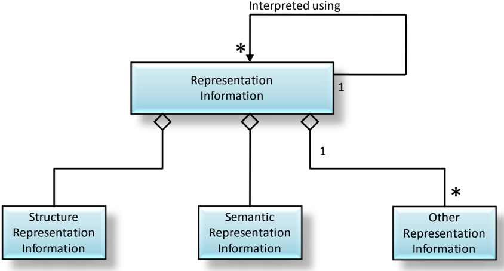

## 4.3.2.3.3 Representation Information Networks

Representation Information is an Information Object that may have its own Data Object and its own Representation Information associated with understanding each Data Object, as shown in a compact form by the 'interpreted using' association. The resulting set of objects can be referred to as a Representation Information Network . This is illustrated in figure 4-12, which shows the start of a Representation Information Network (RIN) for an Information Object (1) made up of a Data Object (1) with the Representation Information (1), which is an Information Object and hence is itself encoded as a Data Object (2) and its associated Representation Information (2). This has components Structure Representation Information (3), Semantic Representation Information (3) and Other Representation Information (3).

## CCSDS RECOMMENDED PRACTICE FOR AN OAIS REFERENCE MODEL

Figure 4-12: Partial General RIN

Another example is an Information Object which is the Information encoded in a FITS (Flexible Image Transport System https://fits.gsfc.nasa.gov/ ) file.

Figure 4-13: Example of a Simplified RIN for a FITS File

The Digital Object in this example is the FITS file itself. Its Structure Representation Information is defined by the FITS Standard. A FITS file may have many keywords in its header, but the FITS standard only defines a limited number of such keywords. The Semantic Representation Information for the additional keywords should be defined in a FITS Dictionary. Other Representation Information is FITS software implemented using Java.

The extent to which an Archive must be able to provide the various pieces of Representation Information which make up the RIN will depend upon the definition of the Designated Community and its Knowledge Base.

As a further example, tabular data (numbers and text) in plain text can be formatted as a Comma Separated Value (CSV) file conforming to the IETF RFC-4180 specification. This specification states that the plain text can be provided in ASCII format; however, the ASCII standard is not provided. To address this situation, the ASCII standard is simply referenced to add the Representation Information that is needed for a full understanding. Therefore, the ASCII standard is a part of the Representation Information Network associated with the CSV file and needs to be obtained by the OAIS in some form, or the OAIS needs to track the availability of this standard so that it may take appropriate steps in the future to ensure its CSV file Representation Information is fully understandable.

In principle, this recursion continues until an Information Object which can be understood using the Designated Community's(ies') Knowledge Base, for example physical forms, are encountered. This arrangement of Representation Information is referred to as the

## CCSDS RECOMMENDED PRACTICE FOR AN OAIS REFERENCE MODEL

Representation Information Network. The Representation Information Network is terminated when the original Content Data Object is understandable or usable by the Designated Community which implies that all the Representation Information objects in the Representation Information Network are also understandable or usable by the Designated Community. For example, Representation Information expressed in ASCII needs the additional Representation Information for ASCII, which might be a physical document giving the ASCII standard. Each item of Representation Information can have multiple components, including multiple referenced Representation Information components; each with its own Representation Information.

To preserve the meaning of an Information Object, its Representation Information must also be preserved. This is most easily accomplished when the Representation Information objects are expressed in forms that are easily understandable, such as text descriptions that use widely supported standards such as ASCII characters for electronic versions. One problem with the use of only text descriptions is that such descriptions can be ambiguous. This is addressed by the use of standardized, formal description languages containing well-defined constructs with which to describe data structures. These languages may need to be augmented with text descriptions to convey fully the semantics of the Representation Information.

As the Knowledge Base of the Designated Community changes over time, the Representation Information Network may need to change accordingly. As noted in 2.3, an OAIS has a choice of whether to collect all the relevant Representation Information or to reference its existence in another trusted or partner OAIS Archive; this is an implementation and organization decision.

The Content Information must be defined and separated into Content Data Object and Representation Information. It is again an implementation and organization decision related to the way Data Objects are ingested and stored in the OAIS. The OAIS may define a single Content Data Object as a collection of separate Data Objects or those individual Data Objects could each be considered to be a Content Data Object. The Representation Information required will clearly be different in these two cases but would be related, for example both would have to describe the relationship between the Data Objects.

For example, in the case of performing arts, where a performer plays a piece of music which is then processed through a computer system before sending out to loudspeakers to allow the audience to hear. Preservation would be regarded as successful if the musical work can be reperformed in future in a way which the composer would regard as the same. Looking at the preservation aspects, the Content Data Object may be the musical score as a PDF document, and the Representation Information would include whatever information is needed to reperform (as the way to use and understand) the piece, such as the way to display the PDF file, the audio processing software needed, placements of hardware such as loudspeakers, movement directions, and a description of how these relate to each other and to the Content Data Object, each of which may be quite complex, encoded in a separate way, and not easily described either simply as Structure Representation Information or as Semantic Representation Information. Alternatively, the Content Data Object may be multiple Data

## CCSDS RECOMMENDED PRACTICE FOR AN OAIS REFERENCE MODEL

Objects including the score, the audio processing software needed, placements of hardware and movement directions. Each of these Data Objects will have its own Representation Information and there will need to be additional Representation Information that describes how the several Data Objects are related.

Two special types of Representation Information are Representation Information Rendering Software and Access Software. Representation Information Rendering Software is able to display the Representation Information in understandable forms. For example, the file and directory structure of many CD-ROMs conforms to ISO 9660. This standard is Representation Information describing how these CD-ROM file structures are implemented, and it may be obtained as a paper document. However, it may also be obtained as a digital object that needs to be understood as a PDF object. Rather than actually obtaining the documentation of PDF and writing software to understand the ISO 9660 object, an OAIS may use available PDF display software to render the ISO 9660 documentation humanly visible and readable. In this role the PDF display software is referred to as Representation Information Rendering Software because it is used to render the Representation Information. It may also terminate the Representation Information Network, because it is sufficient to display all the Representation Information needed to understand or use the Data Object. If the OAIS does not also obtain the associated description of PDF, it needs to record and track this fact because when PDF objects are no longer cost-effective for access and display, the ISO 9660 documentation expressed as a PDF object will need to be migrated to a new form.

Access Software presents some or all of the information content of an Information Object in forms understandable to humans or systems. It may also provide some types of access services, such as displaying, manipulating, processing, or subsetting, to an Information Object. For some types of Digital Objects, such software may be widely available. It is not necessary for the OAIS to maintain or provide such software. The OAIS may want to maintain and provide this software for more specialized types of Digital Objects.

Since Access software will incorporate some understanding of the Representation Information, some Archives may attempt to use Access Software as a substitute for full Representation Information. Access Software source code, which embodies at least a partial understanding of the associated Representation Information, may be used as documentation expressing such Representation Information. A problem with this approach is that the desired Representation Information may not be clearly identifiable as it may be mixed with various processing and display algorithms, and may be incomplete since the code assumes an underlying operating environment. It may be difficult to tell, from the software code, what Representation Information is missing. The use of Access Software executables, without the source code, such as may occur with proprietary formats, presents a much greater risk for loss of information because it is more difficult to maintain an operating environment for software than to migrate documentation over time. The practical use of emulation techniques to preserve working software is an area of active research. This is a significant issue for those desiring to preserve a look and feel to information access. Migration and software preservation are discussed more fully in section 5.

## 4.3.2.4 Taxonomy of Information Object Classes Used by OAIS

## 4.3.2.4.1 General

There are many types of information involved in the Long Term Preservation of information in an OAIS. Each of these types can be viewed as a complete Information Object in that it contains a Data Object and adequate Representation Information to understand the data. This subsection builds on the discussions in 2.3 about the types of supporting information needed to enable Long Term Preservation and the discussion in the previous subsection on the role of Representation Information. The information modeling in this subsection discusses several types of Information Objects that are used in the OAIS. The objects are categorized by their content and function in the operation of an OAIS including Content Information objects, Preservation Description Information objects, Packaging Information objects, and Descriptive Information objects. The following subsections discuss the contents of each of the types of Information Object. Figure 4-14 shows a taxonomy of those Information Objects used within the OAIS.

Figure 4-14: Information Object Taxonomy

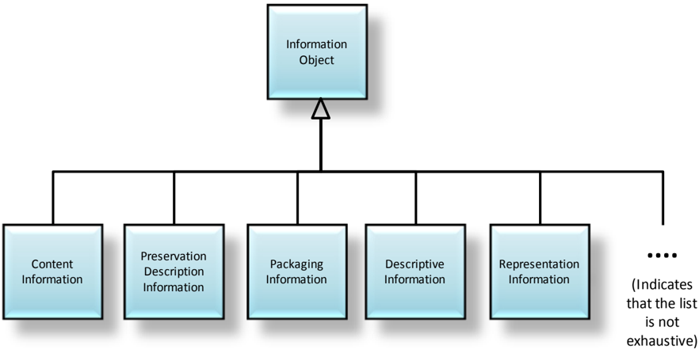

## 4.3.2.4.2 Content Information

The Content Information is the set of information that is the original target of preservation by the OAIS. Deciding what the Content Information is may not be obvious and may need to be negotiated with the Producer. The Content Information, which is an Information Object as shown in figure 4-14, is the Content Data Object together with its Representation Information. The Content Data Object in the Content Information may be either a Digital Object or a Physical Object (e.g., a physical sample, microfilm). Any Information Object may serve as Content Information.

## CCSDS RECOMMENDED PRACTICE FOR AN OAIS REFERENCE MODEL

The Representation Information for a Digital Object (Structure Representation Information and Semantic Representation Information and Other Representation Information) is needed to fully transform the bits into the Content Information. In principal, this even extends to the inclusion of definitions (e.g., dictionary and grammar) of any natural language (e.g., English) used in expressing the Content Information. Over long time periods the meaning of natural language expressions can evolve significantly in both general and in specific discipline usage.

As a practical matter, the OAIS needs to have enough Representation Information associated with the bits of the Content Data Object in the Content Information that it feels confident that the members of the Designated Community can enter the Representation Information Network with enough knowledge to begin accurately interpreting the Representation Information. This is a significant risk area for an OAIS, particularly for those with an expert Designated Community, because jargon and apparently widely understood terms may be short-lived. In such cases extra care needs to be exercised to ensure that the natural evolution of the Designated Community Knowledge Base does not effectively cause information loss from the Content Information.

As described above for an Information Object in general, the Representation Information can also be viewed as being augmented by Access Software that supports the presentation of the Content Information to the Consumer. Examples of this type of software include word processors supporting complex document format representations of Content Information and scientific visualization systems supporting representations of Content Information as a time series or a multidimensional array. Access Software may include rights enforcement tools that allow the access to protected content. The software uses its knowledge of the underlying Representation Information to provide these services.

Often required information will be embedded in the software packages used by the Designated Community to present and analyze the Content Information. A reason for preserving working Access Software arises from a convenience factor. Even with a complete set of Representation Information, practical access to all or part of a digital Content Data Object requires the use of Access Software. Thus, a software module that provides useful access to a digital Content Data Object may be preserved in a working state as a matter of convenience.

This is not difficult to do as long as the environment, which supports the software module, is readily available. This environment consists of some underlying hardware and an operating system, various utilities that effectively augment the operating system and storage and display devices and their drivers. A change to any of these may cause the software module to no longer function, to function incorrectly, or to be unable to present results to the application or human user. The complexity of these interactions is what traditionally makes the preservation of working software such an arduous task.

In summary, the use of Access Software to replace Representation Information Networks is attractive from the point of view of minimizing the resources needed to ingest data and provide current users with access to data. However, the reliance on working software can provide major problems for Long Term Preservation when that software ceases to function. Indefinite Long Term information preservation requires a full and understandable description of the Representation Information. Subsection 5.3 (Adding Representation Information) discusses some techniques that can be used to preserve software over time and the risks associated with this approach.

## CCSDS RECOMMENDED PRACTICE FOR AN OAIS REFERENCE MODEL

An important function of the OAIS is deciding what parts of the Content Information are the Content Data Object and what parts are the Representation Information. This aspect is critical to a clear understanding of what is being preserved. The identification of digital Content Information with its Representation Information objects can be addressed by a series of steps, as follows:

- a) Identify the bits comprising the Content Data Object of the Content Information.
- b) Identify a Representation Information object that, in some way, addresses all the bits of the Content Data Object and converts them into more meaningful information.
- c) For the Representation Information object identified, examine its content to identify if it requires additional Representation Information objects. If it does, obtain the required Representation Information objects. Repeat this step at least until no additional Representation Information objects are identified as required for the Designated Community.
- d) Of the Representation Information objects addressed in step c), for each that is held as a Digital Object, identify any required Representation Information object and repeat steps c) and d) until no new Representation Information objects are identified.
- e) The Content Information consists of the Content Data Object and each of the Representation Information objects identified in steps b) through d).

As an example of this practice, consider an electronic file containing a sequence of values obtained from a sensor looking at the Earth's environment. There is a second file, encoded using ASCII, which provides information on how to understand the first file. It describes how to interpret the bits of the first file to obtain meaningful numbers. It explains what these numbers mean in terms of the physics of the observation being conducted. It provides the date and time period over which the observations were made, an average value for the observed values, and who made the observations. These two files are submitted to an OAIS for preservation.

Assume that the OAIS determines that the Content Information to be preserved is the observed bits together with their values as numbers and the physical meaning of these numbers. This information is conveyed by the bit sequence within the first file together with the Representation Information from the second file that is needed to transform the first file's bits into meaningful physical values. Neither the first file's underlying media nor the particular file system carrying the bits is part of the Content Information in this example. Only part of the second file's content is considered a part of the Content Information and this is the part that enables the transformation of the bits from the first file into meaningful physical values. In fact, this second file does not carry all the Representation Information needed to make this transformation, because the following additional information is needed:

- -information that the second file is encoded in ASCII so that it can be read as meaningful characters;
- -information on how the characters are used to express the transformations from bits to numbers to meaningful physics values.

## CCSDS RECOMMENDED PRACTICE FOR AN OAIS REFERENCE MODEL

This information, typically referred to as a combination of format information and data dictionary information, may also include instrument calibration values and information on how the calibrations are to be applied. All this information may be widely understandable once the ASCII characters are visible because it has all been expressed in English (or some other natural language), or some of it may be in more structured forms that will need additional Representation Information to be understood.

Therefore, the Representation Information of the second file needs additional Representation Information, and this information may need additional Representation Information, etc., forming a linked set of Representation Information objects of other Representation Information objects. This is a good example of the complex Representation Information Network.

In the example above, there was a determination that the Content Information consisted of the observed sensor values and their meanings. This is by no means the only choice that could have been made. It could just as easily have been decided that the Content Data Object of the desired Content Information was the bit sequences within the first file together with the all the bit sequences within the second file. The fact that some of these latter bit sequences are used to interpret the first file's bit sequences is just an example of a set of bits that is somewhat selfdescribing. It is irrelevant that some of the bits in the second file are the basis for information on the date and time period over which the observations were made, the average value for the observed values, and who made the observations. Once it has been determined that all these bits constitute the Content Data Object of the Content Information, then the Representation Information is that information needed to turn them into meaningful information. The minimum amount of this meaningful information and the minimum extent of the Representation Information Network which must be carried are local issues for the OAIS taking into account its Designated Community. The OAIS may also choose to extend the Representation Information Network following consultation with any other parties, for example the Information Producers and any other Consumers.

As another example, consider an electronic file containing a word processing document. This binary Data Object will have a complex format that can be seen as a document only after it has been viewed through use of associated Representation Information. In common practice, this viewing will be provided by Access Software that can use internal, or external, Representation Information. The Content Data Object is most likely to be defined as the bit sequence content of the electronic file. The Representation Information is a description of the word processing format, at a minimum, and may include information deemed needed to adequately understand the meaning of the document as viewed. If the word processing format is proprietary, and if adequate Representation Information cannot be acquired which will at the least allow simply viewing, to ensure its Long Term Preservation it may be necessary to migrate the document to another (possibly non-proprietary) format for which Representation Information is more openly available.

As a variation on the above example, it may be decided that the Content Information to be preserved is not the full word processing view of the document, but simply a sequence of text paragraphs that can be adequately represented by ASCII characters. In this case, the OAIS may decide to extract the relevant text characters and save them as a text file. The Content

Data Object would be defined, most likely, as the bit stream made up of these characters. The Representation Information would be a description of how to interpret this bit stream as characters, together with any additional information deemed needed to adequately understand the meaning of the text.

## 4.3.2.4.3 Preservation Description Information

In addition to Content Information, the Archival Information Package must include information that will support the trust in, the access to and context of the Content Data Object over an indefinite period of time. The specific set of Information Objects, which are required for this function, is collectively called Preservation Description Information (PDI). The PDI must include information that is necessary to adequately preserve the particular Content Data Object with which it is associated. It is specifically focused on describing the past and present states of the Content Data Object, ensuring it is uniquely identifiable, and ensuring it has not been unknowingly altered.

This information is typical for all types of Archives and has been classified in the context of traditional archives. However, the class definitions must be extended for digital Archives. The following definitions are largely based on the categories discussed in the paper 'Preserving Digital Information' (reference [D2]). The relationship between the concepts in OAIS Reference Model and the Preserving Digital Information paper are discussed in the documents referenced in annex B of this document. Table 4-1 provides illustrative examples of this information for various popular Content Data Object types.

- -Reference Information identifies, and if necessary describes, one or more mechanisms used to provide assigned identifiers for the Content Data Object. It also provides those identifiers that allow outside systems to refer, unambiguously, to this particular Content Data Object. Examples of these systems include taxonomic systems, reference systems and registration systems. In the OAIS Reference Model most if not all of this information is replicated in Package Descriptions, which enable Consumers to access Information of interest.
- -Context Information documents the relationships of the Content Data Object to its environment. This includes why the Content Data Object was created and how it relates to other Content Data Objects existing elsewhere.
- -Provenance Information documents the history of the Content Data Object. This tells the origin or source of the Content Data Object, its Information Properties to be preserved (Transformational Information Properties), any changes that may have taken place since it was originated, and who has had custody of it since it was originated, providing an audit trail for the Content Data Object. This gives future users some assurance as to the likely reliability of the Content Data Object as it contributes to evidence supporting Authenticity. Provenance Information can be viewed as a special type of Context Information.
- -Fixity Information provides the data integrity checks or validation/verification keys used to ensure that the particular Content Data Object has not been altered in an

undocumented manner. Fixity Information could include special encoding and error detection schemes that are specific to instances of Content Data Objects. Fixity Information does not include the integrity preserving mechanisms provided by the OAIS underlying services, error protection supplied by the media and device drivers used by Archival Storage. The Fixity Information may specify minimum quality of service requirements for these mechanisms.

- -Access Rights Information identifies the access restrictions pertaining to the Content Data Object, including the legal framework, licensing terms, and access control. It contains the access and distribution conditions stated within the Submission Agreement, related to both preservation (by the OAIS) and final usage (by the Consumer). It also includes the specifications for the application of rights enforcement measures.

These classifications provide a minimum set of PDI; they do not specify a data structure.

Table 4-1: Examples of PDI

| Content Information Type | Reference Information | Provenance Information | Context Information | Fixity Information | Access Rights Information |
|----------------------------|-------------------------------------------------------------------------------------|-----------------------------------------------------------------------------------------------------------------------------------------------------------------------------------------------------------------------------------------------------|-----------------------------------------------------------------------|----------------------------------------------------------|--------------------------------------------------------------------------------------------------------------------------------------------------------------------------------------------------------------------------------------------------------|
| Space Science Data | - ObjecP idenPifier - Journal reference - Mission, insPrumenP, PiPle, aPPribuPe seP | - InsPrumenP descripPion - Principal InvesPigaPor - Processing hisPory - SPorage and handling hisPory - Sensor descripPion - InsPrumenP - InsPrumenP mode - DecommuPaPion map - SofPware inPerface specificaPion - InformaPion ProperPy DescripPion | - CalibraPion hisPory - RelaPed daPa sePs - Mission - Funding hisPory | - CRC - Checksum - Message DigesP - Reed- Solomon coding | - IdenPificaPion of Phe properly auPhorized DesignaPed CommuniPy (Access ConProl) - Permission granPs for preservaPion and for disPribuPion - PoinPers Po FixiPy InformaPion and Provenance InformaPion (e.g., digiPal signaPures, and righPs holders) |

## CCSDS RECOMMENDED PRACTICE FOR AN OAIS REFERENCE MODEL

| Content Information Type | Reference Information | Provenance Information | Context Information | Fixity Information | Access Rights Information |
|-----------------------------|--------------------------------------------------------------|---------------------------------------------------------------------------------------------------------------------------------------------------------------------------------------------------------------------------------------------------------------------------------------------------------------------------|------------------------------------------------------------------------------------|---------------------------------------------------------|--------------------------------------------------------------------------------------------------------------------------------------------------------------------------------------------------------------------------------------------------------------------------------------------------------------------------------------------------------------------------|
| Digital Library Collections | - Bibliographic descripPion - persisPenP idenPifier | - For scanned collecPions: • mePadaPa abouP Phe digiPizaPion process • poinPer Po masPer version - For born-digital publicaPions : • poinPer Po Phe digiPal original - MePadaPa abouP Phe preservaPion process: • poinPers Po earlier versions of Phe collecPion iPem • change hisPory - InformaPion ProperPy DescripPion | - PoinPers Po relaPed documenPs in original environmenP aP Phe Pime of publicaPion | - DigiPal signaPure - Checksum - AuPhenPiciPy indicaPor | - Legal framework(s) - Licensing offers - SpecificaPions for righPs enforcemenP measures applied aP disseminaPion Pime - Permission granPs for preservaPion and for disPribuPion - InformaPion abouP waPermarking applied aP submission and preservaPion Pime - PoinPers Po FixiPy InformaPion and Provenance InformaPion (e.g., digiPal signaPures, and righPs holders) |
| Software Package | - Name - AuPhor/ OriginaPor - Version number - Serial number | - Revision hisPory - RegisPraPion - CopyrighP - InformaPion ProperPy DescripPion | - Help file - User guide - RelaPed sofPware - Language | - CerPificaPe - Checksum - EncrypPion - CRC | - DesignaPed CommuniPy - Legal framework(s) - Licensing offers - SpecificaPions for righPs enforcemenP measures applied aP disseminaPion Pime - PoinPers Po FixiPy InformaPion and Provenance InformaPion (e.g., digiPal signaPures, and righPs holders) |

The OAIS needs to explicitly decide what the exact definition of Content Data Object is in order to be able to ensure that it also has the PDI needed to preserve the Content Data Object. Once the Content Data Object has been determined, it is possible to assess the Preservation Description Information.

## 4.3.2.4.4 Packaging Information

The Packaging Information is that information which, either actually or logically, binds or relates the components of the Information Package into an identifiable entity. For example, if the Content Information and PDI are identified as being the content of specific files in a TAR file, then the Packaging Information may include the name of the TAR file and the fact that it is a TAR file including details of any specific encoding. The Packaging Information needs to be preserved by an OAIS as long as the AIP exists; if the AIP is repackaged then the Packaging Information will be changed and the new Packaging Information will need to be

maintained with that repackaged AIP. These structures are most likely to be used as Packaging Information. Packaging Information is not preserved by all Digital Migrations. The OAIS should avoid holding PDI or Content Information only in the naming conventions of directory or file name structures because any information saved in file names or directory structures may be lost when the Packaging Information is altered. The subject of Packaging Information is an important consideration to the Migration of Information within an OAIS. This subject is addressed in detail in section 5 of this document.

## 4.3.2.4.5 Descriptive Information

The Information Objects described previously in this section provide the information necessary to enable the Long Term Preservation function of the Archive. In addition to preserving information, the OAIS must provide adequate features to allow Consumers to locate information of potential interest, analyze that information, and order desired information. This is accomplished through a specialization of the Information Object called Descriptive Information, which contains the data that serves as the input to documents or applications called Access Aids . The Descriptive Information is generally derived from the Package Description , which is itself derived from the Content Information and PDI. The Descriptive Information can be viewed as an index to enable efficient access to the associated Information Package via associated Access Aids. Access Aids are documents or applications that can be used to locate, analyze, retrieve, or order information from the OAIS.

## 4.3.3 LOGICAL MODEL OF INFORMATION IN AN OPEN ARCHIVAL INFORMATION SYSTEM (OAIS)

## 4.3.3.1 Overview

The previous subsection defines the types of Information Objects that are needed by an OAIS to enable the Long Term Preservation of information and effective access to the preserved information by the Designated Community. This subsection uses those Information Object descriptions to model the conceptual information structures required to accomplish these functions. The models presented in this subsection are not intended to imply an implementation, but rather to highlight the relationships among the types of information needed in the archival process.

## 4.3.3.2 Information Package

The conceptual structure for supporting Long Term Preservation of information is the Information Package. An Information Package is a container for Information Objects; the Information Package is associated with two other types of Information Objects, Packaging Information and Package Descriptions. There are differing information requirements for each of these functions. The UML diagram in figure 4-15 illustrates the conceptual view of an Information Package. This UML diagram shows that an Information Package contains zero or more Information Objects and is associated with exactly one piece of Packaging

Information, which identifies and delimits the Information Package. The Information Package is also associated with zero or more Package Descriptions that describe the Information Object(s) to enable efficient access.

Figure 4-15: Information Package Contents and Its Associated Package Description and Packaging Information

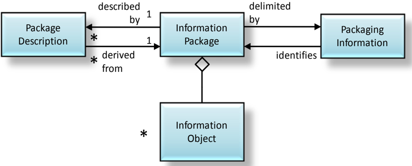

It is useful to point out that the Information Object may consist of separate components, for example Content Information, the target of preservation, plus Preservation Description Information, as illustrated in figure 4-16.

Figure 4-16: Example of an Information Object Made Up of Content Information and PDI

## 4.3.3.3 Types of Information Packages

There are three subtypes of the Information Package identified in 2.3 as being of particular interest: The Submission Information Package (SIP), the Archival Information Package (AIP), and the Dissemination Information Package (DIP). The definitions of these package types in section 2 are based on the function of the archival process, which uses the package, and the translation from one package to another as it passes through the archival process. This taxonomy of Information Package types is shown in figure 4-17.

Figure 4-17: Information Package Taxonomy

There are several types of Information Packages that are used within the archival process. These Information Packages may be used to structure and store the OAIS holdings; to transport the required information from the Producer to the OAIS, or to transport requested information between the OAIS and Consumers. There are differing information requirements for each of these functions. It is necessary to distinguish between an Information Package that is preserved by an OAIS (an Archival Information Package) and the Information Packages that are used to transport requested information from the Producer to an OAIS (a Submission Information Package), and those that are used to transport requested information from an OAIS to the Consumers (a Dissemination Information Package). Although these are all Information Packages, they differ in mandatory content and the multiplicity of the associations among contained classes.

These variant packages are needed to reflect the reality that some submissions to an OAIS will have insufficient Representation Information or PDI to meet final OAIS preservation requirements. In addition, they may be organized very differently from the way the OAIS organizes the information it is preserving. Finally, the OAIS may provide information to Consumers that does not include all the Representation Information or all the PDI with the associated Content Information being disseminated.

## CCSDS RECOMMENDED PRACTICE FOR AN OAIS REFERENCE MODEL

The Submission Information Package (SIP) is that package that is sent to an OAIS by a Producer. Its form and detailed content are typically negotiated between the Producer and the OAIS. Most SIPs will have some Content Information and some PDI, but it may require several SIPs to provide a complete set of Content Information and associated PDI. The Content Information and the PDI both have associated Representation Information, and if there are multiple SIPs involved that use the same Representation Information, it is likely that such Representation Information will only be provided once to the OAIS. As another variation, since some types of PDI will apply to multiple SIPs from the same source, such PDI may be provided in a separate SIP that is without Content Information. The Packaging Information will always be present in some form.

The Descriptive Information associated with a SIP is likely to be provided prior to submitting the SIP to the OAIS, but it may be provided at any time. It may be no more than a text description with a name or title, carried by the Packaging Information, by which the SIP may be recognized.

Within the OAIS, one or more SIPs are transformed into one or more Archival Information Packages (AIPs) for preservation. The AIP has a complete set of PDI for the associated Content Information. The AIP may also contain a collection of other AIPs and this is discussed and modeled later in this subsection. The Packaging Information of the AIP will conform to OAIS internal standards, and it may vary as it is managed by the OAIS. The Descriptive Information associated with an AIP may be extensive and will be managed by the OAIS so that Consumers can find and order the Content Information of interest.

In response to an Order, the OAIS provides all or a part of an AIP to a Consumer in the form of a Dissemination Information Package (DIP). The DIP may also include collections of AIPs, and it may or may not have complete PDI. The Packaging Information will always be present in some form so that the Consumer can clearly distinguish the information ordered. The Packaging Information may take several forms depending on the dissemination media and Consumer requirements. The Descriptive Information associated with a DIP may be provided with the transfer of the DIP, or it may be provided at any time before or after the transfer. Its purpose is to give the Consumer enough information to recognize the DIP from among possible similar packages. It may be no more than a text description with a name or title, as carried by the Packaging Information, by which the DIP may be recognized.

Though the implementation of the AIP may vary from Archive to Archive, the specification of the AIP as a container that contains all the needed information to allow Long Term Preservation and access to Archive holdings remains valid. The information model for the AIP presented in 4.3.3.4 should be used as a reference to establish the types of information required to enable Long Term Preservation and access.

The exact information contents of the SIP and DIP and their relationship to the corresponding AIP are dependent on the agreements between the Archive and its Producers and Consumers. The model for both of these packages is the same as for the Information Package shown in figure 4-15 both in mandatory content and the multiplicity of the associations among contained classes. The subject of transformations between SIP and AIP and between AIP and DIP is further discussed in 4.4.

## 4.3.3.4 The Archival Information Package

An Archival Information Package (AIP), which is modeled in figure 4-18, is a specialization of the Information Package. The AIP is defined to provide a concise way of referring to a set of information that has, in principle, all the qualities needed for permanent, or indefinite, Long Term Preservation of a designated Information Object. The AIP is itself an Information Object that is a container of other Information Objects. Within the AIP is the designated Information Object, and it is called the Content Information.

Figure 4-18: Archival Information Package (AIP) and Its Associated Package Description and Packaging Information

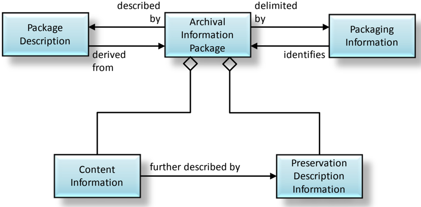

Also, within the AIP is an Information Object called the Preservation Description Information (PDI). The PDI contains additional information about the Content Data Object which is part of the Content Information and is needed to make the Content Data Object meaningful for the indefinite Long Term.

The Preservation Description Information requirements in an AIP are much more stringent than the requirements for Preservation Description Information in the general Information Package. While no PDI objects are mandatory in an Information Package, all classes of PDI information must be present in an AIP. This is illustrated in figure 4-19. The contents of each type of PDI are left to the discretion of the individual Archive.

For example, in some OAIS holdings a statement that the creator of the Content Data Object is unknown may be adequate Provenance Information while in other OAIS holdings it may be mandatory that more complete provenance be researched.

Figure 4-19: Preservation Description Information

The AIP is delimited and identified by the Packaging Information. The Packaging Information may actually be present as a structure on the media that contains the AIP or, it may be virtual in that it is contained in the OAIS Archival Storage function. However, the delimitation and internal identification functions must be well defined in an OAIS.

Each AIP is associated with a structured form of Descriptive Information called the Package Description, which enables the Consumer to locate information of potential interest, analyze that information, and order desired information. The information needed for one Access Aid is called an Associated Description . A single Package Description may contain several Associated Descriptions depending on the number of different Access Aids that can locate, visualize, retrieve or order the associated Content Information and PDI. Figure 4-20 is a UML diagram that models the Package Description and Access Aids.

Figure 4-20: Package Description and Its Associated AIP

The Package Description must contain one Associated Description that supplies data for a Retrieval Aid that allows authorized users to retrieve the Content Information and PDI described by the Package Description. This Retrieval Aid is generally part of the Archival Storage Functional Entity. It translates from the unique identifier assigned by the OAIS to identify the AIP into the set of operations and filenames needed to retrieve the AIP from the file management system used in Archival Storage, and then returns the Content Information and PDI for the requested AIP.

The Package Description may also contain any number of Associated Descriptions, each of which contains data for one or more Access Aids. Two additional subtypes of Access Aid are Finding Aid and Ordering Aid .

A Finding Aid is an Access Aid that assists the Consumer in locating information of interest. A single AIP may have a number of Associated Descriptions that describe the Content Information using different technologies.

An Ordering Aid is any Access Aid that assists the Consumer to discover the cost of and to order information from AIPs of interest. The Ordering Aids may also allow users to specify transformations to be applied to the information in the AIPs prior to dissemination. These transformations can include Data Object transformations such as subsetting, subsampling or format transformations. The transformations can also involve modifying the PDI obtained from the AIPs prior to dissemination.

The Package Description is not required for the Long Term Preservation of the Content Information but is needed to provide visibility and access into the contents of an Archive. The contents of the Package Description are highly dependent on the structure of the Content Information and PDI it describes. The uses and types of Package Descriptions in an OAIS are further defined in 4.3.3.5.

Figure 4-21 gives a detailed view of the Archival Information Package by expanding the PDI and the Content Information. All the 'contains' relationships discussed in this subsection are logical containment relationships. This type of containment relationship may be physical or may be accomplished via a pointer to another object in storage, so an AIP is not necessarily a single file.

Figure 4-21: Archival Information Package (Detailed View) and Its Associated Package Description and Packaging Information

## 4.3.3.5 Specialization of the AIP and Package Descriptions

Two specializations of the AIP are discussed in this subsection, the Archival Information Unit (AIU) and the Archival Information Collection (AIC) . Figure 4-22 is a UML diagram illustrating this specialization. Both AIU and AIC are subtypes of the AIP and as such contain constructs to enable both Long Term Preservation and Consumer access. The AIU

## CCSDS RECOMMENDED PRACTICE FOR AN OAIS REFERENCE MODEL

represents the type used for the preservation function of Content Information where the Archive chooses not to make the Content Information from other Archival Information Packages. The AIC organizes a set of AIPs (AIUs and other AICs) along a thematic hierarchy, which can support flexible and efficient access by the Consumer community. Conceptually all the AIPs organized by an AIC are contained in the Content Information of that AIC. The difference between AIUs and AICs is the complexity of their Content Information and their associated Package Descriptions and Packaging Information. This reference model considers the differences in the Content Information and associated Packaging and Description functionality between AIU and AIC to be adequately complex and linked to justify the definition of separate classes.

Figure 4-22: Specialization of the AIP

From an Access viewpoint, new subsetting and manipulation capabilities are beginning to blur the distinction between AICs and AIUs. Content Information which used to be viewed as atomic can now be viewed as containing a large variation of contents based on the subsetting parameters chosen. As another example, the Content Information of an AIU may not exist as a physical entity. The Content Information could consist of several input files (or pointers to the AIPs containing these data files) and an algorithm which uses these files to create the Data Object of interest.

From an information preservation viewpoint, the distinction between AIU and AIC remains clear. An AIU is viewed as having a single Content Information object that is described by exactly one set of PDI. An AIC Content Information is viewed as a collection of other AIPs, that is, other AICs and AIUs, each of which has its own PDI. In addition, the AIC has its own PDI that describes the collection criteria and process.

There are two specializations of the Package Description, the Unit Description and the Collection Description. Figure 4-23 is a UML diagram illustrating this specialization. The difference in these two classes is based on the functionality needed to effectively access the contents of an AIU versus the functionality needed to effectively access AIPs that are contained in an AIC.

Figure 4-23: Specialization of the Package Description

To aid in the understanding of these constructs, the next two subsections of this document will use an example of a company setting up an OAIS of digital versions of movies. This example will focus on the information content of constructs in an AIP. Subsection 4.4 illustrates more of the details of the information transformations and data flows in an OAIS.

## 4.3.3.6 Archival Information Unit

The AIUs can be viewed as the 'atoms' of information that the Archive is tasked to store. A single AIU contains exactly one Content Information object (which may consist of multiple files) and exactly one set of PDI. The Archive is free to decide how to construct the AIU and in particular an AIU does not need to be a single file. When an Information Object is ingested into the OAIS a Unit Description , which is a subtype of a Package Description, is created by extracting information from the Content Information and the PDI and adding OAIS-specific information such as a unique identifier. The AIU is illustrated in figure 4-24.

In the example where an OAIS chooses to preserve a digital movie, as an AIU, which can be viewed as three objects, one containing a digital encoding of the movie in a proprietary format, one containing the Representation Information needed to understand the proprietary format (these two objects form the Content Information), and the other containing facts about the movie such as date of creation, featured actors, director, producer, sequels, movie studio, and a checksum to ensure the integrity of the digital movie (PDI). Since the OAIS reference model is implementation independent, each of these objects could be implemented as one file or multiple files. This type of implementation-dependent information is contained in the Packaging Information. When a movie is ingested into the OAIS a Unit Description for an Ordering Aid can be created by extracting information from the Content Information and the PDI and appending it to the unique ordering information.

Figure 4-24: Archival Information Unit (AIU) and Its Associated Unit Description and Packaging Information

## 4.3.3.7 Unit Description

The Unit Description is a specialization of the Package Description that always contains a set of Associated Descriptions each of which describe the AIU Content Information from the point of view of a single Access Aid. Figure 4-25 is a UML diagram that illustrates the Unit Description contents.

Figure 4-25: Unit Description and Its Associated Archival Information Unit

## CCSDS RECOMMENDED PRACTICE FOR AN OAIS REFERENCE MODEL

All Unit Descriptions must supply an Associated Description for a Retrieval Aid that enables authorized users to retrieve the AIU described by the Unit Description from Archival Storage. This description includes the unique identifier assigned to the AIP by Archival Storage during the Ingest Process.

An important type of Access Aid is the Finding Aid, which assists the Consumer in locating information of interest. A single AIU may have a number of Associated Descriptions that describe the Content Information using different technologies. Additionally, as new description extraction and display technologies become available, an Archive may want to update the Unit Description associated with each of its AIUs, in order to add a new Associated Description that utilizes the new technology to better describe the AIUs.

In the OAIS for digital movies example, initially, there may be one Associated Description that is a free text description of a movie, another that is a five-minute clip and another that is a row in a relational database that is used by movie collectors to locate movies of interest. After the Archive has been operational for a period of time a technique for supplying compressed digital movies may be developed based on recording every tenth frame. The archivist may decide to create an additional type of Associated Description that is populated using the results of this new technique. If desired, the user can run each of the AIUs contained in the Archive though this compression technique and create a new Associated Description for each movie in the Archive or simply include this Associated Description for new AIUs as they are ingested into the OAIS.

Another important class of Associated Descriptions supplies data for Ordering Aids that allows the Consumer to discover the cost of and order AIUs of interest. The Ordering Aids also allow users to specify transformations to be applied to the AIUs prior to dissemination. These transformations can include Data Object transformations such as subsetting, subsampling or format transformations. The transformations can also involve modifying the PDI from the AIU prior to dissemination in the DIP, if requested.

For example, the OAIS for digital movies could allow a user to order a digital movie as a VHS tape or an MPEG object delivered on-line. Each of these would involve a format transformation and, in theory, an update to the PDI information copied from the AIP to create accurate PDI for the DIP.

## 4.3.3.8 Archival Information Collections

The AIU and its associated Unit Description provide the information necessary for a Consumer to locate and order AIUs of interest. However, it can be impossible for a Consumer to sort through the millions of Unit Descriptions contained in a large Archive. This problem is addressed here.

The Content Information of an AIC is composed of complete AIPs each of which have their own Content Information, PDI, and associated Packaging Information and Package Descriptions. These AIPs are then aggregated into Archival Information Collections (AIC) using criteria determined by the archivist. Generally, AICs contain the AIUs of interest

having common themes or origins and a common set of Associated Descriptions. At a minimum all OAISes can be viewed has having at least one AIC which contains all the AIPs held by the OAIS.

For example, the OAIS for digital movies may have AICs based on the subject area of the movie such as mystery, science fiction, or horror. In addition, the Archive may have AICs based on other factors such as director or lead actor.

A logical model of an AIC is shown in figure 4-26. As in the previous subsections, all of the containment relationships are logical containment and may be physical or may be accomplished via a pointer to another object in storage. For example, the Content Information of an AIC can be created either by creating physical collections of the contained AIPs or by pointing to the contained AIPs. A single AIP can belong to any number of AICs.

Figure 4-26: Archival Information Collections and Its Associated Collection Description and Packaging Information Logical View

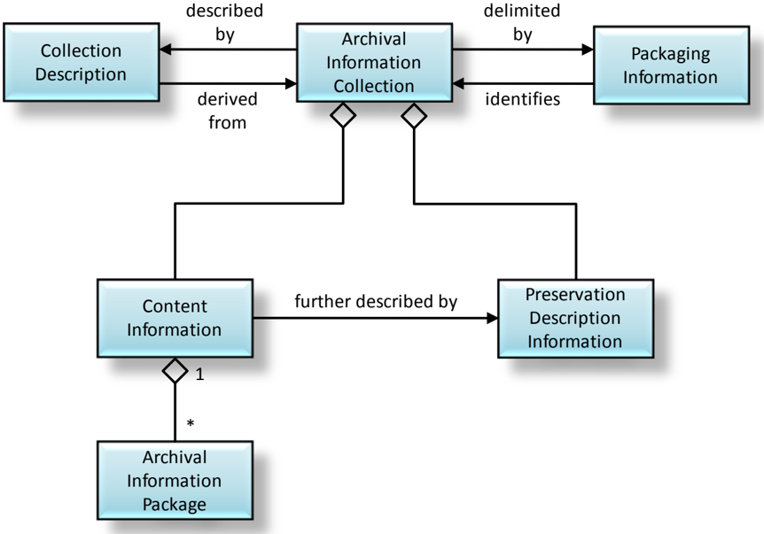

For example, a pattern recognition technique might be created for digital movies and the OAIS for digital movies might offer a service to search its holdings for large structures such as the pyramids or a New York skyline. This type of service is very processing intensive, involving potentially large numbers of AIUs to be transferred from Archival Storage to Access and then running the appropriate process to analyze the Content Information from

each AIU. If the results are generally useful, the archivist could summarize the results of this 'content-based query' into an Associated Description of a new AIC that contains movies with large structures.

An important feature of the AIC, as shown in figure 4-26, is the fact that an AIC is a complete AIP which contains PDI. The PDI provides further information about the AIC such as Provenance Information on when and why it was created, Context Information showing related AICs, the desired level of security, Fixity Information and Access Rights Information. This is in addition to the PDI contained in member AIPs. This type of information is often necessary for a Consumer to have confidence in the reliability of an AIC. In the above example, the usefulness of the AIC of movies with large structures is to some extent based on the algorithm used and the Provenance Information of when the AIC was created or last updated.

## 4.3.3.9 Collection Descriptions

The Collection Description is a subtype of the Package Description that has added structures to better handle the complex Content Information of an AIC. The Collection Description, is modeled in figure 4-27.

There are two types of Associated Description in a Collection Description:

- -There is at least one Overview Description that describes the collection as a whole.
- -There are zero or more Member Descriptions that separately describe each member of the collection.

Figure 4-27: Collection Description and Its Associated Archival Information Collection

The required Associated Description in a Collection Description provides information for Ordering Aids that provide a user with access to the entire set of Content Information of the associated AIC and the PDI for the AIC, but not necessarily to the individual AIPs contained in the AIC. The Collection Description may contain the Package Descriptions of the AIPs contained in the AIC. This containment relationship is logical in that the AIC may either include the Package Descriptions of member Information Packages directly or, more commonly, use pointers to the Package Descriptions of the member Information Packages. This list of the Package Descriptions for contained AIPs in an AIC could provide Access Aids with a method to retrieve or order individual members of the AIC.

It also allows alternative concepts for the implementation of Finding Aids that enable the Consumer to locate AIPs of interest that are contained in an AIC. The Associated Descriptions that provide data for these Finding Aids could be implemented either in a centralized fashion searching an Associated Description in the Collection Description or in a distributed fashion by searching the Associated Description of each member Package Description.

## CCSDS RECOMMENDED PRACTICE FOR AN OAIS REFERENCE MODEL

Another important benefit of the Collection Descriptions is the ability to define new Access Collections . An Access Collection may be based on new data mining results or it may reflect current phenomena or areas of interest that may not be of permanent interest. Examples of an Access Collection in an OAIS for digital movies might be a new arrivals collection or a 'twenty most popular titles' collection that is updated periodically. Another example of an Access Collection is a collection based on the results of a pattern recognition algorithm that has not been verified.

To create an Access Collection, an Archive would create a Collection Description that did not yet have an associated AIC. The Collection Description could have a customized Member Description that documented the newly mined description data for each member AIP. A specialized Finding Aid could use this new Member Description in conjunction with existing Member Descriptions in the Package Description information of each member AIP to locate AIPs of interest to the user. The Package Descriptions of contained AIPs would also supply data for an Ordering Aid, which would allow the Consumer to order the Information Packages of interest to the Consumer.

If an OAIS decides that an Access Collection is valuable enough to be preserved for the Long Term, it can store the required additional Content Information and PDI in Archival Storage, thus creating a new AIC.

Another important application of Access Collections is the concept of locating some members of a collection that have been scheduled for ingest at a future time. In this case, the Associated Descriptions supporting a Finding Aid would allow future AIPs to be located. However, the Associated Description for the Ordering Aid and/or the Retrieval Aid would contain the information that this product was not currently available and allow the user to enter an Event Based Order which would be triggered when the AIP of interest became available.

## 4.3.4 DATA MANAGEMENT INFORMATION

Currently, Package Descriptions are stored in persistent storage such as database management systems to enable easy, flexible access and update to the contained Associated Descriptions. In addition to the Package Descriptions discussed in the previous subsections, all the information needed for the operation of an Archive could be stored in databases as persistent data classes. Figure 4-28 illustrates the various types of 'data management information' within the OAIS. The Archive Administration Information represents the entire range of information required for the day-to-day operation of the Archive. This information includes:

- -Policy (e.g., information which provides pricing information and availability constraints for ordering preserved information.)
- -Request tracking information that records the progress of each user transaction with an Archive. The request tracking process can be very complicated, involving database events and triggers, or as simple as a flat file tracking order requests.

- -Security information that includes user names and any passwords or other mechanisms needed to authenticate the identity and privileges of Archive users.
- -Event Based Order information that provides the information needed to support repeating or future requests.
- -Statistical information needed by Archive administration and Management to determine future policies and performance tuning for more effective Archive operation. Examples of these statistics include the number of times an AIP was ordered over a time period and the average time between receiving an order request and fulfilling the request.
- -Preservation process history information that tracks the migrations of AIPs, including media replacements and AIP transformations, whether the Representation Information has been changed by the Archive, and may include whether responsibility for the AIP has been handed over to another Archive. Some or all of this information may be part of the Provenance Information of the appropriate AIPs.
- -Customer profile information that enables the Archive to maintain facts such as user name and address to avoid the user's having to reenter these facts each time he or she enters a request.
- -Accounting information that includes the data necessary for the operation of the Archive as a business. The accounting data include payroll data, accounts payable data and accounts receivable data.

These classes are intended as examples rather than an exhaustive list of the data required for Archive administration. These classes are conceptual and individual OAIS implementations may vary significantly. For example, individual OAIS may choose to combine the Customer related information types such as Security and Customer Profile into a single database.

Figure 4-28: Data Management Information

## 4.4 INFORMATION PACKAGE TRANSFORMATIONS

## 4.4.1 OVERVIEW

The previous portions of this section have discussed the functional architecture of an OAIS and an information architecture to represent the Information Packages and associated Package Descriptions and Packaging Information. This subsection looks at the transformations, both logical and physical, of the Information Package and its associated objects as they follow a lifecycle from the Producer to the OAIS, and from the OAIS to the Consumer. This subsection is non-normative.

Figure 4-29 presents a high-level data flow diagram that depicts the principle data flows involved in OAIS operations. These flows do not include administrative flows such as accounting and billing.

Figure 4-29: High-Level Data Flows in an OAIS

## 4.4.2 DATA TRANSFORMATIONS IN THE PRODUCER ENTITY

The data within the data Producer entity are private and may be in any format the Producer desires. However, when the decision is made to store the data in an OAIS, the Producer who is responsible for the data meets with archivists to negotiate a Submission Agreement as discussed in 2.6.3 of this document. This agreement defines information such as the content, format, and scheduled arrival times of the Submission Information Package (SIP). The SIP is an Information Package that is provided to the OAIS by the Producer. The SIP consists of some or all of the Content Information plus the data that is necessary to assure that those data can be maintained by the OAIS and that the data can be interpreted and used by Consumers who access the information from the OAIS in the future.

These SIPs are periodically transferred to the OAIS in a Data Submission Session. The number of Data Submission Sessions between an OAIS and a Producer can range from a single session in the transfer of a final data product to multiple sessions a day in the case of active OAIS which stores data for experiments which are still in process. The Data Submission Session can be logically viewed as sets of Data Objects and description objects, although the description can be included in the digital objects (i.e., self-describing objects) or divided into many separate descriptive items. In addition to the logical view of data (the SIP), the specification of Data Submission Sessions must also include the mapping of the objects to the media on which they are delivered. This mapping includes the encoding of the object and description and the allocation of logical objects to files.

## 4.4.3 DATA TRANSFORMATIONS IN THE INGEST FUNCTIONAL ENTITY

Once the SIP is within the OAIS, its form and content may change. An OAIS is not always required to retain the information submitted to it in precisely the same format as in the SIP. Indeed, preserving the original information exactly as submitted may not be desirable. For example, the computer medium on which submitted images are recorded may become obsolete, and the images may need to be copied to a more modern medium. In addition, some types of information such as the unique identifier used to locate the Information Package within the OAIS will not be available to the Producer and should be input during the Ingest process to the OAIS.

The mapping between SIPs and AIPs is not necessarily one-to-one. Here are some examples:

- -One SIP-One AIP: A government agency is ready to send its electronic records from the previous fiscal year to the Archive. All of the year's records are placed onto magnetic tapes that are submitted as one SIP. The Archive stores the tapes together as a single AIP.
- -Many SIPs-One AIP: A satellite sensor makes observations of the Earth over a period of one year. Every week all of the latest sensor data are submitted to the Archive as a SIP. The Archive has a single AIP containing all of the sensor's observations for the year. Ingest merges the Content Information from each weekly SIP into a specified file/files in Ingest persistent storage. The PDI data for the AIP is sent after the last sensor data for the year has been received. After all of the weekly SIPs and the SIP containing the PDI have arrived, ingest processes the AIP.
- -One SIP-Many AIPs: A company submits financial records to an Archive as one SIP. The Archive chooses to store this information as two AIPs: one that contains public information and the other that contains sensitive information. This makes it easier for the Archive to manage access to the information.
- -Many SIPs-Many AIPs: An oil and gas company collects information on its wells. Every year it submits SIPs containing all of the well status information for one well to an Archive. The Archive maintains one AIP for each oil or gas field and breaks out the information on each well to the proper AIP based upon its geographic coordinates.

The ingest process transforms the SIPs received in the Data Submission Session into a set of AIPs and Package Descriptions which can be stored and accepted by the Archival Storage and Data Management functional entities. The complexity of this ingest process can vary greatly from OAIS to OAIS or from Producer to Producer within an OAIS. The simplest form of the process involves removing the Content Information, PDI and Package Descriptions from the Producer transfer media and queuing them for storage by the Archival Storage and Data Management functional entities. In more complex cases, the PDI and Package Descriptions may have to be extracted from the Content Information or input by OAIS personnel during the ingest function; the encoding of the information objects or their allocation to files may have to be changed. In the most extreme case, the granularity of the Content Information may be changed, and the OAIS must generate new PDI and Package Descriptions reflecting the newly generated information objects. When many SIPs are

## CCSDS RECOMMENDED PRACTICE FOR AN OAIS REFERENCE MODEL

required for the creation of one AIP, the Ingest Functional Entity will provide temporary storage for the SIPs until all the SIPs required for the AIP arrive.

In addition, the Ingest Functional Entity will classify incoming information objects and determine in what existing collection or collections, if any, each object belongs and will update the appropriate AICs and Collection Descriptions as necessary after the AIPs are stored in Archival Storage. The OAIS and external organizations including, for example, the Producer, may provide additional Associated Descriptions and Finding Aids that allow alternative access paths to the information objects of interest. Researchers will develop new and fundamentally different access patterns to information objects. It is important that an OAIS's Ingest and internal models are sufficiently flexible to incorporate these new descriptions so the general user community can benefit from the research efforts. A good example of this type of new Associated Description is a phenomenology database in Earth Observation, which allows users to obtain data for a desired event, such as a hurricane or volcano eruption, from many instruments with a single query. It is important to note that such Finding Aids may become obsolete unless the data they require are preserved as parts of the AIPs they access.

It is expected that the Ingest Functional Entity will coordinate the updates between Data Management and Archival Storage and provide appropriate coordination and error recovery. The AIP should first be stored in Archival Storage. The confirmation of that operation will include a unique identifier to retrieve that AIP from Archival Storage. This identifier should be merged into the Package Description prior to the addition of the Collection Description to Data Management.

## 4.4.4 DATA TRANSFORMATIONS IN THE ARCHIVAL STORAGE AND DATA MANAGEMENT FUNCTIONAL ENTITIES

The Archival Storage Functional Entity takes the AIPs produced by the Ingest process and merges them into the permanent Archive holdings. The Data Management Functional Entity takes the Package Descriptions produced by Ingest and augments the existing Collection Descriptions to include their contents. The logical model of the ingested data should already be mapped into the logical model of the Archive's holdings. Thus, the major transformation that occurs in this step is the mapping of the acquisition session from the ingest physical model. This will tend to be on temporary storage, to the permanent storage of the OAIS, which could range from a Database Management Systems (DBMS) to a Hierarchical File Management Systems (HFMS), or any mixture of the above.

The internal view of the OAIS is the permanent representation of the preserved data, so all encoding and mappings must be well documented and understood. The transferring of ingest objects is frequently done by a software process such as an HFMS driver or a DBMS. In this case, it is the responsibility of the OAIS to maintain an active copy of the software or careful documentation of the internal formats so the data can be transferred to other systems in the future without loss of information.

CCSDS RECOMMENDED PRACTICE FOR AN OAIS REFERENCE MODEL

## 4.4.5 DATA FLOWS AND TRANSFORMATIONS IN THE ACCESS FUNCTIONAL ENTITY

When a Consumer wishes to use the data within the OAIS, a Finding Aid may be used to locate information of interest. Finding Aids present Consumers with the logical view of the OAIS holdings so the Consumers can decide which AIPs to acquire. At a minimum, the access view is the high-level logical view of the Collection Descriptions discussed in 4.3.3.9. The OAIS may have to spend significant time and effort developing Associated Descriptions and Finding Aids such as catalogs that will aid the Consumer in locating AIPs or AICs of interest. A Consumer will establish a Search Session with the Access entity. During this Search Session, the Consumer will use the OAIS Finding Aids to identify and investigate potential holdings of interest. This searching process tends to be iterative, first identifying broad criteria and then refining the criteria on the basis of previous search results. When candidate objects of interest are identified, more sophisticated Finding Aids such as browse image viewers or animation may be used to further refine a Result Set.

Once the Consumer identifies the OAIS holdings to acquire, the Consumer uses an OAISsupplied Ordering Aid to develop an Order Agreement to acquire the data. The Consumer produces a logical view of the desired AIPs and associated Package Descriptions to be included in the Dissemination Information Package and specifies the physical details of the Data Dissemination Session such as media type and object format. This process may involve no visible interaction between the Consumer and the OAIS if adequate defaults exist. The order can also specify any transformations the Consumer wishes applied to the AIPs in creating the DIP.

The Access Functional Entity then records the Order Agreement in the Data Management Functional Entity. When the conditions required to satisfy a recorded Order Agreement are met (for many Order Agreements these conditions are met immediately, but if not, Administration notifies Access when they are met), the Access Functional Entity coordinates the response. Access contacts the Archival Storage Functional Entity and the Data Management Functional Entity and requests the AIPs and associated Package Descriptions necessary to populate the DIP requested by the Consumer. The Archival Storage Functional Entity and the Data Management Functional Entity create copies of the requested objects in temporary storage.

Access then transforms this set of the AIPs and associated Package Descriptions into a set of DIPs and stores those DIPs onto distribution (either physical or communications) media to be delivered to the Consumer in a Data Dissemination Session. The complexity of this transformation process can differ greatly on the basis of the level of processing services offered by the OAIS and requested by the Consumer's order. In the simplest case, the DIP contains duplicates of the AIPs and associated Package Descriptions of interest from the Archival Storage Functional Entity and Data Management Functional Entity. In more complex cases, the desired Content Information may have to be extracted from the information objects or inserted into self-describing information objects, and the encoding of the information objects or their allocation to physical files may have to be changed. In the most extreme case, when the OAIS supports subsetting services, the granularity of the

## CCSDS RECOMMENDED PRACTICE FOR AN OAIS REFERENCE MODEL

information objects may be changed, and the Dissemination process may generate DIPs and associated Package Descriptions reflecting the new granularity. The mapping between DIPs and AIPs is one-to-one if no transformations are requested; however, the use of subsetting services and other product processing options could create many DIPs from a single AIP, a single DIP based on combining many AIPs, or multiple DIPs derived from multiple AIPs.

## 5 PRESERVATION PERSPECTIVES

## 5.1 OVERVIEW

This section addresses various practices that have been, or might be, used to preserve digital information and to preserve access services to digital information. It uses the functional and information modeling concepts described in subsection 4.3 and applies them to these practices, and it extends the terminology to distinguish significant aspects of these practices. There will be a number of options available to preserve any particular piece of digitally encoded information; the particular preservation solution applied should be chosen to match the requirements identified in the interactions between Administration and Preservation Planning. This entire section is non-normative.

Despite the efforts of an OAIS to make information it holds be relevant for the long-term, for example, making use of standardized data formats that are expected to be used for a time, it is inevitable that at some point OAIS holdings will need to be addressed to ensure they are usable to future generations.

Even more so the fast-changing nature of the computer industry and the ephemeral nature of electronic data storage media are at odds with the key purpose of an OAIS: to preserve information over a long period of time. Today's digital data storage media can typically be kept at most a few decades before the probability of irreversible loss of data becomes too high to ignore. Further, the rapid pace of technology evolution makes many systems much less cost-effective after only a few years. Even more daunting, as operating systems evolve, is maintenance of operational software as a part of the Representation Information, which is essential for the preservation of Content Information. In addition to the technology changes there will be changes to the Knowledge Base of the Designated Community which will affect the Representation Information needed.

Fundamentally, approaches to information preservation in the face of changing technologies, resource availability and Designated Community requirements may be summarized as follows.

The Content Data Object of the Content Information being preserved may be

- a) kept by the Archive but may be changed; or
- b) kept by the Archive unchanged; or
- c) not kept by the Archive, but instead handed on to another Archive.

Each of these three imply the following:

- -In case a) the archive may Transform the Content Data Object.
- -In case b) the archive may add Representation Information to ensure the Content Information is Independently Understandable.
- -In case c) the archive may hand over the AIP which contains the Content Data Object.

For each of these approaches there will be the need to ensure that an Information Object being preserved continues to be Independently Understandable by the Designated Community, the components of its AIP are not lost and are updated appropriately.

Subsection 5.2 discusses Digital Migration in general terms; subsection 5.3 then discusses the role of Representation Information, part of which involves the roles of software both simply as a convenience for access to Content Information and as a key component of the Content Information. Subsection 5.4 discusses the option of handing over the AIP to another OAIS.

## 5.2 DIGITAL MIGRATION

## 5.2.1 GENERAL

Digital Migration is defined to be the transfer of digital information, while intending to preserve it, within the OAIS. It is distinguished from transfers in general by three attributes:

- -a focus on the preservation of the full information content intended for preservation;
- -a perspective that the new archival implementation of the information is a replacement for the old; and
- -full control and responsibility over all aspects of the transfer resides with the OAIS.

It should be noted that 'transfer' as found in the definition of Digital Migration is used in a broad way such that when any changes are made to Content Information or to PDI bits for the purpose of information preservation, then this is a Digital Migration even if it appears the changes occurred 'in place'.

## 5.2.2 DIGITAL MIGRATION MOTIVATORS

As discussed in the previous section, Digital Migrations are performed in attempts to ensure that Long Term Preservation of information is achieved. But how does the OAIS determine that it may be time for a Digital Migration? Four major motivators are seen to drive Digital Migrations of AIPs within an OAIS. These are:

- -Avoid Information Loss: The rapid pace of technology evolution means that the software used to process the Content Data Object, the hardware used to run the software, and the media used to store the Content Data Object will become obsolete over the short to medium term while the Content Information may need to be preserved over the Long Term. An OAIS may choose to migrate their AIPs so that they can be used with incumbent hardware, software, and media.
- -Improved Cost-Effectiveness: The rapid pace of hardware (e.g., disk/tape drives) and software evolution provides greatly increasing storage capacities and transfer bandwidths at reducing costs. It also drives the obsolescence of some media types well before they have time to decay and it drives the obsolescence of software employed as part of Representation Information. In addition, improved AIP

packaging designs may be less dependent on underlying media and supporting systems, and therefore simplified migration efforts may be recognized. To remain cost-effective, an OAIS should take advantage of these technologies. Depending on the particular technologies involved, the AIP information may have to be moved to new media types not previously supported, and it may have to revise its AIP implementations to maintain information preservation.

- -New Consumer-Service Requirements: The Consumers of an OAIS also experience the benefits of new technologies and consequently raise their expectations of the types and levels of service they expect from an OAIS. These increased services may require new forms of DIPs to service particular Designated Communities, which in turn may drive an OAIS to hold new forms of AIPs to reduce output conversions. Additionally, AIPs typically go through popularity swings and the OAIS may need to provide different levels of access performance to meet Consumer demands over time. This is likely to be satisfied by moving some AIPs to different media that provide increased or decreased levels of access performance. Finally, the Designated Community for a given AIP may be broadened, resulting in the need to revise AIP forms so as to be understandable and usable by this broader community. All of these can result in the migration of AIPs within an OAIS.
- -Media Decay: Digital media, over time, become increasingly unreliable as secure preservers of bits. Even those that are used with some level of error correction eventually need to be replaced. The net result of media decay is that AIP information must be moved to newer media. If the media decays above the recoverable error level, the information will be impossible to recover. This differentiates the task of dealing with media decay from other migration tasks where if they are neglected, the original information can still be recovered with more or less effort. Therefore, for an OAIS concerned about long term preservation, selecting a storage medium with a long lifetime is an important criterion for ensuring that the information survives.

Digital Migrations may be time consuming, costly, and expose the OAIS to greatly increased probabilities of information loss. Therefore, an OAIS will need to study Digital Migration issues and plan approaches that efficiently address those issues.

## 5.2.3 MIGRATION CONTEXT

Key functional and information modeling concepts from section 4, as they relate to migration perspectives, are summarized in figure 5-1.

Figure 5-1: Conceptual View of Relationships among Names and AIP Components

The OAIS Consumer interface in Access provides one or more Content Information IDs, with associated name spaces, to assist in identifying a particular Content Information object of interest. One or more of these Content Information IDs will be included in the PDI Reference Information associated with that Content Information object. The Descriptive Information in Data Management will map each of these IDs to the same AIP ID. The Access Function uses this information to obtain the AIP ID and gives it to Archival Storage to retrieve the associated AIP.

Within Archival Storage, the AIP ID is mapped to the location of AIP Packaging Information by the Archival Storage mapping infrastructure. The AIP Packaging Information, in turn, logically delimits and identifies the Content Information and the PDI, and binds them into a single entity for preservation. For example, if the Content Information and PDI are determined to be the content of several files, the pointers to documents describing the representations of those files, and the documents themselves, then the Packaging Information

would logically be defined as the implementation of the file system holding the file content bits, the data structure holding the pointers, the information which is used to distinguish the Content Information from the PDI, and an encapsulating data structure which identifies the files and other data structures as the components of the AIP Package. The associated Archival Storage mapping infrastructure might then be implemented as a database which relates the AIP ID to the location of the encapsulating data structure.

The transfer of any part of the Content Information, PDI, or Packaging Information to the same or new media type, with the intent that it replaces that part of the previous AIP, is considered to be a Digital Migration of the AIP. A change to the Archival Storage mapping information only, which is outside of the AIP concept, is not considered to be a migration of the associated AIP, although such changes need to be carefully controlled to ensure that access to the AIP is maintained.

The ways in which AIPs are implemented will have a major influence on both the level of automation and the probability of information loss during migrations. Good AIP designs can both increase migration automation and reduce information loss probabilities. To better understand the impacts of these factors on AIP migrations it is useful to categorize migrations into several types and then to consider some issues associated with selected implementation approaches.

## 5.2.4 MIGRATION TYPES

## 5.2.4.1 General

Based on the models and concepts above, it is possible to identify four primary Digital Migration types. The primary types, ordered by increasing risk of information loss, are:

Operations which do not change the bit sequences

- -Refreshment: A Digital Migration where the effect is to replace a media instance with a copy that is sufficiently exact that all Archival Storage hardware and software continues to run as before.
- -Replication : A Digital Migration where there is no change to the Packaging Information, the Content Information and the PDI. The bits used to convey these information objects are preserved in the transfer to the same or new media-type instance. Refreshment is also a Replication, but Replication may require changes to the Archival Storage mapping infrastructure.

Operations which change the bit sequences

- -Repackaging : A Digital Migration where there is some change in the bits of the Packaging Information.
- -Transformation : A Digital Migration where there is some change in the Content Information or PDI bits while attempting to preserve the full information content.

In the short to medium term there is the smallest risk of information loss under Refreshment because none of the bits that are used to hold AIP information or to support finding and accessing AIPs are altered. However, as time goes by, not altering the bits containing the AIP increases the risk of information loss because of obsolescence. There is also little risk of information loss under Replication because none of the bits representing AIP information have changed. However, if a new media type is involved there will be some changes needed in the Archival Storage mapping infrastructure (see figure 5-1). The risk is that something may go wrong in the process and some unintended changes to bits may take place. Repackaging recognizes that some bit changes will take place, but these are mostly confined to information used to delimit the Content Information and the PDI, and so generally do not alter the information carried by the Content Information or the PDI. There is the usual risk that something will go wrong, and there are also cases where some interaction between Packaging Information and the Content Information or PDI cannot be avoided. This poses additional risk of information loss. However, it is expected that the OAIS will verify that Refreshment, Replication, or Repacking Migrations have not lost information. Finally, Transformation poses the most risk because changes to the Content Information or PDI are made.

To understand more clearly what may be involved in these migration types it is necessary to look at possible implementation approaches. It will be seen that some migrations are a mixture of Repackaging and Transformation. It is also important to recall that, for any given AIP the OAIS must first clearly identify what constitutes the Content Information, and only then can the PDI be identified. Following this the Packaging Information can also be identified. Further, there is no single 'correct' definition of what should be the Content Information as this must be determined by the OAIS for each AIP it constructs and stores. All these issues are discussed in more detail in the following subsections using a series of implementation and migration scenarios.

## 5.2.4.2 Refreshment

A migration involves Refreshment when the effect is to replace a media instance with a copy that is sufficiently exact that all Archival Storage hardware and software continues to run as before. The following scenario is an example of Refreshment:

The number of correctable bit errors on a CD-ROM disk has reached a dangerous point and the decision is made to replace it with an exact copy. Once the equivalence between the two has been checked, the new CD-ROM replaces the old CD-ROM and Refreshment has taken place. All AIP components on the CD-ROM are unaltered.

## 5.2.4.3 Replication

A migration involves Replication when there are no bit changes to the Packaging Information, the Content Information, and the PDI. Ensuring that none of these bits has changed may be a significant effort, depending on the implementation. The following scenario is an example of Replication:

The Content Information and PDI for an AIP are encapsulated into a standard packaging structure and held in the body of a single file. A Replication migration is easily achieved by simply copying the bit order in the file body to a new file on the same type of or another type of media. Changes to the Archival Storage mapping infrastructure may be needed to continue to locate the file, but no change in Packaging Information, Content Information, or PDI has taken place. Replication, with this type of Packaging Information, affords ease of migration to new media types with maximum automation and little risk of information loss.

## 5.2.4.4 Repackaging

A migration involves Repackaging when there is some change to the Packaging Information during the transfer. The Packaging Information plays the critical role of delimiting and relating, at a minimum, the Content Information and PDI. If the Content Information and PDI are themselves composed of multiple components, the Packaging Information may be asked to delimit and relate these as well. These are implementation decisions that the OAIS needs to explicitly recognize. The following scenario is an example of Repackaging:

All the Content Information and PDI bits for an AIP are contained within the body of three files on a portable medium. The Packaging Information describes how the bits implement the files and how the directory structure provides access to these three files. The contents of the three files are moved to three new files on another media type or another volume of the same media type, with a new directory and file implementation. Even if all the directory and file names have been preserved in the transfer, a Repackaging has taken place because the bits used to represent the Packaging Information have changed.

## 5.2.4.5 Transformation

Digital Migrations that require some changes to the Content Information or PDI are referred to as Transformations. These changes will be to some of the bits in the Content Information or PDI which will imply corresponding changes in the associated Representation Information. In all cases the intent is to provide maximum information preservation. The resulting AIP is intended to be a full replacement for the AIP that is undergoing Transformation. The new AIP qualifies as a new AIP Version of the previous AIP. The first version of the AIP is referred to as the original AIP. At the Archive's discretion, that first version may be retained for verification of information preservation.

The Representation Information plays a key role in Transformations, and the impacts of the changes on the Representation Information may be used to categorize the Transformations. Two types of Transformation can be defined: Reversible Transformation and NonReversible Transformation .

A Reversible Transformation occurs when the new representation defines a set (or a subset) of resulting entities that are equivalent to the original entities defined by the original

## CCSDS RECOMMENDED PRACTICE FOR AN OAIS REFERENCE MODEL

representation. This means that there is a one-to-one mapping back to the original representation and its set of base entities, that is, the original bit pattern. An example is replacing a representation that uses the ASCII codes 'A through Z' with a representation that uses the Unicode UTF-16 codes for 'A through Z'. The Transformation will result in the replacement of 7-bit codes with 16-bit codes in the AIP object undergoing change. The reverse Transformation can subsequently be performed by replacing the Unicode UTF-16 codes for 'A through Z' with the ASCII codes for 'A through Z' and the original AIP is recovered.

A Non-Reversible Transformation occurs when a Reversible Transformation cannot be guaranteed. For example, replacing an IBM 7094 (reference [D10]) floating point value with an IEEE floating point value is a Non-Reversible Transformation because the resulting entities of these two representations are not semantically equivalent. One will have more precision than the other. However, they may be sufficiently equivalent, depending on what the values they represent are being used for, to be effectively interchangeable. If this is the case, a NonReversible Transformation effectively preserves the information content. File format conversions may also exhibit lossiness; for example, the conversion of a spreadsheet file to display format could mean a loss of formulas and active links; the conversion of a presentation file to a printable format could mean a loss of animation and active links.

For complex formats, where the meanings and relationships among groups are significant, it may be difficult to establish that a Non-Reversible Transformation has adequately preserved the Content Information. A Content Data Object for which software is playing a key role in providing much of the Representation Information may be transformed into a new Content Data Object with new software. Such a Transformation is generally a Non-Reversible Transformation because the underlying data models will likely be quite complex and different.

It is useful to define a Transformational Information Property as an Information Property the preservation of the value of which is regarded as being necessary but not sufficient to verify that any Non-Reversible Transformation has adequately preserved the information content. This could be important as contributing to evidence about Authenticity. Such an Information Property is dependent upon specific Representation Information, including Semantic Representation Information, to denote how it is encoded and what it means. (The term 'significant property', which has various definitions in the literature, is sometimes used in a way that is consistent with its being a Transformational Information Property.)

If a Transformation is performed, evidence that the Transformational Information Properties were verified after the Transformation should be captured as part of the Provenance Information for the AIP.

Following the example from 4.2.3.3, one can consider a simple digital book which when rendered appears as pages with margins, title, chapter headings, paragraphs, and text lines composed of words and punctuation. Information Property Descriptions for Information Properties that need to be preserved (Transformational Information Properties) could be expressed as 'paragraph identification' and 'characters expressing words and punctuation'. The Transformational Information Properties would consist of all the book's paragraph identifications, words, and punctuation as expressed by the Content Data Object and its

## CCSDS RECOMMENDED PRACTICE FOR AN OAIS REFERENCE MODEL

Representation Information. This means that all formatting other than the recognition of paragraphs and readable text could be altered while still maintaining required Transformational Information Properties. Examples of Reversible and Non-Reversible Transformations are given in the scenarios that follow.

The following scenario identifies a Reversible Transformation that occurs when incorporating a lossless compression function on the Content Information of an AIP.

All the Content Information bits for an AIP are contained within the body of three files on media. The Packaging Information includes the bits used to implement the file and directory structure that provides access to these three files. The contents of the three files are transferred to a new media instance or a new media type and in the process they are compressed using a lossless compression algorithm. This transfer is a Transformation because the compression process has altered the Content Information, and it is a Reversible Transformation because there is a decompression algorithm that will return the original file content bits. The relevant Representation Information components of the original Content Information needs to be updated to include the decompression algorithm, and the PDI information also needs to be updated, in forming this new AIP Version.

The following scenario identifies a Non-Reversible Transformation that can occur when Content Information is migrated to a new format that can express a more varied data model than the original format.

All the Content Information bits for an AIP are contained within the body of three files on media. The Packaging Information includes the bits used to implement the file and directory structure that provides access to these three files. The contents of the three files are transferred to a new media instance or a new media type and in the process the third file is altered because there are no longer readily available tools to make effective use of the third file's content in its current form. The new format, which is in common use, employs a different data model from that of the original format and there are many ways in which the information may be mapped into the new format. This mapping will need to be carefully done to ensure there is no significant information loss to the Designated Community. For example, for scientific data a Transformational Information Property could be the values of identified data elements to a specified precision; if the Content Information is a document then the page layout might be a Transformational Information Property. This mapping from the previous format to the new format will need to be included in the PDI, and of course the Representation Information describing the new format will replace that which was describing the previous format. The result is a new AIP Version. This is a Transformation type of Migration that is also a Non-Reversible Transformation when there is no algorithm that will reproduce the original file from the new file.

The following scenario identifies a Reversible Transformation that includes Repackaging. It occurs when the Content Information contains an embedded file name that is a pointer to one of its components, and the Content Information is moved to a new media type with new names for the files.

## CCSDS RECOMMENDED PRACTICE FOR AN OAIS REFERENCE MODEL

The Content Information for an AIP is defined to be the body of three files on a CDROM. The first file contains an internal name that links to the third file and specifies a relationship between them. The Packaging Information includes the directory and file structure that identifies the three files. During a migration to a new media type, these three files are put into a new directory and given new names. This constitutes a Repackaging Migration because there is a new implementation of the directory and file structure, which is providing the packaging function. However, the internal name will also need to be updated in order to maintain the link between the first and third files. This update changes the Content Information and means that the migration is also a Transformation. If the internal name had been a universal identifier, it would not have needed changing. However, the standardized framework supporting the universal identifier would contain the mapping information leading to the location of the third file and therefore would need updating. This approach would be advantageous for an OAIS because it allows updates to be centralized and more easily managed. However, the required technology is more complex and there is no universal agreement on the identification technique to use.

The final scenario identifies a Non-Reversible Transformation that includes Repackaging. It occurs when the Content Information includes file names, directory structure, and associated file attributes. The Content Information is then migrated to a new media type carrying a different implementation of the directory and file name structures that support fewer file attributes.

The Content Information and PDI bits for an AIC are defined to be an aggregation of AIUs where each AIU consists of the body of three files on a CD-ROM together with their file names, file attributes, and directory names. The Packaging Information is the bits used to implement the file and directory structure that provides access to each of the three file instances, but does not include the actual file and directory names. There may be thousands of AIU instances on a single CD-ROM. The transfer of this AIC to a new media type that employs a new representation for the file and directory structure that has fewer file attributes may result in a Non-Reversible Transformation type of Migration as well as a Repackaging migration. This is a Transformation because the Content Information that originally was stored in the file and directory structures will need to be re-distributed among the new file and directory structures and probably within the body of the files themselves. This is a Non-Reversible Transformation if there is no algorithmic one-to-one mapping between the resulting file and directory structures and file contents, and the original file and directory structures. It is a Repackaging because there is a new implementation of the directory and file structure, which was taken to be part of the packaging. The practice of encoding Content Information into a file or directory name increases the risk of information loss because evolution of a data management environment is facilitated by being able to update directory and file names as needed.

## 5.2.4.6 Distinguishing AIP Versions, AIP Editions and Derived AIPs

Unless a Digital Migration involves Transformation, it is not considered to create a new AIP Version and it is not required that its PDI be updated. In other words, the AIP Version is considered to be independent of Refreshment, Replication, and Repackaging that does not affect the Content Information or PDI. This does not mean that the OAIS does not track such migrations; rather it is not required to update the PDI as part of such tracking. It is expected that the OAIS will verify that such migration has not altered the Content Information or PDI and that any repackaging still binds the same components with the same relationships. It is also expected that the OAIS will track the existence of these events, including the verifications made, as a part of its larger operational provenance as this will lend additional evidence concerning the Authenticity of its holdings. If such migration processes are carried out entirely within Archival Storage, the AIP ID could remain the same and, in which case, there is no implied impact to Associated Descriptions or Access Aids.

A Digital Migration that involves Transformation results in a new version of the AIP as defined in 5.2.4.5. In this case, the PDI needs to be updated to identify the source AIP and its version, and to describe what was done and why. The new AIP is viewed as a replacement for the source AIP where the information has been preserved to the maximum extent practical. The AIP is also new, and the Associated Description should be updated. This does not imply any changes are needed to Access Aids unless they have been implemented with 'hardcoded' AIP IDs.

An AIP may, in some environments, be subject to upgrading or improvement over time which was not required for preservation. This is not a Digital Migration. This type of AIP change may be referred to as creating a new AIP Edition . The AIP Edition may or may not be viewed as a replacement for the source AIP, but it may be of historical interest to retain the previous AIP. This also results in a new AIP ID with the same impacts on Associated Descriptions and Access Aids as a Digital Migration Transformation.

An OAIS may also find it convenient to provide an AIP that is derived from an existing AIP. It may do this by extracting some information, or by aggregating information from multiple AIPs, to better serve Consumers. This type of resulting AIP may be referred to as a Derived AIP . It does not replace any of the AIPs that it was derived from and it is not a result of a Digital Migration. This also results in a new AIP ID and new Associated Descriptions. This may also require updates to, or new, Access Aids depending on how they have been implemented.

## 5.3 ADDING REPRESENTATION INFORMATION

## 5.3.1 OVERVIEW

Representation Information may need to be added to the Representation Information Network associated with a Content Data Object in order to ensure that the Content Information will continue to be understandable and usable by the Designated Community.

Examples are provided in the next subsections of Structure Representation Information, Semantic Representation Information and Other Representation Information.

Structure Representation Information with the Semantic Representation Information could allow one to create new software to access elements from a Digital Object, so that one does not have to rely on maintaining old software.

## 5.3.2 EXAMPLES OF STRUCTURE REPRESENTATION INFORMATION

Structure Representation Information imparts meaning about how other information is organized, for example describing how bit streams are mapped to common computer types such as characters, numbers, and pixels and aggregations of those types such as character strings and arrays. Examples include:

- -the ASCII encoding table allows one to convert bit sequences into text characters, or vice-versa.
- -the IEEE 754 32-bit base-2 floating-point definition allows one to convert a bit sequence into 32-bit floating point numbers, or vice-versa.
- -The EAST data description language allows one to describe bit sequences which encode complex structures of numbers, characters and flags to indicate which of several alternatives the next bit sequence should be interpreted as.

## 5.3.3 EXAMPLES OF SEMANTIC REPRESENTATION INFORMATION

Semantic Representation Information further describes the meaning beyond that provided by the Structure Representation Information. For example, the numbers and characters which the Structure Representation Information allows one to decode can be assigned meaning such as, for a number, a measurement of an object's temperature in degrees Centigrade. If the bits should be decoded as characters then they could be a description of the object whose temperature has been measured. Another example is a dictionary to facilitate the translation of a text in one language to one which is understandable by a member of the Designated Community.

## 5.3.4 EXAMPLES OF OTHER REPRESENTATION INFORMATION

## 5.3.4.1 Overview

Other Representation Information may come in many forms, some of which are described in the next subsections.

## 5.3.4.2 Preservation of Access and Use Services

## 5.3.4.2.1 General

An OAIS may wish to preserve a Consumer access service in the face of changing technology. This subsection addresses a set of two distinct scenarios below. The first concerns services to support access. The second concerns preservation.

In the first case the supporting tools such as the original access mechanisms, that is, Content Data Object [CDO] specific software (referred to as CDO software below) that are not essential for Content Information preservation but are convenient for access, are determined to remain adequate for an extended period. An example would be software which extracts a part of a CDO and displays it to a user. However, eventually this support tool CDO software will cease to function as the operating environment changes, or at least cease to function correctly, unless some action is taken. One action is to re-implement that support tool CDO software functionality in the new environment. This has no impact on the preservation of the Content Information.

Another action is to decide that it is too costly to re-implement the support tool CDO software functionality. If there is enough CDO software in this category, it may appear costeffective to emulate the original environment and provide this as an additional support tool. This also has no effect on Content Information preservation as long as the Structure Representation Information and Semantic Representation Information are maintained.

For the case of interest to preservation it may be difficult or impossible to secure the necessary explicit Structure Representation Information and Semantic Representation Information for a CDO. In this case the maintenance of operational CDO specific software, which embodies some understanding of the Structure Representation Information and Semantic Representation Information (the rest typically allocated to the operating environment), may be the only near-term practical option. Such software becomes part of the Representation Information under the Other Representation Information category. Eventually evolution of the operating environment will jeopardize the functioning of the CDO specific software. Either the Content Information will need to be transformed, thus altering both the Content Data Object and the Representation Information and requiring new CDO software for access, or emulation software supporting the original CDO software will be needed. Such emulation software logically becomes an extension of the Other Representation Information as it directly addresses Content Information preservation. An example would be software to display and take measurements from medical images in a proprietary format, where details of the format are held in escrow until such time as the commercial support for the format is dropped. Another example would be computer operating system services needed to run proprietary computer game software; in this case the time required to run the game, the physical hardware to be supported such as CPU and network, would be factors in determining the type of emulation software (Other Representation Information) required.

The following matrix shows the various combinations of some of the alternatives discussed above when evolution of the operating environment jeopardizes operational CDO software.

Table 5-1: CDO Software Roles and Preservation Possible Actions

| CDO Software Role | Possible Actions | Resulting Representation Information |
|----------------------------------------------------------------------------------------------------|---------------------------------------------------------------------------------------------------------------------------------------------------------------------------------------------------------------------|--------------------------------------------------------------------------------------------------------------------------------------------------------------------------------------------------------|
| Support tool only- convenient for access but not essential for preservation of Content Information | - Re-implement CDO software to maintain convenience - Create emulator for environment to maintain original CDO software operational convenience | - No change; independent of operational CDO software - No change; independent of operational CDO software |
| Essential for preservation | - If possible, transform Content Information into new Content Data Object and new Representation Information - Create emulator to support CDO software; emulator becomes another part of Representation Information | - New Representation Information because original CDO software was part of Representation Information - New Representation Information because emulator becomes part of the Representation Information |

## 5.3.4.2.2 Methodologies Involving Source Code Availability

The OAIS response to preserving an Access Software application execution service would likely depend, in part, on whether or not it had the source code for the application. If the OAIS had the source code and adequate documentation on the application, the expected approach would be to port the application to the new environment and attempt to test it adequately to ensure it was functioning correctly. As described in 4.3, it may not be obvious when the application runs but functions incorrectly. Ideally all possible output values would have been recorded initially so they could be used as the basis for ensuring correct functioning following the port. However, this level of testing is likely to result in an unacceptable cost/benefit ratio for the OAIS. Given that the application was compiled from original source code, it is probable that the algorithms are correct; the production of a test suite, or reuse of a test suite that was provided with the design documentation is probably adequate. In this case no change is required or the Content Data Object or its Representation Information.

If the Access Software was a proprietary package, which was widely used and available commercially, it is likely that there will be commercially provided bridge (i.e., conversion)

## CCSDS RECOMMENDED PRACTICE FOR AN OAIS REFERENCE MODEL

software which Transforms the current Content Data Objects to other forms used by the new Access Software having a similar look and feel. This would be a Transformation type of Migration that is likely to be Non-Reversible. If no commercial alternative is seen, the OAIS may contract with the owner of the original Access Software to develop and provide source code for a simplified tool that can read but not modify instances of data written using the format. This would also be a Transformation type of migration because of the change in software that is providing much of the Representation Information. This approach might not be viable because of cost or legal issues. In any of these cases, the OAIS will need to establish mechanisms to verify that the Preservation Objectives are met and that the agreed Transformational Information Properties are maintained. In addition, the OAIS should investigate the issues of ensuring that the new Access Software is available to the Designated Community.

## 5.3.4.2.3 Potential Emulation Approaches

There may be a mandatory requirement from the Designated Community to maintain the look and feel of proprietary Access Software because of the large number of AIUs that are dependent on that Access Software. Proprietary Access software may not have separately available Structure Representation Information and Semantic Representation Information for the Content Data Object. In this case, if the OAIS is unable to obtain the source code, or has the source code but lacks the ability to create the required application for example because of unavailability of a compiler or operating environment, it may find it necessary to investigate use of an emulation approach.

One approach the OAIS could consider is emulating the application.

Another approach is emulation of the underlying hardware. One advantage of hardware emulation is the claim that once a hardware platform is emulated successfully all operating systems and applications that ran on the original platform can be run without modification on the new platform. However, the level of emulation is relevant (for example whether it goes down to the level of duplicating the timing of CPU instruction execution). Moreover, this does not take into account dependencies on input/output devices.

Emulation has been used successfully when a very popular operating system is to be run on a hardware system for which it was not designed, such as running a version of Windows™ designed for an X86 chip set on a Unix system running on a different chip set machine. However, even in this case, when strong market forces encourage this approach, not all applications will necessarily run correctly or perform adequately under the emulated environment. For example, it may not be possible to fully simulate all of the old hardware dependencies and timings, because of the constraints of the new hardware environment. Further, when the application presents information to a human interface, determining that some new device is still presenting the information correctly is problematical and suggests the need to have made a separate recording of the information presentation to use for validation. Once emulation has been adopted, the resulting system is particularly vulnerable to previously unknown software errors that may seriously jeopardize continued information access. Given these constraints, the technical and economic hurdles to hardware emulation appear substantial.

## CCSDS RECOMMENDED PRACTICE FOR AN OAIS REFERENCE MODEL

There have been investigations of alternative emulation approaches, such as the development of a virtual machine architecture or emulation at the operating system level. These approaches solve some of the issues of hardware emulation, but introduce new concerns. In addition, emulation research efforts often involve a centralized architecture with control over all peripherals. The level of complexity of the interfaces and interactions with a ubiquitous distributed computing environment (i.e., WWW and JAVA or more general client-server architectures) with heterogeneous clients may introduce requirements that go beyond the scope of current emulation efforts. Emulating an operating environment with a small number of applications to be supported would make testing easier and appear to offer less risk of information loss. When emulations are developed to support Long Term Preservation, their deployment is a logical extension of the Representation Information employed by the Access Software they support.

## 5.4 HANDING OVER TO ANOTHER OAIS

If an OAIS cannot for some reason continue to preserve Content Information that is to be preserved, then that OAIS must hand over that Content Information to another OAIS. However, in order for the successor OAIS to be able to preserve the Content Information the original OAIS will need to hand over the complete AIP, including the details of its Packaging Information. The supplementary information identified in 2.5 may be relevant as part of Provenance and may be handed over also.

## 6 ARCHIVE INTEROPERABILITY

## 6.1 GENERAL

Users of multiple OAIS Archives may have reasons to wish for some uniformity or cooperation among them. For example, Consumers of several Archives may wish to have:

- -common Finding Aids to aid in locating information across several Archives;
- -a common Package Description schema for access;
- -a common DIP schema for dissemination; or
- -a single global access site.

Producers may wish to have:

- -a common SIP schema for submission to different Archives; or
- -a single depository for all their products.

Managers may wish to have means for

- -cost reduction through sharing of expensive hardware, software, and preservation efforts; and
- -increasing the uniformity and quality of interactions with several Archives.

Therefore, it may be advantageous for Archives to cooperate to meet these wishes. The motivation might come from the Archives themselves, or an authority that has some influence over them may impose it. The motivations could include:

- -the desire to reduce costs;
- -the desire to keep Consumers happy with their products;
- -the desire to keep users happy with their quality of service; or
- -the need to compete with other Archives in order to survive or grow.

Situations like this can and have motivated agreements without the need for any explicit federation establishing an external authority. However, it is possible to formally establish the relationships, and it may be advantageous to do so.

This entire section is non-normative but is provided to offer useful examples of the kinds of OAIS deployments and interactions that may be encountered.

## 6.2 LEVELS OF INTERACTION BETWEEN OAIS ARCHIVES

## 6.2.1 INTRODUCTION

In general, one OAIS is not interoperable with another. However, there are a number of reasons that some level of interoperability may be desirable, motivated for example by Consumers, Producers or Management. Even interoperable Archives may have different Designated Communities-even for the same digital objects-and hence different requirements for Representation Information and/or Descriptive Information.

Regardless of the reason for interactions between Archives and other organizations, there is a requirement for agreements, formal and informal, covering many areas, in order to make the Archives interoperate. Each time the OAIS exchanges data with another organization the agreements include:

- -the protocol(s) to be used in the transfer, for example, TCP/IP, HTTP, USB memory stick, etc.;
- -the interfaces to use;
- -the definition of the packages (SIP/DIP/AIP) transferred;
- -the processes which the sending and receiving organizations should follow.

These agreements may include standards (current or future standards that will be developed which will specify these agreements and processes). The type and extent of these agreements and the level of formality of the agreements can be the basis of categorizing these interactions.

Standards which address several of these issues are noted in the Roadmap in annex B.

Annex F discusses security considerations which may apply to interacting OAISes, which are described below.

OAIS associations can be categorized technically by both external and internal factors. External factors include characteristics of the Producer and Consumer communities. Internal factors could include common implementations of the information models presented in 4.3, or multi-Archive sharing of one or more of the functional entities presented in 4.2.

This subsection describes some possible categories (not an exhaustive or mutually exclusive list) of Archive associations. This first set of three categories has successively higher degrees of organizational interaction:

- -Independent : Archives motivated by local concerns with no management or technical interaction among them.
- -Cooperating : Archives with potential common Producers, common submission standards, and common dissemination standards, but no common Finding Aids.

- -Federated : Archives with both a Local Community (i.e., the original Designated Community served by the Archive) and a Global Community (i.e., an extended Designated Community) which has interests in the holdings of several OAIS Archives and has influenced those Archives to provide access to their holdings via one or more common Finding Aids. The Access needs of the Local Community usually have priority over those of the Global Community. Global dissemination and Ingest are optional features.

Another set of categories, somewhat orthogonal to the previous set, differentiates according to how internal Archive functions and functional areas are addressed and by styles of resource sharing.

- -All In-house: Archives that perform all archival functions in-house.
- -Shared resources: Archives that have entered into agreements with other organizations to share resources, perhaps to reduce cost. This requires various standards internal to the Archive (such as ingest-storage and access-storage interface standards) but does not alter the user community's view of the Archive.
- -Distributed: Archives that have distributed the OAIS functionality either geographically or organizationally. Different levels, forms and organization of the distribution are possible. In every case, the Archive is required to oversee and manage the Archive's use of the distributed functions, but does not alter the user community's view of the Archive.

Since these are two somewhat separate sets of categories, a single Archive would be categorized in each category separately. For example, an Archive could be categorized as an Independent, All-In-House or an Independent, Distributed Archive and other Archives could be a Federated Archive with Shared Resources or a Federated and Distributed Archive.

The remainder of this subsection gives a more detailed view of these categories.

## 6.2.2 INDEPENDENT ARCHIVES

An independent Archive is assumed to serve only a single set of Designated Communities. (It should be noted that each AIP in the Archive may have its own single Designated Community.) The Archive should design the DIPs and the Finding Aids, possibly consulting its Consumers. An independent Archive may choose to design these structures based on formal or de-facto standards. Use of formal or de-facto standards would be supportive of future cooperation with other Archives that implement the same standards and may be helpful to users who may interact with other Archives. The design decisions to use these standards are not based on the possibility of interoperation with other Archives, but rather on local requirements and cost savings.

The classification of an Archive as independent is not based on its size or distributed functionality. An independent Archive may occupy one site, or may be physically distributed over many sites. It may use many standards for a given internal element. However, if there is no dependence on other organizations, the Archive is independent.

## 6.2.3 COOPERATING ARCHIVES

Cooperating Archives are based on standards agreements among two or more Archives.

A simple form of cooperation between Archives is when one Archive acts as a Consumer of material from another Archive. In this case the consuming Archive should support the DIP format of the producing Archive as a SIP format. No common access, submission or dissemination standards are assumed. The only requirement for this architecture is that the cooperating groups support at least one set of compatible SIP and DIP formats for interArchive requests. This does not necessarily require common access, dissemination and submission methods for all participants, although that might encourage more exchange. This level of agreement would also be useful when the holdings of one Archive were consolidated/transferred into another Archive because of Management issues.

The control mechanism for this sort of interoperation may be an Event-Based Order request at each Archive.

Figure 6-1 represents a simple mutual information exchange agreement between Archives.

- NOTE In this and the following figures, the OAIS is represented as a multi-port device following the arrangement of figure 6-1. In each case, a two-Archive federation is shown for simplicity, although the concept can be extended indefinitely.

The essential requirement for this cooperation is a set of mutual Submission Agreements, orders, and user interface standards to allow DIPs from one Archive to be ingested as SIPs by another. Therefore, it assumes that some pair-wise compatibility has between established between the Archives. This does not necessarily require common access, dissemination and submission methods for all participants, although that might encourage more exchange. This level of agreement would also be useful when the holdings of one Archive were consolidated/transferred into another Archive because of Management issues.

Figure 6-1: Cooperating Archives with Mutual Exchange Agreement

Figure 6-2 is an example of OAIS Archives that have standardized their submission and dissemination methods for the benefit of users. No special external element is needed for this. Its disadvantage is that there is no formal mechanism for exchange of Descriptive Information so Consumers still have to have separate Search Sessions to locate AIPs of interest.

Figure 6-2: Cooperating Archives with Standard Ingest and Access Methods

## 6.2.4 FEDERATED ARCHIVES

Federated Archives are conceptually Consumer-oriented. In addition to the local community (i.e., the original Designated Community served by the Archive), there exists a global community (i.e., an extended Designated Community) which has interests in the holdings of several OAIS Archives and has influenced those Archives to provide access to their holdings via one or more common Finding Aids. However, the local Consumers are likely to have access priority over the global Consumers.

At the federated level of association, external elements can be introduced to improve interoperability. For example, Figure 6-3 illustrates a functional architecture to solve the Access problem described in 6.2.3, using an entity external to the Federated OAISes. Here, two OAIS Archives that have similar Designated Communities have decided to federate to allow Consumers to locate AIPs of interest from either OAIS with a single Search Session. The Common Catalog is the external (global) binding element that serves as a common access point for the information in both Archives. DIPs containing the Finding Aids from each OAIS are ingested into the Common Catalog as is shown by the dotted lines in figure 6-3. The Common Catalog may limit its activity to being a Finding Aid or it may include common dissemination of products from either or both OAISes as shown by the dashed lines in the figure.

- NOTE Extra access ports are added to the diagram to illustrate the potentially differing views of each consumer community.

Figure 6-3: An OAIS Federation Employing a Common Catalog

Federated Archives may be further classified into three levels of functionality.

- -Central Site : Global access is accomplished by the export of a standard-format Associated Description to a global site. The global site independently manages a set of descriptors from many Archives and has Finding Aids to locate which Archive owns a collection of interest. The Consumer is given a combined view of the holdings of multiple sites, which is maintained centrally. To view details of the AIPs, the user still has to access the site that contains the actual AIPs. This is made easier when sites and clients support a standard set of protocols.
- -Distributed Finding Aid : Global access is accomplished by having a global node that can distribute a query to multiple local Archives. This means that the local Data Management Functional Entity should store an additional Associated Description in the global format or have a translator from the global queries to local queries.
- -Distributed Access Aid : Global access is accomplished through addition of a standard ordering and dissemination mechanism, available through the global nodes to the functionality of the Distributed Finding Aids discussed above. This is a fully functional, federated system. Here, the global system may influence the Associated Description schema designs in each local Archive; it would be possible to build new local Archives based on the global schemas and Finding Aids to ensure greater interoperability.

## CCSDS RECOMMENDED PRACTICE FOR AN OAIS REFERENCE MODEL

There are several major policy/technology issues that should be addressed when an OAIS joins a Federation. These issues include:

- -Unique AIP Identifiers for each AIP in the Federation; it would be advantageous for these identifiers to be unique persistent identifiers within some specified naming system. An OAIS has the responsibility to provide each of its AIPs with a unique identity. When an OAIS joins a Federation, there is no assurance that some of its current OAIS AIP identifiers are not already used by other members of the Federation. An example of a general solution to this problem is to form the AIP identifiers in the Federation by assigning a Unique ID for each OAIS in the Federation and concatenating it to the identifier for each AIP preserved by that OAIS. This OAIS name could be formatted according to a standard that gives the Consumer or other Federation members the information needed to establish a connection to the OAIS that contains the AIP of interest. An example of a standard that accomplishes this is the ISO X.500 Directory Services Naming.
- -Duplicate AIPs in several different OAISes with different AIP names. This problem is caused by the fact that prior to Federation, some OAISes will have ingested the same Content Information. In this case a Global Consumer will see all the copies as separate, uniquely identified AIPs. Detailed examination of the PDI associated with the Content Information should allow the Consumer to locate the original, authoritative copy, but the search process could be very frustrating to the user. A practical way to handle this is to have a field in the Associated Description of all AIPs that identifies whether they are the original or a copy. This technique is not effective if, prior to federation, two or more Archives received the Content Information from the Producer to Archive. In this case the federated Archives would view these duplicate AIPs as unique, original AIPs.
- -The Preservation of Federation Access to AIPs when an OAIS terminates operations. Unfortunately, many Archives will close while their holdings still are of value to the Federation community. The federation should have an agreement for each member OAIS, which states which OAIS has the responsibility to take over the preservation of a closed OAIS' holdings.
- -User Authentication and Access Management for global users. If an OAIS has a policy that restricts the access to some of its AIPs or charges for the dissemination of some Information Packages, there is a problem of how to identify and authenticate the user who is making requests through the central node. Each OAIS will have implemented an Authentication and Access Management system for its Local Users and the infrastructure for this function will have to be extended to include global users. Some examples of techniques used for this in current systems are:
- Default priorities where all members from the global node share a common set of access constraints and the global node handles all the authentication to verify the Consumer as a legitimate user of the global node. The authentication at member OAIS is done assuming that all requests from the global node are from a single user.

- User credential passing where the specific remote user can be authenticated by any of the Federation OAISes and the global node simply acts as an intermediary to carry the authentication dialog.

There are many factors influencing the decision of which of these techniques should be used by a specific Federation. The major criterion is the granularity of the Access constraints in the Federation. If there is little private data and no charge for data dissemination, a policy that determines a user's access constraints by the source he uses to discover and order AIPs is very reasonable. This involves little modification to the OAIS Authentication system, simply adding the global node as a Consumer. The global node will have to include mechanisms to identify global users to each of the Federated OAIS authentication mechanisms.

If there are charges for disseminating preserved information or significant private data that needs individual user authentication, the proxy techniques will not be sufficient, and user credential passing techniques such as passwords and certificates should be applied. The technologies to enable these supporting mechanisms are still evolving.

The above examples show that the OAIS model is consistent with federation to accomplish specific objectives. However, it should also be considered that some of these objectives might be accomplished through voluntary action. This is an important dimension in the association of systems, including Archives, because it establishes the degree of autonomy for each system. At the heart of the autonomy issue is the ease with which an association may be altered by one of the participants. Some possible characterizations of autonomy levels might be:

- -No interactions and therefore no association (and not part of a federation).
- -Associations that maintain an association member's autonomy. An association member may have to do certain things to participate, but can leave the association without notice or impact. An example is participation in the Internet, including operation as a domain name server. A member will need to meet certain requirements to participate, including the maintenance of a site with certain characteristics, but the member will in effect be expunged from the association if the site simply stops conforming. However, there is no penalty for this. Therefore, the members maintain full autonomy the whole time because they are free, without penalty, to do what they want.
- -Associations that bind an association member by contract. To change the nature of this association, a member will have to re-negotiate the contract. The amount of autonomy retained depends on how difficult it is to negotiate the changes. The difficulty may rise as more entities become a party to the contract.

So, the autonomy dimension is a key one for interacting Archives, determining the ease with which each can effect changes in the nature of the association and the impact/penalty to each for recovering full autonomy. This dimension is different from the degree of technical homogeneity the association implements or supports, but it is not totally independent. For example, a high degree of technical homogeneity can be achieved in a broad association where each participating entity is free to leave without penalty. However, the permanence of such an association cannot be guaranteed, and may be improved by making it more difficult

## CCSDS RECOMMENDED PRACTICE FOR AN OAIS REFERENCE MODEL

to re-negotiate the association, or by establishing penalties for recovering full autonomy. Also, a given degree of technical homogeneity might be achieved more rapidly and at lower cost when the contract is more binding.

## 6.2.5 ALL IN-HOUSE ARCHIVES

One of the simplest allocations of functions in an Archive is the all in-house arrangement. An Archive that is a single organization that performs all the required functions on its own, using its own equipment and perhaps at a single location can be referred to as an All In-House Archive. It should be noted that a few tasks, such as preservation backup may require off-site storage.

## 6.2.6 ARCHIVES WITH SHARED RESOURCES

In an association involving Archives with shared resources, Management has entered into agreements with Archives to share or integrate some resource(s). The motive for this may be to share expensive resources such as hierarchical file management systems for Archival Storage, peripheral devices for Ingest or dissemination of Information Packages or supercomputers for complicated Transformations between SIPs, AIPs or DIPs. This association is fundamentally different from the previous examples, in that it is no longer possible to ignore the internal architecture of the Archive.

Figure 6-4 illustrates the sharing of a common storage function, consisting of an Archival Storage Functional Entity and a Data Management Functional Entity, between two Archives, OAIS 1 and OAIS 2. The Access and Ingest facilities can be at any of the previously described levels of interoperability. In fact, each Archive can serve totally independent communities as implied in this figure. However, for the common storage element to succeed, standards are needed at the internal Ingest-storage and Access-storage interfaces.

Additional potential shared services include registries of Representation Information and name resolvers such as the DNS. In the former case a registry of Representation Information should also be an OAIS and the Representation Information it holds should be part of the Content Information it holds. The Representation Information it holds might, for example, be part of the Representation Information Network for the Content Information within an AIP in another OAIS. In such a case the OAIS holding that AIP may cache copies of the Representation Information Network held in the registry. Whether it does so or instead relies on the registry to maintain the Representation Information Network, the ultimate responsibility for the understandability of the Content Information remains with the OAIS which holds the AIP.

Figure 6-4: Archives with Shared Storage

## 6.2.7 ARCHIVES WITH DISTRIBUTED FUNCTIONALITY

An OAIS may distribute its functionality in different ways. The OAIS may distribute any functionality whether it is functionality supporting OAIS compliance (its Mandatory Responsibilities and its Information Model) or any other items such as its functional model. Different levels, forms and organization of the distribution are possible.

Such a distribution of functional areas or functional entities of an OAIS, as well as their composition into distributed OAIS, can be, for example, of a physical, organizational, or administrative nature. The specific type of distribution may appear in various ways. For example, it is possible that each of the different functionalities of an OAIS is developed by one of the cooperating Archives and then provided to all the other Archives within this OAIS for their use. The motivation could be to distribute resources to achieve the complete set of functional entities or functional areas to establish a distributed OAIS in a complementary and collaborative way. Other motivation factors can be to mitigate risks or outsource parts of the OAIS in a way that enables the OAIS to remain an OAIS.

Archives could handle the distribution by itself. For example, an Archive could distribute its Archival Storage hardware in various geographic locations. In this example, such distribution would allow the Archive to maintain copies of its preserved data in ways that minimized the risk from natural disasters.

## CCSDS RECOMMENDED PRACTICE FOR AN OAIS REFERENCE MODEL

Another example could be the distribution of the Ingest functionality. One aspect of this example could be a physical distribution of Archive personnel, some of whom could be colocated with various Producers supplying the Archive. Another aspect could be that the Archive's co-located personnel could receive and quality check the SIP and they could then use the Archive's approved procedures to generate the AIPs and Descriptive Information. Once these activities have been completed, the co-located Archive personnel would send the AIPs and Descriptive Information to the central Archive site where other employees would coordinate the update of Archival Storage and Data Management.

A similar example could be envisioned on the Access side. For example, the Archive may provide geographically distributed locations and employees to support and interact with Consumers.

It should be noted that this distribution can be implemented in any number of ways, either by the Archive itself handling the distribution or the Archive may enter into agreements with one or more other organizations (possibly other OAISes) to perform some functionality or perhaps even provide all the functionality of some OAIS functional area. A combination of these is also possible where the Archive itself distributes some of its functionality and contracts out other tasks. Once again, the distribution can be in terms of the physical location, organization or logical functions. It should also be noted that an OAIS may cooperate with or federate with other OAISes to aid their distribution efforts.

In cases where other organizations (or other OAISes) are involved, the original OAIS retains the responsibility for ensuring that the distributed functionality is properly carried out. This will likely require that some type of service level contracts will be required between the organizations and the original OAIS will need to appropriately monitor performance and products.

It is possible that development of these agreements and oversight of the results might be accomplished more easily and more reliably with another OAIS. For example, oversight and monitoring of the OAIS providing the service could be simplified by requiring the OAIS be certified as a Trustworthy Digital Repository in accordance with the metrics specified by CCSDS 652.0 (also known as ISO 16363) and the procedures specified in CCSDS 652.1 (also known as ISO 16919). In this example, use of certification to these standards could eliminate the need to re-negotiate the many details already covered in OAIS and those standards.

In the special case where the supporting organizations are themselves OAISes, one can describe the arrangement as a primary OAIS using a supporting OAIS for specific services. In such a case, not only must the supporting OAIS fulfill all requirements for OAIS conformance and the primary OAIS must fulfill all requirements for OAIS conformance, namely the Mandatory Responsibilities and support for the Information Model. The primary OAIS must monitor that the supporting OAIS is meeting its service agreement with the primary OAIS. The conformance of the supporting OAIS may be used as a piece of evidence.

The term 'Outer OAIS-Inner OAIS' has been used in the literature. This usage is consistent with the 'Outer OAIS' being the primary OAIS and the 'Inner OAIS' being the supporting OAIS in cases where the 'Outer OAIS' and 'Inner OAIS' are each totally conformant to OAIS requirements.

## CCSDS RECOMMENDED PRACTICE FOR AN OAIS REFERENCE MODEL

Many implementations of a distributed Archive are possible. For example, one possible implementation is for a primary Archive to rely on one or more other supporting Archives to provide all the functions of the Archival Storage Functional Area.

Figure 6-5 is illustrating an example where an OAIS has physically, organizationally, and administratively distributed Archival Storage to three other organizations. In this example the primary OAIS 1 has distributed the functionality to three other organizations, which in this case happen to all be OAISes and which are referred to as supporting OAISes. It should be noted that in the example and elsewhere whenever something is named as an OAIS, it is expected that anything that is spoken about as an OAIS conforms to the full suite of OAIS criteria specified in the conformance subsection (1.4).

Figure 6-5: Example of a Distributed OAIS Archive for Archival Storage

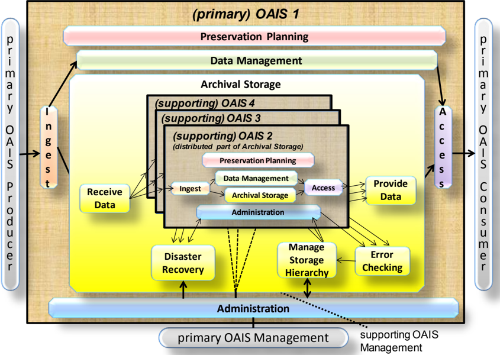

In the example from figure 6-5, the supporting OAISes contain different parts of the functions that constitute parts of the Archival Storage for the primary OAIS. Each OAIS acts in compliance with the agreements that it has made. In this example, the primary OAIS is part of the Designated Community, and is a Producer and a Consumer for the supporting OAISes. The Preservation Objectives for the supporting OAISes may vary as long as they fulfil the objectives for the primary OAIS as part of the Designated Community. For example, in order for the primary OAIS to get all Provenance Information, each supporting OAIS will, of course need to handle Provenance Information for the AIPs which are being held for the primary OAIS and make this Provenance Information available to the primary OAIS to pass along with those AIPs.

## CCSDS RECOMMENDED PRACTICE FOR AN OAIS REFERENCE MODEL

In this example, the part of the Preservation Planning that concerns internal Archival Storage covered by the supporting OAISes are distributed to the respective supporting OAISes. However, in this example, the primary OAIS still needs:

- -the function Developing Preservation Strategies to ensure that threats to copies are mitigated;
- -the function to Manage Storage Hierarchy for the storage of AIPs will need to initiate repairs through the function Disaster Recovery, when, for example, the Error Checking function discovers differences between copies placed in the different supporting OAISes.

In this example, it is clear that the primary OAIS is not an OAIS without the supporting OAISes, whereas the supporting OAISes individually and independently can be regarded as an OAIS if they independently fulfil the OAIS criteria.

It is also possible that an OAIS using distributed functions may provide distributed functionality to another OAIS (i.e., distributed Archives can be recursively distributed.) It is also possible that an OAIS that provides distributed functionality may provide that (or other) distributed functionality to several other OAISes.

An example of this is shown in figure 6-6. OAIS 1 in this figure is a supporting OAIS and OAIS 5 and OAIS 6 each use OAIS 1 to provide their Archival Storage Functional Area tasks.

Figure 6-6: Another Example of a Distributed OAIS Archive for Archival Storage

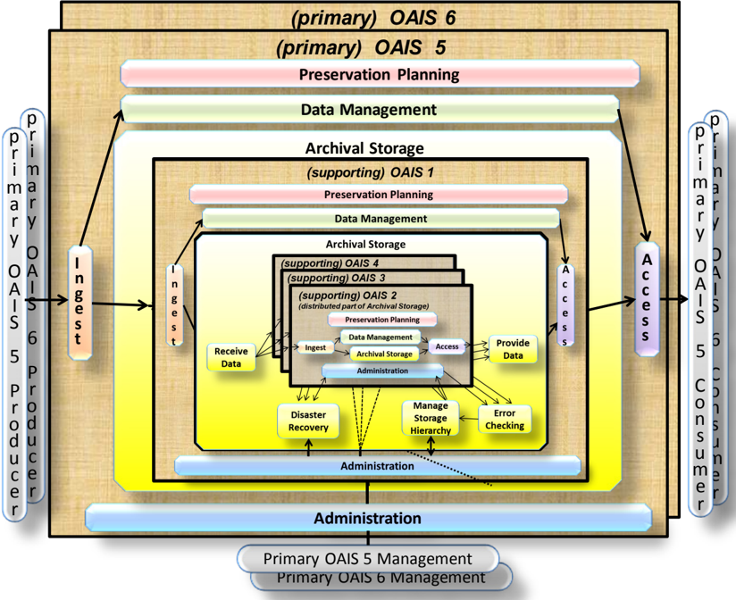

In this example, the focus on OAIS 5 would mean that the OAIS 5 is the primary OAIS depending on the supporting OAIS 1. A similar case can be made for OAIS 6 as a primary OAIS that also depends on the OAIS 1 as a supporting OAIS.

## ANNEX A

## COMPOSITE FUNCTIONAL VIEW

## (INFORMATIVE)

Figure A-1 is a composite of figures 4-2 through 4-7. It is provided to demonstrate consistency among the individual figures. The reader is cautioned not to assume that this is a recommended design or implementation. It should be useful for discussing concepts and comparing systems.

Figure A-1: Composite of Functional Entities

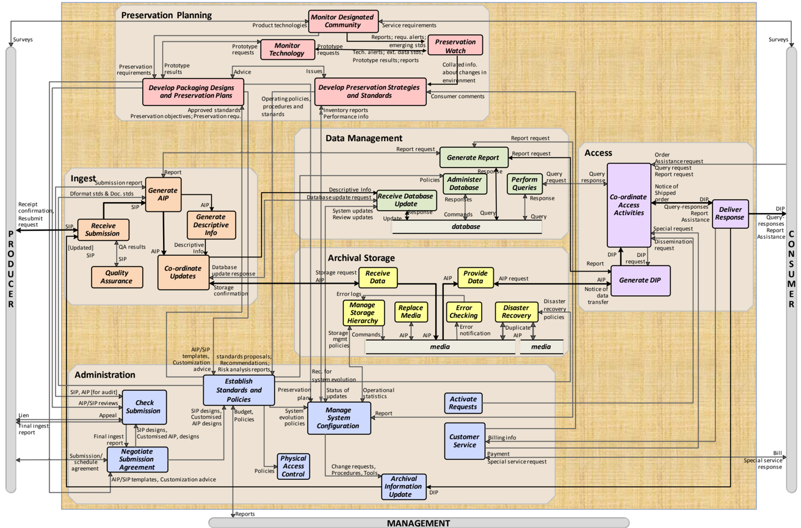

## ANNEX B

## RELATIONSHIP WITH OTHER STANDARDS OR EFFORTS

## (INFORMATIVE)

Because of the dynamic nature of this material it is impossible to keep it up to date within a standard. A document is available at https://cwe.ccsds.org/moims/docs/MOIMSDAI/Draft%20Documents/OAIS-general/OAIS-RelationshipWithOtherStandardsOrEfforts.pdf holding information similar to that which was previously included in this informative annex.

The Roadmap for the development of related standards is available from https://cwe.ccsds.org/moims/docs/MOIMS-DAI/Draft%20Documents/OAISgeneral/RoadmapForDevelopmentOfRelatedStandards.pdf

Descriptions of a number of existing archives are available at https://cwe.ccsds.org/moims/docs/MOIMS-DAI/Draft%20Documents/OAISgeneral/Examples%20of%20Existing%20Archives.pdf.

## ANNEX C

## BRIEF GUIDE TO THE UNIFIED MODELING LANGUAGE (UML) CLASS DIAGRAMS

## (INFORMATIVE)

A key to object relationships in the UML class diagrams of 4.3 in this document is shown in figure C-1.

Figure C-1: Key to UML Relationships

A Class is indicated by a rectangle containing the Class name. The UML representation of a class is a three-compartment rectangle with name in the top compartment attributes in the second compartment and methods in the lowest compartment. In this document the attributes and operations compartments are always empty and UML states empty compartments can be suppressed.

## CCSDS RECOMMENDED PRACTICE FOR AN OAIS REFERENCE MODEL

Classes of objects are related to one another through Associations, and there are various multiplicities that may be attached to these associations as shown. The multiplicity refers to the number of instances, or objects, of that class that are involved in the relationship.

A solid line connecting two classes indicates the general association, among two classes. The line is labeled with an association name, indicating the nature of the association, and a solid arrowhead indicating the direction that the relationship should be read. The multiplicity of each class is shown next to the class near the association line. If the association forms a class that may have its own attributes or methods, that association class is shown as a rectangle connected to the solid line by a dashed line. The multiplicity may be omitted if the association is one to one.

There are two particular associations that are commonly used, aggregation and specialization, and these have particular symbols to indicate them.

An Aggregation association is one where a class is considered to be a part of another class. In UML, a diamond connecting the aggregation association to the aggregated class shows association. There are two types of aggregation defined by UML. Composition (sometimes referred to as strong aggregation), where the part classes are physically stored as part of the aggregated class, is shown with a solid diamond. In a Composition, if the aggregated class is destroyed, the child classes are also destroyed. Weak aggregation, where the part classes are referred to by the aggregated class, is shown with an empty diamond. In a weak aggregation, if the aggregated class is destroyed, the part classes are not destroyed and may be aggregated into other new classes. Composition can be thought of as aggregation by value, while weak aggregation can be thought of as aggregation by reference. In figure C-1, the aggregation association says that the Assembly class contains exactly one Part-1 class instance and zero or more Part-2 class instances. Also, if an instance Assembly is destroyed the Part-1 instance will continue to exist but all the Part-2 instances will be destroyed.

A Specialization association is one where a child class inherits attributes and methods from the parent class. In UML, a broad triangle connecting the aggregation association to the parent class shows specialization. An instance of a child class contains all the attributes and methods contained by its parent class, so an instance of the child class can be used in any operation where an instance of the parent class would be valid. However, the child class may add any number of new attributes or methods so an instance of a parent class is not necessarily a valid replacement for the child class. In figure C-1, the specialization association says that the Parent class attributes and methods are inherited by the Child-1 class and the Child-2 class.

## ANNEX D

## INFORMATIVE REFERENCES

## (INFORMATIVE)

- [D1] Organization and Processes for the Consultative Committee for Space Data Systems . Issue 4. CCSDS Record (Yellow Book), CCSDS A02.1-Y-4. Washington, D.C.: CCSDS, April 2014.
- [D2] D. Waters and J. Garrett. Preserving Digital Information . Report of the Task Force on Archiving of Digital Information. Washington, DC: CLIR, May 1996.
- [D3] Unified Modeling Language (UML) . Version 2.4.1. Needham, Massachusetts: Object Management Group, August 2011.
- [D4] Standard Formatted Data Units-Structure and Construction Rules . Issue 2. Recommendation for Space Data System Standards (Blue Book), CCSDS 620.0-B-2. Washington, D.C.: CCSDS, May 1992.
- [D5] The Data Description Language EAST Specification (CCSD0010) . Issue 3. Recommendation for Space Data System Standards (Blue Book), CCSDS 644.0-B-3. Washington, D.C.: CCSDS, June 2010.
- [D6] Data Entity Dictionary Specification Language (DEDSL)-Abstract Syntax (CCSD0011) . Issue 1. Recommendation for Space Data System Standards (Blue Book), CCSDS 647.1-B-1. Washington, D.C.: CCSDS, June 2001.
- [D7] Data Entity Dictionary Specification Language (DEDSL)-PVL Syntax (CCSD0012) . Issue 1. Recommendation for Space Data System Standards (Blue Book), CCSDS 647.2-B-1. Washington, D.C.: CCSDS, June 2001.
- [D8] XML Formatted Data Unit (XFDU) Structure and Construction Rules . Issue 1. Recommendation for Space Data System Standards (Blue Book), CCSDS 661.0-B-1. Washington, D.C.: CCSDS, September 2008.
- [D9] The Application of Security to CCSDS Protocols . Issue 3. Report Concerning Space Data System Standards (Green Book), CCSDS 350.0-G-3. Washington, D.C.: CCSDS, March 2019.
- [D10] '7094 Data Processing System.' IBM. https://www.ibm.com/ibm/history/exhibits/mainframe/mainframe\_PP7094.html.

## ANNEX E

## A MODEL FOR SOFTWARE USE IN REPRESENTATION INFORMATION

## (INFORMATIVE)

Subsection 4.3 discusses that Representation Information Rendering Software is often used to end the Representation Information Network. A way to view this information is as a layered information model as shown in figure E-1. In this model there are five layers. Each of these layers has well-defined interfaces to the higher layers of the model. These interfaces are known as Application Programming Interfaces or Service Access Points in other layered models. The following is an overview of the functionality of each layer and the data that is exchanged at each interface. This overview illustrates the process of getting bits from the media and adding Representation Information needed to make the information usable by the Consumer.

Figure E-1: Layered Information Model

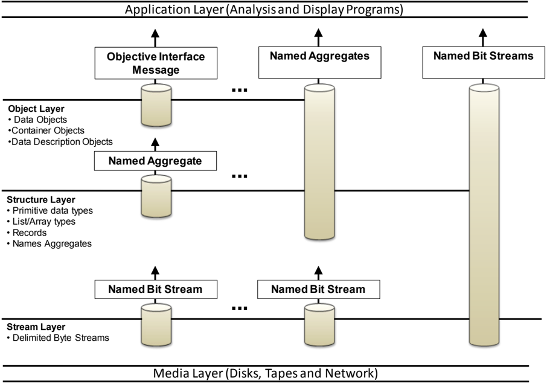

- -The Media Layer simply models the fact that the bit strings are stored on physical or communications media as magnetic domains or as voltages. The function of this layer

## CCSDS RECOMMENDED PRACTICE FOR AN OAIS REFERENCE MODEL

is to convert that bit representation to the bit representation that can be used in a higher level (i.e., one and zero). This layer has as single interface, which enables higher layers to specify the location and size of the bit stream of interest and receive the bits as a string of '1' and '0' bits. In modern computing systems device drivers and chips built into the physical storage interface provide much of this functionality.

- -The Stream Layer hides the unique characteristics of the transport medium by stripping any artifacts of the storage or transmission process (such as packet formats, block sizes, inter-record gaps, and error-correction codes) and provides the higher levels with a consistent view of data that is independent of its medium. The interface between the Stream Layer and higher layers allows the higher layers to request Data Blocks by name and receive a bit/byte string representing those Data Blocks. The term name here means any unique key for locating the data stream of interest. Examples include path names for files or message identifiers for telecommunication messages. In modern computing systems, operating system file systems often provide this layer of functionality.
- -The Structure Layer converts the bit/byte streams from the Stream Layer interface into addressable structures of primitive data types that can be recognized and operated by computer processors and operating systems. For any implementation, the structure layer defines the primitive data types and aggregations that are recognized. This usually means at least characters and integer and real numbers. The aggregation types typically supported include a record (i.e., a structure that can hold more than one data type) and an array (where each element consists of the same data type). Issues relating to the representation of primitive data types are resolved in this layer. The interface from the Structure Layer to higher levels allows the higher levels to request labeled aggregations of primitive data types and receive them in a structured form that may be internally addressable. In modern computing systems programming language compilers and interpreters generally provide this layer of functionality.
- -The Object Layer, which converts the labeled aggregates of primitive data types into information, represented as objects that are recognizable and meaningful in the application domain. In the scientific domain, this includes objects such as images, spectra, and histograms. The object layer adds semantic meaning to the data treated by the lower layers of the model. Some specific functions of this layer include the following:
- Defines data types based on information content rather than on the representation of those data at the structure layer. For example, many different kinds of objects-images, maps, and tables-can be implemented at the structure level using arrays or records. Within the object layer, images, maps, and tables are recognized and treated as distinct types of information.
- Presents applications with a consistent interface to similar kinds of information objects, regardless of their underlying representations. The interface defines the operations that can be performed on the object, the inputs required for each operation and the output data types from each.

## CCSDS RECOMMENDED PRACTICE FOR AN OAIS REFERENCE MODEL

- Provides a mechanism to identify the characteristics of objects that are visible to users, operations that may be applied to an object, and the relationships between objects.

The Interface between the Object Layer and the Application Layer allows the higher levels to specify the operation that is to be applied to an object, the parameters needed for that operation and the form in which results of the operations will be returned. One special interface allows the user to discover the semantics of the objects, such as operations available and relationships to other objects. In modern computing systems subroutine libraries or object repositories and interfaces supply this functionality.

- -The Application Layer contains customized programs to analyze the Data Objects and present the analysis or the Data Object in a form that a data Consumer can understand. In modern computing systems application programs supply this functionality.

The problem with using Representation Information Rendering Software to end Representation Information Networks is that the programs that are saved do not include the information needed to enable the lower levels of the layered model to extract the information from the bits on the media. These services are usually provided by the vendor-supplied operating systems, device drivers, and file systems. When data is moved to other media or different software platforms, the interfaces to these levels may be changed. This migration process is further discussed in section 5 of this document.

## ANNEX F

## SECURITY CONSIDERATIONS

## (INFORMATIVE)

CCSDS requires there to be an informative annex which points out security considerations for implementations of its standards, including those implementing archival systems based on this Reference Model. It must be borne in mind that the OAIS Reference Model itself is not a design and does not specify any particular implementation techniques.

General guidance on security issues may be found in the CCSDS Informational Report, The Application of CCSDS Protocols to Secure Systems (reference [D9]) and references therein.

To be conformant to this Reference Model an implementation should use the Information Model and follow the mandatory requirements in 3.2; therefore, the following annotations on those mandatory requirements provide some guidance on security concerns.

- -Negotiate for and accept appropriate information from information Producers.
- The identity of the information Producer should be validated where appropriate, not least to ensure that the evidence for Authenticity of the information can be relied upon. Communications between the Archive and Producer may require additional safeguards such as electronic signatures and/or digests.
- -Obtain sufficient control of the information provided to the level needed to ensure Long Term Preservation.
- Sufficient control includes control of the bits, and would imply adequate security processes for personnel and systems. Security considerations for any agreements with rights holders which may be necessary should be covered by normal business processes. Any restrictions which the original rights holder places on what the archive preserves should also be respected over time and adequate security measures should be put in place no matter what preservation activities have been adopted, including Transformations. Any Information Packages derived from Content Information should respect the access rights associated with that Content Information; when Information from multiple Content Information Objects has been combined, the archive should be able to justify the access rights to be applied.
- -Determine, either by itself or in conjunction with other parties, which communities should become the Designated Community and, therefore, should be able to understand the information provided, thereby defining its Knowledge Base.
- No specific security issues seem relevant here other than normal business processes involved in communication with any other parties involved.

- -Ensure that the information to be preserved is Independently Understandable to the Designated Community. In particular, the Designated Community should be able to understand the information without needing special resources such as the assistance of the experts who produced the information.
- Security considerations here include respecting restrictions imposed by the original rights holders and appropriate security and Authenticity of the content of the components of the Archival Information Packages, including Representation Information, Provenance Information, and Access Rights Information.
- -Follow documented policies and procedures which ensure that the information is preserved against all reasonable contingencies, including the demise of the Archive, ensuring that it is never deleted unless allowed as part of an approved strategy. There should be no ad-hoc deletions.
- This should include all appropriate security measures such as physical access, backup and recovery processes, periodic integrity checking, and other measures, for example, measures from ISO/IEC 27040 and audits such as those under ISO/IEC 16363. In the case of the demise of the Archive the identity of any successor organization should be verified and transmission of holdings to that organization should be carried out using tamper-proof techniques, including for example the use of electronic digests and signatures in order to ensure the chain of Provenance Information.
- -Make the preserved information available to the Designated Community and enable the information to be disseminated as copies of, or as traceable to, the original submitted Content Information with evidence supporting its Authenticity.
- Implementations of Dissemination Information Packages could include electronic signatures and digests, as well as details of any Transformations which may have been performed to create the DIP, for example where the Consumer needs to be able to securely trace back to the originally submitted Content Information. Access controls may also need to be put in place if required. Attacks on an Archive such as denial of service attacks may raise security concerns which would need to be addressed.